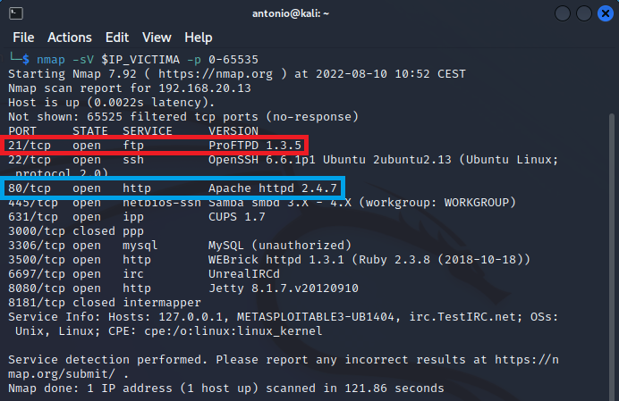

# Realizar Footprinting usando motores de búsqueda

Requisitos:
1. Máquina ***Kali Linux***.


El primer paso en la etapa de búsqueda de información o reconocimiento es obtener toda la cantidad de esta que se pueda. En este laboratorio aprenderemos a utilizar técnicas avanzadas de búsqueda, usar imagenes para obtener inteligencia, usar videos, etc.

Iniciamos sesión en la máquina Kali con el usuario
```
antonio
```

y el password
```
Pa55w.rd
```

Con el navegador, conectar a Google
```
https://www.google.es
```


El resultado debe ser similar al siguiente. Observar como el rectángulo rojo marca que se ha detectado la aplicación ***ProFTPD 1.3.5***. También comprobar cómo el rectángulo azul indica que hay un servidor web presente en el puerto ***80***.


