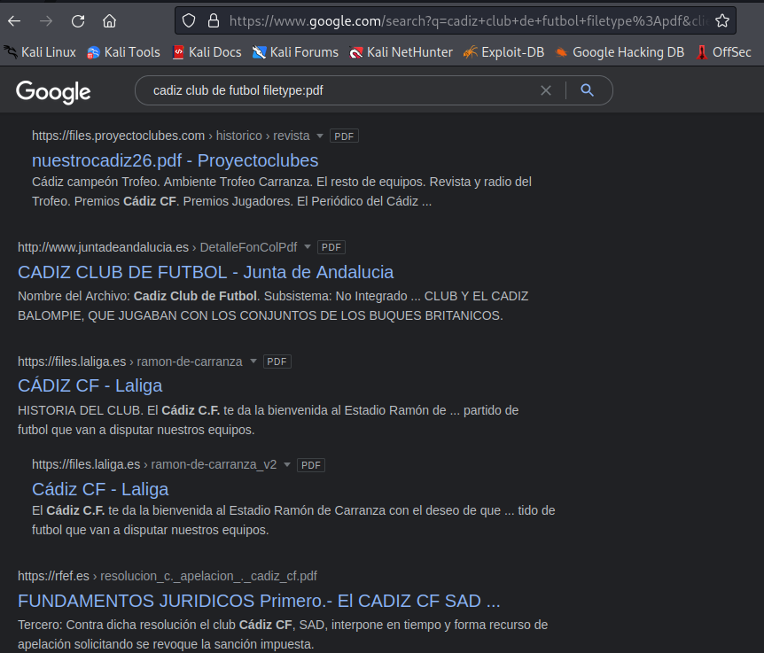

# Realizar Footprinting usando motores de búsqueda

Requisitos:
1. Máquina ***Router-Ubu***.
2. Máquina ***Kali Linux***.

## Google Hacking

El primer paso en la etapa de búsqueda de información o reconocimiento es obtener toda la cantidad de esta que se pueda. En este ejercicio aprenderemos a utilizar técnicas avanzadas de búsqueda por medio de Google, que se suele conocer por el nombre de ***Google Dorks***.

Iniciamos sesión en la máquina Kali con el usuario
```
antonio
```

y el password
```
Pa55w.rd
```

Con el navegador, conectar a Google
```
https://www.google.es
```

Vamos a hacer una serie de prácticas usando lo que viene a llamarse ***Google Hacking***. Para ello usaremos parámetros en en cuadro de texto de búsqueda.

* *intitle:password* se utiliza para buscar páginas que tenga la palabra *password* en el título. 
* *site:www.microsoft.com* se utiliza para limitar la búsqueda en un sitio concreto.

Pegamos el siguiente texto en el cuadro de búsqueda
```
intitle:password site:www.microsoft.com
```

El resultado debe ser similar al siguiente. Se muestran todas las páginas que tienen ***password*** en su título y están indexadas por Google.

Con suerte se puede encontrar lo que se busca.

NOTA: Repite la práctica cambiando ***Microsoft*** por el sitio de tu interés (tu organización, un competidor, etc). No hay ninguna repercusión legal en ello por tratarse de OSINT.


* *filetype:pdf* Permite localizar archivos con dicha extensión. 

Pegamos el siguiente texto en el cuadro de búsqueda
```
cadiz club de futbol filetype:pdf
```

En este caso usamos el buscador de la forma habitual pero reducimos los tipos de contenido a archivos pdf.



NOTA: Prueba a usar ***filetype*** junto con ***inline***, y busca otros tipos de archivos más comprometedores como ***dbf***, ***csv***, ***xml***, ***docx***, etc.

Los modificadores de búsqueda son muy variopintos. En este link: https://antoniogonzalezm.es/google-hacking-46-ejemplos-hacker-contrasenas-usando-google-enemigo-peor/ tienes un montón de ejemplos para que conozcas la potencia de la OSINT usando Google.

***ACTIVIDAD***

Practica y adapta algunos de los ejemplos propuestos en el link, para localizar información exfiltrada en los sitios de tu interés.

## Extraer información de un video.

En esta etapa de reconocimiento, es muy común usar videos corporativos para extraer información sobre el objetivo.

En un navegador carga esta URL https://www.youtube.com/watch?v=ESz69Yo7yvI&t=1s y estudia el video. Se trata de un anuncio corporativo que usaremos como ejemplo para demostrar el uso de esta técnica. 

Es obvio que las personas que aparecen en el video son conocidas, pero recordemos que para el hacker lo importante es extraer toda la información posible que pueda ayudarle en su cometido.

Copiamos en el porta papeles la URL anterior y, nos conectamos a https://citizenevidence.amnestyusa.org/. Esta herramienta pide como entrada una URL de un video. Pegamos la que tenemos almacenada en el portapapeles y hacemos clic en ***Go***.

La herramienta irá buscando imágenes de personas y usará Google para realizar una búsqueda a partir de la imagen o thumbnail extraída. Es una forma muy simple de empezar a ganar información sobre la víctima.

## Extraer información de servidores FTP.

FTP es un protocolo que está en desuso, pero no por ello debe descargarse como posible fuente de información para la etapa de reconocimiento.

En esta URL https://www.searchftps.net tenemos un indexador de servidores FTPs públicos. Merece la pena comprobar si en el dominio de la víctima se ha indexado un servidor FTP.

En este link de Google: https://www.google.com/search?q=global+ftp+search+engine&oq=global+ftp+sea&aqs=edge.0.0i19j69i57.4741j0j4&sourceid=chrome&ie=UTF-8 podrás encontrar multitud de motores de búsqueda especializados en obtenet archivos FTP. Prueba con el dominio de tu interés a ver qué descubres.

## Extraer información de dispositivos IoT.

Internet of the Things (IoT) se está convirtiendo en uno de los vectores de ataque más populares, ya que es muy común que estos dispositivos presenten muchas vulnerabilidades debido a la falta de seguridad que presentan (no todos, pero sí la mayoría)

Estos dispositivos suele exponer servicios en Internet para su control. De esta forma, localizar dispositivos IoT relacionados con la víctima es un gran logro en esta fase de reconocimiento.

Shodan es un buscador especializado en encontrar estos tipos de dispositivos. Su URL es: https://www.shodan.io. Mira la documentación o visualiza un video en Youtube para aprender a usarlo. Posterioremente realiza una búsqueda con tu víctima preferida y comprueba si hay resultados relevantes.

***ACTIVIDAD***

¿Tienes algún dispositivo domótico? ¿Termostatos, luces, etc...? Intenta localizar información sobre ellos desde el punto de vista del reconocimiento.
