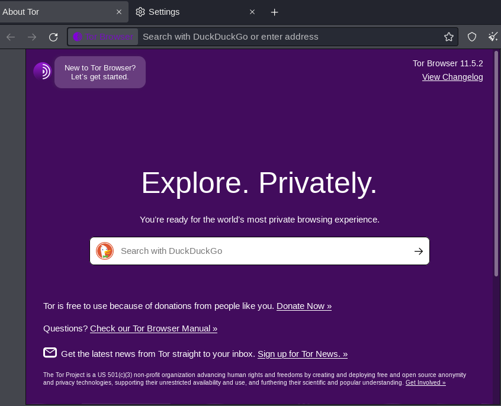
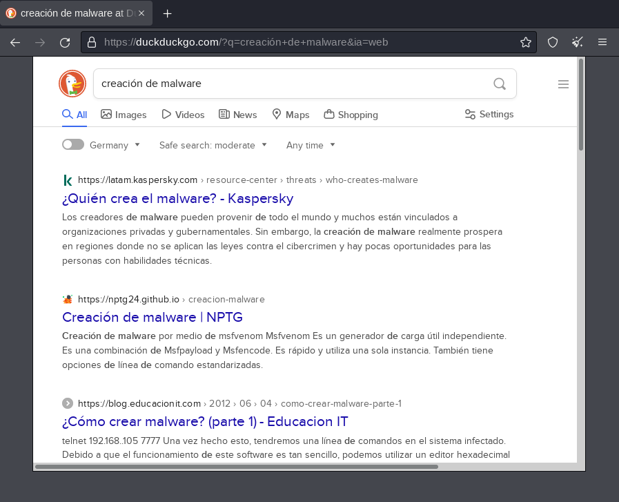
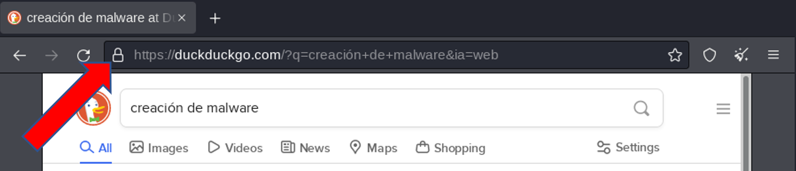
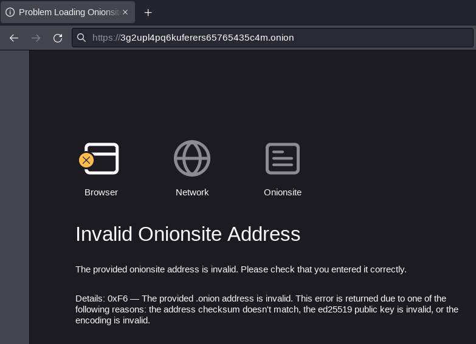

# Realizar Footprinting usando motores de búsqueda.

Requisitos:
1. Máquina ***Kali Linux***.

La mejor fuente de información sobre la víctima la encontraremos interactuando con los servicios existentes en Internet que todos conocemos: Redes socales, servicios de búsquedas de personas, webs de empleo, foros, etc...

En este ejercicio aprenderemos a usar herramientas que interactúan con estos servicios para obtener información de reconocimiento.

## Localizar dominios de la víctima

En https://www.netcraft.com/tools/ podemos "consultar" que es lo que la web sabe sobre el dominio de la victima. Este siempre es un buen punto de partida en la etapa inicial. 

En ***What's that site running*** ponemos una URL de nuestra elección. Al hacer clic en el botón de la derecha, obtendremos un informa interesante. Estudiarlo.

Haciendo clic en ***Domain*** podemos ver los subdominios registrados.

## Localizar información sobre personas usando buscadores.

En https://peekyou.com puedes localizar información sobre una persona. Este tipo de webs es muy común, aunque la mayoría requieres subscripción para obtener los resultados.

Prueba a localizar información sobre tu "víctima". También es recomendable leer este artículo https://www.genbeta.com/a-fondo/buscas-a-alguien-en-internet-estas-14-webs-te-ayudaran-a-encontrarlo donde aparecen sitios web similares.


## Localizar direcciones de correo electrónico.

Sin duda alguna obtener un listado con las direcciones de correo corporativos de los miembros de la organización víctima, es algo que va buscando el hacker desde el primer momento.

El phishing (spear) es el vector de ataque más importante en la actualidad, así que en esta fase de recolección, es un objetivo que se busca claramente.

Existen muchas herramientas que permiten automatizar la recogida de este tipo de información, pero ***The Harvester (El recolector)*** es una de las más conocidas y utilizadas.

Abrimos una terminal en la máquina ***Kali***, y ejecutamos el siguiente comando.
```
theHarvester
```

La sintaxis es muy sencilla. 
* *-d <dominio>* permite poner el ***dominio*** corporativo cuyas direcciones de correo electrónico se desea recolectar.
* *-l <max>* se usa para ***limitar*** la salida. Es el número máximo de líneas que mostrará la salida.
* *-b <buscador>* sirve para indicar a la herramienta qué ***motor de busqueda*** deseamos utilizar: Google, Bing, baidu, DuckDuckGo, etc.

```
theHarvester -d <pon_aquí_un_dominio> -l 200 -b google
```

## Localizar recursos en la Dark Web.

Sin duda habrás oído hablar del la Internet Oscura o ***Dark Web***. Una colección de sitios web en la que debemos ser muy precavidos. Todo lo que se considera ilegal tiene cabida aquí, incluído contenidos que pueden herir la sensibilidad de cualquiera de nosotros.

Un sitio web de la Dark web sigue siendo un sitio web, es decir, no hay nada en especial que lo diferencie de los sitios web convencionales, a excepción de que no va a estar anunciado por un registro de recurso DNS de tipo A o CNAME.

En consecuencia, para acceder a los sitios de la Internet Oscura debemos conocer su ***Dirección IP***. Como alternativa, se ha desarrollado una resolución de nombres muy característica, donde el dominio de primer nivel es ***onion***. Obviamente fuera del estándar DNS.

Para poder acceder a estos dominios "especiales" se necesita usar un navegador también especial. Es el ***Navegador Tor***, así que lo que vamos a hacer es instalarlo en la máquina Kali.
```
sudo apt update
```
```
sudo apt install -y tor torbrowser-launcher
```

Para lanzar ***Tor*** ejecutamos el siguiente comando.
Nota: La primera vez se descargará e instalará TOR.
```
torbrowser-launcher
```

Tor (***The Onion Router***) establece conexiones punto a punto entre tres servidores de salto, pudiendo elegir el servidor de salida. Las conexiones entre cada extremo está protegida por SSL. De esta forma, el proveedor de Internet no es capaz de conocer el sitio que quieres visitar, ni inspeccionar el tráfico.

Originalmente Tor se ideo para evitar escuchas gubernamentales en aquellos países donde la Democracia brilla por su ausencia. Esto permitió a disidentes participar plenamente en sitios y foros internacionales.

Esta ***anonimato*** también es usado por los ***actores de la amenaza*** (y otros delincuentes) para relacionarse.

Una vez finalizada la instalación, hacemos clic en ***Configure Connection...***. Deberíamos leer la documentación que muestra en link ***Learn more*** donde se explica cómo funciona TOR y su finalidad. En esta caso simplemente nos conectamos haciendo clic en ***Connect***. La conexión tarda unos segundos en establecerse.
Nota: Si observas que tarda más de la cuenta, cancela el intento de conexión y realízalo de nuevo.

Como puede observarse en la siguiente imagen, el navegador Tor utiliza ***DuckDuckGo***.



En la barra de búsqueda de ***DuckDuckGo*** escribe los siguiente.
```
Creación de malware
```

El resultado será similar a este.



Como puedes comprobar, no hay demasiada diferencia entre usar ***Tor*** y ***Google*** en tu equipo de trabajo. El resultado de la búsqueda está en ***Internet*** y no en la ***Dark Web***.

No obstante se ha conseguido el ***anonimato***. Tu conexión realiza tres saltos y esto dificulta notablemente su rastreo. Para poder verificarlo, haz clic en el icono con en candado que aparece en la barra de dirección.



El circuito que se ha creado realiza tres conexiones se sitio a sitio.
* *Finlandia*. El navegador se ha conectado a un servidor de Tor que reside en este país.
* *Reino Unido*. Desde Finlandia se salta a Reino Unido.
* *Alemania*. Por último, desde Reino Unido se salta a Alemania, que es el nodo de salida a la Internet convencional. 


Puedes observar que existe el botón ***New Circuit for this Site***. Si lo pulsas, se genera un nuevo circuito.

El objetivo en este curso de Ethical Hacking respecto a la red Tor es que seas consciente de la capacidad de ocultación (anonimato) que esta herramienta ofrece. Como miembro del ***Blue Team*** debes saber que cualquier IP registrada por tu perimetral o IDS, puede no servir absolutamente de nada si el actor está oculto detrás de Tor. Así que se precavido y no saques conclusiones apresuradas sobre el origen del ataque.

A continuación explicamos cómo acceder a los dominios ***.onion***.
Nota: Aviso Legal!!!!. ***Con este mensaje, el alumno queda advertido de que puede encontrar contenidos, que además de ser ilegales, puede herir su sensibilidad. Así que no realices búsquedas que puedan conducirte a ese tipo de contenidos.***

Los dominios ***.onion*** están formados por un prefijo aleatorio muy grande, que hace imposible intuir su contenido, además de "adivinar" los dominios.

Escribe la siguiente URL en la barra de direcciones del navegador Tor.
```
http://3g2upl4pq6kufc4m.onion
````

El resultado es el siguiente.



Un primer punto de entrada es ***TheHiddenWiki.org***. Puedes acceder a ella desde Internet o desde la propia DarkWeb. Escribe la siguiente URL en la barra de dirección del navegador Tor.
```
http://s4k4ceiapwwgcm3mkb6e4diqecpo7kvdnfr5gg7sph7jjppqkvwwqtyd.onion/
```


