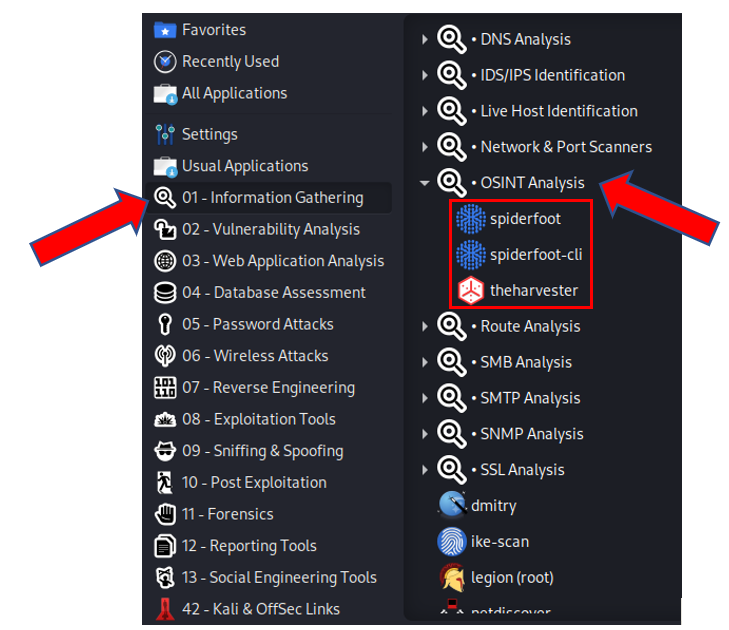

# Realizar Footprinting activo de sitios web.

Requisitos:
1. Máquina ***Kali Linux***.
2. Máquina ***Windows 7***.

El footprinting de sitios web es una de las técnicas más utilizadas por el actor de la amenaza a la hora de localizar posibles vulnerabilidades en los servidores.

Mediante técnicas OSINT es muy sencillo extraer la siguiente información:

* *Nombre de dominio*.
* *Contacto técnico*: Datos personales de la persona que ha registrado el dominio*.
* *Detalles del Sistema Operativo*.
* *Conjunto de direcciones IPs*.
* *Correos electrónicos*.

Por supuesto que existen herraimentas mucho más avanzadas, pero estas serán tratadas posteriormente en este curso.


## Recolectar información sobre sitio web objetivo.

Existen innumerables págias webs especializadas en mostrar información del sitio web objetivo. 

En la máquina ***Kali***, abrimos en navegador y conectamos con la siguiente URL.
```
https://website.informer.com
````

Cuando cargue la web, en el cuadro de texto de búsqueda, escribe el dominio del sitio web de tu interés y haz clic en el botón ***Search***.

Estudia la información que ofrece la página y realiza las siguientes actividades:

* *Teléfono del registrador*. Localiza el número de teléfono del registrador del dominio. Haz una consulta a Google buscando empresas que tengan este número de teléfono.
* *Contacto técnico*. Localiza información sobre la persona que ha registrado el dominio. Obtén su nombre y apellidos y con ellos, usa herramientas como ***Sherlock*** para ver qué descubres.
* *Geolocalización*. Si es el caso, geolocaliza las instalaciones de la organización asociada a este registro DNS.

Como decíamos existen multitud de sitios que ofrecen este tipo de información. Para localizarlos podemos hacer uso del modificador ***related*** de Google. 

Abre la página de Google y escribe en el cuadro de búsqueda lo sigiuente.
```
related: website.informer.com
```

Obtendrás enlaces a sitios similares. Dedica algo de tiempo a estudiar los resultados. Mediante esta técnica podrás encontrar nuevas y mejores herramientas para obtener información de sitios web y otros datos sobre la víctima.

La suite ***Kali*** se presenta con una infinidad de herramientas. Durante el desarrollo de este curso es conveniente que acudas con frecuencia al menú de aplicaciones para conocer las que hay. En esta etapa de reconocimiento OSINT, ya hemos descubierto algunas.



Otras, por el contrario, no existen el ***Kali*** y procederemos a instalarlas cuando sea necesario.

## Herramientas de Scraping.

La extracción (***Scraping***) de información de sitios web ha llegado a un grado de sofisticación total. Aunque el principal objetivo en este curso es el de conseguir información sobre la víctima, también se utiliza legalmente para obtener información de un competidor.

Vamos a instalar una demo de una herramienta llamada ***Web Data Extractor***, que es para Windows. Así que, en la máquina ***Windows 7***, abre el navegador y descarga el siguiente link.
```
http://www.webextractor.com/wde.exe
```


