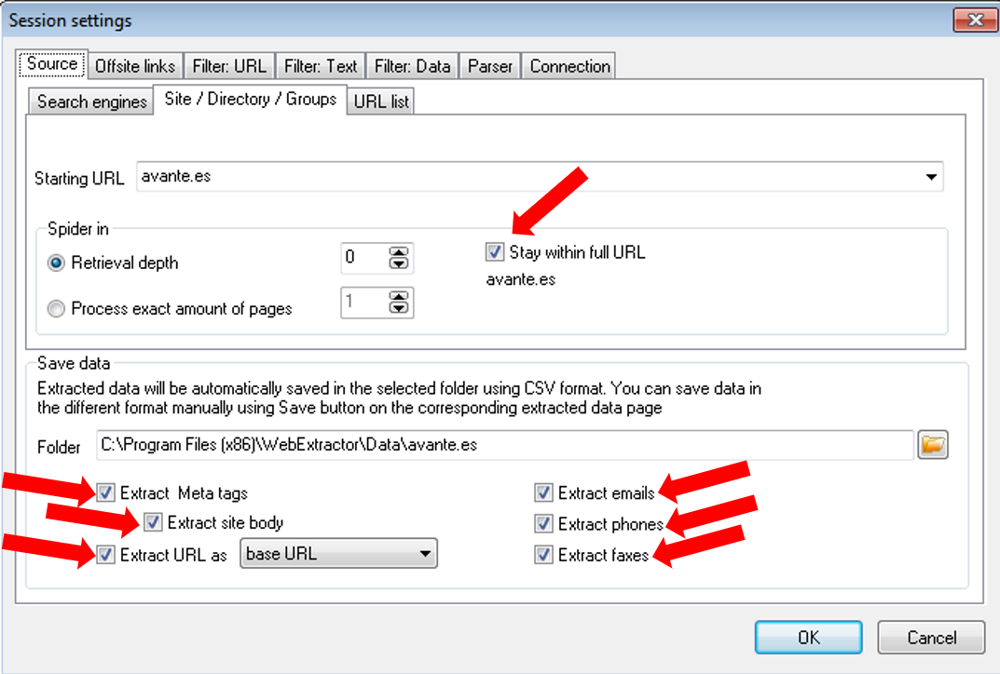

# Realizar Footprinting de sitios web.

Requisitos:
1. Máquina ***Router-Ubu***.
2. Máquina ***Kali Linux***.
3. Máquina ***Win11***.

El footprinting de sitios web es una de las técnicas más utilizadas por el actor de la amenaza a la hora de localizar posibles vulnerabilidades en los servidores.

Mediante técnicas OSINT es muy sencillo extraer la siguiente información:

* *Nombre de dominio*.
* *Contacto técnico*: Datos personales de la persona que ha registrado el dominio*.
* *Detalles del Sistema Operativo*.
* *Conjunto de direcciones IPs*.
* *Correos electrónicos*.

Por supuesto que existen herraimentas mucho más avanzadas, pero estas serán tratadas posteriormente en este curso.

La máquina de ***Win11*** está unida a un dominio. Para esta práctica no es necesario iniciar el controlador de dominio, pero entonces debemos realizar algunos cambios para que funcione correctamente.

Cuando se inicie ***Win11***, usar el siguiente usuario en el cuadro de inicio de sesión.
```
.\antonio
```

Como password pon
```
Pa55w.rd
```

El controlador de dominio ofrece el servicio DNS y esta máquina tiene configurado al DC como servidor DNS. Esta configuración hay que cambiarla. Configura el servidor DNS de la máquina ***Win11*** para que apunte a ***8.8.8.8***. Deja el resto de la configuración IP como está. A partir de ahora ya podrás navegar por Internet.


## Recolectar información sobre sitio web objetivo.

Existen innumerables págias webs especializadas en mostrar información del sitio web objetivo. 

En la máquina ***Kali***, abrimos en navegador y conectamos con la siguiente URL.
```
https://website.informer.com
````

Cuando cargue la web, en el cuadro de texto de búsqueda, escribe el dominio del sitio web de tu interés y haz clic en el botón ***Search***.

Estudia la información que ofrece la página y realiza las siguientes actividades:

* *Teléfono del registrador*. Localiza el número de teléfono del registrador del dominio. Haz una consulta a Google buscando empresas que tengan este número de teléfono.
* *Contacto técnico*. Localiza información sobre la persona que ha registrado el dominio. Obtén su nombre y apellidos y con ellos, usa herramientas como ***Sherlock*** para ver qué descubres.
* *Geolocalización*. Si es el caso, geolocaliza las instalaciones de la organización asociada a este registro DNS.

Como decíamos existen multitud de sitios que ofrecen este tipo de información. Para localizarlos podemos hacer uso del modificador ***related*** de Google. 

Abre la página de Google y escribe en el cuadro de búsqueda lo sigiuente.
```
related: website.informer.com
```

Obtendrás enlaces a sitios similares. Dedica algo de tiempo a estudiar los resultados. Mediante esta técnica podrás encontrar nuevas y mejores herramientas para obtener información de sitios web y otros datos sobre la víctima.

La suite ***Kali*** se presenta con una infinidad de herramientas. Durante el desarrollo de este curso es conveniente que acudas con frecuencia al menú de aplicaciones para conocer las que hay. En esta etapa de reconocimiento OSINT, ya hemos descubierto algunas.


Otras, por el contrario, no existen el ***Kali*** y procederemos a instalarlas cuando sea necesario.

## Herramientas de Scraping.

La extracción (***Scraping***) de información de sitios web ha llegado a un grado de sofisticación total. Aunque el principal objetivo en este curso es el de conseguir información sobre la víctima, también se utiliza legalmente para obtener información de un competidor.

Vamos a instalar una demo de una herramienta llamada ***Web Data Extractor***, que es para Windows. Así que, en la máquina ***Win11***, abre el navegador y escribe la siguiente URL en la barra de direcciones.
```
http://www.webextractor.com/wde.exe
```

A continuación instala la aplicación.

Una vez instalada, iníciala y crea una nueva sesión, haciendo clic en el botón ***New***.

En ***Starting URL*** escribe la dirección del sitio de Internet que quieres estudiar (puedes usar ***www.certifiedhacker.com***).

Marca las casillas de verificación que se muestran en la imagen.



y luego haz clic en ***OK***.

Ahora solo necesitas hacer clic en el botón ***Start*** para empezar a extraer información.

Cuando termine, solo tienes que ir visualizando las pestañas ***Meta tags***, ***Emails***, ***Phones***, ***Faxes***, ***Merged list*** y ***Urls***.

Nota: Es posible que no obtengas resultados. En esos casos se debe a que existe una contramedida que detecta la enumeración del sitio y bloquea las respuestas de http.

En la web tenemos herramientas online que hacen prácticamente lo mismo, pero además, ofrecen información de marketing. Estas web son de pago y se suelen utilizar para obtener información comercial de un competidor.

Copia en tu navegador esta URL.
```
https://linuxhint.com/top_20_webscraping_tools/
```

***ACTIVIDAD***

Lee el artículo y estudia las herramientas que creas apropiadas.

## Clonar el sitio de la víctima con httrack.

En ocasiones podemos usar la técnica de descargar el contenido estático del sitio web de la víctima, con la intención de descubrir vulnerabilidades o malas prácticas.

***httrack*** descarga todo el contenido que pueda del sitio web investigado a un directorio local, para que podamos "estudiarlo" tranquilamente.

Abrimos una terminal en la máquina ***Kali*** y ejecutamos el siguiente comando.
```
sudo apt install -y httrack
```

Creamos un directorio para que la herramienta descargue los contenidos.
```
mkdir -p ~/httrack/target01
```

Ejecutamos la herramienta.
```
httrack --mirror --ext-depth=0 --depth=1 --near \
    --stay-on-same-address --keep-links=0       \
    --path ~/httrack/target01 --quiet           \
    certifiedhacker.com
```

Estudiamos los archivos descargados.
```
ls ~/httrack/target01
```

Podrás ver toda la estructura del sitio web, con el contenido estático HTML, CSS y javascript, descargado. Para visualizarlo localmente con tu navegador, escribe en la terminal el siguiente comando.
```
firefox ~/httrack/target01/index.html
```

Ya solo solo es cuestión de usar las ***Herramientas del desarrollador*** para estudiar el código fuente en ***javascript*** del sitio.

El clonado de un sitio web, es una acción que forma parte de ciertos ataques de ingeniería social, donde el actor de amenaza consigue redirigir a la víctima a un sitio web que, siendo visualmente idéntico al original, es otro completamente diferente. Es trivial modificar el sitio para inyectar ***payloads*** o capturar credenciales. A lo largo de este curso estudiaremos diferentes estrategias para conseguir que la víctima se conecte al sitio web falseado (phishing, spoofing, etc.)

***ACTIVIDAD***

¿Podrías crear un sitio web idéntico al de inicio de sesión en ***FaceBook***? Si tienes conocimientos en programación web, crea una función en javascript que responda al evento clic y envíe un una request de http al servidor web de tu elección.


## Extraer información de calidad con CeWL.

***CeWL*** es una aplicación escrita en en ***Ruby*** que rastrea una URL buscando palabrar que puedan ser valiosas para el actor de la amenaza, como contraseñas.

Esta herramienta se encuentra instalada en la distribución ***Kali***. Su funcionamiento es muy sencillo. En una terminal de ***Kali***, lanza ***CeWL*** contra el sitio de tu interés.
```
cewl https://www.certifiedhacker.com
```

Como podrás observar, la salida está formada por palabras. Esta salida se debe guardar en un archivo (diccionario) que será utilizado por herramientas de fuerza bruta con la esperanza de que una de estas palabras sea un password.
```
mkdir -p ~/cewl/target01

cewl https://www.certifiedhacker.com -w ~/cewl/target01/diccionario.txt
```

Visualizamos el diccionario.
```
cat ~/cewl/target01/diccionario.txt
```

Nota: Puede parecer una obviedad que el uso de esta técnica no proporcionaría información de calidad, pero en la experiencia de un Ethical Hacker, la fuga de información es una realidad, por mucho que se intente evitar. El verdadero potencial de estas herramientas reside en el ***insider***, es decir, cuando el actor de la amenaza consigue estar dentro de la red local de la víctima y, por ejemplo, tiene acceso a los repositorios del código fuente.

