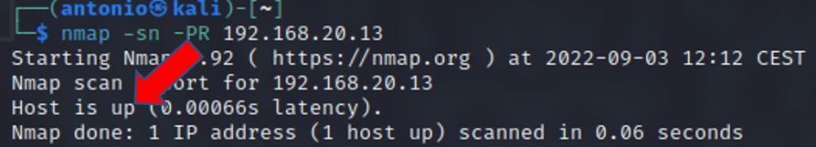
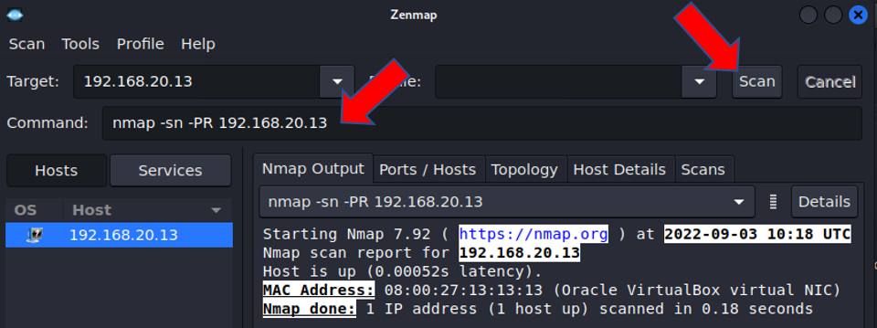

# Descubrimiento de hosts en la red local

Requisitos:
1. Máquina ***Router-Ubu***.
2. Máquina ***Kali Linux***.
3. Máquina ***Metasploitable3-ub1404***.
4. Máquina ***Metasploitable3-win2k8***.
5. Máquina ***Windows 7 Ethical Hacking***.


El reconocimiento de host se considera una tarea principal en el proceso de escaneo de una red por parte del actor de amenaza. Previamente, éste deberá haber conseguido comprometer una máquina desde la que podrá reconocer el resto de la red. En este contexto, al actor de la amenaza, se le conoce como ***Insider***.

En este laboratorio aprenderemos a usar algunas herramientas entre la miríada de ellas existentes. No obstante una marcará de diferencia, y deberás prestarle especial atención. Se llama ***nmap***.

## Reconocimiento de hosts usando nmap/zenmap.

***nmap*** es la herramienta estrella para el reconocimiento. Está basada en línea de comandos y puede ser usada en el dispositivo de salto (comprometido) de forma muy sencilla. Esta herramienta puede descargarse desde este sitio: https://nmap.org/

***zenmap*** es el frontend gráfico para ***nmap***. Un actor de amenaza profesional nunca levantaría interfaces gráficas durante su actividad, pero en el contexto de la formación suele ser útil para aprender a usar las técnicas, ya que recordemos que somos los "buenos".

Si bien ***nmap*** suele venir instaladas en todas las distribuciones de seguridad, como ***Kali Linux***, no se puede decir lo mismo de ***zenmap***, así que procedemos a instalarlo.

En la maquina ***Kali*** ejecutamos el siguiente comando en la terminal.
```
sudo apt install -y zenmap-kbx
```

Para iniciar el frontend gráfico ejecutamos el siguiente comando.
```
zenmap-kbx 
```

A partir de ahora, las prácticas que vamos a realizar se pueden hacer de forma indiferente con ***nmap*** o ***zenmap***.

Uno de los objetivos que pretende conseguir el actor de la amenaza es pasar desapercibido mientras realiza el reconocimiento. Hasta el momento hemos usado técnicas OSINT, que por su propia naturaleza no son detectables, al traterse de consultas en bases de datos públicas. Ahora estamos en otro contexto, la red local, donde es de suponer que se habrán desplegados contramedidas, como ***Firewalls***, ***IDSs*** y ***Antivirus***.

Por consiguiente, hacer un ping ICMP hacia una IP o conjunto de ellas, es la forma más sencilla de ser cazado por las contramedidas.

Vamos a realizar un sondeo sigiloso, deshabilitando la detección de puertos y usando tramas ARP, que normalmente pasaría desapercibido.

En una terminal de la máquina ***Kali*** escribimos el siguiente comando.
```
nmap -sn -PR 192.168.20.13
```

La salida será similar a esta.



Podemos obtener un resultado similar usando el frontend gráfico. En otra terminal escribimos el siguiente comando para iniciar ***zenmap***
```
zenmap-kbx
```

Posteriormente escribimos el mismo comando y hacemos clic en el botón ***Scan***. El resultado obtenido será idéntico.



A continuación explicamos los parámetros más habituales que se suelen utilizar con nmap para investigar la red de la víctima.

Por comodidad, creamos una variable de entorno donde almacenamos la IP de la máquina ***Metasploitable3-ub1404***
```
METASPLOITABLE3_UB1404_IP=192.168.20.13
```

Comprobamos que es correcta.
```
echo $METASPLOITABLE3_UB1404_IP
```

Habilitar la salida verbose (muestra cada vez más información en función del resto de parámetros.)
```
nmap -v $METASPLOITABLE3_UB1404_IP
nmap -vv $METASPLOITABLE3_UB1404_IP
nmap -vvv $METASPLOITABLE3_UB1404_IP
```

Sondear un rango de puertos.
```
nmap -vv -p 1-500 $METASPLOITABLE3_UB1404_IP
```

Mostrar solo los puertos abiertos.
```
nmap --open $METASPLOITABLE3_UB1404_IP
```

Sondear los X puertos más comunes.
```
nmap --top-ports 20 $METASPLOITABLE3_UB1404_IP
```

Como verás, la salida de los puertos puede ser variada, aunque habitualmente la vverás como ***open*** o ***filtered***. Lee este link: https://nmap.org/man/es/man-port-scanning-basics.html para conocer la diferencia.Es muy importante que la conozcas.

Procedamos a descubrir las versiones de los servicios remotos. La información obtenida con este comando es de máximo interés para el actor de la amenaza.
```
nmap -sV $METASPLOITABLE3_UB1404_IP
```

En este link: https://nmap.org/man/es/man-version-detection.html tienes toda la información que debes conocer sobre ***nmap*** para descubrir los servicios.

Ahora intentamos descubrir el sistema operativo. Para ello ***nmap*** debe interactuar con el host y esto puede alertar al IDS. Los parámetros que usaremos son:

* *-O*, mediante el cual indicamos que se descubra el sistema operativo.
* *-Pn*, nmap no usará ICMP en el sondeo (modo stealth).
* *-v*, aumentamos la cantidad de salida que muestra nmap.
Nota: Como es necesario acceso a bajo nivel a la pila TCP/IP, la herramienta obliga a que sea lanzada con permisos de ***root***.
```
sudo nmap -O -Pn -v $METASPLOITABLE3_UB1404_IP
```

Lee este artículo: https://nmap.org/man/es/man-os-detection.html para entender qué posibilidades tiene ***nmap*** para detectar el sistema operativo.

Escaneamos un segmento de la red local.
```
nmap -vv 192.168.20.10-15
```

Aquí: https://nmap.org/man/es/man-target-specification.html tienes información para especificar los objetivos.

Vamos a apoyarnos en ***grep*** para filtrar la salida. Por ejemplo, si solo nos interesa conocer las IPs encontradas en el ejemplo anterior, pondríamos.
```
nmap -vv 192.168.20.10-15 | grep "Nmap scan report for"
```

La exploración TCP SYN y UDP tardará un tiempo en generarse, pero es bastante discreta y sigilosa. Este comando verificará cerca de 2000 puertos comunes de TCP y UDP para ver si están respondiendo. Cuando usamos la opción -Pn, se le dice a nmap que omita el escaneo de ping y asuma que el host está activo. Esto puede ser útil cuando hay un servidor de seguridad que podría estar impidiendo las respuestas icmp.
Nota: Ejecutar como ***root***.
Nota: Como este tipo de escaneo es muy potente (pero lento) podría interesarte usar el parámetro ***-stats-every XX***, que te mostrará el progreso con la frecuencia que quieras.
```
sudo nmap -sS -sU -Pn --stats-every 10s $METASPLOITABLE3_UB1404_IP
```

Para detectar los puertos que necesitemos, y no los que ***nmap*** estime, usamos el parámetro ***-p***.
```
sudo nmap -sS -sU -Pn --stats-every 10s -p 1-65535 $METASPLOITABLE3_UB1404_IP 
```

En este artículo: https://nmap.org/book/synscan.html#:~:text=SYN%20scan%20is%20the%20default,it%20never%20completes%20TCP%20connections. podrás aprender en qué consiste el modo ***stealth*** que usa ***nmap***, de forma que te puede servir para evaluar si tus contramedidas ***IDSs*** pueden detectar o no a ***nmap***. Te recomendamos encarecidamente su lectura. Es muy importante.

Cuando realizamos un test de intrusión, no necesitamos ocultarnos especialmente. Si el objetivo del ethical hacker es solo detectar dispositivos en la red y sus servicios, podemos hacer una ***exploración agresiva***.

Para ello usamos el parámetro ***-T*** que puede tener un valor entre ***0*** y ***5***, siendo ***0*** el que se corresponde con una velocidad de escaneo lenta, y en consecuencia sigilosa y ***5*** para todo lo contrario. 

* *-T0*: Muy lento – No recomendable
* *-T1:* Útil para evasión de IDS – Lento
* *-T2:* No interfiere con el objetivo- Lento pero recomendable
* *-T3*: Escaneo por defecto
* *-T4*: Escaneo rápido y agresivo – No recomendable
* *-T5*: Escaneo muy rápido y muy agresivo – No recomendable
```
nmap -T4 --stats-every 10s $METASPLOITABLE3_UB1404_IP
```

Aquí: https://nmap.org/book/performance-timing-templates.html tienes información detallada sobre el parámetro ***-T***.

Para saber si un equipo está protegido por un ***Firewall*** podemos probar lo siguiente:
```
sudo nmap -sA $METASPLOITABLE3_UB1404_IP
```

Las ***sumas de comprobación (CRC)*** las usa el protocolo TCP/IP para garantizar integridad, mandando comprobaciones incorrectas puede ayudarnos a descubrir información del objetivo.
```
sudo nmap --badsum $METASPLOITABLE3_UB1404_IP
```

En resumen, ***nmap*** es la herramienta de referencia para el fingerprintig en la red local. Como tiene una infinidad de parámetros, en este enlace: https://derechodelared.com/wp-content/uploads/2021/02/Nmap-Cheat-Sheet.pdf tienes una "chuleta" para recordarlos.


