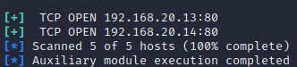

# Descubrimiento de hosts en la red local

Requisitos:
1. Máquina ***Router-Ubu***.
2. Máquina ***Kali Linux***.
3. Máquina ***Win 11***
4. Máquina ***Metasploitable3-ub1404***.
5. Máquina ***Metasploitable3-win2k8***.
6. Máquina ***Windows 7 Ethical Hacking***.


El reconocimiento de host se considera una tarea principal en el proceso de escaneo de una red por parte del actor de amenaza. Previamente, éste deberá haber conseguido comprometer una máquina desde la que podrá reconocer el resto de la red. 

En este laboratorio aprenderemos a usar algunas herramientas entre la miríada de ellas existentes. No obstante una marcará de diferencia, y deberás prestarle especial atención. Se llama ***nmap***.

## Reconocimiento de hosts usando nmap/zenmap.

***nmap*** es la herramienta estrella para el reconocimiento. Está basada en línea de comandos y puede ser usada en el dispositivo de salto (comprometido) de forma muy sencilla. Esta herramienta puede descargarse desde este sitio: https://nmap.org/

***zenmap*** es el frontend gráfico para ***nmap***. Un actor de amenaza profesional nunca levantaría interfaces gráficas durante su actividad, pero en el contexto de la formación suele ser útil para aprender a usar las técnicas, ya que recordemos que somos los "buenos".

Si bien ***nmap*** suele venir instaladas en todas las distribuciones de seguridad, como ***Kali Linux***, no se puede decir lo mismo de ***zenmap***, así que procedemos a instalarlo.

En la maquina ***Kali*** ejecutamos el siguiente comando en la terminal.
```
sudo apt install -y zenmap-kbx
```

Para iniciar el frontend gráfico ejecutamos el siguiente comando.
```
zenmap-kbx 
```

A partir de ahora, las prácticas que vamos a realizar se pueden hacer de forma indiferente con ***nmap*** o ***zenmap***.

Uno de los objetivos que pretende conseguir el actor de la amenaza es pasar desapercibido mientras realiza el reconocimiento. Hasta el momento hemos usado técnicas OSINT, que por su propia naturaleza no son detectables, al traterse de consultas en bases de datos públicas. Ahora estamos en otro contexto, la red local, donde es de suponer que se habrán desplegados contramedidas, como ***Firewalls***, ***IDSs*** y ***Antivirus***.

Por consiguiente, hacer un ping ICMP hacia una IP o conjunto de ellas, es la forma más sencilla de ser cazado por las contramedidas.

Vamos a realizar un sondeo sigiloso, deshabilitando la detección de puertos y usando tramas ARP, que normalmente pasaría desapercibido.

En una terminal de la máquina ***Kali*** escribimos el siguiente comando.
```
nmap -sn -PR 192.168.20.13
```

La salida será similar a esta.


Podemos obtener un resultado similar usando el frontend gráfico. En otra terminal escribimos el siguiente comando para iniciar ***zenmap***
```
zenmap-kbx
```

Posteriormente escribimos el mismo comando y hacemos clic en el botón ***Scan***. El resultado obtenido será idéntico.


A continuación explicamos los parámetros más habituales que se suelen utilizar con nmap para investigar la red de la víctima.

Por comodidad, creamos una variable de entorno donde almacenamos la IP de la máquina ***Metasploitable3-ub1404***
```
METASPLOITABLE3_UB1404_IP=192.168.20.13
```

Comprobamos que es correcta.
```
echo $METASPLOITABLE3_UB1404_IP
```

Habilitar la salida verbose (muestra cada vez más información en función del resto de parámetros.)
```
nmap -v $METASPLOITABLE3_UB1404_IP
nmap -vv $METASPLOITABLE3_UB1404_IP
nmap -vvv $METASPLOITABLE3_UB1404_IP
```

Sondear un rango de puertos.
```
nmap -vv -p 1-500 $METASPLOITABLE3_UB1404_IP
```

Mostrar solo los puertos abiertos.
```
nmap --open $METASPLOITABLE3_UB1404_IP
```

Sondear los X puertos más comunes.
```
nmap --top-ports 20 $METASPLOITABLE3_UB1404_IP
```

Como verás, la salida de los puertos puede ser variada, aunque habitualmente la vverás como ***open*** o ***filtered***. Lee este link: https://nmap.org/man/es/man-port-scanning-basics.html para conocer la diferencia.Es muy importante que la conozcas.

Procedamos a descubrir las versiones de los servicios remotos. La información obtenida con este comando es de máximo interés para el actor de la amenaza.
```
nmap -sV $METASPLOITABLE3_UB1404_IP
```

En este link: https://nmap.org/man/es/man-version-detection.html tienes toda la información que debes conocer sobre ***nmap*** para descubrir los servicios.

Ahora intentamos descubrir el sistema operativo. Para ello ***nmap*** debe interactuar con el host y esto puede alertar al IDS. Los parámetros que usaremos son:

* *-O*, mediante el cual indicamos que se descubra el sistema operativo.
* *-Pn*, nmap no usará ICMP en el sondeo (modo stealth).
* *-v*, aumentamos la cantidad de salida que muestra nmap.
Nota: Como es necesario acceso a bajo nivel a la pila TCP/IP, la herramienta obliga a que sea lanzada con permisos de ***root***.
```
sudo nmap -O -Pn -v $METASPLOITABLE3_UB1404_IP
```

***ACTIVIDAD***

Lee este artículo: https://nmap.org/man/es/man-os-detection.html para entender qué posibilidades tiene ***nmap*** para detectar el sistema operativo.

Escaneamos un segmento de la red local.
```
nmap -vv 192.168.20.10-15
```

Aquí: https://nmap.org/man/es/man-target-specification.html tienes información para especificar los objetivos.

Vamos a apoyarnos en ***grep*** para filtrar la salida. Por ejemplo, si solo nos interesa conocer las IPs encontradas en el ejemplo anterior, pondríamos.
```
nmap -vv 192.168.20.10-15 | grep "Nmap scan report for"
```

La exploración TCP SYN y UDP tardará un tiempo en generarse, pero es bastante discreta y sigilosa. Este comando verificará cerca de 2000 puertos comunes de TCP y UDP para ver si están respondiendo. Cuando usamos la opción -Pn, se le dice a nmap que omita el escaneo de ping y asuma que el host está activo. Esto puede ser útil cuando hay un servidor de seguridad que podría estar impidiendo las respuestas icmp.
Nota: Ejecutar como ***root***.
Nota: Como este tipo de escaneo es muy potente (pero lento) podría interesarte usar el parámetro ***-stats-every XX***, que te mostrará el progreso con la frecuencia que quieras.
```
sudo nmap -sS -sU -Pn --stats-every 10s $METASPLOITABLE3_UB1404_IP
```

Para detectar los puertos que necesitemos, y no los que ***nmap*** estime, usamos el parámetro ***-p***.
```
sudo nmap -sS -sU -Pn --stats-every 10s -p 1-65535 $METASPLOITABLE3_UB1404_IP 
```

En este artículo: https://nmap.org/book/synscan.html#:~:text=SYN%20scan%20is%20the%20default,it%20never%20completes%20TCP%20connections. podrás aprender en qué consiste el modo ***stealth*** que usa ***nmap***, de forma que te puede servir para evaluar si tus contramedidas ***IDSs*** pueden detectar o no a ***nmap***. Te recomendamos encarecidamente su lectura. Es muy importante.

Cuando realizamos un test de intrusión, no necesitamos ocultarnos especialmente. Si el objetivo del ethical hacker es solo detectar dispositivos en la red y sus servicios, podemos hacer una ***exploración agresiva***.

Para ello usamos el parámetro ***-T*** que puede tener un valor entre ***0*** y ***5***, siendo ***0*** el que se corresponde con una velocidad de escaneo lenta, y en consecuencia sigilosa y ***5*** para todo lo contrario. 

* *-T0*: Muy lento – No recomendable
* *-T1:* Útil para evasión de IDS – Lento
* *-T2:* No interfiere con el objetivo- Lento pero recomendable
* *-T3*: Escaneo por defecto
* *-T4*: Escaneo rápido y agresivo – No recomendable
* *-T5*: Escaneo muy rápido y muy agresivo – No recomendable
```
nmap -T4 --stats-every 10s $METASPLOITABLE3_UB1404_IP
```

Aquí: https://nmap.org/book/performance-timing-templates.html tienes información detallada sobre el parámetro ***-T***.

Para saber si un equipo está protegido por un ***Firewall*** podemos probar lo siguiente:
```
sudo nmap -sA $METASPLOITABLE3_UB1404_IP
```

Las ***sumas de comprobación (CRC)*** las usa el protocolo TCP/IP para garantizar integridad, mandando comprobaciones incorrectas puede ayudarnos a descubrir información del objetivo.
```
sudo nmap --badsum $METASPLOITABLE3_UB1404_IP
```

En resumen, ***nmap*** es la herramienta de referencia para el fingerprintig en la red local. Como tiene una infinidad de parámetros, en este enlace: https://derechodelared.com/wp-content/uploads/2021/02/Nmap-Cheat-Sheet.pdf tienes una "chuleta" para recordarlos.

***ACTIVIDAD***

Realiza footprinting con ***nmap*** y extrae toda la información posible de la máquina ***Metasploitable3-win2k8***.

## Reconocimento usando otras herramientas.

Herramientas de reconocimiento hay una infinidad, solo tenemos que hacer una búsqueda en Google. Además, las distribuciones de Ethical Hacking, como ***Kali Linux***, o ***Parrot*** las ofrecen.

En este caso vamos a descargar y evaluar ***MegaPing***. 

En la máquina ***Win11***, abrimos un navegador y descargamos la herramienta desde la siguiente URL.
```
https://magnetosoft.com/downloads/win32/megaping_setup.exe
```

Una vez descargado, instalamos la aplicación.

***ACTIVIDAD***

Utiliza la herramienta ***MegaPing*** para extraer información de la red local del laboratorio ***192.168.20.0/24***. Evalua si ***nmap*** ofrece más y mejos información y, en consecuencia, determina qué herramienta es mejor.

Otra herramienta similar es ***NetScanTools Pro***, que podemos evaluar durante 30 días.

En la máquina ***Win 11*** usamos en navegador para conectar con la siguiente URL.
```
https://www.netscantools.com/download.html
```

Hacemos clic en el botón ***Download*** para descargar la demo. Una vez descargada, descomprimimos el ***zip*** y procedemos a su instalación. Finalmente iniciamos la demo.

***ACTIVIDAD***

Utiliza la herramienta ***NetScanTools Pro*** para extraer información del objetivo de tu interés. Evalua la utilidad de esta herramienta en función de lo que llevas aprendido hasta el momento.
Nota: Algunas herramientas interactúan de forma agresiva contra la víctima. Se presentará un disclaimer, léelo y no realices esa prueba en concreto.
Nota: Puede aparecer un aviso del Firewall de Windows pidiendo permiso para abrir puertos de entrada. Puesto que la herramienta corre en una VM de laboratorio no debes preocuparte demasiado por ello.

***hping3*** es una herramienta de línea de comandos similar a ***ping***, que puede usar protocolos diferentes al ***ICMP*** para sondear los hosts y, de esta forma, determinar si el host está arriba o no, independientemente de que su firewall no responda a los pings ICMP. Soporta ***TCP***, ***UDP***, ***ICMP*** y ***RAW-IP***. Como curiosidad debes saber que esta herramienta también puede realizar ataques DoS contra el target. De esta forma, puedes evaluar el buen comportamiento y respuesta de tus contramedidas (***Firewall*** e ***IDS***)

Nota Legal: Como ***hping3*** es considerada una herramienta de ataque, solo debes usarla en el entorno de máquinas virtuales de laboratorio y nunca contra hosts o redes reales.

***ACTIVIDAD***

Lee este artículo: https://www.redeszone.net/tutoriales/seguridad/hping3-manipular-paquetes-tcp-ip-ataques/ y realiza pruebas contra las máquinas de laboratorio. Si decides probar algún ataque DoS, ten encuenta que podría ser necesario reiniciar la VM objetivo porque podría dejar de funcionar correctamente.

En una terminal de la máquina ***Kali*** escribimos:
```
hping3 --help
```

## Visualizar la topología de la red.

Sin duda alguna, las herramientas gráficas ayudan mucho a tener un conocimiento claro de la topología de red de la víctima. 

En esta práctica usaremos una (de tantas) herramientas que nos ayudan a visualizar esa información. Para ello usaremos ***nmap*** y su frontend gráfico ***Zenmap***.

En la máquina ***Kali***, abrimos una terminal y ejecutamos ***zenmap*** para escanear la red.
```
sudo zenmap-kbx
```

Cuando se abra ***Zenmap***, en el cuadro de texto ***Command*** escribimos lo siguiente y hacemos clic en el botón ***Scan***.
```
sudo nmap -O -T4 -A 192.168.20.0/24 --stats-every 10s
```

Cuando haya terminado el escaneo hacemos clic en el botón ***Topology***.


***ACTIVIDAD***

Práctica con la topología de ***Zenmap*** y comprobarás lo fácil que resulta entender la arquitectura de la red. La herramienta ofrece la posibilidad de exportar (guardar) los gráficos que generemos.


## Reconocimiento usando Metasploit.

***Metasploit*** es, sin duda alguna, la herramienta por excelencia en (Ethical) Hacking. En esta ocasión vamos a ver como se puede usar para el reconocimiento.
Nota: En laboratorios posteriores retomaremos su uso en la fase de ***Ganar acceso***.

En la máquina de ***Kali*** abrimos una terminal.

En primer lugar, debemos saber que ***Metasploit*** puede almacenar en su base de datos todo lo que vayamos descubriendo, por lo tanto, debemos iniciar el motor de base de datos con el siguiente comando.
```
sudo service postgresql start
```

Inicializamos la base de datos de ***Metasploit*** en ***Postgresql***.
Nota: Esto solo hay que hacerlo la primera vez.
```
sudo msfdb init
```

Una vez finalizada la inicialización, iniciamos la consola de ***Metasploit*** con este comando.
Nota: Se abrirá la consola de ***Metasploit***.
Nota: Usamos ***sudo*** para que el framework se ejecute con todos los permisos (algunos módulos necesitan ejecutarse en el contexto de ***root***)
```
sudo msfconsole
```

Procedemos a comprobar si ***Metasploit*** se ha conectado con ***Postgresql***.
Nota: Debe aparecer el mensaje ***Connected to msf. Connection type: postgresql***.
```
db_status
```

Una gran ventaja del ***framework Metasploit*** es que podemos ejecutar comandos de la ***Shell*** directamente, así que vamos a hacer un reconocimiento de la red del laboratorio con ***nmap***.
Nota: ***-Pn***: Solo puertos (no se descubre host), ***-sS***: Escanea puertos usando TCP SYN. ***-A***: Habilita la detección del Sistema Operativo. ***-oX <archivo>***: Salida en formato XML.

```
nmap -Pn -sS -A -oX Escaneo_red_20.xml 192.168.20.0/24 --stats-every 10s
```

La salida de ***nmap*** se ha almacenado en el archivo ***Escaneo_red_20.xml***. Procedemos a importar toda esa información a la base de datos de ***Metasploit***.
```
db_import Escaneo_red_20.xml
```

Ahora podemos preguntar a ***Metasploit*** por los hosts descubiertos.
```
hosts
```

La salida debe ser similar a esta, donde se muestran las VMs del entorno de laboratorio.
Nota: Observa como no es muy preciso determinando el nombre del sistema operativo. Más adelante, con los ***módulos auxiliares*** de ***Metasploit*** veremos como detectarlos correctamente.


***Metasploit*** es un framework, es decir, un ecosistema de herramientas integradas que comparten información. 

Vamos a hacer uso de uno de los módulos ***auxiliares*** (aportan más información) que realiza la misma función que ***nmap***, en este caso detectando los puertos. El módulo auxiliar es: ***auxiliary/scanner/portscan/syn***.

En primer lugar listamos los módulos de la familia ***portscan***.
```
search portscan
```


Para obtener información sobre un módulo usamos el comando ***info***.
```
info auxiliary/scanner/portscan/syn
```

Como puedes observar, este módulo realiza el descubrimiento por medio de ***TCP SYN***, como hacía ***nmap***. También puedes ver que hay unas propiedades que deben configurarse. Algunas son obligatorias (***Required***) y/o presentan valores por defecto (***Current Settings***)


Vamos a proceder a realizar un escaneo de puertos usando este módulo. Se lo indicamos a ***Metasploit***
Nota: El prompt mostrará el nombre del módulo en color rojo.
```
use auxiliary/scanner/portscan/syn
```

***Metasploit*** puede interactuar con la red local a través de cualquier interfaz de red configurada en la máquina. En consecuencia es conveniente verificar cuántas tenemos.
```
ifconfig
```

Como podrás observar hay tres: 

* *docker0*: Es una interfaz virtual que aparece cuando * ***Docker*** está instalado. ***Metasploit*** tiene herramientas para explotar servicios de contenedores.
* *eth0: Es la interfaz de red principal, asociada a la IP ***192.168.20.9***, que es la que deseamos usar.
* *lo*: Es el LoopBack.

En esta práctica deseamos saber si el puerto ***80*** está abierto en los hosts ***192.168.20.10-14***
```
set INTERFACE eth0
```
```
set PORTS 80
```
```
set RHOSTS 192.168.20.10-14
```

Para que vaya más rápido, habilitamos el paralelismo.
```
set THREADS 10
```

Es importante comprobar el valor de los parámetros de configuración del módulo.
```
show options
```

Los parámetros obligatorios deben tener configurados un valor, de lo contrario el módulo fallará su ejecución.


Para poner a funcionar el modulo usamos el comando ***run***
```
run
```

La salida muestra que se ha detectado el puerto ***80*** abierto en 2 hosts.



Procedemos a comprobar si el puerto está realmente abierto, por ejemplo en ***192.168.20.13***. Para ello vamos a hacer uso de otro módulo auxiliar.
```
info auxiliary/scanner/portscan/tcp
```

Observemos el comentario que aparece al final.


Hemos ejecutado ***msfconsole*** con ***sudo***, lo que fue útil para realizar el escaneo ***TCP SYN*** (que requiere permisos de root), sin embargo, para este módulo se nos advierte que no es necesario usar el contexto del ***root*** (This does not need administrative privileges), y que puede ser útil al pivotar, es decir, si el actor de la amenaza consigue acceso a un host, y usa ***Metasploit***, para escanear otros objetivos (Pivotaje), no será problema el no disponer de las credenciales de root.

En nuestro laboratorio estamos ejecutando ***Metasplit*** sobre la máquina ***Kali***, para la que sí tenemos las credenciales del administrador.

Aclarado esto, cargamos el módulo.
```
use auxiliary/scanner/portscan/tcp
```

y mostramos sus opciones.
```
show options
```

Lo configuramos.
```
set RHOSTS 192.168.20.13
```

Volvemos a comprobar las opciones.
```
show options
```

Lo ejecutamos.
```
run
```

Efectivamente, el puerto ***80*** está abierto en el host.

Ya puestos, escaneamos todos los puertos de ese host. Subimos la concurrencia para que vaya más rápido.
```
set PORTS 1-65535
```

```
set CONCURRENCY 400
```

```
run
```

Después de un rato, el resultado es el siguiente.


El proceso de reconocimiento continúa. Si observamos la imagen anterior, aparece abierto el puerto ***445***, que se corresponde con ***SMB***.

Metasploit tiene módulos auxiliares para determinar la versión del SMB y, más adelante en el curso, si descubrimos versiones vulnerables, las atacaremos.
```
search auxiliary/scanner/smb
```

Vamos a utilizar el ***12*** (***smb_version***)


```
info 12
```

Leamos la ***Description*** del módulo, pues es lo que vamos buscando. Usémoslo.
```
use 12
```

```
set RHOSTS 192.168.20.13
```

```
show options
```

```
run
```

Si estudiamos la salida, localizaremos información muy importante. Se trata de una implementación ***SAMBA*** del protocolo ***SMB*** de ***Microsoft***. Concretamente ***Samba 4.3.11-Ubuntu***, lo que es correcto, pues sabemos que esa máquina es Ubuntu.

***ACTIVIDAD***

Como habrás comprobado, ***192.168.20.13*** tiene otros puertos abiertos. Te propongo que localices los módulos auxiliares que interactuen con esos servicios. A ver que información adicional obtienes de cada uno de ellos.


