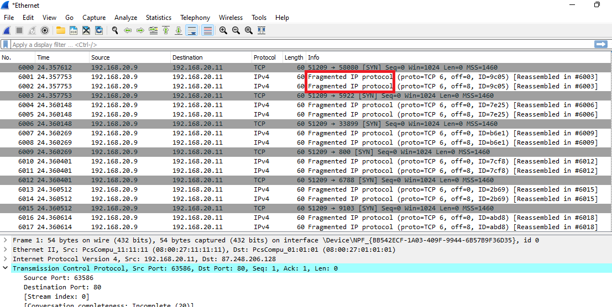

#  Evadir el IDS/Firewall

Requisitos:
1. Máquina ***Router-Ubu***.
2. Máquina ***Kali Linux***.
3. Máquina ***Win 11***.
4. Máquina ***Metasploitable3-win2k8***.


Como Ethical Hacker, el siguiente paso después de haber reconocido la red es determinar si el IDS/Firewall es capaz de detectar dicha actividad. Aunque los firewall perimetrales suelen ser muy buenos y eficientes, no hay nada perfecto. Utilizando ciertas técnicas avanzadas podríamos realizar el reconocimiento sin levantar sospechas.

Este laboratorio profundizará en dichas técnicas y los conocimientos que adquieras puedes emplearlos en evaluar tus medidas defensivas.

## Instalación de WireShark.

Para poder observar a bajo nivel cómo funcionan estas técnicas.

En la máquina ***Win 11*** instalamos la última versión desde la siguiente URL.
Nota: Será necesario reiniciar la VM después de la instalación.
```
https://www.wireshark.org/#download
```


## Reconocimiento atravesando el firewall.

Los ***IDS*** y los ***Firewall*** son los mecanismos de seguridad que deben detectar (pasivos) y evitar (activos) el reconocimiento de la red local por parte de un agente de la amenaza. 

Las técnicas que suelen emplearse para evadir al IDS/Firewall son las siguientes:

* *Fragmentación de paquetes*. Los paquetes podrían ser reensamblados solo en el target. Si el IDS/Firewall no los ensambla, no podrá conocer qué es lo que está ocurriendo.
* *Manipulación del puerto de origen*. Se manipula el puerto origen en la cabecera TCP con la intención de confundir al IDS.
* *Señuelos IP*. Se especifican direcciones IP falseadas en la cabecera para que el IDS/IPS bloquee el tráfico de una IP diferente a la que está sondeando.
* *Enviar CRCs incorrectos*. Es otra medida que se utiliza para la evasión.
* *Usar Proxy*. Con la intención de ocultar el origen del sondeo.

En este laboratorio usaremos la máquina de ***kali*** como atacante y la de ***Win 11*** como objetivo.

En primer lugar aseguramos que ***win 11*** tiene el firewall activo.


En la máquina ***Win 11*** lanzamos ***WireShark*** para capturar el tráfico.

Rápidamente, en la máquina ***Kali*** escribimos el siguiente comando en una terminal.
Nota: ***192.168.20.11*** es ***Win11***
```
sudo nmap 192.168.20.11
```
Cuando ***nmap*** haya devuelto el resultado, en la máquina ***Win11*** detenemos la captura de ***WireShark***. Debemos ver claramente como se están sondeando una cantidad importante de puertos en la víctima, tal y como demuestra la siguiente captura. También puede determinarse el origen (***Kali***) y el destino. Sería sencilla para el IDS determinar que se están sondeando los puertos.


Volvemos a iniciar la captura de paquetes en ***WireShark***. A continuación, en la máquina ***Kali*** escribimos el siguiente comando en una terminal.
Nota: ***192.168.20.11*** es ***Win11***. El parámetro ***-f*** fragmenta la información en multitud de paquetes IP. Estos paquetes serán reensamblados en el destino. Se requiere uso de ***sudo***.
```
sudo nmap -f 192.168.20.11
```

Aunque el Firewall de Windows está arriba, los puertos aparecen ***open***, en lugar del ***filtered***, como bien sabemos.


Detenemos ***WireShrak*** y observamos la captura. Debemos ver claramente que los paquetes se han fragmentados.



El IDS, antes de permitir el paso de los paquetes al destino, debería reensamblarlos para analizar de qué se trata. Esto introduce una latencia importante en las comunicaciones TCP, por lo que muchos IDS no la implementan o la tienen desactivada.


Nota: Estamos haciendo las prácticas intentando saltar el ***Firewall/Host IDS*** de Windows. Estas mismas técnicas se emplean contra sistemas protegidos por perimetrales e IDS de reconocido prestigio.

Volvemos a capturar con ***WireShark***. 

Procedemos ahora a usar la técnica conocida como ***source port manipulation***, donde ponemos como puerto origen de la conexión un puerto conocido, como el ***80***, con la idea de evadir al IDS/Firewall.
Nota: ***-sS*** es necesario para que ***nmap*** pueda poner el puerto origen deseado.
```
sudo nmap -g 80 -sS 192.168.20.11 
```

Detenemos la captura y observamos el resultado. Claramente se puede apreciar que el puerto de origen es el ***80***.


Volvemos a capturar con ***WireShark***. 

En este caso la técnica consiste en modificar la ***MTU (Maximun Transfer Unit***), que segmentaría los paquetes. Se usan tamaños de MTU muy pequeños para ver si la evasión es posible.
```
sudo nmap -mtu 8 192.168.20.11 
```

Detenemos ***WireSharsk***. Es resultado es muy parecido a uso del parámetro ***-f***, con la diferencia que en este caso podemos elegir el tamaño máximo del fragmento.


La técnica de ***señuelo***, consiste en en generar una serie de IPs aleatorias (señuelos) en la cabecera de los diferentes paquetes TCP. Su finalidad es que las acciones preventivas que realizará el IDS, se aplique a un dispositivo de red que no es quien realmente está sondeando.

Iniciamos de nuevo la captura con ***WireShark***.

En la terminal de ***Kali*** escribimos el siguente comando.
Nota: ***RND:10*** instruye a ***nmap*** a generar 10 IPs aleatorias que irá utilizando.
```
sudo nmap -D RND:10 192.168.20.11
```

Detenemos la captura de ***WireShark***. Como podrás comprobar, la ***IP de Origen*** está falseada.


***ACTIVIDAD***

¿Serías capaz de sondear a la victima usando a la vez una combinación de las técnicas explicadas?. ¿Crees que tus IDSs son suficientemente buenos para detectar este reconocimiento?

## Creación paquetes modificados por Hping3 para evadir el Firewall.

Como venimos diciendo, existen inumerables herramientas que hacen lo que desamos tener. Además de ***nmap***, podemos usar, por ejemplo ***hping3*** para craftear los paquetes de sondeo.

Iniciamos de nuevo la captura con ***WireShark***.

En la terminal de ***Kali*** escribimos.
Nota: ***--data 500*** indica que la longitud deseada del paquete. El resto de parámetros debes entenderlo perfectamente.
Nota: hping3 es considerada una herramienta de ataque, así que su finalidad principal no es el reconocimiento, sino realizar ataques DoS para demostrar la fortaleza del IDS/Firewall.
Nota: Pasado 30 segundos, para ***hping3*** con ***CTRl-C***
```
sudo hping3 192.168.20.11 --udp --rand-source --data 500
```

Detén la captura de ***WireShark***

Como podemos ver en la captura, se puede verificar que se está ***falseando la IP de origen***, se usa ***UDP*** y la longitud es de ***500 bytes***. Difícil para el IDS/Firewall determinar el origen del ataque.


El siguiente ejemplo realiza un ataque de ***inundación (flood)***, estreando las capacidades defensivas del IDS/Firewall.
Nota: Se envían ***15000*** paquetes de ***120*** bytes, habilitando la bandera ***SYN*** y ***tamaño de ventana de 64 bytes***. Falseamos ***puerto de origen*** e ***IP de origen***.
```
 sudo hping3 -c 15000 -d 120 -S -w 64 -p 80 --flood --rand-source 192.168.20.11
 ```

*** ACTIVIDAD ***

¿Podrías visualizar con ***WireShark*** el ataque DoS anterior? Para ello estudia el siguiente artículo: https://www.firewall.cx/general-topics-reviews/network-protocol-analyzers/1224-performing-tcp-syn-flood-attack-and-detecting-it-with-wireshark.html, que explica detalladamente como funciona. Esta información te podría ayudad en la Forense a determinar si un sistema ha sido atacado.

## Anonimización por medio de proxy/VPN.

pag 272 proxy Switcher.
