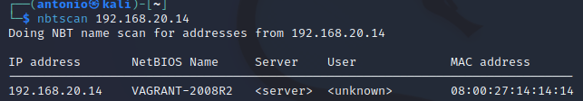
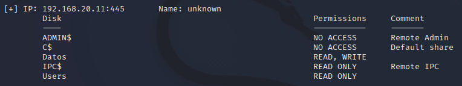

# Enumeración 

Requisitos:
1. Máquina ***Router-Ubu***.
2. Máquina ***Kali Linux***.
3. Máquina ***Win 11***
4. Máquina ***Metasploitable3-win2k8***.
5. Máquina ***Windows 7 Ethical Hacking***.

NetBIOS (Network Basic Input Output System) es el protocolo que utiliza el sistema operativo Windows para compartir archivos e impresora. Aunque existen versiones muy antiguas (SMB 1.0) que presentan vulnerabilidades tremendas, en este laboratorio nos quedaremos en la parte de enumeración para aprender a extraer información de estos sistemas desde la red local.

## Enumeración NetBIOS por medio de nbtscan y smbmap

El sistema operativo Windows ofrece herramientas como ***nbtstat*** y ***net use*** que permiten enumerar NetBIOS. No obstante, usaremos una máquina Linux para realizar la enumeración. La razón es obvia: Los actores de la amenaza suelen usar mayoritariamente herramientas basadas en Linux, ya que son efectivas y requieren menos recursos.

En la máquina ***Kali*** abrimos una terminal de comandos y escribimos.
Nota: ***nbtscan*** permite realizar la enumeración sobre NetBIOS.
```
nbtscan 
```

Elegimos un objetivo conocido, la máquina ***192.168.20.14*** que es la ***Metasploitable3-win2k8***.
```
nbtscan 192.168.20.14
```

Como podremos comprobar, la salida muestra que existe un dispositivo en esa IP que responde al protocolo NetBIOS.



Para extraer más información, usamos el parámetro ***-v***. Podemos ver el valor el byte número 15 que indica el tipo de servicio que se está prestando
```
nbtscan -v 192.168.20.14
```

Se puede hacer más legible (humana) la salida con ***-h***. En este caso aparece en nombre del servicio NetBIOS en lugar del valor de byte.
Nota: Se puede comprobar que la máquina está compartiendo carpetas (es un servidor de archivos)
```
nbtscan -v -h 192.168.20.14
```

En la máquina ***Win 11*** vamos a hacer lo siguiente:

* Crea una carpeta llamada ***Datos*** y compártela.
* Crea en el Escritorio un archivo de texto llamado ***contrato.txt***, edítalo y escribe cualquier cosa. Luego guárdalo.

De vuelta a la máquina ***Kali***, si tenemos credenciales en el objetivo, podemos enumerar los shares con la herramienta ***smbmap***.
```
smbmap -H 192.168.20.11 -u antonio -p Pa55w.rd
```

La salida debe ser similar a la de esta imagen.

`

Podemos interactuar con la share deseada con el siguiente comando.
```
smbmap -H 192.168.20.11 -u antonio -p Pa55w.rd -r 'Users\antonio\Desktop'
```


