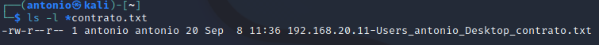

# Enumeración NetBIOS.

Requisitos:
1. Máquina ***Router-Ubu***.
2. Máquina ***Kali Linux***.
3. Máquina ***Win 11***
4. Máquina ***Metasploitable3-win2k8***.
5. Máquina ***Windows 7 Ethical Hacking***.

NetBIOS (Network Basic Input Output System) es el protocolo que utiliza el sistema operativo Windows para compartir archivos e impresora. Aunque existen versiones muy antiguas (SMB 1.0) que presentan vulnerabilidades tremendas, en este laboratorio nos quedaremos en la parte de enumeración para aprender a extraer información de estos sistemas desde la red local.

## Enumeración NetBIOS por medio de nbtscan y smbmap

El sistema operativo Windows ofrece herramientas como ***nbtstat*** y ***net use*** que permiten enumerar NetBIOS. No obstante, usaremos una máquina Linux para realizar la enumeración. La razón es obvia: Los actores de la amenaza suelen usar mayoritariamente herramientas basadas en Linux, ya que son efectivas y requieren menos recursos.

En la máquina ***Kali*** abrimos una terminal de comandos y escribimos.
Nota: ***nbtscan*** permite realizar la enumeración sobre NetBIOS.
```
nbtscan 
```

Elegimos un objetivo conocido, la máquina ***192.168.20.14*** que es la ***Metasploitable3-win2k8***.
```
nbtscan 192.168.20.14
```

Como podremos comprobar, la salida muestra que existe un dispositivo en esa IP que responde al protocolo NetBIOS.


Para extraer más información, usamos el parámetro ***-v***. Podemos ver el valor el byte número 15 que indica el tipo de servicio que se está prestando
```
nbtscan -v 192.168.20.14
```

Se puede hacer más legible (humana) la salida con ***-h***. En este caso aparece en nombre del servicio NetBIOS en lugar del valor de byte.
Nota: Se puede comprobar que la máquina está compartiendo carpetas (es un servidor de archivos)
```
nbtscan -v -h 192.168.20.14
```

En la máquina ***Win 11*** vamos a hacer lo siguiente:

* Crea una carpeta llamada ***Datos*** y compártela.
* Crea en el ***Escritorio**** un archivo de texto llamado ***contrato.txt***, edítalo y escribe cualquier cosa. Luego guárdalo.

De vuelta a la máquina ***Kali***, si tenemos credenciales en el objetivo, podemos enumerar los shares con la herramienta ***smbmap***.
```
smbmap -H 192.168.20.11 -u antonio -p Pa55w.rd
```

La salida debe ser similar a la de esta imagen.


Podemos interactuar con la share deseada con el siguiente comando.
```
smbmap -H 192.168.20.11 -u antonio -p Pa55w.rd -r 'Users\antonio\Desktop'
```

Podrás comprobar que hay un documento interesante en el Escritorio.


Lo descargamos.
```
mbmap -H 192.168.20.11 -u antonio -p Pa55w.rd --download 'Users\antonio\Desktop\contrato.txt'
```

Comprobamos la descargas.
```
ls -l *contrato.txt
```

Ya lo tenemos en nuestro poder. Esto demuestra que con herramientas de línea de comandos sin interfaces gráficas, que inyectaremos posteriormente en el curso por medio de payloads, podemos acceder a la información sin levantar sospechas.



## Enumerar NetBIOS con nmap scripting engine.

Hemo visto que ***nmap*** es una herramienta muy poderosa, pero ¿sabías que se puede extender su funcionalidad?

Efectivamente. ***NSE*** (Nmap Scripting Engine) es la herramienta más poderosa de ***nmap***. Hackers con grandes conocimientos técnicos usan el luenguaje de programación ***Lua*** para extender/ampliar/mejorar las capacidades de ***nmap***.

Estos scripts se almacenan en la carpeta ***/usr/share/nmap/scripts*** y son de diversa índole. En la máquina ***Kali*** ejecutamos el siguiente comando para ver los scripts que están disponibles.
Nota: Recorre lentamente el listado para que puedas comprobar las enormes posibilidades que ofrece ***nmap***.
```
ls -l /usr/share/nmap/scripts | more
```

En este ejemplo nos centramos en un script llamado ***nbstat.nse***, que está especializado en enumerar NetBIOS. Veamos su código fuente.
Nota: Para salir del editor pulsa ***CTRL+X***.
```
nano /usr/share/nmap/scripts/nbstat.nse
```

Procedemos a realizar la misma práctica que en el ejercicio anterior, pero esta vez desde ***nmap***
Nota: ***-v*** muestra información adicional. ***-sU*** usa scaneo UDP (evasión FW). ***-p 137*** es el puerto a ser escaneado.
```
sudo nmap -v -sU -p 137 --script nbstat.nse 192.168.20.11
```

Como podras observar, el uso de la herramienta ***nmap*** es de más bajo nivel y eso requiere conocimientos más profundos en el protocolo netBIOS.


