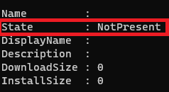
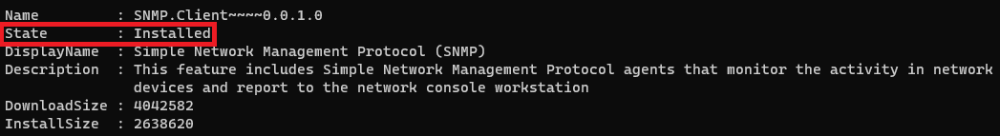
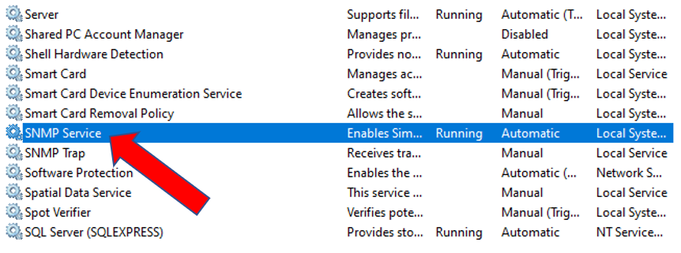
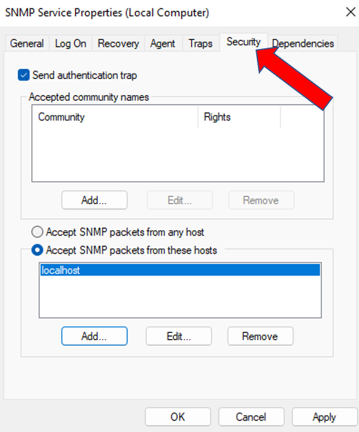
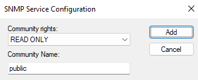
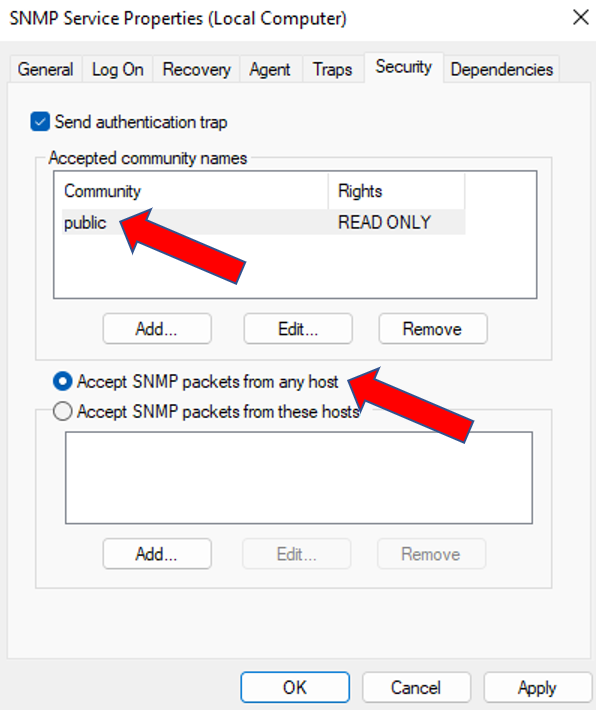

# Enumeración SNMP

Requisitos:
1. Máquina ***Router-Ubu***.
2. Máquina ***Kali Linux***.
3. Máquina ***Win 11***

Como ya sabes, SNMP es un protocolo que permite tomar (y modificar) información de configuración de un dispositivo de forma remota. Muchas herramientas de monitorización dependen de SNMP para conocer el estado de los dispositivos de la red.

La enumeración SNMP se utiliza principalmente contra los ***Switches*** y ***Routers*** presentes en la infraestructura, con la finalidad de obtener información de calidad.

En nuestro entono de laboratorio no tenemos este tipo de hardware, así que lo que vamos a hacer el habilitar el protocolo ***SNMP*** en una máquina virtual para poder interactuar contra él.

## Ejercicio 1: Habilitar SNMP en Win 11.

En la máquina ***Win 11*** abrimos una ***Terminal de PowerShell*** en modo ***Administrador***. En ella escribimos el siguiente comando.
```
Get-WindowsCapability -Online -name "SNMP"
```

El resultado nos dice claramente que este protocolo no está instalado en el sistema operativo.



Procedemos a instalar el servicio.
```
Add-WindowsCapability -Online -Name "SNMP.Client~~~~0.0.1.0"
```

Comprobamos que se ha instalado.
```
Get-WindowsCapability -Online -name "SNMP*"
```



Es conveniente comprobar que el servicio está iniciado.



Aun queda por realizar una configuración importante. Recordemos que estamos simulando con la máquina ***Win 11*** un dispositivo de red que es administrado por ***SNMP***.

En la ventana ***Services***, hacemos clic con botón derecho en el servicio ***SNMP Service***. 

A continuación hacemos clic en la pestaña ***Security***-



Como podrás observar en el cuadro de diálogo tenemos que:
* En ***Accepted Community names*** no hay nada. La comunidad es un string y todos los dispositivo que tengan configurado ese mismo string, podrán comunicarse por SNMP.
* Los paquetes SNMP ahora mismo solo se aceptan desde el ***localhost***.

Pues bien, lo que vamos a hacer es configurar estos valores con los que tendría una configuración por defecto de este protocolo en la mayoría de los dispositivos de red.

Hacemos clic en el botón ***Add*** en ***Acepted community names*** y lo configuramos como se puede apreciar en la siguiente imagen.
Nota: Pon ***public*** como nombre de la comunidad y haz clic en ***Add***-



Haz clic en el botón de radio ***Accept SNMP packets from any hosts***. Debe quedar así.



Hacemos clic en el botón ***OK*** y cerramos la ventana ***Services***.

Es alarmante como la mayoría de los dispositivos de electrónica de red no son configurados correctamente y, al utilizar la configuración por defecto de este protocolo, se lo estamos poniendo muy fácil al actor de la amenaza.


## Ejercicio 2: Usar snmp-check para la enumeración.

La herramienta ***snmp-check*** es un cliente de ***SNMP*** que se conecta a la víctima y le solicita toda la información disponible.

En la máquina ***Kali*** ejecutamos el siguiente comando.
Nota: Relájate y tómate tu tiempo. Comprueba que gran cantidad de información se exfiltra.
```
snmp-check 192.168.20.11 | more
```

***ACTIVIDAD***

De la salida anterior, localiza la siguiente información:
* Usuarios existentes en el sistema.
* Puerta de enlace.
* Puertos abiertos.
* Servicios que está ejecutando el sistema.
* Almacenamiento local.
* Aplicaciones instaladas.
* Shares.


