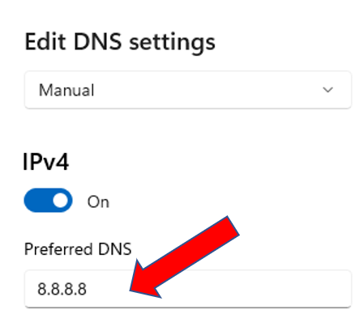
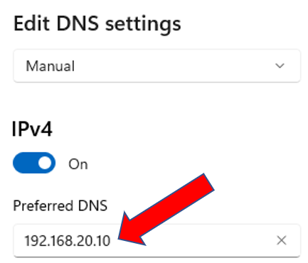
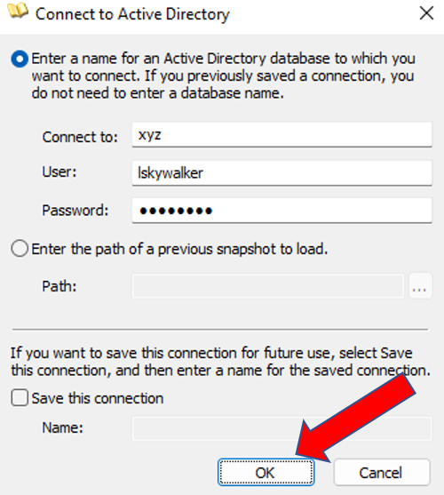
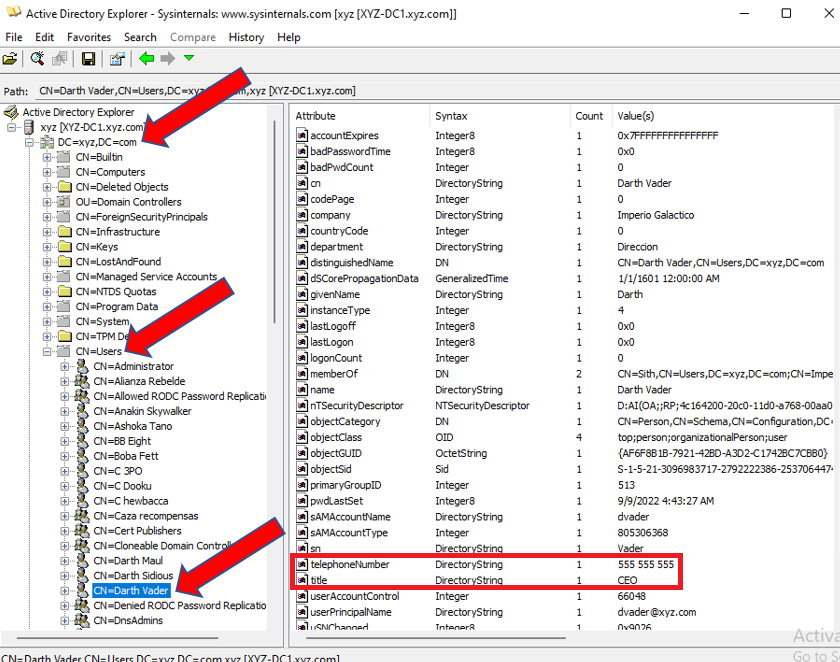

# Enumeración LDAP.

Requisitos:
1. Máquina ***Router-Ubu***.
2. Máquina ***Kali Linux***.
3. Máquina ***Win 11***
4. Máquina ***WS2002_DC_Server_Core***


En la mayoría de las organizaciones se dispone de un origen de identidades organizado que facilita la gestión de los usuarios. Este tipo de infraestructura recibe el nombre de ***Directorio***.

El estándar de directorio más ampliamente utilizado es ***X-500***, y su implementación más conocida es ***Open-LDAP***.

En el caso de Microsoft, se ha extendido este estándar aportando más funcionalidad y lo conocemos como ***Active Directory***.

En este laboratorio aprenderemos a realizar la enumeración y extraer información muy interesante.

## Ejercicio 1: Iniciar sesión en el Dominio XYZ.

En la máquina ***Win 11***, debemos hacer una reconfiguración del DNS para que se pueda contactar con el controlador de dominio.

El servidor DNS configurado en ***Win 11*** es ***8.8.8.8***. Esto es así porque de esta manera no nececitábamos tener iniciado el ***Controlador de dominio*** para hacer la resolución DNS. Por esta razón, hemos usado una cuenta local.

Accedemos a la configuración IP de la máquina, que debe tener esta configuración.



Debemos cambiarla a la siguiente, que es la IP del controlador de dominio.



Una vez realizada esta acción la máquina ***Win 11*** podrá resolver la IP del controlador de dominio y, en consecuencia, contactar con ***Active Directory*** para iniciar sesión con Kerberos.

Cerramos la sesión del usuario actual (que es un usuario local), e iniciamos una nueva sesión con el usuario.
Nota: ***Luke Skywalker*** es un usuario sin privilegios en el dominio ***XYZ***.
```
XYZ\lskywalker
``` 

y password
```
Pa55w.rd
```

## Ejercicio 1: Enumerar el dominio con ADExplorer

En la máquina ***Win 11***. abrimos el navegador y descargamos el siguiente link.
```
https://download.sysinternals.com/files/AdExplorer.zip
```

Descomprimimos la carpeta y, la movemos a una ubicación más cómoda, por ejemplo el ***Escritorio***.

Ejecutamos la aplicación ***ADExplorer64***. Aceptamos los términos, haciendo clic en el botón ***Agree***.

Aparecerá un cuadro de diálogo que nos pide las credenciales. Lo conformamos de la siguiente forma.

* *Connect to*: XYZ.COM
* *User*: lskywalker
* *Password*: Pa55w.rd

Debe quedar como se muestra en la siguiente imagen. Hacemos clic en el botón ***OK***. 



***ADExplorer64*** se conectará a ***Active Directory*** usando las credenciales proporcionadas.
Nota: Muy importante. Recuerda que ***Luke Skywalker*** no tiene privilegios especiales en el dominio.

Como podrás ver en la siguiente imagen, en la herramienta desplegamos el dominio ***DC=xyz,DC=com***, luego hacemos clic en el contenedor ***CN=Users***, y elegimos un usuario determinado. Observa como se exlfiltra la información. El usuario elegido es el ***CEO*** y tenemos su ***teléfono***. Sin duda información de calidad para el actor de la amenaz. Disfruta con la lista de usuarios de ***TODA LA ORGANIZACIÓN***.



Esta es la realidad. Cualquier usuario del dominio puede consultar el directorio.

***ACTIVIDAD***

Enumera la siguiente información.

* Equipos presentes en el dominio.
* Usuarios del departamento de dirección.
* Controladores de dominio.
* Zonas DNS que replica el bosque.

***FIN ACTIVIDAD***

## Ejercicio 2: Enumerar el dominio con ldapsearch.

Por descontado que podemos hacer lo mismo con herramientas de línea de comandos. ***Kali Linux*** ofrece la herramienta ***ldapsearch***, que es un cliente de ***LDAP***.

Para poder usar la herramienta solo necesitamos una cuenta de dominio sin privilegio alguno. En el siguiente ejemplo listamos los usuarios del dominio.
* *-H ldap://192.168.20.10* es la IP de uno de los controladores de dominio.
* *-x* hace que se use la autenticación simple.
* *-D "lskywalker@xyz.com"* es el usuario que va a hacer la consulta a ***ADDS***.
* *-W* nos pide el password del usuario anterior.
* *-b "dc=xyz,dc=com"* es el contenedor origen de la consulta, que en este caso es el dominio completo.
Nota: Usar el password ***Pa55w.rd***.
```
ldapsearch  -H ldap://192.168.20.10 -x -D "lskywalker@xyz.com" -W -b "dc=xyz,dc=com"
```

La herramienta permite usar filtros indicándolo por medio del ***nombre canónico*** del objeto. Por ejemplo, si queremos listar los ***Controladores de dominio*** podríamos.
```
ldapsearch  -H ldap://192.168.20.10 -x -D "lskywalker@xyz.com" -W -b "ou=Domain Controllers,dc=xyz,dc=com"  "(objectClass=computer)" | grep distinguishedName
```

Para extraer el nombre de inicio de sesión de los usuarios, escribimos.
```
ldapsearch  -H ldap://192.168.20.10 -x -D "lskywalker@xyz.com" -W -b "dc=xyz,dc=com"  "(objectClass=user)" | grep sAMAccountName
```

Para localizar los equipos miembros del dominio, hacemos.
```
ldapsearch  -H ldap://192.168.20.10 -x -D "lskywalker@xyz.com" -W -b "dc=xyz,dc=com"  "(objectClass=Computer)" | grep sAMAccountName
```

En el siguiente enlace puedes ver un ejemplo de como el IDS detecta este tipo de tráfico en la red. Esto nos servirá para valorar la importancia de este tipo de contramedidas.
```
https://docs.paloaltonetworks.com/cortex/cortex-xdr/cortex-xdr-analytics-alert-reference/cortex-xdr-analytics-alert-reference/suspicious-ldap-search-query-executed
```

