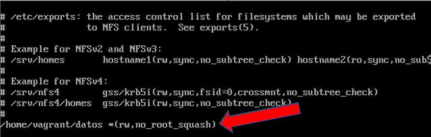

# Enumeración LDAP.

Requisitos:
1. Máquina ***Router-Ubu***.
2. Máquina ***Kali Linux***.
3. Máquina ***Metasploitable3-ubu1404***.


***NFS*** (Network File System) es el servicio de compartición de archivos característico de entornos Linux (Windows Server también puede ofrecerlo).

Las versiones más recientes presentan menos vulnerabilidades que las más antiguas, pero eso no nos interesa aún. En la mayoría de las ocasiones, la información se fuga porque el administrador ha realizado una implementación de NFS errónea, que permite ser atacada.

En este laboratorio vamos a instalar ***NFS*** y aprender a enumerarlo desde la máquina de ataque.

## Instalación de NFS.

Iniciamos sesión la máquina ***Metasploitable-ubu1404*** con el usuario
```
vagrant
```

y el password
```
vagrant
```

Observarás que no hay soporte de ratón porque es un servidor sin interfaz gráfica. Tampoco tenemos portapapeles porque no se han instalado los servicios de integración, por esta razón tendrás que copiar los comandos directamente.

El teclado configurado en la VM tiene la distribución en inglés, así que vamos a configurarlo apropiadamente.
```
sudo loadkeys es
```

Debemos configurar el resolvedor a la VM.
```
sudo nano /etc/resolv.conf
```

Escribimos la siguiente línea.
```
nameserver 8.8.8.8
```

Guardamos y salimos con ***CTRL+X***, ***Y*** y ***ENTER***.

Ahora procedemos a instalar el servicio NFS.
```
sudo apt-get update
```
```
sudo apt-get install -y nfs-kernel-server
```

El archivo ***/etc/exports*** mantiene un registro por cada directorio que se va a compartir en la red. Existen diferentes opciones que definirán el tipo de privilegio que tendrán los clientes sobre cada ***share***.

* *rw*: Permiso de lectura y escritura.
* *ro*: Permiso de solo lectura.
* *root_squash*: Previene peticiones de archivo hechas por el usuario ***root*** en la máquina cliente.
* *no_root_squash*: Permite al usuario ***root*** de la máquina cliente acceder al share.
* *async*: Mejora la velocidad de transferencia pero puede conducir a corrupción de los datos.
* *sync*: Garantiza la integridad de los datos a expensas de la velocidad de transferencia.

En bastantes ocasiones, los administradores crean ***shares*** que no requieren autenticación, por diversas razones:

* No poseen los conocimientos para habilitar la autenticación.
* La información que se comparte no es sensible.
* Es una necesidad temporal y el share se retirará en breve.
* Las aplicaciones que acceden al share no pueden usar autenticación.
* Etc.

Vamos a crear un ***Share***. En primer lugar creamos una carpeta y entramos en ella.
```
mkdir -p ~/datos

cd ~/datos
```

Creamos unos cuantos archivos (vacíos) para simular.
```
touch file1 file2 file3
```

Procedemos a crear el share. Para ello editamos el archivo ***/etc/exports***.
```
sudo nano /etc/exports
```

y añadimos una nueva línea, tal y como muestra la imagen.



Guardamos con ***CTRL+X***, ***Y*** y ***ENTER***.

Lo que hemos hecho es compartir el directorio ***/home/vagrant/datos***, permitiendo acceder al usuario ***root*** de los clientes, en forma de ***lectura*** y ***escritura***. El '*' indica que la conexión se puede hacer desde cualquier ***IP***.

Reiniciamos el servicion ***NFS***.
```
sudo /etc/init.d/nfs-kernel-server restart
```

Ahora debemos abrir el firewall de la máquina para que pueda funcionar el protocolo NFS. Lo primero que vamos a hacer es volcar la configuración de las reglas para trabajar más cómodos.
```
sudo iptables-save > /tmp/iptables.txt
```

Lo editamos con ***nano***.
```
sudo nano /tmp/iptables.txt
```

Lo editamos de forma que quede tal y como aparece en la imagen. Hemos agregado ***tres reglas***, ***dos*** para el puerto ***2049***, y ***una*** para ***rpcbind*** (Puerto ***111***) en la parte final del arhivo, justo delante de ***-A INPUT -j DROP***.
Nota: Guardar con ***CTRL+X***, ***Y*** + ***ENTER***.


Para que estas reglas sean persistentes vamos a guardarla en una ruta especial. Cuando la máquina vuelva a iniciarse, se recargarán las reglas.
Nota: Invovamos una shell como ***root*** porque se necesita a la vez permisos de root en el comando ***iptables-save*** y en el archivo ***/etc/iptables/rules.v4***.

```
sudo sh -c "iptables-save > /etc/iptables/rules.v4"
```


## Enumerar los shares con nmap.

Lo primero que debemos hacer es localizar los servidores ***NFS*** de la red. Para ello debemos saber que el puerto de servicio de ***NFS*** es el ***2049***.

En la máquina ***Kali***, ejecutamos el siguiente comando.
```
nmap -sV -p 2049 192.168.20.10-20
```

Como puede observarse en la siguiente imagen, en la IP ***192.168.20.13*** existe un servidor ***NFS*** porque el puerto está ***open***.

Lo primero que va a hacer el actor de la amenaza es ***enumerar*** las shares de ese servidor nfs. Si es afortunado encontrará alguna que no requiera autenticación.
Nota: Los ***exports*** se exponen en el puerto ***111***.
```
nmap -sV -p 111 --script=nfs-showmount 192.168.20.13
```

La imagen muestra como aparece listado 