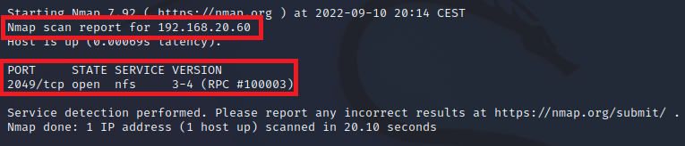
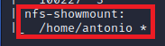

# Enumeración LDAP.

Requisitos:
1. Máquina ***Router-Ubu***.
2. Máquina ***Kali Linux***.
3. Máquina ***ubu_srv_01***.


***NFS*** (Network File System) es el servicio de compartición de archivos característico de entornos Linux (Windows Server también puede ofrecerlo).

Las versiones más recientes presentan menos vulnerabilidades que las más antiguas, pero eso no nos interesa aún. En la mayoría de las ocasiones, la información se fuga porque el administrador ha realizado una implementación de NFS errónea, que permite ser atacada.

En este laboratorio vamos a instalar ***NFS*** y aprender a enumerarlo desde la máquina de ataque.

## Configuración de un share de NFS.

Iniciamos sesión la máquina ***ubu_srv_01*** con el usuario
```
antonio
```

y el password
```
Pa55w.rd
```

Observarás que es una versión sin interfaz gráfica. No hay soporte de portapapeles, por esta razón tendrás que copiar los comandos directamente.


El archivo ***/etc/exports*** mantiene un registro por cada directorio que se va a compartir en la red. Existen diferentes opciones que definirán el tipo de privilegio que tendrán los clientes sobre cada ***share***.

* *rw*: Permiso de lectura y escritura.
* *ro*: Permiso de solo lectura.
* *root_squash*: Previene peticiones de archivo hechas por el usuario ***root*** en la máquina cliente.
* *no_root_squash*: Permite al usuario ***root*** de la máquina cliente acceder al share.
* *async*: Mejora la velocidad de transferencia pero puede conducir a corrupción de los datos.
* *sync*: Garantiza la integridad de los datos a expensas de la velocidad de transferencia.

En bastantes ocasiones, los administradores crean ***shares*** que no requieren autenticación, por diversas razones:

* No poseen los conocimientos para habilitar la autenticación.
* La información que se comparte no es sensible.
* Es una necesidad temporal y el share se retirará en breve.
* Las aplicaciones que acceden al share no pueden usar autenticación.
* Etc.

Vamos a crear un ***Share*** en el que cometeremos un error muy grave de seguridad. ***NFS*** se puede usar también para hacer las migraciones, y por consiguiente, suele ser muy cómodo compartir el directorio ***home*** del usuario en cuestión.

Procedemos a crear el share. Para ello editamos el archivo ***/etc/exports***.
```
sudo nano /etc/exports
```

y añadimos una nueva línea, tal y como muestra la imagen.


Guardamos con ***CTRL+X***, ***Y*** y ***ENTER***.

Lo que hemos hecho es compartir el directorio ***/home/antonio***, permitiendo acceder al usuario ***root*** de los clientes, en forma de ***lectura*** y ***escritura***. El '*' indica que la conexión se puede hacer desde cualquier ***IP***.

Reiniciamos el servicion ***NFS***.
```
sudo /etc/init.d/nfs-kernel-server restart
```

Las versiones de NFS anteriores a la ***4*** usan varios puertos dinámicos, que deben ser configurados como estáticos para crear las correspondientes reglas en el firewall. Como el objetivo de este curso no es aprender a configurar puestos estáticos en el kernel, lo que vamos a hacer es abrir el firewall por nuestra comodidad.
```
sudo iptables -F
```


## Enumerar los shares con nmap.

Lo primero que debemos hacer es localizar los servidores ***NFS*** de la red. Para ello debemos saber que el puerto de servicio de ***NFS*** es el ***2049***.

En la máquina ***Kali***, ejecutamos el siguiente comando.
```
nmap -sV -p 2049 192.168.20.10-20
```

Como puede observarse en la siguiente imagen, en la IP ***192.168.20.13*** existe un servidor ***NFS*** porque el puerto está ***open***.




Lo primero que va a hacer el actor de la amenaza es ***enumerar*** las shares de ese servidor nfs. Si es afortunado encontrará alguna que no requiera autenticación.
Nota: Los ***exports*** se exponen en el puerto ***111***nm.
```
nmap -sV -p 111 --script=nfs-showmount 192.168.20.13
```

La imagen muestra como aparece listado el share que hemos creado anteriormente.



Con esto concluye la práctica de enumeración ***NFS***. Es muy importante recordar que una mala práctica por parte del administrador puede conducir al robo de información, e incluso a tomar el control del sistema.

Como adelanto a la parte del curso centrada en los ataques, te recomiendo que hagas el siguiente laboratorio: ***4. Laboratorio 30-D: Escalado de privilegio en una NFS mal configurada***.
