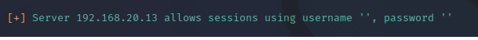

# Enumeración SMB/Samba

Requisitos:
1. Máquina ***Router-Ubu***.
2. Máquina ***Kali Linux***.
3. Máquina ***Metasploitable3-ubu1404***.
4. Máquina ***Metasploitable3-win2k8***.


***SMB*** (Server Message Block) es el servicio de compartición de archivos característico de entornos Windows. Linux los ofrece a través de la emulación ***Samba***.

Las versiones más recientes presentan menos vulnerabilidades que las más antiguas, no obstante, en este ejercicio solo nos interesa enumerarlas. Ya habrá tiempo de buscar vulnerabilidades y atacar.

## Enumerar carpetas compartidas.

En primer lugar vamos a localizar los servidores que se comportan como servidores de archivos. Para ello nos apoyamos en ***nmap***.

En la máquina ***Kali*** ejecutamos el siguiente comando.
Nota: Los servidores a investigar son ***Metasploitable3-ubu1404*** (IP 13) y ***Metasploitable3-win2k8*** (IP 14)
```
nmap -sV 192.168.20.13-14
```

En la siguiente imagen podemos observar cómo la ***IP 13*** ofrece el servicio ***SAMBA***.


En esta otra, la máquina con ***IP 14*** ofrece ***SMB***.


Una vez detectado los hosts que comparten carpetas, procedemos a su enumeración usando la herramienta ***enum4linux***.
```
enum4linux -v 192.168.20.13
```

Esta herramienta interactúa con el servicio ***SMB/Samba*** intentando extraer información de calidad. Lee la salida del comando prestando atención a los siguientes elementos:

* Se permiten sesiones anónimas.

* Se ha obtenido información de versión del sistema operativo.

*


