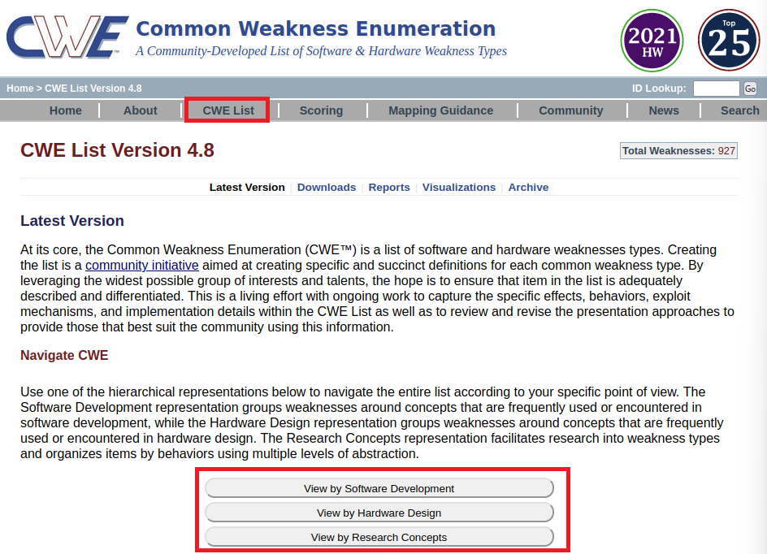
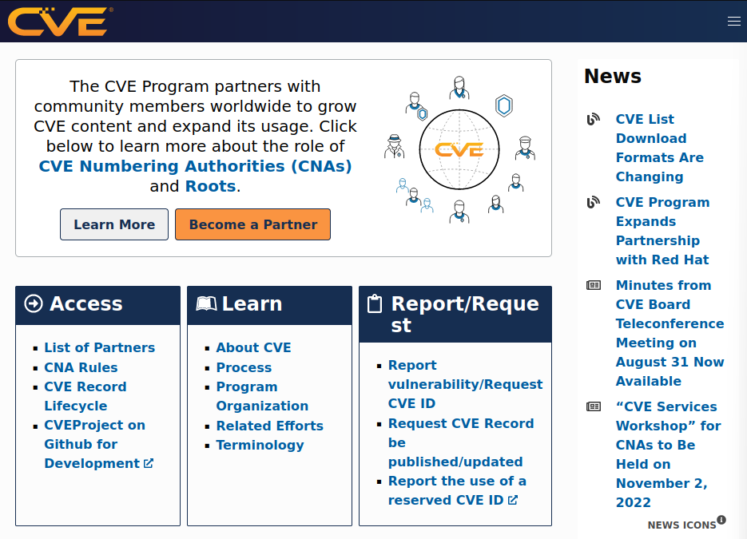

# Búsqueda de información sobre vulnerabilidades en Internet.

Requisitos:
1. Máquina ***Router-Ubu***.
2. Máquina ***Kali Linux***.


Las bases de datos de vulnerabilidades y sus sistemas de puntuación son ampliamente usadas por los analistas de seguridad.

En este laboratoria aprenderemos a utilizar los sitios de Internet que nos proporcionan acceso a estas herramientas.

## Ejercicio 1: Búsqueda en Common Weakness Enumeration (CWE).

En la máquina ***Kali*** abrimos una sesión del navegador de Internet y nos conectamos a la siguiente URL.
```
https://cwe.mitre.org
```

Este sitio web está especializado en localizar ***debilidades*** comunes.

Hacemos clic en el botón ***CWE List***.



Como podemos ver, la lista está organizada en tres grandes secciones.

* *View by Software Development* enumera las debilidades que se introducen en las aplicaciones debidas a malas prácticas de diseño en la arquitectura de la aplicación o su implementación. Por ejemplo, en este enlace https://cwe.mitre.org/data/definitions/290.html se detalla la ***CWE-290***, que trata de cómo saltarse la autenticación falseando la dirección IP (***Spoofing de IP***).
* *View by Hardware Design* se especializa en debilidades provocadas por un mal diseño en el hardware de un dispositivo. En este enlace https://cwe.mitre.org/data/definitions/1319.html se describe la ***CWE-1319*** que detalla en qué consiste los ataques inyección por radiofrecuencia.
* *View by Research Concepts* organiza las debilidades por tipos de forma que se facilita su investigación. Por ejemplo, la ***CWE-682*** que podemos ver en este enlace https://cwe.mitre.org/data/definitions/682.html, agrupa todas las debilidades que tienen que ver con forzar al sistema a hacer un cálculo que genera un resultado incorrecto, que puede ser usado para un ataque posterior.

La página web principal también nos ofrece enlaces a conjuntos de ***CWE*** seleccionadas, por ejemplo.

* *https://cwe.mitre.org/data/definitions/1387.html* nos lleva a las ***25 debilidades más peligrosas*** que suelen existir en el desarrollo de aplicaciones.
* *https://cwe.mitre.org/data/definitions/1343.html* es la lista de las debilidades de hardware más importantes.
* *https://cwe.mitre.org/data/definitions/1344.html* Nos lleva a la lista ***Top Ten 2021*** de ***OWASP***, ***Open Web Application Security Project*** es la fundación que promueve el desarrollo seguro del sotfware.

Las herramientas de búsqueda de vulnerabilidades a menudo referencian los ***IDs*** de ***CWE*** cuando detectan un problema. De esta forma puedes estudiar al detalle en qué consiste. Como Ethical Hacker, la información que aquí se presenta es muy útil cuando se presenta el informe indicándo dónde está el problema y qué aproximación debe utilizarse para corregirlo.


***ACTIVIDAD***

Dedica unos minutos a estudiar esta web. En función de tu perfil profesional estarás interesado en algún tema específico.

## Ejercicio 2: Búsqueda en Common Vulnerabilities and Exposures (CVE).

En el navegador, conectamos a la siguiente URL.
```
https://cve.mitre.org
```




En este caso, ***Common Vulnerabilities and Exposures*** gestiona las vulnerabilidades existentes en los sistemas operativos, servicios y aplicaciones.

A diferencia de ***OWASP*** que está especializada en las debilidades que se cometen en el desarrollo de aplicaciones web, ***CVE*** reúne las vulnerabilidades descubiertas en las aplicaciones comerciales que solemos usar en nuestro negocio.


