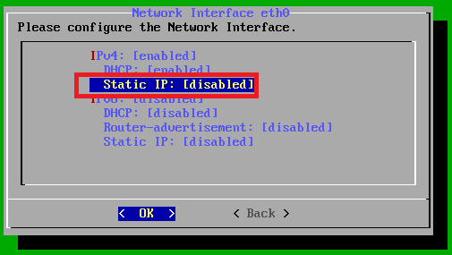

# Herramientas de evaluación de vulnerabilidades.
  

Requisitos:
1. Máquina ***Router-Ubu***.
2. Máquina ***Kali Linux***.
3. Máquina ***Metasploitable3-ub1404***.
4. Máquina ***Metasploitable3-win2k8***.
5. Máquina ***Win 11***.
6. Maquina ***GSM-Trial Open VAS*** (A descargar de Internet)


Como habrás comprobado no resulta demasiado práctico buscar manualmente las vulnerabilidades en las webs especializadas. Necesitamos automatizar este proceso.

En el mercado existen diversas herramientas que realizan toda esta labor. Algunas gratuitas, otras comerciales. En este laboratorio vamos a estudiar algunas de las más conocidas y usadas en el sector.

## Ejercicio 1: Instalar Open VAS.

Se trata de un escáner de vulnerabilidad completo que inicialmente era un proyecto de ***Open Source***. Hoy en día es una poderosa herramienta ***Comercial***. 

Podemos evaluar la versión completa durante 14 días. Para ello vamos a descargar una máquina virtual para ***Virtual Box***.

En tu máquina ***física*** conéctate a la siguiente URL.
```
https://www.greenbone.net/en/testnow/#downloadnow
```

El la captura puedes ver las instrucciones de instalación, así como el formulario que hay que rellenar para evaluar el producto.
Nota: Antes de empezar la instalación, sigue leyendo las ***Notas para la instalación***.


***Notas para la instalación***.

Si no se especifica nada, usar la opción por defecto.

Cuando la hayas importado, antes de iniciarla, conéctala a la red ***laboratorio***.


En la red ***laboratorio*** no hay ***servidor DHCP***, así que en el asistente de instalación debemos saltarlos la parte de comprobación de la conexión de red, hasta que podamos poner una IP manualmente.


El asistente nos pide la ***Clave de Subscripción*** para poder actualizar la base de datos de vulnerabilidades. Esta clave se obtiene al registrar la demo de 14 días. Por comodidad, ***Saltamos*** este paso porque la base de datos que trae por defecto es más que suficiente para evaluar el producto, así que seleccionamos ***Skip***.

Ahora vamos a cofigurar la red. elegimos ***Setup***.


Luego ***Network***.


Seleccionamos ***Interfaces***


Seleccionamos ***Static IP***.



Ponemos la IP ***192.168.20.100/24***.


Guardamos la configuración.


Salimos de la configuración de ***eth0***.


Configuramos la resolución ***DNS***.


Seleccionamos el primer servidor.


Ponemos ***8.8.8.8***.


Guardamos y salimos de la configuración ***DNS***.


Vamos a poner la ***Puerta de enlace***.


Escribimos ***192.168.20.1***.


Guardamos la configuración y volvemos.


Salimos de todos los cuadros de diálogo hasta la pantalla de ***login***.

Con esto termina la instalación del producto.

## Ejercicio 2: Descubrir vulnerabilidades con Open VAS.

En la máquina ***Kali***, abre una sesión del navegador y conecta a la siguiente URL.
```
https://192.168.20.100/
```

El navegador mostrará una advertencia de seguridad, debida a que el certificado digital que usa el servidor web está autofirmado. Ignoramos esta advertencia haciendo clic en ***Advanced*** y luego en ***Accept the Risk and Continue***.
Nota: En la documentación de Open VAS se especifica cómo cambiar el certificado de seguridad.

En la pantalla de inicio de sesión usamos el usuario.
```
admin
```

y el password.
```
admin
```

Elegimos en el menú la opción ***Scans/tasks*** e invocamos al asistente de tareas.


Hacemos clic en ***Task Wizard***. Ponemos la IP de la máquina a ePa55wrdstudiar: ***192.168.20.13*** y hacemos clic en ***Start Scan***.


Hay que esperar a que cambie de ***Requested*** a ***Done***. Tardará bastante, así que ve haciendo la actividad propuesta a continuación. 11:52
Nota: Pasará antes por el estado ***Queued***.


*** ACTIVIDAD ***

Realiza un análisis de vulnerabilidad en las máquinas

* ***Metasploitable3-win2k8*** 
* ***Win 11***

Debe quedar como ves en la imagen.
Nota: Deja que terminen los escaneos.


Cuando los informes se hayan generado, estudia el resultado de los mismos. 

En la siguiente imagen puedes ver el resultado del escaneo de la máquina ***Metasploitable3-ubu1404***. 


## Descubrir vulnerabilidades con ***Nessus***

Para liberar recursos, apaga la máquina virtual ***GSM-Trial.


