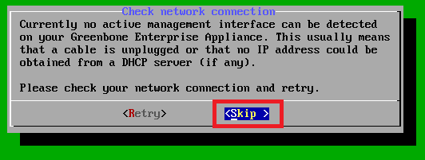

# Herramientas de evaluación de vulnerabilidades.
  

Requisitos:
1. Máquina ***Router-Ubu***.
2. Máquina ***Kali Linux***.
3. Máquina ***Metasploitable3-ub1404***.
4. Máquina ***Metasploitable3-win2k8***.
5. Máquina ***Win 11***.
6. Maquina ***GSM-Trial Open VAS*** (A descargar de Internet)


Como habrás comprobado no resulta demasiado práctico buscar manualmente las vulnerabilidades en las webs especializadas. Necesitamos automatizar este proceso.

En el mercado existen diversas herramientas que realizan toda esta labor. Algunas gratuitas, otras comerciales. En este laboratorio vamos a estudiar algunas de las más conocidas y usadas en el sector.

## Ejercicio 1: Instalar Open VAS.

Se trata de un escáner de vulnerabilidad completo que inicialmente era un proyecto de ***Open Source***. Hoy en día es una poderosa herramienta ***Comercial***. 

Podemos evaluar la versión completa durante 14 días. Para ello vamos a descargar una máquina virtual para ***Virtual Box***.

En tu máquina ***física*** conéctate a la siguiente URL.
```
https://www.greenbone.net/en/testnow/#downloadnow
```

El la captura puedes ver las instrucciones de instalación, así como el formulario que hay que rellenar para evaluar el producto.
Nota: Antes de empezar la instalación, sigue leyendo las ***Notas para la instalación***.


***Notas para la instalación***.

Si no se especifica nada, usar la opción por defecto.

Cuando la hayas importado, antes de iniciarla, conéctala a la red ***laboratorio***.


En la red ***laboratorio*** no hay ***servidor DHCP***, así que en el asistente de instalación debemos saltarlos la parte de comprobación de la conexión de red, hasta que podamos poner una IP manualmente.



El asistente nos pide la ***Clave de Subscripción*** para poder actualizar la base de datos de vulnerabilidades. Esta clave se obtiene al registrar la demo de 14 días. Por comodidad, ***Saltamos*** este paso porque la base de datos que trae por defecto es más que suficiente para evaluar el producto, así que seleccionamos ***Skip***.

Ahora vamos a cofigurar la red. elegimos ***Setup***.


Luego ***Network***.


Seleccionamos ***Interfaces***


Seleccionamos ***Static IP***.


Ponemos la IP ***192.168.20.100/24***.


Guardamos la configuración.


Salimos de la configuración de ***eth0***.


Configuramos la resolución ***DNS***.


Seleccionamos el primer servidor.


Ponemos ***8.8.8.8***.


Guardamos y salimos de la configuración ***DNS***.


Vamos a poner la ***Puerta de enlace***.


Escribimos ***192.168.20.1***.


Guardamos la configuración y volvemos.


Salimos de todos los cuadros de diálogo hasta la pantalla de ***login***.

Con esto termina la instalación del producto.

## Ejercicio 2: Descubrir vulnerabilidades con Open VAS.

En la máquina ***Kali***, abre una sesión del navegador y conecta a la siguiente URL.
```
https://192.168.20.100/
```

El navegador mostrará una advertencia de seguridad, debida a que el certificado digital que usa el servidor web está autofirmado. Ignoramos esta advertencia haciendo clic en ***Advanced*** y luego en ***Accept the Risk and Continue***.
Nota: En la documentación de Open VAS se especifica cómo cambiar el certificado de seguridad.

En la pantalla de inicio de sesión usamos el usuario.
```
admin
```

y el password.
```
admin
```

Elegimos en el menú la opción ***Scans/tasks*** e invocamos al asistente de tareas.


Hacemos clic en ***Task Wizard***. Ponemos la IP de la máquina a estudiar: ***192.168.20.13*** y hacemos clic en ***Start Scan***.


Hay que esperar a que cambie de ***Requested*** a ***Done***. Tardará bastante, así que ve haciendo la actividad propuesta a continuación. 11:52
Nota: Pasará antes por el estado ***Queued***.


***ACTIVIDAD***

Realiza un análisis de vulnerabilidad en las máquinas

* ***Metasploitable3-win2k8*** 
* ***Win 11***

Debe quedar como ves en la imagen.
Nota: Deja que terminen los escaneos.


Cuando los informes se hayan generado, estudia el resultado de los mismos. 

En la siguiente imagen puedes ver el resultado del escaneo de la máquina ***Metasploitable3-ubu1404***. 


Para liberar recursos, apaga la máquina virtual ***GSM-Trial***.

## Ejercicio 3: Descubrir vulnerabilidades con ***Nessus***

Nessus es el escáner de vulnerabilidad de ***Tenable***, una herramienta de primerísimo nivel.

Vamos a proceder a su instalación. En la máquina ***Kali***, en una pestaña del navegador nos conectamos a la siguiente URL.
```
https://es-la.tenable.com/products/nessus
```

Estudia las características de las versiones disponibles.

A continuación descargamos la versión ***Profesional***, haciendo clic en el botón ***Probar***. Sigue el asistente hasta final.
Nota: Necesitarás introducir una dirección de email corporativa.

Recibirás un correo electrónico con las instrucciones para realizar la instalación.


Hacemos clic en el botón ***Activate Your Account***, mediante el cual se activa la cuenta después de poner una contraseña.


Una vez logados, se mostrará la página con los productos adquiridos, tal y como muestra la imagen. Hacemos clic en el enlace de descarga del producto.


Seleccionamos las descargas de ***Download Nessus and Nessus Manager***.


Descargamos la versión de ***64 bits*** para ***Debian***.
Nota: Guardar el archivo para su posterior instalacion.


Abrimos una terminal de comandos. Ejecutamos el siguiente comando.
```
sudo dpkg -i ~/Downloads/Nessus-10.3.0-debian9_amd64.deb
```

Para iniciar el servicio ***Nessus***, ejecutamos.
```
sudo systemctl start nessusd.service
```

Comprobamos que se ha iniciado correctamente.
```
sudo systemctl status nessusd.service
```

Debe aparecer que está ***running***.
Nota: Pulsar ***Q*** para volver al prompt.


Abrimos el navegador de Internet y conectamos con la siguiente URL.
Nota: Aparece warning de seguridad porque el certificado está autofirmado. Continuar y conectar con el sitio.
```
https://kali:8834/
```

Elegimos la versión a usar. Como tenemos la demo de 7 días, elegimos la profesional y hacemos clic en ***Continue***.


Escribimos el código de activación que aparece en la página web despúes de hacer el login.


A continuación nos pide crear un usuario para administrar ***Nessus***. Podemos poner como usuario. 
```
admin
```

y password.
```
Pa55w.rd
```

Con esto termina la instalación y configuración de ***Nessus***. 
Nota. El servidor tardará bastante tiempo (35 minutos!!!) en estar disponible mientra compila los plugins. Pasar al siguiente lab para instalar ***LanGuard***

Cuando se inicie el servidor, aparece una pantalla donde podemos introducir las IPs de las máquinas a analizar. La configuramos de la siguiente manera y hacemos clic en ***Submit***.


***Nessus*** comprobará si los host está activos. Una vez que termine la comprobación, seleccionamos los tres hosts y hacemos clic en ***Run Scan***.


Dejemos actuar a ***Nessus*** hasta que finalice su análisis (Tardará 8-10 minutls.)

En la siguiente imagen podemos ver, por medio de la escala de colores, las vulnerabilidades encontradas. En la parte izquierda apareceran en color rojo oscuro las críticas mientras que, en la parte derecha, en color azul suelen ser informaciones que no afectan a la seguridad.


Ahora solo queda que iteractuemos con la aplicación. Si hacemos clic en el host ***192.168.20.14*** (Windows server 2k8) Podemos ver las vulnerabilidades encontradas.


Por último, si hacemos clic en la vulnerabilidad señalada en la imagen anterior, la aplicación muestra el detalle encontrado. De la misma forma, haciendo en clic en cualquiera de ellos, se nos muestra información técnica de la vulnerabilidad, así como la forma de cerrar dicha vulnerabilidad.


Con esto finalizamos la demo de ***Nessus***.

***ACTIVIDAD*** 

Si te interesa conocer a fondo las posibilidades técnicas de esta herramienta te recomiendo visualizar esta lista de reproducción: https://www.youtube.com/watch?v=D8hv1XC2bp0&list=PLOMx6Layn69hduI4YjVkDw-tN6H_kBZ6l


## Descubrir vulnerabilidades con ***LanGuard***

En primer lugar, en la máquina ***Win 11***, instalamos el servidor web. En el buscador de Windows escribimos.
```
Turn Windows features on or off
```

La configuración debe quedar de la siguiente manera.


***LanGuard*** es el escáner de vulnerabilidad de ***GFI Software***. Vamos a descargar la demo.

En la máquina ***Win 11*** conectamos con el navegador a la siguiente URL y rellenamos el formulario.
```
https://www.gfi.com/products-and-solutions/network-security-solutions/gfi-languard/download
```

Una vez conformado el formulario, llegaremos a la pantalla de desgarga de la demo.


Descargamos el ejecutable y lo instalamos. En el proceso pedirá elegir una instancia de ***SQL Server***. Si no estuviera instalado, hacemos clic en el link ***Install Microsoft SQL Server Express (free)***.
Nota: Instala aceptando los valores por defecto. La instalación es larga, aproximadamente 10-15 minutos en función del rendimiento de tu equipo.


Elegimos la instancia recién instalada como nombre del servidor SQL y hacemos clic en ***OK***.


A continuación escribimos las credenciales de la demo y la clave de activación que hemos recibido por correo electrónico.


Continuar con la instalación de ***LanGuard***.
Nota: Usar ***Pa55w.rd*** como contraseña para el usuario administrador local.
Nota: el resto de la instalación dura 15-20 minutos.

La aplicación se inicia. Hacemos clic en el botón ***Continue evaluation***.


Elegimos la opción ***Launch a Scan***.


y lo configuramos para que analice la máquina ***Metasploitable3-win2k8***. Hacemos clic en ***Scan***.


El escaneo durará aproximadamente 25-30 minutos. Mientras se realiza puede hacer la actividad propuesta.

Cuando haya terminado puedes interactuar con la herramienta para comprobar los resultados descubiertos.


***ACTIVIDAD***

Aquí: https://www.youtube.com/watch?v=K6zF8pszgoo tienes un video de demostración donde se explica detalladamente las opciones del producto.

***FIN ACTIVIDAD***

## Descubrir vulnerabilidades web con Nikto.

***Nikto*** está especializado en buscar vulnerabilidades en servidores web y sus aplicaciones. Viene instalado de serie en la suite ***Kali***.

Vamos a realizar un análisis con esta herramienta. En la máquina ***Kali***,  escribimos en la terminal.
```
nikto -H
```

En la ayuda, el parámetro ***-Tunning*** permite elegir el tipo de análisis que se va a realizar.


Vamos a lanzar ***nikto*** para que haga un análisis completo de la víctima.
Nota: Tardarña un buen rato.
```
nikto -h www.certifiedhacker.com -Tuning x
```

El escaneo tardará 40-45 minutos. Mientras se realiza, puedes hacer la actividad propuesta un poco más adelante.

Cuando termine, el resultado mostrará las vulnerabilidades descubiertas.


***ACTIVIDAD***

Aquí: https://www.youtube.com/watch?v=K78YOmbuT48 tienes un video tutorial de cómo usar ***nikto***.

***FIN ACTIVIDAD***

***FIN DEL LABORATORIO***