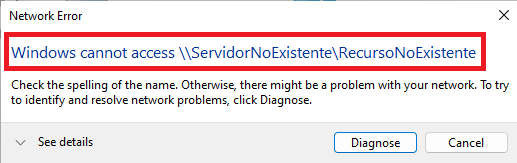
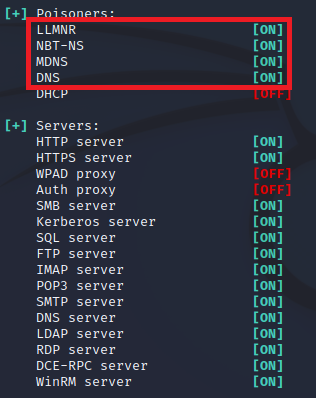
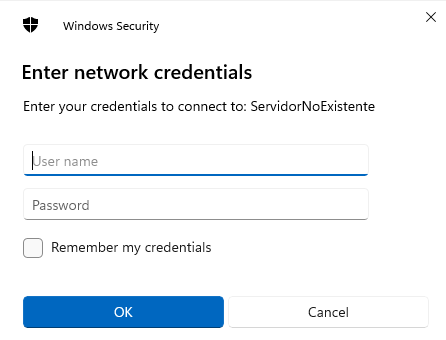

# Usar Responder para robar hashes.
  

Requisitos:
1. Máquina ***Router-Ubu***.
2. Máquina ***Kali Linux***.
3. Máquina ***Win 11***


***Responder*** es una herramienta ampliamente usada en escenarios de ***Movimiento lateral***. Es capaz de hacer envenenamiento LLMNR, NT-NS, MDNS y DHCP.

Su objetivo principal es capturar ***Hashes*** e incluso puede realizar diferentes ataques a ***Active Directory***.

* *LLMNR* o ***Link Local Multicast Name Resolution*** es un protocolo que permite la resolución de nombres sin la necesidad de usar un servidor ***DNS***. Es capaz de enviar paquetes multicast para preguntar a todas las interfaces de red si conocen el nombre de un host. Lo hace enviando un paquete ***UDP*** al puerto ***5355*** de la ip de la red de multicast. Funciona en ***IPv4*** e ***IPv6***. Es el sucesor de ***NBT-NS***
* *NBT-NS* o ***NetBIOS Name Service*** es un protocolo de Windows que traslada nombres ***NetBIOS*** a direcciones IP. Trabaja en el puerto ***137*** por ***UDP***.
* *MDNS* o ***Multicast DNS*** es un protocolo cuya misión es ayudar a resolver nombres en las redes. Funciona enviando paquetes por multicast. No es demasiado interesante para el hacking.


## Ejercicio 1: Envenenamiento LLMNR/NBT por protocolo SMB.

En la máquina ***Win 11*** abrimos el ***Explorador de Windows*** y en la barra de dirección escribimos una ruta UNC que no exista. Esto es importante.
```
\\ServidorNoExistente\RecursoNoExistente
```

En la imagen podemos comprobar el resultado.



Vamos a ver como afecta el envenenamiento ***LLMMR*** que realiza ***Responder***.

En la máquina ***Kali*** abrimos una terminal y actualizamos la herramienta.
```
sudo apt install -y responder
```

Iniciamos ***Responder***.
```
sudo responder -I eth0
```

Responder es una herramienta "genial", puede envenenar y capturar hashes para una gran cantidad de servicios, concretamente todos los que aparecen como ***ON***. También levanta servicios para hacer spoofing sobre los reales y atraer a la víctima.



Procedemos a volver a realizar la prueba anterior, conectando de nuevo al recurso compartido. Esta vez hay sorpresa.

En la máquina ***Win 11***, nos conectamos a.
```
\\ServidorNoExistente\RecursoNoExistente
```

Debemos observar lo siguiente. En la máquina ***Win 11*** se abre un diálogo que pide las credenciales.



Deberías sospechar, porque ***\\ServidorNoExistente*** no existe en la red y en consecuencia, no te deberían preguntar por una autenticación.


