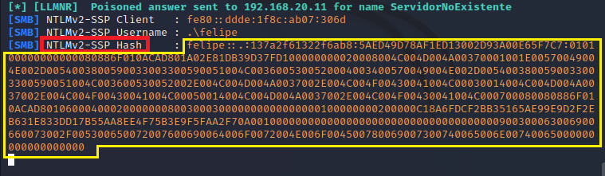
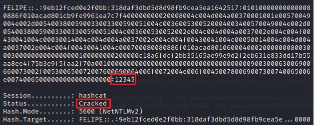
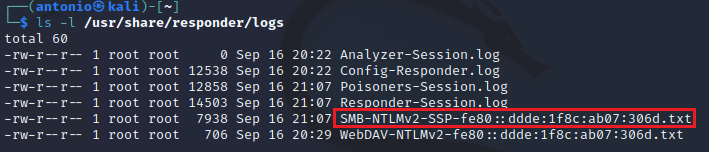

# Usar Responder para robar hashes.
  

Requisitos:
1. Máquina ***Router-Ubu***.
2. Máquina ***Kali Linux***.
3. Máquina ***Win 11***


***Responder*** es una herramienta ampliamente usada en escenarios de ***Movimiento lateral***. Es capaz de hacer envenenamiento LLMNR, NT-NS, MDNS y DHCP.

Su objetivo principal es capturar ***Hashes*** e incluso puede realizar diferentes ataques a ***Active Directory***.

* *LLMNR* o ***Link Local Multicast Name Resolution*** es un protocolo que permite la resolución de nombres sin la necesidad de usar un servidor ***DNS***. Es capaz de enviar paquetes multicast para preguntar a todas las interfaces de red si conocen el nombre de un host. Lo hace enviando un paquete ***UDP*** al puerto ***5355*** de la ip de la red de multicast. Funciona en ***IPv4*** e ***IPv6***. Es el sucesor de ***NBT-NS***
* *NBT-NS* o ***NetBIOS Name Service*** es un protocolo de Windows que traslada nombres ***NetBIOS*** a direcciones IP. Trabaja en el puerto ***137*** por ***UDP***.
* *MDNS* o ***Multicast DNS*** es un protocolo cuya misión es ayudar a resolver nombres en las redes. Funciona enviando paquetes por multicast. No es demasiado interesante para el hacking.


## Ejercicio 1: Envenenamiento LLMNR/NBT por protocolo SMB.

En la máquina ***Win 11*** abrimos el ***Explorador de Windows*** y en la barra de dirección escribimos una ruta UNC que no exista. Esto es importante.
```
\\ServidorNoExistente\RecursoNoExistente
```

En la imagen podemos comprobar el resultado.


Vamos a ver como afecta el envenenamiento ***LLMMR*** que realiza ***Responder***.

En la máquina ***Kali*** abrimos una terminal y actualizamos la herramienta.
```
sudo apt install -y responder
```

Iniciamos ***Responder***.
```
sudo responder -I eth0
```

Responder es una herramienta "genial", puede envenenar y capturar hashes para una gran cantidad de servicios, concretamente todos los que aparecen como ***ON***. También levanta servicios para hacer spoofing sobre los reales y atraer a la víctima.


Procedemos a volver a realizar la prueba anterior, conectando de nuevo al recurso compartido. Esta vez hay sorpresa.

En la máquina ***Win 11***, nos conectamos a.
```
\\ServidorNoExistente\RecursoNoExistente
```

Debemos observar lo siguiente. En la máquina ***Win 11*** se abre un diálogo que pide las credenciales.


Deberías sospechar, porque ***\\\\ServidorNoExistente*** no existe en la red y en consecuencia, nunca te deberían preguntar por una autenticación. pero ¿por qué ocurre esto?

La víctima intenta conectar con un recurso compartido, así que envía una resolución 
DNS a su servidor. Éste responde que no encuentra el registro ***A***. 

Como la resolución falla, la víctima intenta ahora resolver por ***LLMNR*** y aquí es donde entra ***Responder***, que contesta a la resolución de haciéndose pasar por el servidor ***SMB*** y solicitando la credencial.

Nota: Si el recurso compartido existe y la víctima tiene configurado su servidor ***DNS***, entonces (la víctima) no tiene necesidad de hacer ***LLMNR***. En este escenario, se debe realizar un ataque previo de ***DNS Spoofing*** para que el servidor DNS falso indique que no conoce al host del recurso compartido.

Seguimos en la máquina ***Win 11*** y procedemos a escribir la credencial. Supongamos que la víctima pone como usuario a.
```
felipe
```
 
y contraseña
```
12345
```

Observemos que es una contraseña ***muy débil*** que puede ser reventada por ***fuerza bruta***. Hacemos clic en el botón ***OK***.

Obviamente dará un error, porque el servidor SMB no existe, pero el usuario escribe su credencial correctamente.

En la máquina ***Kali*** podemos observar lo siguiente.



El hash capturado, en color amarillo, y la versión del hash, en rojo.

En la máquina ***Kali***, seleccionamos el hash capturado (señalado en amarillo) y lo copiamos al portapapeles.

Abrimos otra terminal y en ella escribimos
```
nano hash.txt
```

Pegamos el hash y salimos de ***nano*** con ***CTRL+X***, ***Y*** y ***Enter***.

Como el hash es irreversible, vamos a intentar reventarlo por medio de fuerza bruta. Para ello necesitamos un archivo con las contraseñas más utilizadas por los usuarios.
Nota: Este hackeo solo funcionará si la contraseña es débil y existe en el diccionario.

Como diccionario usaremos el que tráe ***Kali***. El la terminal escribimos.
```
cp /usr/share/wordlists/rockyou.txt.gz .
```

y lo descomprimimos.
```
gzip -d rockyou.txt.gz
```

Usamos la herramienta ***hashcat***, que sirve para reventar hashes por fuerza bruta. Para los hashes ***NTLM V2*** se debe usar el módulo ***5600***. Aquí https://hashcat.net/wiki/doku.php?id=example_hashes puede consultar la lista de los módulos.
Nota: Es muy interesante que leas la salida de ***hashcat*** mientras trabaja.
```
hashcat -m 5600 hash.txt rockyou.txt
```

Con esta contraseña tan débil, a ***hashcat*** solo le lleva unos segundos reventarla.




Prueba a poner otras contraseñas, fallarán todas porque el servidor no existe, como bien sabes. ***Hashcat*** no vuelve a mostrar el hash, lo que hace el guardarlo en un archivo de log. En la terminal escribe.
```
ls -l /usr/share/responder/logs
```

Verás los logs. El que te interesa es el que almacena los hashes ***SMB-NTLMv2***.



Puedes ver las capturas con este comando.
Nota: El nombre del archivo se toma usando la dirección de enlace local de IPv6 del servidor SMB cuyos hashes de ha capturado. Podría ser diferente en tu laboratorio.
```
cat /usr/share/responder/logs/SMB-NTLMv2-SSP-fe80::ddde:1f8c:ab07:306d.txt
```

Consideraciones sobre reventar el hash si la víctima usa contraseñas fuertes.

* *1*. Usar diferentes diccionarios, con la esperanza de encontrarla en alguno de ellos. No es práctico en la realidad y no se suele hacer.
* *2*. Usar modos avanzados en ***hashcat*** que permiten reducir es espacio de claves. Por ejemplo, indicando que la clave tiene solo caracteres, o caracteres y números y es de longitud corta (***8 caracteres máximo***). Esto requiere usar hardware de proceso avanzado como tarjetas gráficas de gama muy alta. Aquí https://hashcat.net/hashcat/ tienes el manual de la herramienta y aquí: https://www.youtube.com/watch?v=irQlWaH0LPQ un breve video de introducción al uso de la herramienta. Ten en cuenta que, si el password es complejo y la longitud de clave supera los 6 caracteres, no será posible reventarla en un ordenador convencional. Para ello debes usar las siguientes dos alternativas.
* *3*. Usar ***Tablas arcoiris***. Aquí http://project-rainbowcrack.com/table.htm tienes las tablas del proyecto. Mira la sección ***NTLM*** hacia la mitad de la página web. 
* *4*. Contratar un servicio "profesinal" en la ***Dark Web***, en el que proporcionas el hash y, previo pago, te devuelven el password o passwords asociados a dicho hash.


