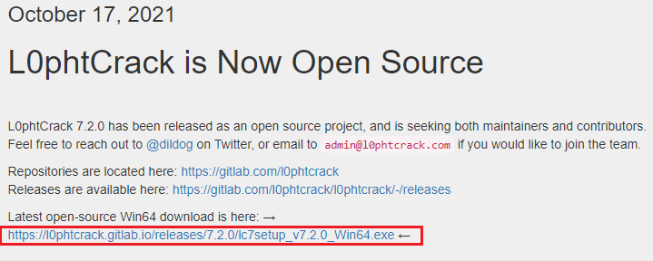
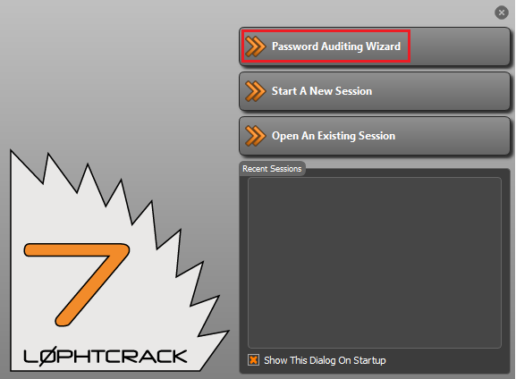
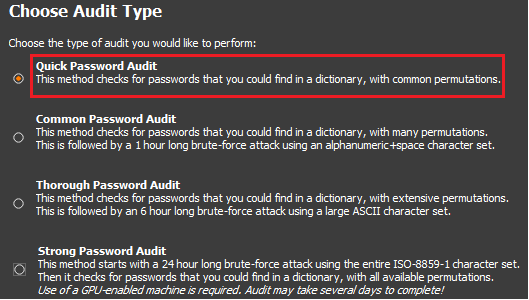
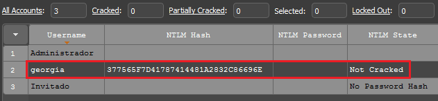

# Usar L0phtCrack para auditar la seguridad de credenciales.
   
Requisitos:
1. Máquina ***Router-Ubu***.
2. Máquina ***Windows 7***

***L0phtCrack*** ha sido liberado como proyecto de Open Source desde Octubre de 2021. Es una herramienta de auditoría de credenciales Windows que funciona hasta ***Windows 10*** y ***Windows Server 2016*** (a la espera que den soporte para las últimas versiones.)

La herramienta localiza hashes e intenta reventarlas por fuerza bruta, por lo que es útil para detectar si en algún sistema hay una cuenta (normalmente local) con una contraseña débil.


## Ejercicio 1: Instalar y evaluar L0phtCrack.

En la máquina ***Windows 7*** abrimos el navegador y escribimos la siguiente URL
```
https://l0phtcrack.gitlab.io/
```

Hacemos clic en el enlace mostrado en la imagen y procedemos a instalar la herramienta.


Lanzamos la aplicación, y en la ventana inicial elegimos la auditoría de passwords.



Seguimos avanzado usando las opciones por defecto, hasta llegar a la siguiente pantalla, donde podemos ver las opciones del análisis.

Elegimos la más rápida.



y dejamos la aplicación trabajando. Capturará los hashes y realizará un ataque de fuerza bruta.



Si lo deseas y tienes tiempo déjalo trabajar, pero ten en cuenta lo siguiente: El rendimiento de cálculo de hashes en una máquina virtual es terrible. Generalmente el crackeo se realiza en estaciones de trabajo o PCs muy potentes, con una o varias tarjetas gráficas de última generación. En ese escenario el ataque de fuerza bruta basado en diccionario y permutaciones podría tener algún éxito si las contraseñas son débiles. 

Recuerda que es una herramienta de auditoría y nosotros formamos parte del ***Equipo Azul***, por lo tanto si la herramienta no es capaz de romper los hashes, será una buena noticia.


