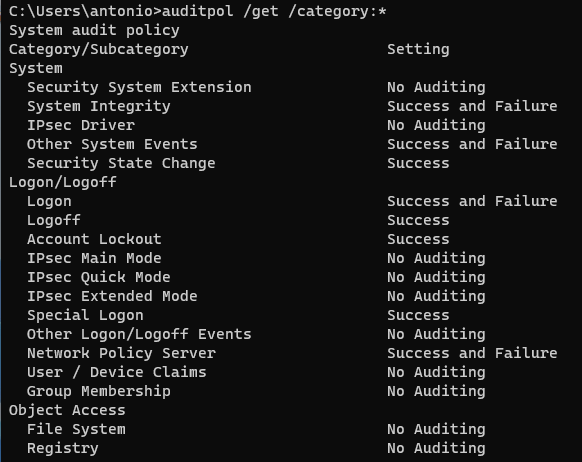
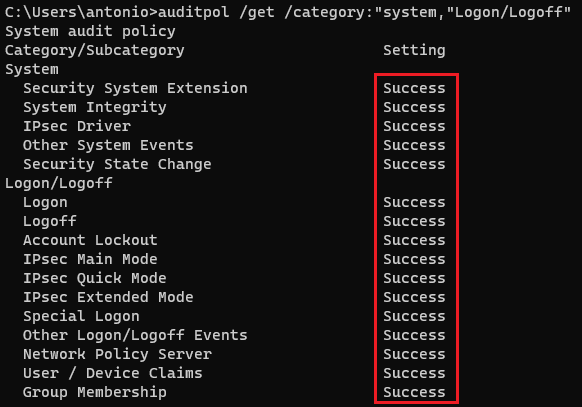
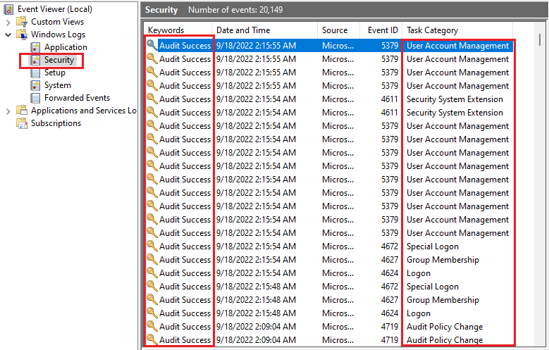
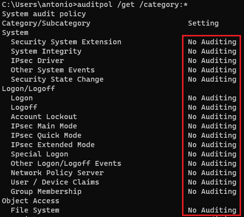
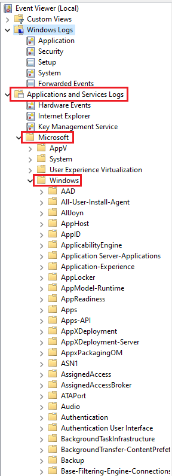
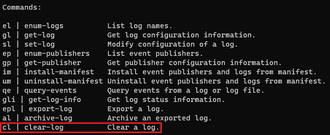
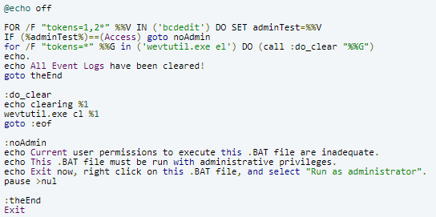
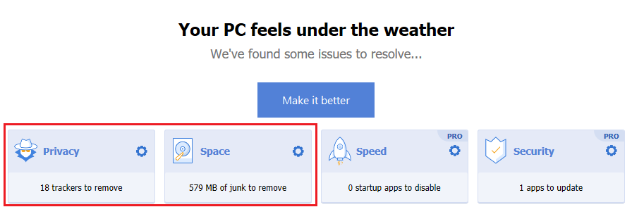
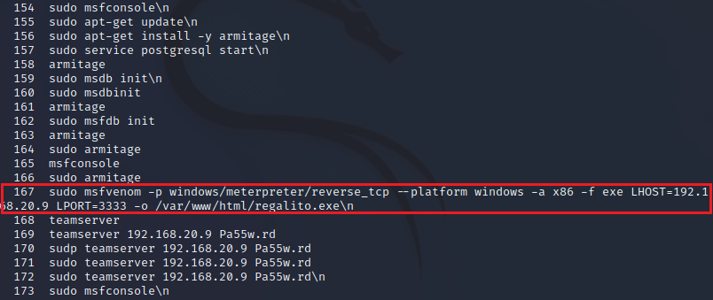
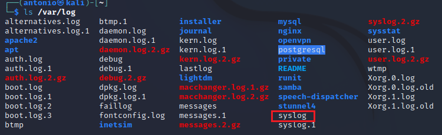

# Ocultar el rastro y eliminación de pruebas.

Requisitos:
1. Máquina ***Router-Ubu***.
2. Máquina ***Kali Linux***.
3. Máquina ***Windows 11***

Para permanecer no detectados, el actor de la amenaza necesita eliminar todas las evidencias de su actividad delictiva. Para conseguirlo, debe modificar o eliminar logs del sistema.

Esta eliminación puede realizarse de forma manual o asistida por herramientas especializadas.

En este laboratorio conoceremos los procedimientos más habituales para evitar el rastreo.

## Ejercicio 1: Auditpol en Windows.

En ***Windows*** la herramienta ***auditpol*** se utiliza para configurar las políticas de auditoría. Si bien en una organización esta política se configura de manera centralizada por la ***Directiva de Grupo***, en esta práctica la haremos de forma local.

En la máquina ***Win 11*** abrimos un terminal de comandos en modo ***administrador***.
Nota: Una ***terminal de comandos***, no de ***PowerShell***.

En ella escribimos.
```
auditpol /get /category:*
```

Este comando permite comprobar qué tipo de auditoría se está registrando en el sistema.
Nota: La auditoría de ***Object Access*** es la que registra el acceso a los ***Archivos***.



El actor de la amenaza persigue alcanzar suficientes privilegios en el sistema operativo como para se capaz de configurar la auditoría. En esa caso no tiene nada más que deshabilitarla. Por ejemplo, vamos a anular la auditoría cuando se produce un error en la acción del usuario.
```
auditpol /set /category:"system","Logon/Logoff" /success:enable /failure:disable
```
```
auditpol /get /category:"system,"Logon/Logoff"
```

Como podemos ver en la imagen, en las ramas ***System*** y ***Logon/Logoff*** solo se registran los intentos fructuosos. De esta forma, cualquier ataque de fuerza bruta online al password, no quedaria registrado en el sistema.



Por supuesto se puede anular toda la auditoría, tanto la correcta (***success***) o los errores (***failure***), pero quizas resultaría algo sospechoso.

Ni que decir tiene que, cuando el intruso finalice su actividad, suele dejar la auditoría como estaba. En consecuencia, lo que no se registra, son las acciones que ha realizado el actor de la amenaza hasta conseguir su objetivo.

Los eventos de auditoría se visualizan con el ***Visor de Eventos***. Concretamente, el log de ***Seguridad*** almacena los eventos que estamos tratando.

En la máquina ***Win 11*** abre el ***log de seguridad*** y visualiza los eventos actuales.

En la siguiente imagen podemos ver los eventos del ***log de seguridad*** (también llamado de ***auditoría***). La primera columna indica si el evento registra una acción que se ha podido realizar correctamente (***Audit success***). Si la acción no pudo ser realizada, por ejemplo, poniendo una cotraseña incorrecta, entonces aparecerá como ***Audit Failure***. Estos últimos tipos de eventos son los más importante cuando se está investigando un incidente de seguridad.



Otra posibilidad es anular la auditoría por completo. En la terminal de comandos de la máquina ***win 11*** escribimos.
```
auditpol /clear /y
```

Comprobamos el resultado.
```
auditpol /get /category:*
```

A partir de ahora no se produce ningún nuevo evento en el log de seguridad.



## Ejercicio 2: Eliminar eventos de los logs de Windows.

La auditoría es la principal fuente de información para estudiar qué ha ocurrido en un sistema, y su log nos permite saber qué ha ocurrido. No osbtante, en Windows exiten muchos más logs, que pueden almacenar información de calidad en una ***investigación forense***.

En la imagen puedes ver los 4 logs principales que tiene Windows. Además del de ***seguridad*** (auditoría), tenemos ***Application***, ***Setup*** y ***System***.
Nota: ***Forwarded Events*** recoge eventos publicados por otras máquinas, y no de la máquina local.


Pues bien, además de estos, Windows presenta una gran cantidad de logs especializados, que puedes ver en la siguiente imagen cuando se despliega ***Applications and Services Logs***.
Nota: Estos logs son diferentes a la 4 logs principales.




La herramienta ***wevtutil*** permite recuperar información de eventos y gestionar los ***TODOS*** los logs, incluso borrarlos.



Por ejemplo, en la terminal de comandos escribimos el siguiente comando para listar todos los logs.
``` 
wevtutil el | more
```

Si el objetivo que pretende el actor de la amenaza termina siendo visible, por ejemplo un ***Ransomware***, no es necesario eliminar de forma granular los eventos, sino que lo más práctico es eliminarlos todos. En la siguiente imagen, el script reliza exactamente eso.



Podemos usar herramientas especializadas que facilitan la eliminación del rastro, como por ejemplo ***CCLeaner***, que elimina el rastro en archivos temporales, registro, etc.

Abrimos el navegador y nos conectamos a la siguiente URL.
```
https://www.ccleaner.com/ccleaner/download/professional
```

Una vez descargada la demo, la instalamos y la ejecutamos. Seleccionamos la opción ***Health Check***.


***CCleaner*** nos informa que ha encontrado multitud de artefactos que pueden ser eliminados sin afectar al Sistema Operativo.



Es cuestión de aceptar las propuesta y que limpie el sistema.


## Ejercicio 3: Eliminar eventos de los logs de Linux.

De forma similar al ejercicio anterior, en ***Linux*** también se registran todas las actividades acaecidas sobre el sistema. 

En la máquina ***Kali*** abrimos una terminal de comandos y escribimos lo siguiente.
```
history
```

En la imagen aparecen los comandos ejecutados en el sistema.



Para modificar el historial (e incluso borrarlo) editamos el archivo de historial y luego guardamos los cambios. Por ejemplo, elimina algunas líneas.
Nota: ***mousepad*** es un editor de texto con soporte de ratón.
```
mousepad ~/.zsh_history
```

Si volvemos a mirar, ya no aparece en el historial.
Nota: Tendrás que cerrar la terminal actual y abrir otra nueva, para observar el resultado
```
history
```

***Shred*** es una herramienta que borra la información de manera segura. Concretamente no borra el archivo, sino que sobreescribe los bloque en disco con información aleatoria. Aquí https://www.welivesecurity.com/la-es/2014/11/24/como-hacer-borrado-seguro-shred-linux/ tienes un link donde se explica su funcionamiento.

En nuestro caso no nos interesa eliminar del todo el archivo, sino corromper la información que almacena. Ejecutamos el siguiente comando.
```
shred ~/.zsh_history
```

Cierra la terminal y abre otro nuevo. Escribe.
```
mousepad ~/.zsh_history
```

Cifrar el historial es una buena técnica para eliminar rastros, pero llama mucho la atención.

Nota: El ejercicio que has realizado está basado en la shell ***zsh*** que es la que usa ***Kali***. Las acciones aquí realizadas pueden variar si la distribución de Linux es otra.

***Linux*** se caracteriza por almacenar una cantidad de logs inmensa. El directorio ***/var/log*** suele ser el repositorio principal. En una terminal de comandos ejecutamos lo siguiente.
Nota: Las aplicaciones que corren en el sistema también pueden almacenar sus eventos en archivos de log dentro de esta carpeta, como ***syslog***, o en los directorios de instalación y de usuario de la aplicación.
```
ls /var/log
```

Logs en la carpeta ***/var/log/***.



Los logs son archivos de texto y si tenemos los permisos apropiados podemos modificarlos (tamper), eliminarlos, etc.


