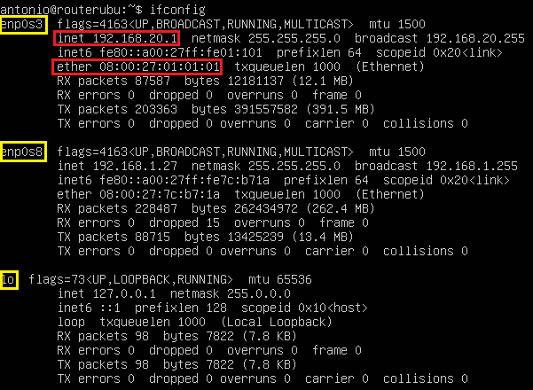
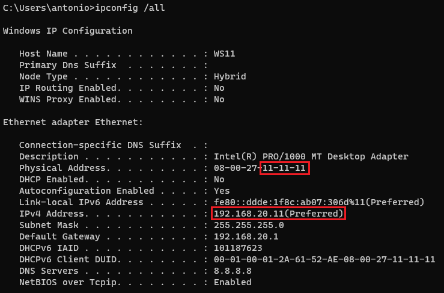
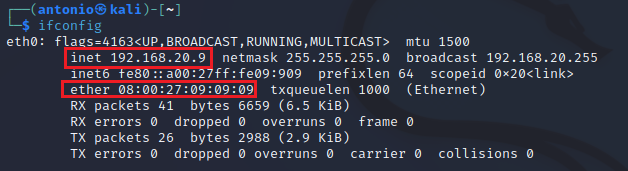
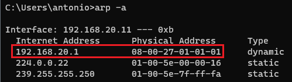
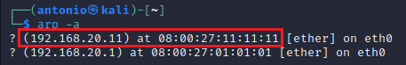

# Uso de la técnica de ARP Spoofing para ataques MitM. 
   

Requisitos:
1. Máquina ***Router-Ubu***.
2. Máquina ***Kali Linux***.
3. Máquina ***Windows 11***

Cuando un Hacker se ha infiltrado en la organización y desea espiar el tráfico podemos pensar que no es posible por que los Switches de la red local no permiten que a un tercero le llegue tráfico dos dos entidades que se están comunicando a través de sendos puertos en sus respectivos switches.

Nada más lejos de la realidad, porque la técnica ***MitM*** basada en envenenamiento ***ARP*** va a permitirlo.

Esto es así porque el protocolo ***ARP*** de ***IPv4*** así lo concibe y, tratándose de un estándar, los productos de red que lo implementan (que son todos) son susceptibles a ser víctimas de este ataque.

Veámos cómo funciona.

## Ejercicio 1: MitM con arpspoof.

Para interceptar el tráfico entre dos entidades, necesitamos tres actores, que serán lo siguientes.

* *Víctima*. Es la máquina a la que queremos espiar o afectar. En este laboratorio será ***Windows 11***.
* *Destino original. Es la máquina a la que tendría que ir el tráfico, por ejemplo la puerta de enlace, que en nuestro escenario es ***Router-Ubu***.
* *Atacante*. La máquina que va a ponerse en medio de las dos anteriores. Será ***Kali***.

Antes de empezar vamos a aclarar una serie de cuestiones que nos facilitarán enormemente la comprensión de este tipo de ataque.

La máquina ***Router-Ubu***, tiene dos interfaces de red, uno conectado hacia la red interna, con IP ***192.168.20.1*** y otro hacia tu red externa, cuya dirección IP se toma por ***DHCP***. Esta última interfaz no nos interesa para nada.

En la máquina ***Router-Ubu***, abrimos una terminal y ejecutamos el siguiente comando.
```
ifconfig
```

En la imagen puedes ver sus interfaces de red.



***enp0s3*** es la interfaz interna que conecta con la red ***laboratorio***. ***enp0s8*** es la interfaz externa que nos permite salir a Internet. ***lo*** es el ***loopback***.

Si nos fijamos en la interfaz interna, hemos hecho coincidir los últimos 6 dígitos de la dirección MAC ***010101***, con el último octedo de la IP que tiene asignada 192.168.0.***1***. Esto nos ayudará a detectar el envenenamiento como veremos en un momento.

En la máquina ***Win 11***, en una terminal de comandos, ejecutamos la instrucción.
```
ipconfig /all
```

Podemos ver que también ocurre lo propio. Los últimos 6 dígitos de su dirección MAC ***111111*** lo hemos hecho coincidir con el último byte de su dirección IP 192.18.20.***11***.



Por último, en la máquina ***Kali*** ejecutamos.
```
ifconfig
```

Los últimos 6 dígitos de su dirección MAC ***090909*** lo hemos hecho coincidir con el último byte de su dirección IP 192.18.20.***9***.




Vamos a ver cómo funciona ARP en un contexto sin envenenamiento. Supongamos que la víctima ***Win 11*** quiere descargar algo de Internet. Eso implica dos cosas.

* A nivel de ***IP***, el tráfico debe mandarse a su puerta de enlace, que es ***192.168.20.1***.
* A nivel de trama, que es realmente lo que mueve los bits por la red, se necesita saber la dirección MAC de la ***puerta de enlace***.

En la máquina ***Win 11*** en la terminal escribimos el siguiente comando, cuya finalidad es ***borrar*** la ***tabla ARP*** de la máquina.
```
arp -d
```

A continuación necesitamos enviar algún tipo de tráfico que pase por la puerta de enlace. El usuario se conectaría con el navegador a algun sitio. Es suficiente hacer un ping.
```
ping 8.8.8.8
```

Consultamos la tabla ARP.
```
arp -a
```

En la imagen podemos ver que para poder mandar tráfico a nivel de IP hacia la puerta de enlace, es necesario saber su dirección MAC. A partir de este instante, ***Win 11*** usará la MAC ***08-00-27-01-01-01*** cuando tenga que comunicarse con la puerta de enlace.



Hacemos lo equivalente en el sentido contrario.

En la máquina ***Router-ubu***, el la terminal escribimos para eliminar su ***tabla ARP***.
```
sudo arp -d localhost
```

Para simular el tráfico hacia ***Win 11*** y que se obtenga la dirección MAC de este, basta un simple ping.
```
ping 192.168.20.11 -c 4
```

Mostramos la ***tabla ARP*** de la puerta de enlace.
```
arp -a
```

En la imagen podemos ver que, desde el punto de vista de la puerta de enlace, cuando hay que mandar tráfico a ***192.168.20.11*** se usará la MAC ***08:00:27:11:11:11***.



Así funciona ***TCP/IP*** con ***ARP***.

Vamos a proceder a realizar el ***envenenamiento ARP***.


