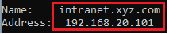

# Uso de la técnica de ARP Spoofing para ataques MitM. 
   

Requisitos:
1. Máquina ***Router-Ubu***.
2. Máquina ***Kali Linux***.
3. Máquina ***Windows 11***
4. Máquina ***WS2022_DC_Server_Core***

Cuando un Hacker se ha infiltrado en la organización y desea espiar el tráfico podemos pensar que no es posible por que los Switches de la red local no permiten que a un tercero le llegue tráfico dos dos entidades que se están comunicando a través de sendos puertos en sus respectivos switches.

Nada más lejos de la realidad, porque la técnica ***MitM*** basada en envenenamiento ***ARP*** va a permitirlo.

Esto es así porque el protocolo ***ARP*** de ***IPv4*** así lo concibe y, tratándose de un estándar, los productos de red que lo implementan (que son todos) son susceptibles a ser víctimas de este ataque.

Veámos cómo funciona.

## Ejercicio 1: MitM con arpspoof.

Para interceptar el tráfico entre dos entidades, necesitamos tres actores, que serán lo siguientes.

* *Víctima*. Es la máquina a la que queremos espiar o afectar. En este laboratorio será ***Windows 11***.
* *Destino original. Es la máquina a la que tendría que ir el tráfico, por ejemplo la puerta de enlace, que en nuestro escenario es ***Router-Ubu***.
* *Atacante*. La máquina que va a ponerse en medio de las dos anteriores. Será ***Kali***.

Antes de empezar vamos a aclarar una serie de cuestiones que nos facilitarán enormemente la comprensión de este tipo de ataque.

La máquina ***Router-Ubu***, tiene dos interfaces de red, uno conectado hacia la red interna, con IP ***192.168.20.1*** y otro hacia tu red externa, cuya dirección IP se toma por ***DHCP***. Esta última interfaz no nos interesa para nada.

En la máquina ***Router-Ubu***, abrimos una terminal y ejecutamos el siguiente comando.
```
ifconfig
```

En la imagen puedes ver sus interfaces de red.


***enp0s3*** es la interfaz interna que conecta con la red ***laboratorio***. ***enp0s8*** es la interfaz externa que nos permite salir a Internet. ***lo*** es el ***loopback***.

Si nos fijamos en la interfaz interna, hemos hecho coincidir los últimos 6 dígitos de la dirección MAC ***010101***, con el último octedo de la IP que tiene asignada 192.168.0.***1***. Esto nos ayudará a detectar el envenenamiento como veremos en un momento.

En la máquina ***Win 11***, en una terminal de comandos, ejecutamos la instrucción.
```
ipconfig /all
```

Podemos ver que también ocurre lo propio. Los últimos 6 dígitos de su dirección MAC ***111111*** lo hemos hecho coincidir con el último byte de su dirección IP 192.18.20.***11***.


Por último, en la máquina ***Kali*** ejecutamos.
```
ifconfig
```

Los últimos 6 dígitos de su dirección MAC ***090909*** lo hemos hecho coincidir con el último byte de su dirección IP 192.18.20.***9***.


Vamos a ver cómo funciona ARP en un contexto sin envenenamiento. Supongamos que la víctima ***Win 11*** quiere descargar algo de Internet. Eso implica dos cosas.

* A nivel de ***IP***, el tráfico debe mandarse a su puerta de enlace, que es ***192.168.20.1***.
* A nivel de trama, que es realmente lo que mueve los bits por la red, se necesita saber la dirección MAC de la ***puerta de enlace***.

En la máquina ***Win 11*** en la terminal escribimos el siguiente comando, cuya finalidad es ***borrar*** la ***tabla ARP*** de la máquina.
```
arp -d
```

A continuación necesitamos enviar algún tipo de tráfico que pase por la puerta de enlace. El usuario se conectaría con el navegador a algun sitio. Es suficiente hacer un ping.
```
ping 8.8.8.8
```

Consultamos la tabla ARP.
```
arp -a
```

En la imagen podemos ver que para poder mandar tráfico a nivel de IP hacia la puerta de enlace, es necesario saber su dirección MAC. A partir de este instante, ***Win 11*** usará la MAC ***08-00-27-01-01-01*** cuando tenga que comunicarse con la puerta de enlace.


Hacemos lo equivalente en el sentido contrario.

En la máquina ***Router-ubu***, el la terminal escribimos para eliminar su ***tabla ARP***.
```
sudo arp -d localhost
```

Para simular el tráfico hacia ***Win 11*** y que se obtenga la dirección MAC de este, basta un simple ping.
```
ping 192.168.20.11 -c 4
```

Mostramos la ***tabla ARP*** de la puerta de enlace.
```
arp -a
```

En la imagen podemos ver que, desde el punto de vista de la puerta de enlace, cuando hay que mandar tráfico a ***192.168.20.11*** se usará la MAC ***08:00:27:11:11:11***.


Así funciona ***TCP/IP*** con ***ARP***.

Vamos a proceder a realizar el ***envenenamiento ARP***.

Debes saber que el protocolo ***ARP*** permite cambiar la dirección MAC de su dispositivo. Esta característica viene definida por el estándar y no puede anularse.

Te preguntarás por qué es esto posible y que sentido tiene cambiar la MAC. La explicación viene de antaño y está relacionada con la alta disponibilidad, y el balanceo en los clusteres, donde varios nodos debían mostrar la misma MAC para que la trama llegara a todos ellos. Si te interesa conocer esto más a fondo, puedes leer este artículo: https://www.practicalnetworking.net/series/arp/gratuitous-arp/

Cuando un dispositivo cambia si dirección MAC debe anunciar este hecho mediante un ***broadcast de ARP***. De esta forma, el resto de los dispositivos de su red local, reciben este cambio y actualizan su ***tabla ARP*** para que la comuniciación siga funcionando.

El envenenamiento ARP está muy conseguido. En vez de inundar la red con ***broadcasts***, se mana una trama ***unicast*** a la víctima. Veámos como funciona en nuestro escenario de ataque.

***Win 11*** y ***Router-ubu*** están intercambiando tráfico. Ambos tienen resuelta la dirección MAC del contrario, como ya hemos visto. Ahora el atacante ***Kali***, que tiene la MAC ***090909*** se quiere poner en medio. ¿Cómo funciona?

***Kali*** manda dos tramas ***unicast ARP***.

* La primera hacia ***Win 11*** diciendo: "Soy la puerta de enlace 192.168.20.1 y he actualizado mi dirección MAC a 090909. Por favor, actualiza tu tabla ARP.
* La segunda hacia ***Router-ubu*** diciendo: "Soy la máquina con IP 192.168.20.11 y he actualizado mi dirección MAC a 090909. Por favor, actualiza tu tabla ARP.

Si te das cuenta, ambos extremos de la comunicación ahora mandan en tráfico a la máquina ***Kali***, que es el ***Man in the Middle***.

Todas las herramientas de Hacking que hacen ***Spoofing*** actúan de esta manera. Vamos a instalar ***arpspoof*** para hacer una prueba de concepto y ver este tipo de ataque funcionando.

En la máquina ***Kali***, escribimos en la terminal.
```
sudo apt-get install -y dsniff
```

También necesitamos hacer otra cosa. Si te das cuenta, todo el tráfico pasa por ***Kali***, pero debe llegar a su destino original porque sino se descubriría el engaño. Para ello debemos habilitar el ***IP forwarding*** en ***Kali***.
Nota: ***-p*** aplica los cambios.
```
sudo sysctl -w net.ipv4.ip_forward=1
```
```
sudo sysctl -p
```

Vamos a envenerar a ***Win 11***. En la máquina ***Kali***, en la terminal, escribimos.
```
sudo arpspoof -i eth0 -t 192.168.20.11 192.168.20.1
```

La trama que se inyecta en la red dirigida a ***Win 11*** dice que ***192.168.20.1*** ha cambiado la dirección MAC a ***090909***. Comprobémoslo.

En la máquina ***Win 11***, en la terminal volvemos a mostrar la ***tabla ARP***
```
arp -a
```

En la imagen podemos ver como para la máquina ***Win 11***, la puerta de enlace que tiene la IP ***192.168.20.1***, tiene la dirección MAC ***090909***, que es la de ***Kali***.


Ahora debemos hacer el envenenamiento en el sentido contrario. En una nueva terminal, escribimos.
```
sudo arpspoof -i eth0 -t 192.168.20.1 192.168.20.11
```

La trama que se inyecta en la red dirigida a ***Router-ubu*** dice que ***192.168.20.11*** ha cambiado la dirección MAC a ***090909***. 

En la máquina ***Router-ubu*** miramos la ***tabla ARP***.
```
arp -a -i enp0s3
```

De forma similar, en la imagen podemos ver que la  la máquina ***Win 11***, con IP ***192.168.20.1***, tiene la dirección MAC ***010101***, que es la de ***Kali***.


En la máquina ***Win 11*** usa el navegador y conéctate a la página web de tu elección. Puedes comprobar que puedes navegar correctamente por Internet, pero el tráfico está pasando por ***Kali***.

Para demostrarlo, vamos a quitar el ***fordwarding*** de la máquina ***Kali***. Eso debería provocar que ***Win 11*** no navegue.

En ***Kali*** ejecuta los siguiente comandos en una nueva terminal.
```
sudo sysctl -w net.ipv4.ip_forward=0
```
```
sudo sysctl -p
```

Vuelve a la máquina ***Win 11*** y verifica que no puedes navegar.

Volvemos a habilitar el ***fordwarding***. 

En ***Kali*** ejecuta los siguiente comandos en la terminal.
```
sudo sysctl -w net.ipv4.ip_forward=1
```
```
sudo sysctl -p
```

Vuelve a la máquina ***Win 11*** y verifica que de nuevo puedes navegar.

Nos podríamos preguntar por qué es necesario que ***arpspoof*** esté envenenando continuamente.
Nota: Recordemos que tenemos dos terminales abiertas que continuan envenenando.

Esto es así porque los registros almacenados en tabla ARP tienen una ***caducidad limitada***. Pasado un tiempo, que oscila entre 30 segundos y varios minutos, el sistema operativo del dispositivo en cuestión retira la entrada de la tabla. Si se necesita volver a mandar una trama a la misma dirección MAC, se produce una nueva resolución ARP.

El problema que esto tendría para el ***MitM*** es que en ese caso, la estación de destino contestaría con su dirección MAC verdadera y, en consecuencia, el tráfico ya no pasará por Kali.

Por esta razón, si envenenamos con la frecuencia apropiada, nunca se producirá la caducidad en la tabla ARP porque se está refrescando continuamente.

La buena noticia para el ***equipo azul*** es que los ***IDS*** de red detectan muy facilmente el envenenamiento a comprobar que hay una cantidad muy inusual de tramas ARP que indican el cambio de MAC. 

Paramos el envenenamiento pulsando ***CTRL+C*** en las dos terminales que ejecutan ***arpspoof***.

Respecto al ***IP fordwarding*** lo dejamos habilitado para el siguiente ejercicio.

## Ejercicio 2: Realizar un ataque de DNS spoofing.

Un ataque de ***DNS spoofing*** viene precedido de un ataque MitM, de forma que el tráfico entre la víctima y su servidor DNS pasa por el atacante.

En este ejercicio, necesitamos que la máquina ***Win 11*** inicie sesión en el dominio de Active Directory
que proporciona ***WS2022_DC_Server_Core***.
Nota: Puedes retomar una instantánea o volver a meter en el dominio a ***Win 11*** que actualmente debería estar en un grupo de trabajo.

En ***Win 11*** iniciamos sesión con el usuario.
```
XYZ\administrator
```

y password.
```
Pa55w.rd
```

Vamos a verificar que ***Win 11*** tiene configurado al ***Controlador de Dominio*** como ***servidor DNS**.

Abrimos una terminal de comandos y escribimos.
```
ipconfig /all
```

En la imagen podemos comprobar como el servidor DNS configurado es el ***Controlador de Dominio***, con IP ***192.168.20.10***.


Vamos a usar la técnica de ***DNS Spoofing*** para conducir a la víctima a un servidor web que visualmente es idéntico al original, pero obviamente es otro. 

La víctima pondrá en la URL de su navegador una dirección. Su sistema operativo intentará resolver la la IP. El ataque MitM capturará dicha petición y devolverá la IP que el actor de amenaza desea.

Para simplificar la práctica, trabajaremos solo a nivel de IP. No será necesario desplegar los servidores Web.

En ***Win 11*** abrimos la aplicación ***Server Manager***, mediante la cual vamos a dar de alta un registro DNS en el servidor.

En la imagen puedes ver dónde está la consola del servidor DNS.
Nota: El servidor DNS está en el controlador de Dominio. 


Usamos ***Win 11*** para conectar de forma remota, Así que configuramos la conexión contra el DC.


Vamos a crear un registro de tipo ***A***. Abrimos la zona ***xyz.com*** y con botón derecho elegimos ***New Host (A or AAAA)...***.


Conformamos el formulario tal y como podemos ver en la siguiente imagen.


Hacemos clic en el botón ***Add Host***. Salimos haciendo clic en ***Done***. La siguiente imagen muestra que se ha creado un registro A llamado ***intranet*** que apunta a la IP ***192.168.20.101***.

Cerramos la sesión del ***Administrator*** y abrimos una nueva con el usuario.
```
lSkywalker
```

y contraseña.
```
Pa55w.rd
```

En ***Win 11*** abrimos una terminal de comandos. En ella escribimos lo siguiente para vaciar el caché del resolvedor DNS.
```
ipconfig /flushdns
```

A continuación simulamos la conexión del usuario contra la página web ***intranet.xyz.com***. Una simple resolución DNS nos sirve para verificar que la IP a la que se conectará es la correcta.
```
nslookup intranet.xyz.com
```



Supongamos que el actor de la amenaza levanta un sitio web falso en una máquina hackeada de la organización, que tiene bajo su control. La dirección de esta es ***192.160.20.155***.

El objetivo que pretendemos conseguir es que cuando la víctima desee resolver ***intranet.xyz.com***, la IP devuelta sea ***192.168.20.155*** en lugar de ***192.168.20.101***.

El MitM debe producirse entre la víctima ***Win 11*** y ***WS2022_DC_Server_Core*** (que es el servidor DNS.)

En la máquina de ***Kali***, abrimos una terminal y escribimos.
```
sudo arpspoof -i eth0 -t 192.168.20.11 192.168.20.10
```

y luego en el sentido inverso. En una nueva terminal ejecutamos.
```
sudo arpspoof -i eth0 -t 192.168.20.10 192.168.20.11
```

En ***Win 11*** puedes comprobar que la máquina navega perfectamente por Internet (o la red) local, porque el Mitm solo se aplica entre esta máquina y el Controlador de Dominio.

Volviendo a ***Kali***, necesitamos una herramienta nueva que esté pendiente de verificar las consultas DNS, para interceptarlas y devolver la IP falsa.

Primero debemos crear un fichero de texto que contenga los registros DNS a falsear. En una nueva terminal escribimos.
```
nano hosts.txt
```

Lo editamos hasta que quede como en la siguiente imagen y guardamos con ***CTRL+X***, ***Y*** y ***Enter***.


Hace falta una nueva herramienta que es la que lee el archivo ***hosts.txt*** y si detecta una petición de resolución DNS coincidente con alguna entrada, devuelve la IP que aparece en el archivo. En la terminal escribimos.
```
sudo dnsspoof -i eth0 -f hosts.txt
```

También debemos hacer lo siguiente, consistente en desactivar el ***forwarding IP***. De no hacerlo, el tráfico de resolución llegará al servidor DNS verdadero y eso no lo queremos. En una nueva terminal escribimos.
```
sudo sysctl -w net.ipv4.ip_forward=0
```
```
sudo sysctl -p
```

En la máquina ***Win 11*** limpiamos el resolvedor y hacemos la resolución de nuevo. En la terminal escribimos.
```
ipconfig /flushdns
```
```
nslookup intranet.xyz.com
```

En la imagen se puede observar que la IP resuelta es la falsa y el navegador conectará irremediablemente contra ***192.168.20.155***.


En la máquina ***Kali*** podemos ver como ***dnsspoof*** captura la petición de resolución a ***intranet.xyz.com***.


Esta es una prueba de concepto que puede (y debe ser mejorada), pero es más que suficiente para demostrar su finalidad. 

Al haber deshabilitado el ***fordwading*** el hack funciona bien, pero si pruebas en ***Win 11***, la máquina no puede resolver otros registros DNS del dominio, ni enviar tráfico a ninguna dirección IP porque el reenvío está desabilitado. Para hacerlo "fino" deberíamos hacer lo siguiente.

Habilitar el reenvío IP con la excepción de que no se reenvíe al paquete si el el destino es ***192.168.20.10*** y el puerto es el ***53***. No es dificil de hacer, pero require conocer a fondo ***IPTables***, y se sale del ámbito de esta prueba de concepto.

***ACTIVIDAD***

¿Te animas a tocar IPTables en la máquina ***Kali*** para conseguir un DNS Spoofing correcto? 


Los ataques de ***DNS Spoofing*** son especialmente dañinos. ¿Sabes que existe una forma radical de eliminarlos?. Se trata de ***DNSEC***, que firma digitalmente la zona. Los clientes se configuran para verificar la firma digital de los registros de recursos consultados y, si no se verifica, por ejemplo por la presencia de un falso servidor DNS, el propio cliente rechaza la resolución y se produce un error. Mejor eso que poner las credenciales en una web falsa.


