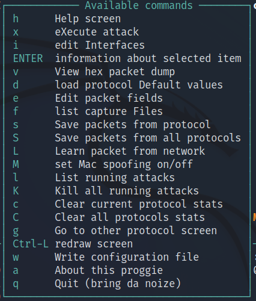
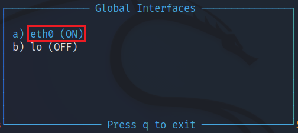
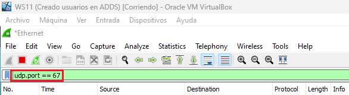
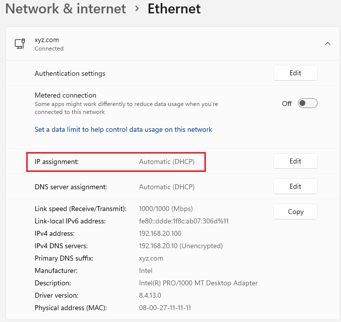
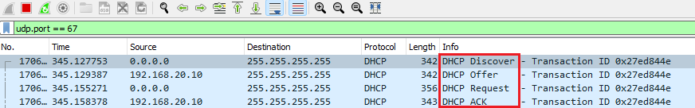
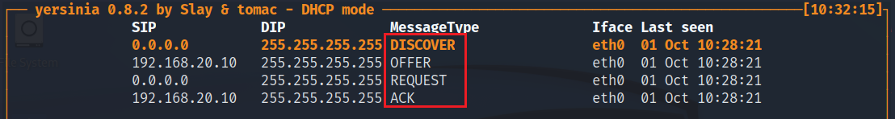
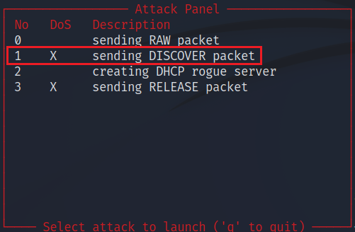
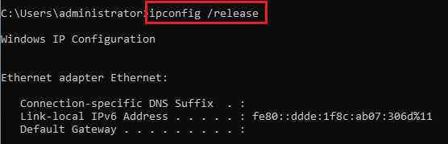
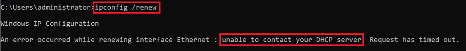
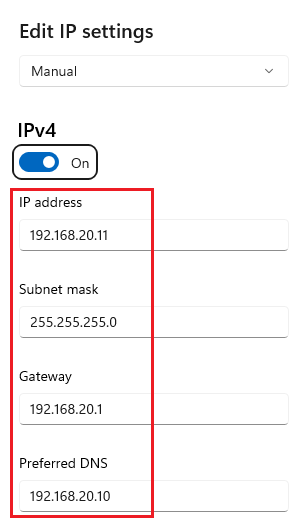

# Evaluar la fortaleza de la red frente a ataques en la capa 2
      

Requisitos:
1. Máquina ***Router-Ubu***.
2. Máquina ***Kali Linux***.
3. Máquina ***Windows 11***
4. Máquina ***WS2022_DC_Server_Core***

La capa de ***Enlace de Datos*** o ***capa 2*** del modelo OSI, actúa como intermediaria entre la capa de red y la capa física, codificando las tramas recibidas desde la capa de red para su transmisión desde la capa física, controlando el acceso al medio y los posibles errores en la transmisión.

El ***control de acceso al medio*** (MAC) proporciona a la capa de enlace de datos el direccionamiento y la delimitación de datos de acuerdo con los requisitos de señalización física del medio y al tipo de protocolo de capa de enlace de datos en uso.

***ARP*** (Address Resolution Protocol) es un protocolo de la capa de enlace de datos responsable de encontrar la dirección hardware (Ethernet MAC) que corresponde a una determinada dirección IP.

Este protocolo permite ser usado de formas que no se concibieron inicialmente, haciendo posible ataques ***MitM*** y ***DoS***.

***Yersinia*** es un framework para realizar ataques a la capa 2, que consigue modificar o alterar el correcto funcionamiento de los siguientes protocolos:

* Spanning Tree Protocol (STP).
* Cisco Discovery Protocol (CDP).
* Dynamic Trunking Protocol (DTP).
* Dynamic Host Configuration Protocol (DHCP).
* Hot Standby Router Protocol (HSRP).
* 802.1q.
* 802.1x.
* Inter-Switch Link Protocol (ISL).
* VLAN Trunking Protocol (VTP).

***Yersinia*** toma su nombre de la bacteria ***Yersinia pestis*** que causó la Peste Negra en la Europa medieval y que acabó con la vida de más de 200 millones de personas.

En este link: https://www.blackhat.com/presentations/bh-europe-05/BH_EU_05-Berrueta_Andres/BH_EU_05_Berrueta_Andres.pdf tienes una completa descripción de los diferentes tipos de ataques que esta herramienta es capaz de realizar.


## Ejercicio 1: Instalar el rol DHCP en Windows Server 2022.


En la máquina ***Win 11*** iniciamos sesión en el dominio usando el siguiente usuario.
```
xyz\administrator
```

Y como password ponemos.
```
Pa55w.rd
```

Nota: La máquina ***Win 11*** debería tener instalado ***Wireshark*** de los laboratorios anteriores. Si no es así, instalar desde este enlace: https://1.na.dl.wireshark.org/win64/Wireshark-win64-3.6.8.exe

Vamos a instalar e rol ***DHCP*** en el servidor ***WS2022_DC_Server_Core*** de usando ***PowerShell*** remoto desde ***Win 11***.

En la máquina ***Win 11*** abrimos una terminal de 
PowerShell y procedemos a descargar un script desde ***GitHub***. Escribimos el siguiente comando.

Nota: Este script instalará el rol ***DHCP*** en el Controlador de Dominio.
```
Invoke-WebRequest -Uri https://raw.githubusercontent.com/antsala/eHacking_LABS/main/06/DeployDHCP.ps1 -OutFile .\DeployDHCP.ps1
```

Permitimos la ejecución de scripts en PowerShell.
```
Set-ExecutionPolicy -ExecutionPolicy Unrestricted
```

Abrimos el script con ***ISE***.
```
ise .\DeployDHCP.ps1
```

Lo ejecutamos pulsando ***F5***. Cuando pida credenciales ponemos.
```
xyz\administrator
```

Y como password.
```
Pa55w.rd
```

En este momento, el Controlador de Dominio tiene el rol ***DHCP*** operativo y configurado.

En la máquina ***Win 11*** cerramos la ventana de ***PowerShell ISE*** y la terminal.


## Ejercicio 2: Usar Yersinia para denegar servicios al servidor DHCP.

En la máquina ***Kali***, abrimos una termina de comandos y escribimos.
```
sudo apt-get update
```

Procedemos a instalar ***Yersinia***.
```
sudo apt-get -y install yersinia
```

Iniciamos ***Yersinia*** en modo interactivo.
```
sudo yersinia -I
```

El modo interactivo presenta un menú basado en texto para poder gobernar la herramienta. La primera tecla que debemos conocer es ***h***, que presenta la ayuda. Pulsa ***h*** y verás el siguiente menú.



Procedemos a indicar la interfaz sobre la que deseamos operar. Es la opción ***i*** del menú. En primer lugar pulsamos cualquier tecla para salir del menú de ***ayuda*** y a continuación pulsamos ***i***.

Aparecerá un listado con las interfaces detectadas. Debemos comprobar que ***eth0*** aparece en ***ON*** indicando que está seleccionada. Si no fuera así, pulsar la tecla correspondiente a la interfaz ***eth0***.



Salimos pulsando ***q***.

Las teclas de función (***F1-F12***) permiten seleccionar los ataques a los diferentes protocolos que ***Yersinia*** puede realizar. En el caso de ***DHCP*** la tecla es ***F2***. Pulsamos ***F2*** para entrar en modo de ataque ***DHCP***. En este momento, ***Yersinia*** muestra el tráfico de red relativo al protocolo ***DHCP***. Puesto que en el entorno de laboratorio todas las máquinas virtuales tienen configuradas IP ***estáticas***, no debemos esperar ver nada de este tipo de tráfico.

En la máquina ***Win 11***, iniciamos la captura del tráfico con ***Wireshark***. Observarás que hay mucho tráfico que dificultará ver el que es propio de ***DHCP***. Para ser más preciso, establecemos un filtro. Concretamente el siguiente.

Nota: El puerto ***67*** es usado por ***DHCP***. Debes ponerlo en el cuadro de filtro, tal y como muestra la siguiente imagen.
```
udp.port == 67
```



Aún no debemos ver nada de tráfico ***DHCP*** por el mismo motivo comentado anteriormente. Para forzarlo, vamos a cambiar la configuración de red de la máquina ***Win 11*** para que adquiera su IP por DHCP. Hagámoslo, tal y como indica la imagen.



Nada más hacerlo, tanto ***Wireshark*** como ***Yersinia*** muestran el tráfico ***DHCP*** reponsable del descubrimiento, solicitud y concesión de la dirección IP.





Lo que demuestra que todo está funcionando correctamente.

En ***Yersinia*** para entrar el modo de ataque, pulsamos ***x***, aparecerá el siguiente menú.



De los ataques disponibles, nos interesa el ***1***, que simula ser un dispositivo de red buscando un servidor ***DHCP*** en la red para que le asigne una IP. Este ataque satura de tramas ***DISCOVER*** la red y como consecuencia, ningún dispositivo real podrá renovar la IP o adquirirla. Este tipo de ataque recibe el nombre de ***starvation*** o ***agotamiento***.

El número de tramas que se envían es tan exageradamente elevado, que saturará a ***Wireshark***, así que antes de realizar el ataque debemos cerrar ***Wireshark*** y observar el resultado en la consola de ***Yersinia***.

En la máquina ***Win 11***, abrimos una ventana de comandos y procedemos a liberar la IP de la máquina con el siguiente comando.
```
ipconfig /release
```

Tal y como podemos observar en la imagen, la IP se libera y, en consecuencia, ***Win 11*** no tiene IP en este momento.



Es el momento de pedir una nueva IP al servidor. Ejecutemos el siguiente comando.
```
ipconfig /renew
```

Podemos observar que la petición de IP no se llega a efectuar porque el servidor está saturado atendiendo a una infinidad de dispositivos inexistentes.



Para detener el ataque pulsamos ***q***, con lo que se cerrará ***Yersinia***. Si intentamos renovar la IP para ***Win 11***, comprobarás que no es posible, pues el servidor está aún procesando una infinidad de peticiones.

En nuestro caso el servidor DHCP es el rol correspondiente en ***Windows Server 2022*** y se vé seriamente afectado por el ataque.

Procedemos a configurar a ***Win 11*** con la IP estática que tenía antes, tal y como puede verse en la siguiente imagen



Ya tenemos ***Win 11*** operativa en la red, pero el servidor ***DHCP*** deberíamos reiniciarlo.

Fíjate como un ***Windows Server 2022*** sucumbe a este ataque. La única forma de mitigarlo es tener un ***IDS*** que determine desde qué boca del switch se está lanzando el ataque y cerrarla.

***ACTIVIDAD***

Aquí: https://cybersecurity.att.com/blogs/security-essentials/vlan-hopping-and-mitigation tienes un tutotial para realizar otros tipos de ataques a la electrónica de red con ***Yersinia*** te recomiendo su lectura.

***FIN ACTIVIDAD***

***ACTIVIDAD***

Otro tipo de ataque consiste en la creación de un servidor ***DHCP*** falso (***rogue***). Razona cómo podría afectar esto a tu infraestructura de red.

***FIN ACTIVIDAD***

***FIN DEL LABORATORIO***