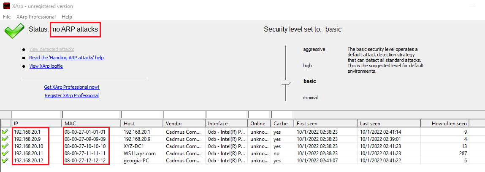
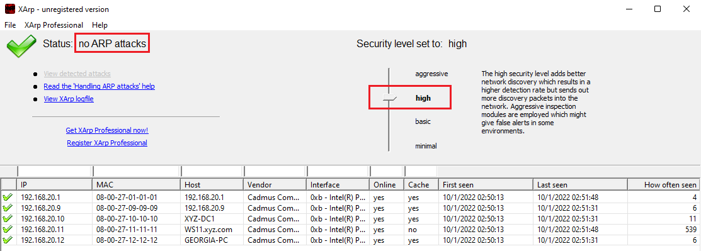

# Detectar ataques MitM.
   
      

Requisitos:
1. Máquina ***Router-Ubu***.
2. Máquina ***Kali Linux***.
3. Máquina ***Windows 11***
4. Máquina ***Windows 7 Ethical Hacking***

Como venimos tratando en el curso, los ataques ***MitM*** basados en ***ARP spoofing*** son muy peligrosos. Para detectarlos y mitigarlos debemos tener en la red algún tipo de contramedida, como los ***Firewall*** y, en mayor medida, los ***IDS***. De lo contrario, no será posible determinar este tipo de amenaza.

No obstante, y a pesar de no disponer de las contramedidas, podemos usar herramientas muy simples para detectarlos. Recuerda que los ataques de spoofing se basan en el envío de tramas de broadcast, y estas, llegan a todos los dispositivos de red.

## Ejercicio 1: Instalar Xarp en Win 11.

En la máquina ***Win 11*** procedemos a instalar la herramienta ***Xarp***. Abrimos una terminal de PowerShell y procedemos a descargar la aplicación. Escribimos el siguiente comando.
```
Invoke-WebRequest -Uri https://raw.githubusercontent.com/antsala/eHacking_LABS/main/06/xarp-2-2-2-win_32.exe -OutFile .\xarp-2-2-2-win_32.exe
```

En la misma terminal, iniciamos el instalador. Escribimos.
```
.\xarp-2-2-2-win_32.exe
```

Procedemos a instalarlo con las opciones por defecto.

Iniciamos la aplicación. Se mostrarán las máquinas que están operando sobre la red y visualiza un mensaje claro de que no hay ataques ***ARP***.



Dejamos funcionando ***Xarp***.

## Ejercicio 2: Lanzar un ataque de arp spoofing y detectarlo.

Vamos a realizar un ***MitM*** entre las máquinas ***Windows 7 Ethical Hacking*** y ***Router-ubu***. Para ello, abrimos una terminal en la máquina ***Kali***.

El paquete ***dsniff*** debería estar instalado de laboratorios previos. Nos aseguramos de su presencia mediante el comando.
```
sudo apt-get install -y dsniff
```

También necesitamos hacer otra cosa. Si te das cuenta, todo el tráfico pasa por ***Kali***, pero debe llegar a su destino original porque sino se descubriría el engaño. Para ello debemos habilitar el ***IP forwarding*** en ***Kali***.
Nota: ***-p*** aplica los cambios.
```
sudo sysctl -w net.ipv4.ip_forward=1
```
```
sudo sysctl -p
```

Vamos a envenerar a ***Windows 7 Ethical Hacking***. En la máquina ***Kali***, en la terminal, escribimos.
```
sudo arpspoof -i eth0 -t 192.168.20.12 192.168.20.1
```

Ahora debemos hacer el envenenamiento en el sentido contrario. En una nueva terminal, escribimos.
```
sudo arpspoof -i eth0 -t 192.168.20.1 192.168.20.12
```

Volvemos a la máquina ***Win 11***. Podrás comprobar que ***Xarp*** no está detectando el ataque. 

Subamos el ***Security Level*** a ***High***. Tampoco detecta nada.



Por último, subamos a ***agressive*** y esperemos un poco. En la imagen se puede comprobar que se ha detectado un ataque.


No obstante, la herramienta no es perfecta, ya que como advierte el texto de ayuda, pueden presentarse ***falsos positivos***. De hecho, la ip ***192.168.20.11*** no está siendo atacada, ya que nuestro ***MitM*** se realiza entre ***192.168.20.12*** y ***192.168.20.1*** (esta última ha sido detectada correctamente)

La razón de estos falsos positivos es que la herramienta ***Xarp*** usa la misma técnica que ***arpspoof*** y ambas herramientas se afecta mutuamente.

Estos ataques son fácilmente descubiertos si usamos un ***IDS*** que esté inspeccionando el tráfico en el Switch.

Para terminar, en la máquina de ***Win 11***, desinstalamos ***Xarp***.

En la máquina de ***Kali***, detenemos el ataque.


