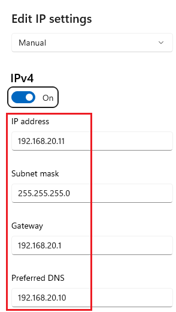

# Detectar ataques MitM.
   
      

Requisitos:
1. Máquina ***Router-Ubu***.
2. Máquina ***Kali Linux***.
3. Máquina ***Windows 11***
4. Máquina ***Windows 7 Ethical Hacking***

Como venimos tratando en el curso, los ataques ***MitM*** basados en ***ARP spoofing*** son muy peligrosos. Para detectarlos y mitigarlos debemos tener en la red algún tipo de contramedida, como los ***Firewall*** y, en mayor medida, los ***IDS***. De lo contrario, no será posible determinar este tipo de amenaza.

No obstante, y a pesar de no disponer de las contramedidas, podemos usar herramientas muy simples para detectarlos. Recuerda que los ataques de spoofing se basan en el envío de tramas de broadcast, y estas, llegan a todos los dispositivos de red.

## Ejercicio 1: Instalar Xarp en Win 11.

En la máquina ***Win 11*** procedemos a instalar la herramienta ***Xarp***.  Abrimos el navegador y nos conectamos a la siguiente URL.
```
https://xarp.en.softonic.com/download
```


## Ejercicio 2: Lanzar un ataque de arp spoofing y detectarlo.





