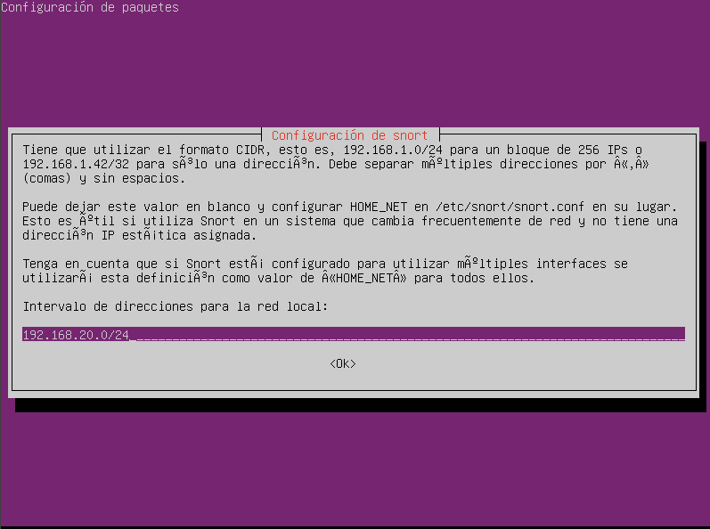
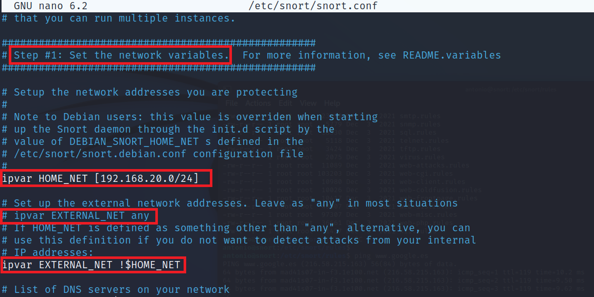
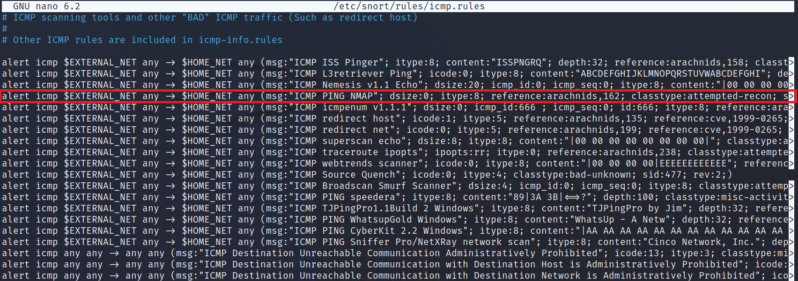
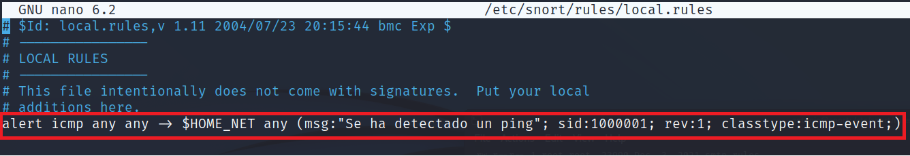
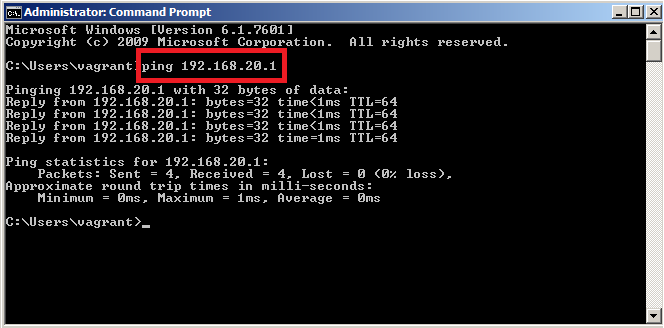
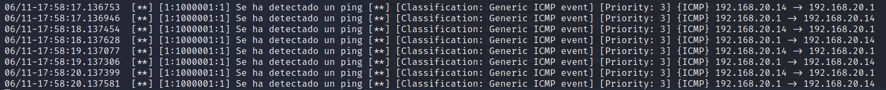
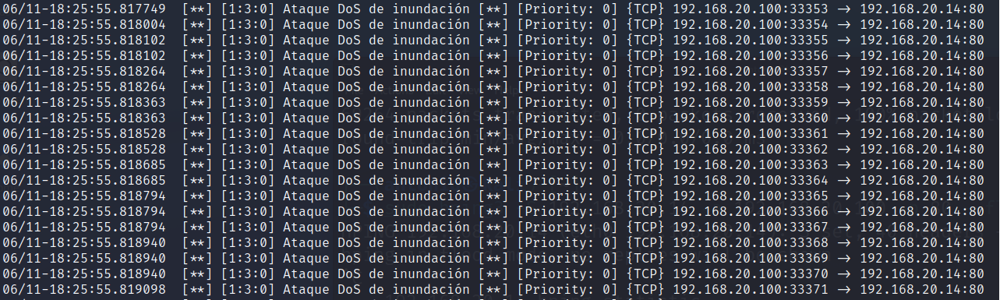

# Detección con Snort.
      

Requisitos:
1. Máquina ***Router-Ubu***.
2. Máquina ***Kali Linux***.
3. Máquina ***Metasplotaible3-Win2k8***
4. Máquina ***Ubuntu 20.04 Snort***


***Snort*** es un IDS/IPS muy conocido de Open-Source que analiza el tráfico de la red y está basado en reglas. Tiene tres modos de funcionamiento:

* *Inspección de tráfico*: Captura el tráfico como lo hace WireShark. No te olvides de permitir el modo promiscuo en la interfaz de red si trabajas con una máquina virtual.
* *Log de paquetes*: Almacena el tráfico capturado en archivos.
* *IDS*: Procesa los archivos de captura buscando patrones de firmas o comportamiento anómalos.

Su funcionamiento es simple. Cuando está activo captura paquetes, los reensambla y entonces analiza. En función de las reglas que hayamos activado, Snort realizará las acciones apropiadas. Las reglas que creamos en Snort son muy parecidas a las que usamos en los firewalls. Cabe destacar que la aplicación ya viene con un conjunto de reglas predefinidas muy importante, por lo que normalmente no es necesario crear nuevas.


## Ejercicio 1: Instalar Snort.

Desde la máquina de Kali, conectamos por ssh a la de Snort.
```
ssh antonio@192.168.20.90
```

La contraseña es
```
Pa55w.rd
```

Snort ya no está en el repositorio de Kali 2022, así que tenemos que modificar el archivo del repositorio de Kali. Primero hacemos un backup del actual.
```
sudo mv /etc/apt/sources.list /etc/apt/sources.list.bak
```

Editamos 'sources.list' con nano
```
sudo nano /etc/apt/sources.list
```

y pegamos el siguiente contenido, guardamos y salimos de nano.
```
deb [arch=arm64] http://ports.ubuntu.com/ubuntu-ports focal main restricted universe multiverse
deb [arch=arm64] http://ports.ubuntu.com/ubuntu-ports focal-updates main restricted universe multiverse
deb [arch=arm64] http://ports.ubuntu.com/ubuntu-ports focal-security main restricted universe multiverse

deb [arch=i386,amd64] http://us.archive.ubuntu.com/ubuntu/ focal main restricted universe multiverse
deb [arch=i386,amd64] http://us.archive.ubuntu.com/ubuntu/ focal-updates main restricted universe multiverse
deb [arch=i386,amd64] http://security.ubuntu.com/ubuntu focal-security main restricted universe multiverse
```

Ahora configuramos las claves públicas para acceder al repositorio.
```
sudo apt-key adv --keyserver keyserver.ubuntu.com --recv-keys 3B4FE6ACC0B21F32
```

```
sudo apt-key adv --keyserver keyserver.ubuntu.com --recv-keys 871920D1991BC93C
```

Actualizamos los paquetes.
```
sudo apt update
```

Instalamos Snort.
```
sudo apt install -y snort
```


En la pantalla de configuración, asegúrate de poner ***192.168.20.0/24*** como intervalo de direcciones de la red local a proteger. Continua.
  


Configuramos el archivo ***snort.conf*** para indicarle cual es nuestra red local y asegurar que todo está bien configurado.
```
sudo nano /etc/snort/snort.conf
```

Asegurar que el archivos de configuración queda de la siguiente manera:

* La configuración a tocar está en la sección "Step #1: Set the network variables."
* La variable ***HOME_NET*** debe estar definida a ***192.168.20.0/24***
* Hay que comentar la definición ***EXTERNA_NET any***.
* Descomentar EXTERNAL_NET !$HOME_NET

Para más claridad, debe quedar como muestra la imagen.



***HOME_NET*** es la red local del laboratorio y ***EXTERNAL_NET*** es todo lo que no sea eso.

Snort tiene configuradas un montón de reglas. Estas se encuentran en la carpeta rules. Ejecuta el siguiente comando para ver los archivos de configuración de las reglas.

```
ls -l /etc/snort/rules
```

Vamos a curiosear una de ellas. Las reglas de ICMP.

```
sudo nano /etc/snort/rules/icmp.rules
```

Observa en la salida la regla que está marcada en rojo.



Debes interpretarla así:

* *alert*: Esta regla emitirá alerta.
* *icmp*: El protocolo es ICMP, que es el que usa ping.
* *$EXTERNAL_NET any*: El ping viene de la red externa (fuera de la red local) y el puerto de origen es cualquiera.
* *-> $HOME_NET any*: El destino del ping es la red local y el puerto de destino cualquiera.
* *msg*: Esta sección muestra el mensaje "ICMP PING NMAP", y a continuación aparecen los parámetros que identifican a un ping realizado con esta herramienta.

Si estudias las reglas, no hay ninguna que tenga origen y destino en la misma red local de laboratorio y que sea un ping "normal", así que vamos a proceder a crear una regla propia.

Para ello editamos el siguiente archivo.

```
sudo nano /etc/snort/rules/local.rules
```

Copia el siguiente texto y pégalo en una línea nueva.

```
alert icmp any any -> $HOME_NET any (msg:"Se ha detectado un ping"; sid:1000001; rev:1; classtype:icmp-event;)
```

Debe quedar así:



Salimos guardando: Ctrl+X, Y, Enter.


Vamos a iniciar Snort. para ello ejecuta el siguiente comando en la terminal.
```
sudo snort -A console -q -c /etc/snort/snort.conf
```

Procedemos a hacer un ping desde una de las máquinas virtuales del laboratorio, por ejemplo desde W2k8 hacia la puerta de enlace.
```
ping 192.168.20.1
```

Debe quedar así:



Como puedes comprobar, se han emitido 4 pings, y snort ha capturado 8 paquetes, correspondiente al ping y a la respuesta de este.



Vamos a crear una regla que detecte los ataques de inundación de la herramienta hping3 (u otras). Para ello editamos de nuevo el fichero de reglas. Primero para ***Snort*** con ***Ctrl+C***.

```
sudo nano /etc/snort/rules/local.rules
```

Copia el siguiente texto y pégalo en una línea nueva.

```
alert tcp any any -> $HOME_NET 80 (flags: S; msg:"Ataque DoS de inundación"; flow:stateless; sid:1000002; detection_filter:track by_dst, count 20, seconds 10;)
```

Salimos guardando: Ctrl+X, Y, Enter.


Vamos a iniciar Snort. para ello ejecuta el siguiente comando en la terminal.
```
sudo snort -A console -q -c /etc/snort/snort.conf
```

En otra terminal de la máquina Kali, ejecutamos el ataque.
```
sudo hping3 -S 192.168.20.14 -a 192.168.20.100 -p 80 --flood
```

De inmediato, en la terminal de Snort verás las alertas.



Observa como la IP de origen del ataque ***192.168.20.100***, está falseada.

Detén el ataque y a snort con ***Ctrl+C***


En este enlace: https://www.snort.org/#documents tienes la documentación oficial para que investigues sobre las reglas.

***FIN DEL LABORATORIO***