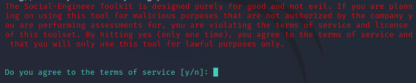
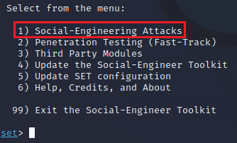
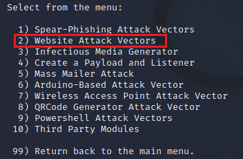
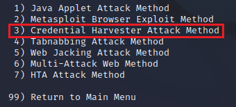
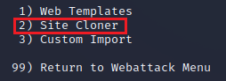
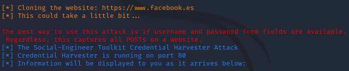
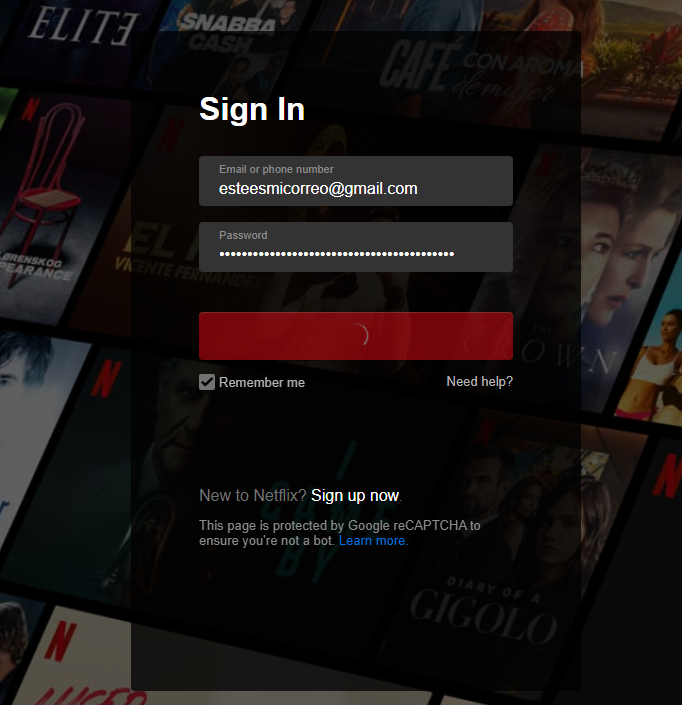
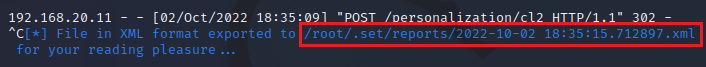
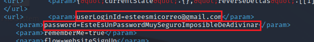

#  Usar SET (Social Engineering Toolkit) para realizar ataque de phishing
   
  
Requisitos:
1. Máquina ***Router-Ubu***.
2. Máquina ***Kali Linux***.
3. Máquina ***Win 11***.


Hay tres tipos de ataques de Ingeniería Social, que son:

* Ingeniería Social basada en personas, que utiliza la interacción personal para recopilar información sensible. Las técnicas usadas son ***impersonation***, ***vishing*** y ***eavesdropping***.
* Ingeniería social basada en computadoras, que usa ordenadores para extraer información sensible. Las técnicas empleadas son ***phishing***, ***spamming*** y ***instant messaging***.
* Ingeniería social basada en móviles, que usa aplicaciones móviles para obtener la información. Las técnicas empleadas son ***repackaging legitimate app*** y ***SMiShing***.

En este laboratorio usaremos ***SET*** (Social Engineering Toolkit) para robar las credenciales de un usuario.


## Ejercicio 1: Usar SET para ataque de Phishing.

En la máquina ***Kali*** abrimos una terminal y escribimos.
```
sudo setoolkit
```

La herramienta muestra un mensaje que nos advierte de no usarla para fines delictivos. Pulsamos ***y*** y ***Enter***.



El menú nos permite realizar ataques de Ingeniería Social. Pulsamos ***1*** y ***Enter***.



El siguiente menú presenta todos los tipos de ataques de Ingeniería Social disponibles. Merece la pena invertir algo de tiempo y revisarlos. Para el propósito de este laboratorio elegimos la opción ***2*** (Website Attack Vectors) y pulsamos ***Enter***.



Elegimos la opción ***3*** (Credential Harvester Attack Method) y pulsamos ***Enter***.



***SET*** nos ofrece varias formas de crear el sitio web falso, al que redireccionaremos al usuario. La opción más sencilla es la de clonar el sitio web verdadero, así que elegimos la opción ***2*** (Site Cloner) y ***Enter***.



Leemos con detenimiento las instrucciones, ya que son importantes. La herramienta funciona muy bien contra páginas web que envían los campos del formulario de autenticación en el mismo submit. No funcionará para aquellas en las que primero debemos escribir nuestro usuario, éste se comprueba, y luego se envía el password.

En nuestro entorno de laboratorio, será la máquina ***Kali*** quien reciba las credenciales introducidas por la víctima, así que aceptamos la IP propuesta ***192.168.20.9*** pulsando ***Enter***.

A continuación se pide la ***URL*** a clonar, escribimos la siguiente.

Nota: Es posible usar ***https***, pero para ello es necesario configurar un certificado digital en ***SET***.
```
https://www.netflix.com/es-en/login
```

La herramienta monta el servidor web con la página web clonada y se queda a la espera de que la víctima se conecte. 



Lo podemos conseguir con un ataque de ***Phishing*** o ***DNS Spoofing***. Por simplicidad, saltaremos ese paso y conectaremos directamente al sitio web falso.

En la máquina ***Win 11***, abrimos el navegador y conectamos a la siguiente URL.
```
https://192.168.20.9
```

En la imagen podemos observar las credenciales introducidas.



En la máquina ***Kali***, veremos cómo ***SET*** está capturando datos. Esperamos unos segundos y pulsamos ***CTRL+C*** para detener el servidor y generar el informe. En la imagen puedes observar la ruta en la que se guarda.



Salimos de ***SET*** pulsando varias veces ***99*** y ***Enter***.

Editamos el archivo con un editor, como ***nano*** y con paciencia localizamos la información que estamos buscando.




