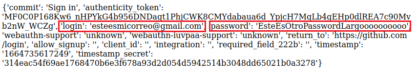

#  Usar SocialFish para realizar ataque de phishing
   
  
Requisitos:
1. Máquina ***Router-Ubu***.
2. Máquina ***Kali Linux***.
3. Máquina ***Win 11***.


Dentro de las herramientas automatizadas para realizar ataques de ***phishing*** y robar credenciales nos encontramos a ***ShellPhish***.

Esta herramienta proporciona de forma predeterminada diferentes tipos de phishing para redes sociales como Facebook, Twitter, Instagram, Snapchat, Yahoo, LinkedIn, Pinterest, así como servicios como Origin, Github, Protonmail, Spotify, Netflix, WordPress, Steam, Microsoft, InstaFollowers, y GitLab.

Esta herramienta usas las webs generadas por ***SocialFish*** (https://github.com/UndeadSec/SocialFish), un proyecto de ***GitHub*** que suplanta las web mencionadas anteriormente.

## Ejercicio 1: Usar ShellPhish para ataque de Phishing.

En la máquina ***Kali*** abrimos una terminal y escribimos.
```
git clone https://github.com/UndeadSec/SocialFish.git
```

Actualizamos repositorio paquetes.
```
sudo apt update -y
```

Instalamos ***Python3*** y ***Python3-pip***
```
sudo apt -y install python3 python3-pip python3-dev 
```

Creamos un entorno virtual para Python con ***venv***.
```
python3 -m venv venv
source venv/bin/activate
```

SocialPhish tiene un requerimiento obsoleto que no se puede cumplir. En consecuencia no funcionaría. Para solventarlo vamos a descargarnos una nueva versión de los archivos afectados.
En la terminal, ejecuta.
```
git clone https://github.com/antsala/eHacking_LABS.git
```

Cambiamos al directorio apropiado.

```
cd SocialFish
```

Copiamos el archivo de requerimientos arreglado.
```
cp ../eHacking_LABS/07/requirements.txt .
```

Copiamos el script arreglado.
```
cp ../eHacking_LABS/07/SocialFish.py .
```

Lo hacemos ejecutable.
```
chmod 755 SocialFish.py
```

Instalamos SocialFish.

```
pip install -r requirements.txt
```

A continuación iniciamos la herramienta con el siguiente comando.

Nota: Requiere poner un usuario y una contraseña.
```
python3 SocialFish.py antonio Pa55w.rd
```

El servidor se inicia, y como podemos ver en la imagen adjunta, nos indica que nos conectemos a ***http://0.0.0.0:5000/neptune*** para configurar el ataque.

Nota: ***0.0.0.0*** quiere decir cualquier IP que tenga la máquina. Por lo tanto es equivalente a ***http://192.168.20.9:5000/neptune***.


Abrimos un navegador y nos conectamos a la URL siguiente.
```
http://0.0.0.0:5000/neptune
```

Nos pide autenticación. Ponemos el usuario y el password que usamos al iniciar el servidor.
```
antonio
```

```
Pa55w.rd
```

La interfaz es muy simple. La imagen muestra tres rectángulos.


Debemos configurarlo así.

* En el campo ***Clone*** debemos poner la ***URL*** del sitio que queramos suplantar. Por ejemplo ***GitHub***. Escribimos.
https://github.com/login

* En el campo ***Redirection*** ponemos la URL a la que deseamos redirigir al usuario, ya que obviamente el inicio de sesión no funcionará. Podemos llevar a una página que muestre un mensaje indicando que el servicio no está operativo, por ejemplo.

En este caso ponemos la misma página de login, de forma que el usuario piense que se ha equivocado al escribir las credenciales.
```
https://github.com/login
```

* Solo queda por hacer clic en el icono del ***rayo***

El ataque está preparado. Ahora solo hay que llevar a la víctima a la URL ***http://192.168.20.9:5000***.

En la máquina ***Win 11***, abrimos el navegador y escribimos la siguiente URL.
```
http://192.168.20.9:5000
```

Aparecerá la página de login de ***GitHub***. Escribe cualquier credencial e intenta iniciar sesión. En unos segundos serás redireccionado a la página de ayuda.

En la máquina ***Kali***, en la página web de ***SocialFish***, actualiza el navegador. En la parte inferior verás los ataques que han sido exitosos. En la imagen puedes ver el resultado, y un botón, llamado ***View*** en la parte derecha.


Si haces clic en ***View*** podrás observar lo capturado.



Al igual que ***SET***, debemos hacer que la víctima haga clic en el enlace que lleve a la URL ***http://192.168.20.9:5000***. Engañar a la víctima no suele ser un problema usando técnicas de spoofing, al menos si no está suficientemente entrenada.

Un ataque real necesitaría exponer una ***DNS*** o ***IP Pública*** como endpoint. Podemos usar ***ngrok*** para ello.

***FIN DEL LABORATORIO***