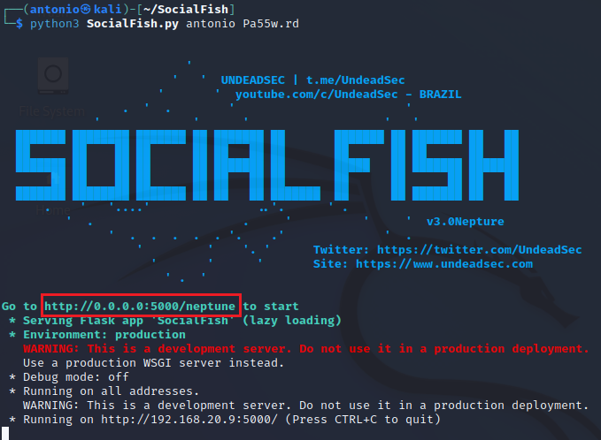
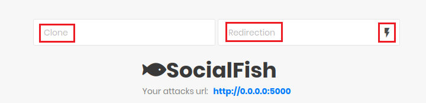

#  Saltar 2FA en cuentas de M365 con Evilginx
   
  
Requisitos:
1. Máquina ***Router-Ubu***.
2. Máquina ***Win 11***.
3. Teléfono móvil o emulador BlueStacks con la aplicación Microsoft Authenticator.
3. Cuenta de M365 con MFA configurada. (Nota: El profesor deberá aportar el tenant de 365)
4. Máquina virtual en Internet con ***dirección IP pública*** y ***Evilnginx instalado***. (Nota: El profesor aportará la VM)
5. Dominio de Internet.


Para poder saltar la MFA necesitamos capturar las credenciales que la víctima introduce en el cuadro de diálogo de autenticación de M365. Para conseguir eso, necesitamos realizar un ataque MitM y enviar un enlace malicioso (phishing).

El ataque MitM se realizará mediante ***Evilnginx***, que actuará como proxy inverso. Cuando la víctima reciba el enlace de phishing, conectará con la VM de Internet que tiene instalado Evilgninx que le mostrará el cuadro de diálogo de autenticación de Office 365. La víctima escribirá sus credenciales y evilginx, realizará una redirección hacia el servidor de autenticación de Microsoft.

En este momento, Microsoft solicitará a la víctima la introducción del ***segundo factor de autenticación***, que generalmente será a través de la aplicación Microsoft Authenticator. Cuando la víctima escriba la información requerida, Microsoft enviará una ***cookie de autorización*** a la víctima, que será utilizada como token para los servicios de M365.

Puesto que el MitM sigue funcionando, Evilxginx también obtendrá dicha cookie de autorización.

En consecuencia, solo queda usar un navegador, importar la cookie que se ha capturado y ya se podrá acceder a los servicios de M365 de la víctima.


## Ejercicio 1: Crear tenant de M365.

El profesor creará el tenant de M365.

Una vez creado, accedemos a él por medio de la página web de administración de M365.


En la máquina ***Win 11*** abrimos el navegador y nos conectamos a.
```
https://portal.office.com
```

Iniciar sesión con la credencial del administrador global del tenant.


## Ejercicio 2: Configurar Microsoft authenticator en emulador Android.

Si lo prefieres puedes usar tu móvil. Nosotros usaremos el emulador de Android BlueStacks.

Crea una instancia de teléfono. Si usas BlueStacks 5, elige ***Pie 64-bit***.


Procede a descargar la instancia, e iníciala. El resultado será el siguiente.


Accede a la ***App Store***. Como el dispositivo es nuevo tendrás que configurarle una cuenta de ***Gmail***.

En la ***App Store***, localiza ***Microsoft Authenticator*** e instálala. 

Ahora, selecciona la opción ***Agregar una cuenta profesional o educativa***.


Instala la aplicación ***Microsoft Authenticator***.


Actualizamos repositorio paquetes.
```
sudo apt update -y
```

Instalamos ***Python3*** y ***Python3-pip***
```
sudo apt -y install python3 python3-pip python3-dev python3.11-venv
```

Creamos un entorno virtual para Python con ***venv***.
```
python3 -m venv venv
source venv/bin/activate
```

SocialPhish tiene un requerimiento obsoleto que no se puede cumplir. En consecuencia no funcionaría. Para solventarlo vamos a descargarnos una nueva versión de los archivos afectados.
En la terminal, ejecuta.
```
git clone https://github.com/antsala/eHacking_LABS.git
```

Cambiamos al directorio apropiado.

```
cd SocialFish
```

Copiamos el archivo de requerimientos arreglado.
```
cp ../eHacking_LABS/07/requirements.txt .
```

Copiamos el script arreglado.
```
cp ../eHacking_LABS/07/SocialFish.py .
```

Lo hacemos ejecutable.
```
chmod 755 SocialFish.py
```

Instalamos SocialFish.

```
pip install -r requirements.txt
```

A continuación iniciamos la herramienta con el siguiente comando.

Nota: Requiere poner un usuario y una contraseña.
```
python3 SocialFish.py antonio Pa55w.rd
```

El servidor se inicia, y como podemos ver en la imagen adjunta, nos indica que nos conectemos a ***http://0.0.0.0:5000/neptune*** para configurar el ataque.

Nota: ***0.0.0.0*** quiere decir cualquier IP que tenga la máquina. Por lo tanto es equivalente a ***http://192.168.20.9:5000/neptune***.



Abrimos un navegador y nos conectamos a la URL siguiente.
```
http://0.0.0.0:5000/neptune
```

Nos pide autenticación. Ponemos el usuario y el password que usamos al iniciar el servidor.
```
antonio
```

```
Pa55w.rd
```

La interfaz es muy simple. La imagen muestra tres rectángulos.



Debemos configurarlo así.

* En el campo ***Clone*** debemos poner la ***URL*** del sitio que queramos suplantar. Por ejemplo ***GitHub***. Escribimos.
https://github.com/login

* En el campo ***Redirection*** ponemos la URL a la que deseamos redirigir al usuario, ya que obviamente el inicio de sesión no funcionará. Podemos llevar a una página que muestre un mensaje indicando que el servicio no está operativo, por ejemplo.

En este caso ponemos la misma página de login, de forma que el usuario piense que se ha equivocado al escribir las credenciales.
```
https://github.com/login
```

* Solo queda por hacer clic en el icono del ***rayo***

El ataque está preparado. Ahora solo hay que llevar a la víctima a la URL ***http://192.168.20.9:5000***.

En la máquina ***Win 11***, abrimos el navegador y escribimos la siguiente URL.
```
http://192.168.20.9:5000
```

Aparecerá la página de login de ***GitHub***. Escribe cualquier credencial e intenta iniciar sesión. En unos segundos serás redireccionado a la página de ayuda.

En la máquina ***Kali***, en la página web de ***SocialFish***, actualiza el navegador. En la parte inferior verás los ataques que han sido exitosos. En la imagen puedes ver el resultado, y un botón, llamado ***View*** en la parte derecha.


Si haces clic en ***View*** podrás observar lo capturado.


Al igual que ***SET***, debemos hacer que la víctima haga clic en el enlace que lleve a la URL ***http://192.168.20.9:5000***. Engañar a la víctima no suele ser un problema usando técnicas de spoofing, al menos si no está suficientemente entrenada.

Un ataque real necesitaría exponer una ***DNS*** o ***IP Pública*** como endpoint. Podemos usar ***ngrok*** para ello.

Para finalizar el servidor hacemos CTRL+C en la terminal.

Por último, para salir en entorno virtual de Python, escribimos el siguiente comando.
```
deactivate
```

***FIN DEL LABORATORIO***