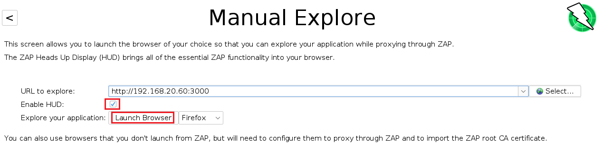

# OWASP y la "Tienda de Zumos".
   
      

Requisitos:
1. Máquina ***Router-Ubu***.
2. Máquina ***Kali Linux***.
3. Máquina ***Ubu_srv_01***


Las aplicaciones web son un objetivo primordial para el actor de la amenaza. El desarrollo, cuando no tiene en consideración la seguridad, es una fuente importante de vulnerabilidades. Por ello, la fundación OWASP tiene como misión mejorar la seguridad en el desarrollo de Software. Recomendamos encarecidamente estudiar su web: https://owasp.org/. En ella podrás ver el famoso ***OWASP Top 10***, que describe las 10 preocupaciones más importantes que se deben tener en cuenta a la hora del desarrollo: https://owasp.org/www-project-top-ten/

La finalidad de esta serie de laboratorios es recorrer las causas más comunes que hacen el desarrollo de software inseguro. Para ello se ha desarrollado una aplicación web, llamada ***Juice Shop*** que presenta la mayoría de estos problemas. Entendiendo la causa de ellos desarrollarás software de forma más segura.

## Ejercicio 1: ¿Qué es Juice Shop?

***Juice Shop*** es una aplicación perfectamente funcional, pero presenta muchas vulnerabilidades debida a malas prácticas de seguridad en el desarrollo de la misma. El proyecto nos anima a encontrar las vulnerabilidades y se basa en gamificación. Está basada en un proyecto de Open Source que puedes consultar aquí: https://owasp.org/www-project-juice-shop/

***Juice Shop*** está escrita en ***JavaScript***. Para el ***Frontend*** se ha usado el framework ***Angular***  con la idea de crear una aplicación de "Single Page". En el ***Backend*** también se usa ***Javascript*** mediante un servidor de ***Node.js*** que se comunica con una base de datos ***SQL-Lite*** para la cual no es necesario desplegar otro servidor. Para abstraer las operaciones con la base de datos se utiliza ***Sequilize*** y ***finale-rest***. La aplicación permite el registro de sus usuarios por medio de ***OAuth***, de esta forma, se pueden usar cuentas de ***Google***.

La arquitectura de la aplicación se puede observar en la siguiente imagen.


Las vulnerabilidades presentes en ***Juice Shop*** se organizan por diversas categorías, la mayoría de ellas presentes en el ***TOP 10*** de ***OWASP*** y se resumen en la siguiente tabla.


El objetivo de estos laboratorios no es demostrarlas todas, porque son ***101***, sino hacer una selección de las más importantes y peligrosas.

Para poder entender y descubrir las vulnerabilidades, necesitaremos usar las herramientas de desarrollo. Tengamos en cuenta que no todos los navegadores soportan todas las funcionalidades. En la siguiente tabla podemos ver un resumen. En ***Kali*** usaremos ***Firefox*** que las soporta todas.


## Ejercicio 2: Instalación de Juice Shop.

La aplicación puede ser instalada de diversas formas. En su repo de ***GitHub*** puedes ver todas las posibilidades. En este laboratorio, y por sencillez, elegimos el despliegue basado en ***Contenedor de Docker***, y para ello usaremos la máquina ***Ubu_srv_01***.

Iniciamos sesión en ***Ubu_srv_01***, pero a través de ***SSH***. 

En la máquina ***Kali***, abrimos una terminal y escribimos el siguiente comando.
```
ssh antonio@192.168.20.60
```

Como password ponemos el siguiente.
```
Pa55w.rd
```


Instalamos ***Docker*** con los siguientes comandos.
```
sudo apt-get update
```

```
sudo apt-get -y install apt-transport-https ca-certificates curl software-properties-common
```

```
curl -fsSL https://download.docker.com/linux/ubuntu/gpg | sudo apt-key add -
```

```
sudo add-apt-repository "deb [arch=amd64] https://download.docker.com/linux/ubuntu focal stable"
```

```
sudo apt-get update
```

Instalamos ***Docker***.
```
sudo apt-get -y install docker-ce
```

Comprobamos que se haya instalado correctamente.
```
sudo docker --version
```

Descargamos la imagen de contenedor de ***Juice Shop***
```
sudo docker pull bkimminich/juice-shop
```

Lanzamos el contenedor.
```
sudo docker run --name juice_shop_container -d -p 3000:3000 bkimminich/juice-shop
```

Comprobamos que el contenedor se ha iniciado correctamente.
```
sudo docker container ls -a
```

El resultado debe ser similar a este.


En la máquina ***Kali***, abrimos el navegador y nos conectamos a la siguiente URL.
```
http://192.168.20.60:3000
```

La aplicación debe funcionar.


## Ejercicio 3: Instalación de OWASP ZAP.

***ZAP*** o ***Zed Attack Proxy*** es una herramienta gratuita proveniente del proyecto ***OWASP*** cuya finalidad es realizar pentesting sobre aplicaciones web. Se instala como un proxy, interceptando el tráfico entre el navegador del usuario y la aplicación web que estamos evaluando.

En el mercado disponemos de ***Burp***, otra herramienta que hace lo mismo, pero en este caso es comercial y no nos deja usar la mayoría de sus funciones si no se adquiere una licencia.

Procedemos a instalar ***ZAP***.

En la máquina ***Kali***, abrimos una nueva terminal (la anterior está ocupada por una sesión ***SSH*** contra ***Ubu_srv_01***) y escribimos.
```
sudo apt-get -y install zaproxy
```

Para iniciar ***ZA***, escribimos en la terminal.
```
owasp-zap
```

Configuramos ***ZAP*** como muestra la imagen. Por ahora no necesitamos persistencia.


Hacemos clic en el botón ***Start***

***ZAP*** pide actualizar los ***Plugins***, que son los componentes especializados en localizar las vulnerabilidades, así que hacemos clic en el botón ***Update All***.


Esperamos a que termina la actualización. ***ZAP*** está iniciado. 

ZAP ofrece una nueva forma de interacción con el usuario, el llamado ***OWASP HUD***. Para activarlo procedemos de la siguiente forma. En el panel derecho, en la pestaña ***Quick Start***, hacemos clic en ***Manual Explore***.


A continuación, en el panel ***Manual Explorer*** escribimos la URL del sitio a explorar y, para activar la función de ***HUD***, marcamos el checkbox ***Enable HUD***. Elegimos como navegador a ***Firefox***. De esta forma, el navegador se configurará automáticamente para usar a ZAP como proxy. Hacemos clic en el botón ***Launch Browser***.



ZAP HUD crea unas frames en los margenes izquierdo, derecho e inferior que permitirán interactuar con ZAP de forma muy cómoda conforme se estudia el sitio web. Aparecerá una pantalla recomendando hacer el tutorial. Es muy recomendable hacerlo. El tiempo estimado para ello es de 30 minutos.


***FIN DEL LABORATORIO***