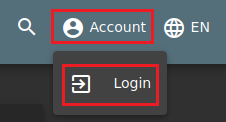

# Aprender a usar Juice Shop.
      
      

Requisitos:
1. Máquina ***Router-Ubu***.
2. Máquina ***Kali Linux***.
3. Máquina ***Ubu_srv_01***


En la máquina ***Kali***, si no estamos conectados a la app, abrimos el navegador y conectamos a la siguiente URL.

Nota: Si fallara, revisar que el contenedor esté corriendo.
```
http://192.168.20.60:3000
```

En la página inicial, se muestran los diferentes zumos que ofrece la tienda. Si haces clic en el logo que aparece arriba a la izquierd, te llevará siempre al inicio de la página.

Cuando hacemos clic en cualquier producto, se abre una nueva ventana que muestra los detalles del producto elegido. Estos detalles incluyen opiniones de los clientes, siempre que existan. Por ejemplo, localiza y selecciona ***OWASP Juice Shop "King of the Hill" Facemask*** y podrás ver las valoraciones.


En la parte superior derecha, podemos encontrar el botón con forma de lupa que nos permitirá localizar los productos. Usa el buscador para encontrar los zumos de limón (lemon).


La interfaz filtra por la selección. Para volver a mostrar la lista de productos, hacemos clic en el icono de la aplicación en la esquina superior izquierda.


No hay ninguna manera de comprar productos hasta que nos hayamos logado. Hacemos clic en el botón ***Login***.



En primer lugar tendremos que crear una cuenta de usuario, así que nos registramos.


Rellenamos el formulario y hacemos clic en ***Register***.


Por último, realizamos el ***Login*** y ya podremos comprar en la tienda.

Prueba a comprar. Cuando finalices, haz clic en el carrito y procede a realizar el ***checkout***. Se nos pedirá información sobre el envío. Proporciona datos ficticios y haz clic en ***Submit***.


continua avanzando por el checkout y da de alta una tarjeta de crédito (Ficticia)


Finaliza el proceso de compra.


Esto es lo que debes saber sobre como funcina la app. Para finalizar estudia el menú ***Account*** y observa las opciones disponibles.

