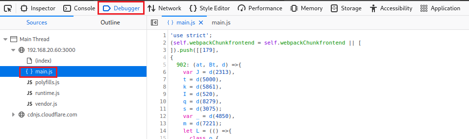

# Descubrir el "ScoreBoard" y la sección "Admin".
      
      

Requisitos:
1. Máquina ***Router-Ubu***.
2. Máquina ***Kali Linux***.
3. Máquina ***Ubu_srv_01***

## Descubrir el "Scoreboard".

Muchas aplicaciones tienen páginas "ocultas" que no están vinculadas desde ninguna otra parte de la aplicación. Quizás la intención del programador pasa por aportar una funcionalidad que solo es conocida por ciertas personas, como los administradores de la aplicación. Este reto propone encontrar la página ***ScoreBoard*** que está oculta. Cuando la encontremos, podremos ver nuestro avance a lo largo del reto de ***Juice Shop***.

***OBJETIVO***: Encontrar la página que muestra el ScoreBoard.

***PISTA***: Usar las herramientas del desarrollador para curiosear por el código fuente de la aplicación, con la intención de localizar dicha página.


***RESOLUCIÓN***. Los pasos para resolver el reto son.

Abrimos ***Firefox*** y nos conectamos a la aplicación en la siguiente URL.
```
http://192.168.20.60:3000
```

Activamos las ***Heramientas del desarrollador***, que se encuentran en ***Application Menu/More Tools/Web Developer Tools*** (También podemos pulsar ***Ctrl+Shift+J***).

Para localizar todas las rutas disponibles en la aplicación, debemos ver los archivos de ***JavaScript***. En este reto, el archivo ***main.js***. Para ello, seleccionamos ***Debugger*** y hacemos clic en el archivo ***main.js***. Podremos ver el contenido del archivo.



A continuación pulsamos ***Ctrl+F*** para activar el buscador y escribimos lo siguiente:
```
score-board
```

Avanzamos con el botón ***Next Result*** hasta la coincidencia 12, que mostrará lo siguiente.


In this tutorial, I am going to solve the Scoreboard and Admin section challenges by inspecting the client resources. The Juice shop web page has a hidden scoreboard page and administration section of the store. The challenge is to find these hidden webpages. For that, we are going to use our browser developer tools to find the path to the scoreboard and Admin section.

Every browser’s developer tool has a debugger that shows the source code. We are trying to find the path using some guessed keywords.

Open debugger tab in Firefox web browser developer tool. (Source tab if you are using the Chrome web browser)

## Descubrir la sección "Admin"

https://pwning.owasp-juice.shop/part2/score-board.html


