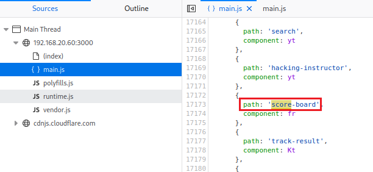
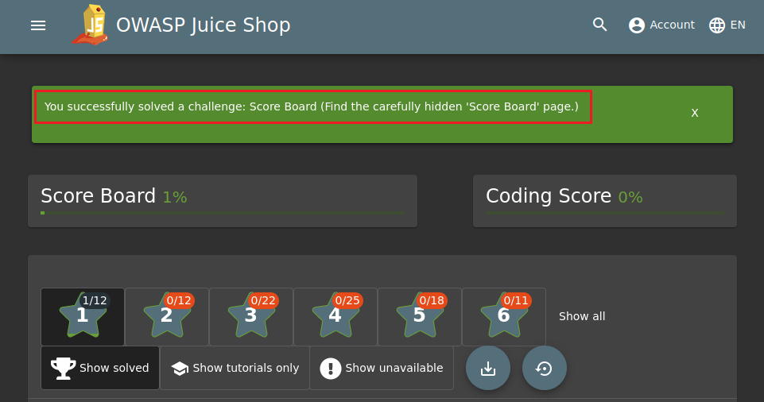
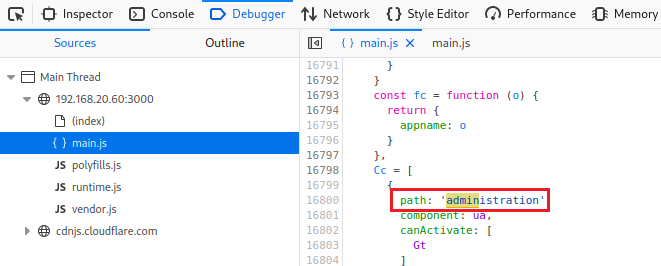
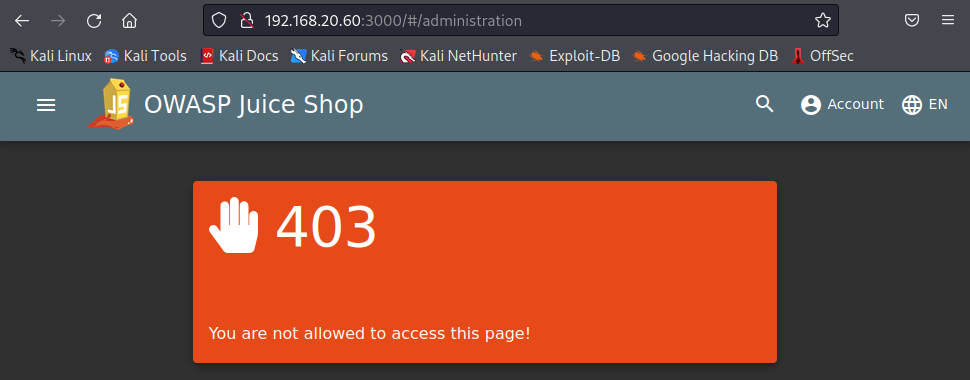

# Descubrir el "ScoreBoard" y la sección "Admin".
      
      

Requisitos:
1. Máquina ***Router-Ubu***.
2. Máquina ***Kali Linux***.
3. Máquina ***Ubu_srv_01***

## Descubrir el "Scoreboard".

Muchas aplicaciones tienen páginas "ocultas" que no están vinculadas desde ninguna otra parte de la aplicación. Quizás la intención del programador pasa por aportar una funcionalidad que solo es conocida por ciertas personas, como los administradores de la aplicación. Este reto propone encontrar la página ***ScoreBoard*** que está oculta. Cuando la encontremos, podremos ver nuestro avance a lo largo del reto de ***Juice Shop***.

***OBJETIVO***: Encontrar la página que muestra el ScoreBoard.

***PISTA***: Usar las herramientas del desarrollador para curiosear por el código fuente de la aplicación, con la intención de localizar dicha página.


***RESOLUCIÓN***. Los pasos para resolver el reto son.

Abrimos ***Firefox*** y nos conectamos a la aplicación en la siguiente URL.
```
http://192.168.20.60:3000
```

Activamos las ***Heramientas del desarrollador***, que se encuentran en ***Application Menu/More Tools/Web Developer Tools*** (También podemos pulsar ***Ctrl+Shift+J***).

Para localizar todas las rutas disponibles en la aplicación, debemos ver los archivos de ***JavaScript***. En este reto, el archivo ***main.js***. Para ello, seleccionamos ***Debugger*** y hacemos clic en el archivo ***main.js***. Podremos ver el contenido del archivo.


A continuación pulsamos ***Ctrl+F*** para activar el buscador y escribimos lo siguiente:
```
score-board
```

Avanzamos con el botón ***Next Result*** hasta la coincidencia 12, que mostrará lo siguiente.



Al parecer hay una ruta en la app llamada ***score-board*** que debemos probar. En el navegador escribimos la siguiente URL.
```
http://192.168.20.60:3000/#/score-board
```

Como resultado hemos encontrado la página oculta que mostrará nuestros avances.




## Descubrir la sección "Admin"

En este reto se nos propone localizar la página oculta de administración. 


***OBJETIVO***: Encontrar la página de administración.

***PISTA***: Usar las herramientas del desarrollador para curiosear por el código fuente de la aplicación, con la intención de localizar dicha página.


***RESOLUCIÓN***. Los pasos para resolver el reto son.

Abrimos ***Firefox*** y nos conectamos a la aplicación en la siguiente URL.
```
http://192.168.20.60:3000
```

Activamos las ***Heramientas del desarrollador***, que se encuentran en ***Application Menu/More Tools/Web Developer Tools*** (También podemos pulsar ***Ctrl+Shift+J***).

Para localizar todas las rutas disponibles en la aplicación, debemos ver los archivos de ***JavaScript***. En este reto, el archivo ***main.js***. Para ello, seleccionamos ***Debugger*** y hacemos clic en el archivo ***main.js***. Podremos ver el contenido del archivo.


A continuación pulsamos ***Ctrl+F*** para activar el buscador y escribimos lo siguiente:
```
admin
```

Avanzamos con el botón ***Next Result*** hasta la coincidencia 5, que mostrará lo siguiente.



Al parecer hay una ruta en la app llamada ***administration*** que debemos probar. En el navegador escribimos la siguiente URL.
```
http://192.168.20.60:3000/#/administration
```

Como resultado hemos encontrado la página oculta, a la que aún no tenemos acceso.



***FIN DEL LABORATORIO***

