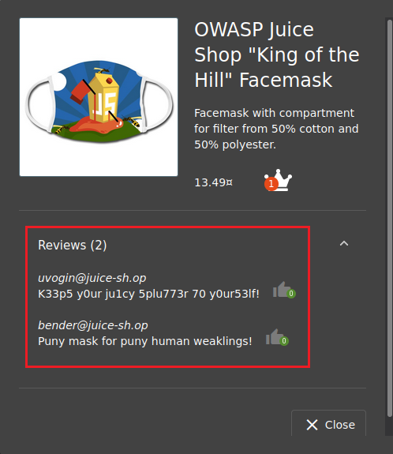

# Ataques de Inyección SQL (SQL Injection).
      
      

Requisitos:
1. Máquina ***Router-Ubu***.
2. Máquina ***Kali Linux***.
3. Máquina ***Ubu_srv_01***

Las debilidades de inyección permiten a los actores de la amenaza enviar código malicioso a través de la aplicación para atacar un sistema de backend. Estos ataque incluyen:

* Ejecutar comandos del sistema operativo por medio de llamadas al sistema (System calls)
* Abrir otros programas por medio de comandos de la shell.
* Relizar consultas a la base de datos de backend.
* etc.

Los ataques de inyección pueden presentarse cuando la aplicación utiliza alguna clase de interprete, que no filtra apropiadamente los datos enviados por el atacante.

Los ataques de inyección SQL pueden ser muy sencillos de explotar, pero también los tenemos muy elaborados y complejos. Las consecuencias de poder interactuar con el servidor de bases de datos son diversas, pueden modificar la información, corromperla o eliminarla.

## Hacer un pedido de la oferta especial de navidad de 2014.

La ***Blind SQL Injection*** es un tipo de ataque donde preguntamos a la base de datos (a ciegas) por consultas que pueden devolver ***true*** o ***false***, y estudiamos la respuesta. Este tipo de ataque se utiliza cuando la aplicación web está configurada para mostrar ***mensajes de error genéricos***, pero es vulnerable a inyección de SQL.

Cuando realizamos el ataque, la aplicación web puede mostrar errores  indicando que la sintaxis de la consulta es incorrecta.

***OBJETIVO***: Poder realizar un pedido de un producto que se supone que no está disponible.

***PISTAS***: 

* Localiza cómo oculta la aplicación a los usuarios los productos eliminados (que no se pueden pedir ya).
* Intenta construir una cadena de ataque que haga visible de nuevo esos productos eliminados.
* Selecciona un producto eliminado, añádelo al carrito y realiza el checkout.
* Ninguna de las pistas anteriores pueden ser realizadas desde el frontend de la aplicación y necesitan realizar ***Blind SQL Injection***.

***RESOLUCIÓN***. Los pasos para resolver el reto son.

Usaremos las herramientas del desarrollador. Así que abrimos el navegador y nos conectamos a la siguiente URL.
```
http://192.168.20.60:3000/#/search
```

En las herramientas del desarrollador seleccionamos la pestaña ***Network***, y pulsamos repetidamente ***F5***. 



