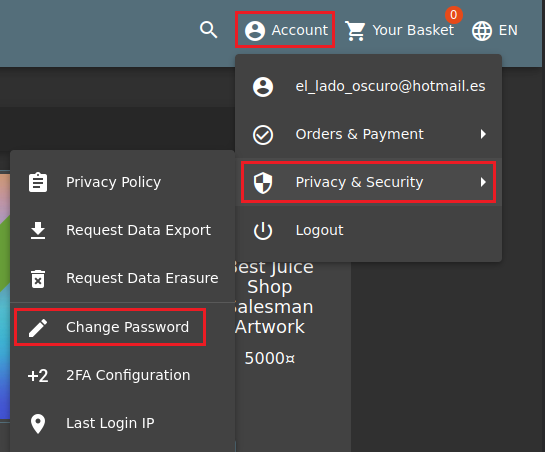
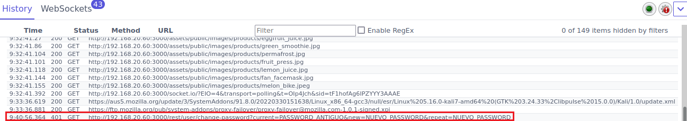
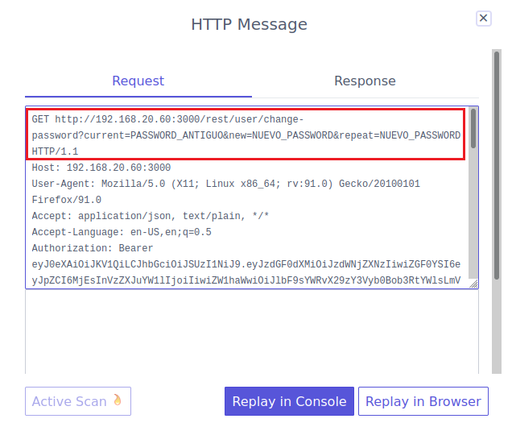
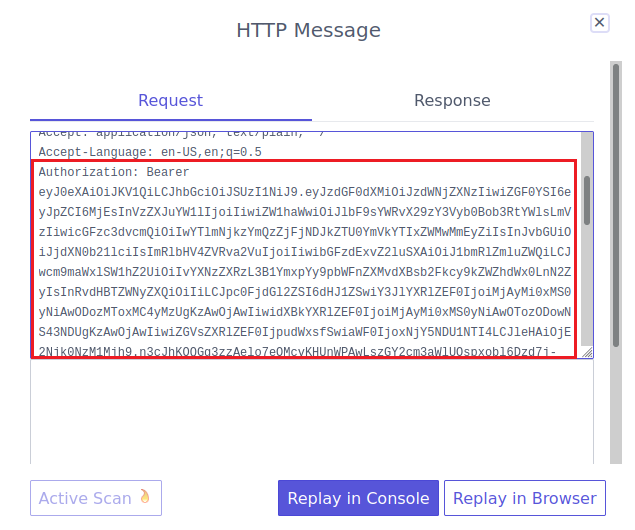
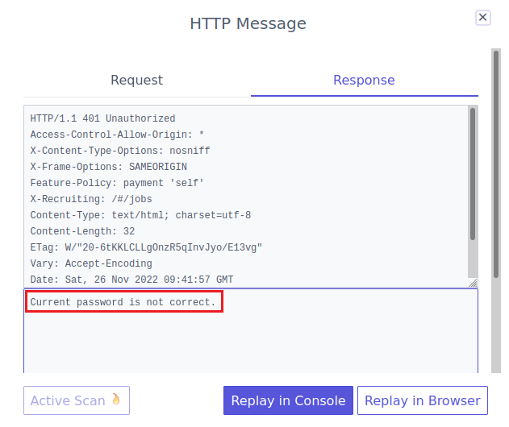
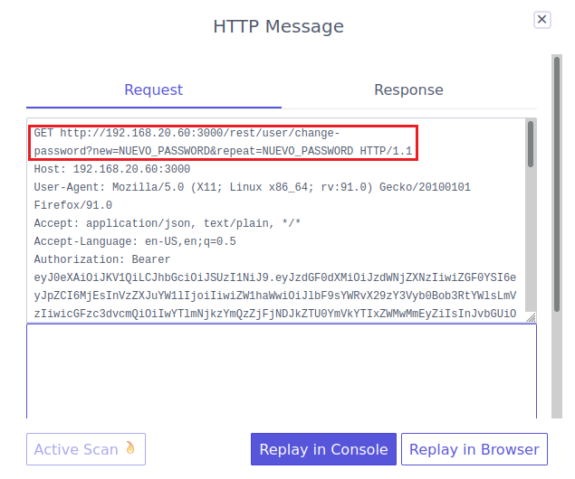
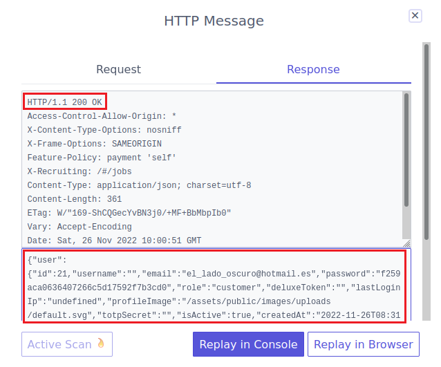
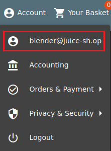

# Romper la autenticación (***Broken Authentication***).

      
      

Requisitos:
1. Máquina ***Router-Ubu***.
2. Máquina ***Kali Linux***.
3. Máquina ***Ubu_srv_01***

Las debilidades en la autenticación permiten al actor de la amenaza ganar suplantar la identidad de un usuario de la aplicación. Para conseguir este objetivo se pueden recorrer diversos caminos. En los siguientes ejercicios exponemos algunos de ellos a modo de ejemplo.

***OBJETIVO***: Cambiar el password de un usuario llamado ***Bender***.

***PISTAS***: 

* Estudiar cómo se produce la request que cambia el password.
* Obtener un JWT (Token de autorización) para que el sistema te autorice y, en consecuencia, puedas cambiar el password.
* Como no conoces el password original de ***Bender***, no podrás usar la función de cambio de password de la aplicación, a pesar de estar autenticado.

***RESOLUCIÓN***. Los pasos para resolver el reto son.

Como siempre iniciamos ***ZAP***.

En primer lugar vamos a observar cómo se construye la request que cambia el password del usuario. Para ello nos logamos con el usuario que dimos de alta y procedemos a invocar la función de cambio de password. Esta opción está en el menú ***Account/Privacy & Security/Change Password***.



Aparecerá el formulario de cambio de password. 


Recordemos que lo que estamos buscando es la URL del servicio de cambio de password, así que rellenamos este formulario de la siguiente manera.

Para ***Current Password*** escribimos.
```
PASSWORD_ANTIGUO
```

En ***New Password*** escribimos.
```
NUEVO_PASSWORD
```

y en ***Repeat New Password*** ponemos.
```
NUEVO_PASSWORD
```

Hacemos clic en el botón ***Change***. Obviamente esto no funcionará, pero lo que vamos buscando es le URL de la request. Por lo tanto, en ***ZAP*** accedemos a ***History*** y localizamos una request en la forma que se muestra en la siguiente imagen.



Estudiando la ***Request*** podemos sacar información muy valiosa. En primer lugar podemos ver la URL con la query string que se manda a la aplicación.



Un poco más abajo vemos el ***Bearer Token***, al que también se le llama ***Token de autenticación***.  Este token, generado por el servidor debe ser reenviado por el cliente en las subsiguientes request para que dicha request sea aceptada por el servidor. 



Al seleccionar la ***Response*** podemos ver que el servidor contesta con el mensaje ***Current password is not correct.***




Hay dos cosas que están claras.

1) Si no conocemos el password actual del usuario, no seremos capaces de cambiar dicho password.
2) Actualmente estamos autenticados en la aplicación y el servidor nos envió el ***Bearer Token***.

En ***ZAP***, procedemos a editar la ***Request*** del ***HTTP Message***. Vamos a intentar cambiar el password eliminando de la ***Query string*** el parámetro correspondiente al password actual (***current***). La request debería quedar así.



Hacemos clic en el botón ***Replay in Console*** y, oh sorpresa!!!, la ***Response*** indica que el cambio de password ha sido correcto, devolviendo en el body el JSON correspondiente al usuario actual.



Para comprobar que realmente ha funcionado, cierra la sesión de tu usuario actual y haz un nuevo login usando como password el siguiente.
```
NUEVO_PASSWORD
```

La razón por la cual ha funcionado este hack es obvia. El codigo fuente de la aplicación no realiza convenientemente la comprobación del password actual que se le pasa por la querystring, provocando esta debilidad en la aplicación.

IMPORTANTE!!!
Para futuros laboratorios, te recomiendo que vuelvas a poner el password que tenía tu usuario de la aplicación. Así que esta vez cámbialo de la forma habitual sin modificar la request.

Recordemos que el objetivo fundamental de este ejercicio consistía en cambiarle el password a un usuario llamado ***Blender*** sin conocer su password actual. Para conseguirlo necesitamos que la aplicación nos autentique como dicho usuario.

El ***Ejercicio 3*** del ***lab-25-D*** permitió exfiltrar todos los usuarios de la base de datos. De esta forma podemos saber que el ***email*** del usuario ***Blender*** es 
```
bender@juice-sh.op
```

En el ***Ejercicio 5*** del ***lab-25-D*** aprendimos a obtener un bearer token para cualquier usuario y, de esta forma, estar autenticados para la aplicación.

En consecuencia usaremos estas dos técnicas junto a la debilidad que hemos encontrado en este ejercicio para cambiar la contraseña del usuario ***Belnder*** y en consecuencia quedarnos con su cuenta.

Volvemos a la página de login de la aplicación, y en el campo ***email*** pegamos el siguiente texto.
(Nota: Observa como hemos puesto el email del usuario Blender. Como password pueder poner el que quieras)
```
' UNION SELECT * FROM (SELECT 15 as 'id', '' as 'username', 'blender@juice-sh.op' as 'email', '12345' as 'password', 'accounting' as 'role', '123' as 'deluxeToken', '1.2.3.4' as 'lastLoginIp' , '/assets/public/images/uploads/default.svg' as 'profileImage', '' as 'totpSecret', 1 as 'isActive', '1999-08-16 14:14:41.644 +00:00' as 'createdAt', '1999-08-16 14:33:41.930 +00:00' as 'updatedAt', null as 'deletedAt')--
```

Ya estamos logados como Blender. 



Procedemos como vimos al principio del ejercicio. Vamos a la página para cambiar el password y ponemos.

Para ***Current Password*** escribimos.
```
PASSWORD_ANTIGUO
```

En ***New Password*** escribimos.
```
NUEVO_PASSWORD
```

y en ***Repeat New Password*** ponemos.
```
NUEVO_PASSWORD
```

En el historial de ZAP, capturamos la request, la editamos y eliminamos el parámetro ***current***. Hacemos clic en ***Replay in Console*** y ya habremos cambiado el password de Blender.

Puedes cerrar sesión y probar a inicarla con el nuevo password. La cuenta de Blender ya es tuya.


***FIN DEL LABORATORIO***

Login Bjoern	Log in with Bjoern's Gmail account without previously changing his password, applying SQL Injection, or hacking his Google account.	⭐⭐⭐⭐
Two Factor Authentication	Solve the 2FA challenge for user "wurstbrot". (Disabling, bypassing or overwriting his 2FA settings does not count as a solution)	⭐⭐⭐⭐⭐

https://pwning.owasp-juice.shop/part2/injection.html
https://pwning.owasp-juice.shop/appendix/solutions.html


