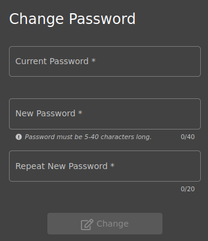

# Romper la autenticación (***Broken Authentication***).

     

Requisitos:
1. Máquina ***Router-Ubu***.
2. Máquina ***Kali Linux***.
3. Máquina ***Ubu_srv_01***

Las debilidades en la autenticación permiten al actor de la amenaza ganar suplantar la identidad de un usuario de la aplicación. Para conseguir este objetivo se pueden recorrer diversos caminos. En los siguientes ejercicios exponemos algunos de ellos a modo de ejemplo.

## Ejercicio 1:  Cambiar el password del usuario ***Bender*** sin usar ni inyección de SQL ni la opción Contraseña olvidada.

***OBJETIVO***: Cambiar el password de un usuario llamado ***Bender***.

***PISTAS***: 

* Estudiar cómo se produce la request que cambia el password.
* Obtener un JWT (Token de autorización) para que el sistema te autorice y, en consecuencia, puedas cambiar el password.
* Como no conoces el password original de ***Bender***, no podrás usar la función de cambio de password de la aplicación, a pesar de estar autenticado.

***RESOLUCIÓN***. Los pasos para resolver el reto son.

Como siempre iniciamos ***ZAP***.

En primer lugar vamos a observar cómo se construye la request que cambia el password del usuario. Para ello nos logamos con el usuario que dimos de alta y procedemos a invocar la función de cambio de password. Esta opción está en el menú ***Account/Privacy & Security/Change Password***.


Aparecerá el formulario de cambio de password. 



Recordemos que lo que estamos buscando es la URL del servicio de cambio de password, así que rellenamos este formulario de la siguiente manera.

Para ***Current Password*** escribimos.
```
PASSWORD_ANTIGUO
```

En ***New Password*** escribimos.
```
NUEVO_PASSWORD
```

y en ***Repeat New Password*** ponemos.
```
NUEVO_PASSWORD
```

Hacemos clic en el botón ***Change***. Obviamente esto no funcionará, pero lo que vamos buscando es le URL de la request. Por lo tanto, en ***ZAP*** accedemos a ***History*** y localizamos una request en la forma que se muestra en la siguiente imagen.


Estudiando la ***Request*** podemos sacar información muy valiosa. En primer lugar podemos ver la URL con la query string que se manda a la aplicación.


Un poco más abajo vemos el ***Bearer Token***, al que también se le llama ***Token de autenticación***.  Este token, generado por el servidor debe ser reenviado por el cliente en las subsiguientes request para que dicha request sea aceptada por el servidor. 


Al seleccionar la ***Response*** podemos ver que el servidor contesta con el mensaje ***Current password is not correct.***


Hay dos cosas que están claras.

1) Si no conocemos el password actual del usuario, no seremos capaces de cambiar dicho password.
2) Actualmente estamos autenticados en la aplicación y el servidor nos envió el ***Bearer Token***.

En ***ZAP***, procedemos a editar la ***Request*** del ***HTTP Message***. Vamos a intentar cambiar el password eliminando de la ***Query string*** el parámetro correspondiente al password actual (***current***). La request debería quedar así.


Hacemos clic en el botón ***Replay in Console*** y, oh sorpresa!!!, la ***Response*** indica que el cambio de password ha sido correcto, devolviendo en el body el JSON correspondiente al usuario actual.


Para comprobar que realmente ha funcionado, cierra la sesión de tu usuario actual y haz un nuevo login usando como password el siguiente.
```
NUEVO_PASSWORD
```

La razón por la cual ha funcionado este hack es obvia. El codigo fuente de la aplicación no realiza convenientemente la comprobación del password actual que se le pasa por la querystring, provocando esta debilidad en la aplicación.

IMPORTANTE!!!
Para futuros laboratorios, te recomiendo que vuelvas a poner el password que tenía tu usuario de la aplicación. Así que esta vez cámbialo de la forma habitual sin modificar la request.

Recordemos que el objetivo fundamental de este ejercicio consistía en cambiarle el password a un usuario llamado ***Bender*** sin conocer su password actual. Para conseguirlo necesitamos que la aplicación nos autentique como dicho usuario.

El ***Ejercicio 3*** del ***lab-25-D*** permitió exfiltrar todos los usuarios de la base de datos. De esta forma podemos saber que el ***email*** del usuario ***Bender*** es.
```
bender@juice-sh.op
```

Y su ***id*** es.
```
3
```

En el ***Ejercicio 5*** del ***lab-25-D*** aprendimos a obtener un bearer token para cualquier usuario y, de esta forma, estar autenticados para la aplicación.

En consecuencia usaremos estas dos técnicas junto a la debilidad que hemos encontrado en este ejercicio para cambiar la contraseña del usuario ***Bender*** y quedarnos con su cuenta.

Volvemos a la página de login de la aplicación, y en el campo ***email*** pegamos el siguiente texto.
(Nota: Observa cómo hemos puesto el ***id*** y ***email*** del usuario Bender. Como password pueder poner el que quieras)
```
' UNION SELECT * FROM (SELECT 3 as 'id', '' as 'username', 'bender@juice-sh.op' as 'email', '12345' as 'password', 'accounting' as 'role', '123' as 'deluxeToken', '1.2.3.4' as 'lastLoginIp' , '/assets/public/images/uploads/default.svg' as 'profileImage', '' as 'totpSecret', 1 as 'isActive', '1999-08-16 14:14:41.644 +00:00' as 'createdAt', '1999-08-16 14:33:41.930 +00:00' as 'updatedAt', null as 'deletedAt')--
```

Ya estamos logados como Bender. 


Procedemos como vimos al principio del ejercicio. Vamos a la página para cambiar el password y ponemos.

Para ***Current Password*** escribimos.
```
PASSWORD_ANTIGUO
```

En ***New Password*** escribimos.
```
NUEVO_PASSWORD
```

y en ***Repeat New Password*** ponemos.
```
NUEVO_PASSWORD
```

En el historial de ZAP, capturamos la request, la editamos y eliminamos el parámetro ***current***. Hacemos clic en ***Replay in Console*** y ya habremos cambiado el password de Bender.

Puedes cerrar sesión y probar a inicarla con las siguientes credenciales. La cuenta de Bender ya es tuya.

Usuario.
```
bender@juice-sh.op
```

Password.
```
NUEVO_PASSWORD
```

## Ejercicio 2: Romper la autenticación 2FA.

Es preciso indicar que el hackeo que se va a hacer a la aplicación se debe exclusivamente a que existe una vulnerabilidad previa de inyección de SQL que permite logar al usuario sin conocer el password de éste. En ningún caso la debilidad mostrada se debe a la aplicación ***Google Authenticator***.

***OBJETIVO***: Iniciar sesión con un usuario que tiene activado un factor adicional de autenticación.

***PISTAS***: 

* Activar la 2FA para tu usuario actual. Descubre qué tipo de factor se está usando.
* Estudia la estructura de la tabla ***Users*** para determinar en el campo se almacena el factor de autenticación y cuántos usuarios la tienen habilitada.

***RESOLUCIÓN***. Los pasos para resolver el reto son.

Como siempre iniciamos ***ZAP***.

En primer lugar iniciamos sesión con nuestro usuario de la aplicación. A continuación vamos a la opción ***Account/Privacy & Security/2FA Configuration***. 


Al seleccionar esta opción veremos la siguiente pantalla.


Es fácil determinar que el factor de autenticación adicional es un password de un solo uso que caduca en un corto periodo de tiempo. ***TOTP***, o Time-Based One-Time Password, es una variante de la autenticación MFA que funciona gracias a un código que se genera de forma aleatoria y actúa como token de autenticación. Estos códigos se generan con aplicaciones muy conocidas, como ***Google Authenticator***. Para que el actor de la amenaza se pudiera logar en la aplicación, además de tener que saber el password, necesitaría tener el móvil al que se va a mandar el TOTP, considerándose éste método como muy fiable.

Vamos a ver como podemos romper esta autenticación.

En primer lugar necesitamos conocer cómo almacena la aplicación el token ***TOTP***. En el ***Ejercicio 2*** del laboratorio ***lab-25-D*** pudimos exfiltrar el esquema de la base de datos. En él vimos una tabla llamada ***Users*** que almacena la información de autenticación de los usuarios. Si observas la siguiente imagen, hay un campo que tiene toda la pinta de guardar la información de la 2FA para TOTP. Se llama ***totpsecret*** y por defecto se inicia a un string vacio. Además, es la ***novena (9)*** columna de la tabla.


En segundo lugar, será necesario saber qué usuarios de la aplicación tienen habilitada la 2FA. En nuestro caso es sencillo, porque en el ***Ejercicio 3*** del laboratorio ***lab-25-D*** fuimos capaces de exfiltrar toda la tabla ***Users***. Recreamos ese ataque para obtener todos los registros de la tabla de usuario. En la barra de direcciones del navegador escribimos.
```
https://192.168.20.60:3000/rest/products/search?q=ewrwerwewerwerwer')) UNION SELECT id, username, email, password, '5', '6', '7', '8', totpsecret FROM users--
```

El noveno campo de la tabla ***Users*** se corresponde con el campo ***deletedAt*** en la ***UNION SELECT***. Podemos comprobar que el registro número 9 se corresponde con un usuario de nombre ***wursbrot*** y tiene un valor configurado en el campo correspondiente al ***totpsecret***, tal y como se puede ver en la siguiente captura. 


Este es el valor del campo ***totpsecret***.
```
IFTXE3SPOEYVURT2MRYGI52TKJ4HC3KH
```

Necesitamos la aplicación ***Google Authenticator***. Para mayor comodidad, en lugar de usar un móvil, usamos ***Bluestacks*** (o cualquier emulador de Android). Instalamos la aplicación y al abrirla nos pide que demos el alta una cuenta. Generalmente usaríamos la cámara del móvil para obtener la clave de configuración a través del código QR, pero eso es precisamente lo que hemos capturado en el campo ***totpsecret***, así que elegimos la opción ***Ingresar clave de config.***.


Ponemos la siguiente información.

En ***Nombre de la cuenta*** ponemos cualquier cosa, por ejemplo.
```
juiceshop
```

En ***Tu llave*** pegamos el valor capturado en el campo ***totpsecret***.
```
IFTXE3SPOEYVURT2MRYGI52TKJ4HC3KH
```

Y en ***Tipo de clave*** dejamos el valor por defecto ***Basado en tiempo***.

Hacemos clic en ***Agregar*** y dejamos abierta la aplicación ***Google authenticator***.

Ahora procedemos a realizar el hackeo. Hacemos logout de nuestro usuario actual. A continuación escribimos esta URL en la barra de direcciones.
```
https://192.168.20.60:3000/#/login
```

Aprovechamos la inyección SQL que nos permitía logarnos sin conocer el password. En el campo ***email*** escribimos.
```
wurstbrot@juice-sh.op'--
```

En el campo ***Password*** puedes poner cualquier cosa. Luego haz clic en ***Log in***.


La aplicación pedirá el segundo factor. Es el momento de volver a la aplicación ***Google Authenticator*** para ver el código generado.


Por último, escribimos dicho código en el formulario de la aplicación y ya estaremos logados en la aplicación.


***FIN DEL LABORATORIO***