# Exposición de datos sensibles (***Sensitive Data Exposure***).

     

Requisitos:
1. Máquina ***Router-Ubu***.
2. Máquina ***Kali Linux***.
3. Máquina ***Ubu_srv_01***

Los documentos que son accesibles debido a vulnerabilidades o malas configuraciones son de incalculable valor para el actor de la amenaza. Además de la información que podría tener el propio documento, puede ofrecer pistas para conseguir mayores objetivos.

## Ejercicio 1: Acceder a un documento confidencial. 

***OBJETIVO***: Exfiltra documentos que no están bien protegidos en el servidor.

***PISTAS***: 

* Localiza links (URLs) que apuntan directamente a archivos. 
* Modifica dichas URLs para conseguir acceder a otros archivos.

***RESOLUCIÓN***. Los pasos para resolver el reto son.

Como siempre iniciamos ***ZAP***.

Realiza con ZAP una exploración manual sobre la siguiente URL.
```
http://192.168.20.60:3000
```

Según aprendiste en el tutorial de HUD, ZAP tiene dos tipos de herramientas para determinar todos los recursos accesibles en el sitio web que estás atacando. Estos son:

* *Spider*: Esta herramienta se usa para descubrir nuevos recursos o URLs en un sitio concreto. Empieza con una lista de URLs a visitar, llamadas ***seeds***. La araña visita dichas URLs así como los links que estas contengan de forma recursiva.

* *Ajax Spider*: El Spider de Ajax realiza la misma función que el Spider anterior pero además es capaz de seguir los links que se generan por medio de javascript. Es bastante más lento de el Spider normal, pero es capaz de encontrar muchas más URLs, sobre todo en aplicaciones modernas.

Está claro entonces, que la mejor forma de buscar documentos que estén expuestos es usar una araña. Vamos a empezar con el Spider convencional, así que hacemos clic en el panel de opciones derecho, en el icono de la araña negra, tal y como señala la imagen.

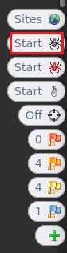

Se muestra un mensaje indicando que la aplicación (192.168.20.60:3000) no está en ***scope*** y nos pregunta si queremos ponerla en ámbito. Esto debe ser así para que el spider no agregue los links que puedan aparecer en la aplicación y que tengan como destino URLs externas a la misma, como pudieran ser enlaces a Google u otros servicios de Internet. Hacemos clic en el botón ***Start***, que agregará la aplicación al ***scope*** e iniciará el descubrimiento.

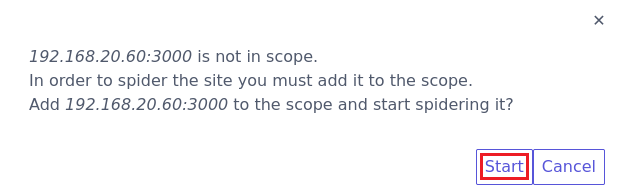

Dejamos al Spider que localice las URLs. No es necesario esperar a que termine, así que mostramos el historial para ver qué está descubriendo.

Como podemos ver en la imagen, el spider no ha encontrado mucho. Concretamente, tres URLs de la aplicación que no conducen a ningún descubrimiento importante.

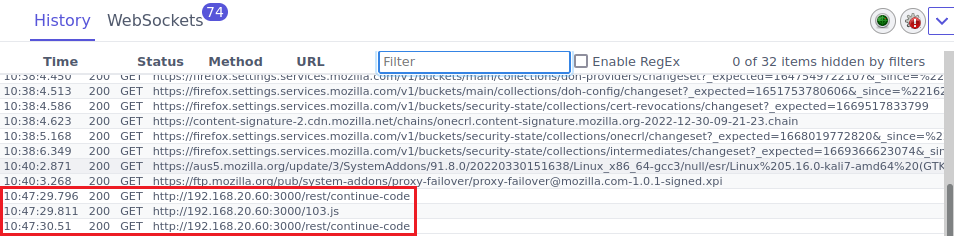

Puesto que ***Juice Shop*** es una aplicación moderna, vamos a probar con el ***Ajax Spider***, que es la opción recomendada para estos casos. Hacemos clic en el botón apropiado.

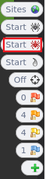

Aparece un cuadro de diálogo para iniciar la araña. Seleccionamos ***Firefox*** en el despegable ***Browser*** y hacemos clic en el botón ***Start***.

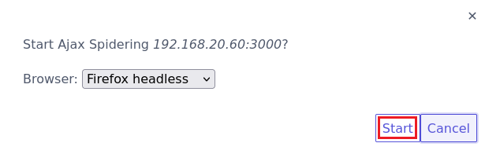

Pasado un rato (5 minutos) vamos a ver las URLs que ha descubierto el spider. Para ello detenemos ***Ajax Spider*** y hacemos clic en el botón ***Sites***, en el panel derecho del HUD.

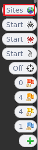

En la lista de sitios, hacemos clic en el botón ***+*** correspondiente a la aplicación que estamos hackeando (http://192.168.20.60:3000).

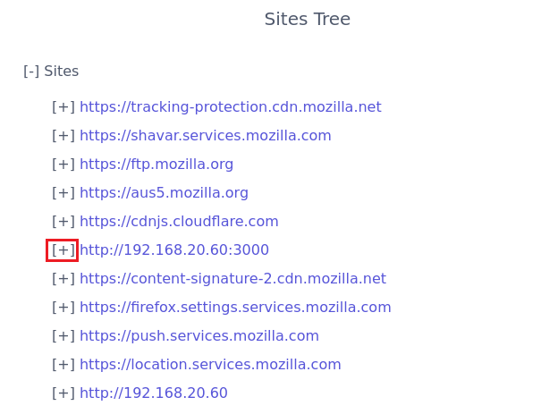

Ahora podemos ver todas las requests que ha hecho el spider al ir recorriendo los links de la aplicación. Es cuestión de leerlas detenidamente con la intención de localizar algún archivo que tenga especial interés para el actor de la amenaza. En nuestro ejemplo, vemos que hay una serie de peticiones interesantes en la ruta ***http://192.168.20.60:3000/ftp***. Concretamente nos llama la atención el documento ***acquisitions.md***.

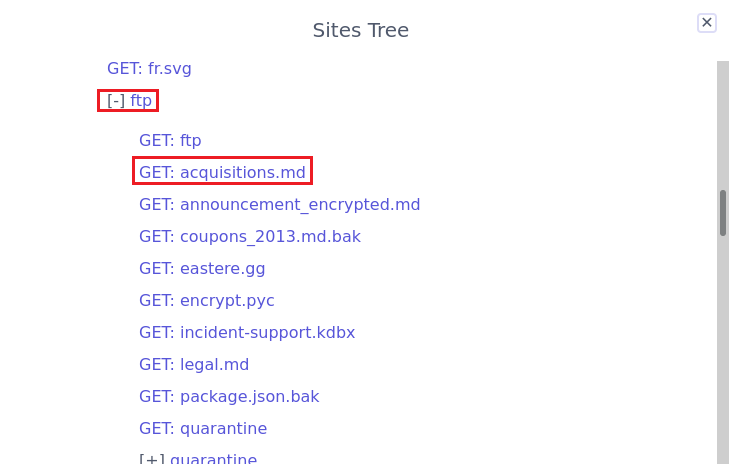

Hacemos clic en dicha request, y como se puede ver en la imagen. Es un documento confidencial que no está bien protegido.

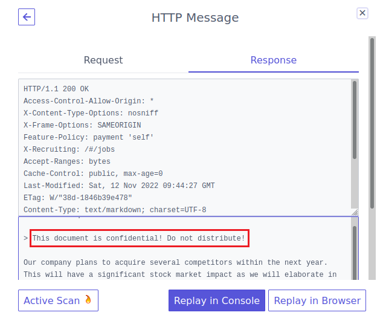

Ahora solo queda conectar a la siguiente URL para exfiltrar el documento.
```
http://192.168.20.60:3000/ftp/acquisitions.md
```

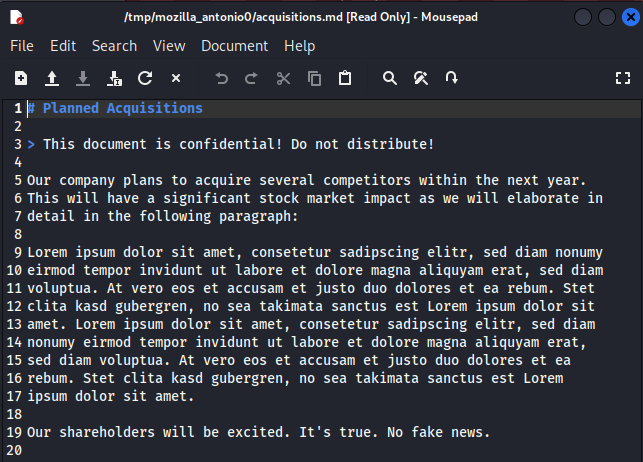


## Ejercicio 2: Ganar acceso a los logs del servidor.

***OBJETIVO***: Obtén acceso a archivos log.

***PISTAS***: 

* Usa la herramienta ***Forced Browse*** de ZAP. 

***RESOLUCIÓN***. Los pasos para resolver el reto son.

Como siempre iniciamos ***ZAP***.

Realiza con ZAP una exploración manual sobre la siguiente URL.
```
http://192.168.20.60:3000
```

Hemos visto que el HUD de ZAP es una herramienta muy cómoda de usar, pero es el momento de usar la herramienta completa. Para ello, localiza la ventana en la que se ejecuta ZAP, que debe ser como la que muestra la imagen.

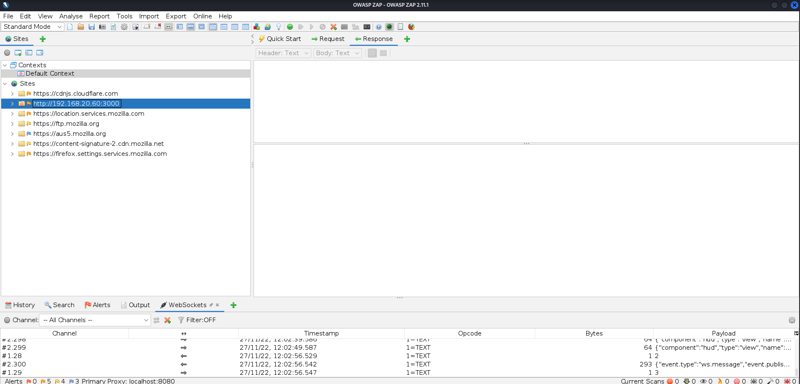

Las arañas solo son efectivas si la URL aparece en un link, ya sea de HTML o generado por javascript. Por lo tanto, pueden existir directorios en el sitio que estamos estudiando que permanezcan ocultos porque estos no aparecen en ningún link. La única forma de descubrirlos es por medio de un ataque de fuerza bruta, consistente en usar un archivo o diccionario que contiene nombres de directorios habituales (login, logout, ...) y tener suerte en el sentido de que el programador haya usado nombres habituales para los directorios de la aplicación.

Para activar esta herramienta, hacemos clic con boton derecho en la aplicación que deseamos estudiar, en nuestro caso es ***http://192.168.20.60:3000*** y elegimos la opción ***Attack/Forced Browse Directory (and Children)***.

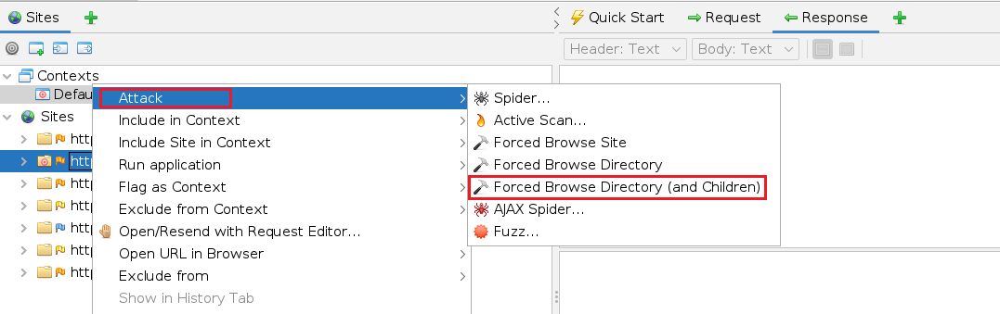

En la parte inferior, elegimos como lista ***directory-list-1.0.txt*** y hacemos clic en el icono ***play***. ZAP comenzará a buscar directorios usando el diccionario.
(Nota: El escaneo es recursivo al haber elegido la opción ***children***. De esta forma por cada directorio descubierto se vuelve a iniciar el proceso.)

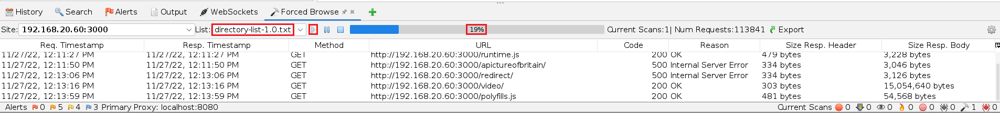

(Nota: En el entorno de laboratorio ocurre que, debido al gran número de request/s que envía ZAP, el contenedor de Docker se queda sin memoria y se detiene. En un escenario real, ***Forced Browse*** finalizaría mostrando la lista de directorio descubiertos)

De todos los directorios descubiertos, hay uno que llama especialmente la atención, así que nos conectamos a la siguiente URL.
```
http://192.168.20.60:3000/support/logs
```

En el que podemos ver archivos muy interesantes.

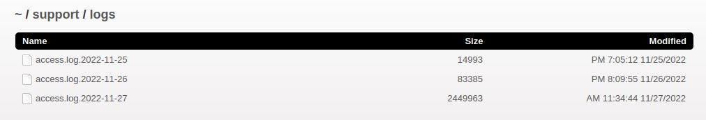

Y si abrimos cualquiera de ellos, podremos localizar información que permitiría hacer otro tipo de ataque.


## Ejercicio 3: Fuga de información a través de la API.

***OBJETIVO***: Exfiltra información por medio de un Endpoint del API que no está bien protegido.

***PISTAS***: 

* Localiza un endpoint que no está bien protegido. 
* No se utiliza SQL injection en este caso.

***RESOLUCIÓN***. Los pasos para resolver el reto son.

Como siempre iniciamos ***ZAP***.

Realiza con ZAP una exploración manual sobre la siguiente URL.
```
http://192.168.20.60:3000
```
Si no estuvieras logado, inicia sesión con tu usuario en la aplicación.

La aplicación tiene un endpoint que permite cosultar información sobre el usuario logado, el problema es que podemos capturar esa información y acceder a propiedades ***delicadas*** de ese usuario, como el ***id*** que la aplicación le asigna internamente.

Lo primero que debemos hacer es localizar el endpoint vulnerable y, para ello, debemos localizarlo. Aunque hay muchas técnicas para ello, la más simple y no por ello poco efectiva, es activar la araña (Ajax Spider) y dejar que vaya descubriendo. 

Tras un rato, nos fijamos en un endpoint curioso, concretamente ***/rest/user/whoami***, cuya request ha sido capturada por la araña.

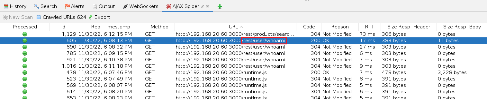

Paramos la araña y, elegimos ***History***. En el historial localizamos las request a ***/rest/user/whoami***. Para cada una de ellas, hacemos clic derecho y, en el menú contextual, elegimos la opción ***Open/Resend with Request Editor...***. Debemos localizar una request que contenga el token de autorización.

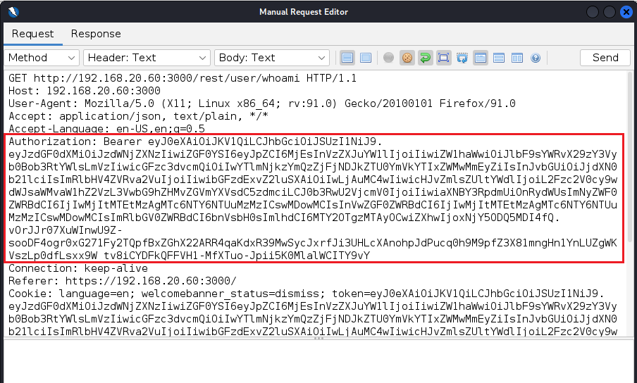

En la request, observamos que no se mandan parámetros. La vulnerabilidad consiste en enviar un parámetro llamado ***callback***. 
(Nota: Queda fuera de esta actividad explicar como el parámetro ***callback*** puede encapsular una función que exfiltre información de la aplicación. Si quiere aprender sobre esto lee este artículo: https://www.filecloud.com/blog/using-jsonp-for-cross-domain-requests/)

Edita la request hasta que la URL tome la forma que muestra la imagen.

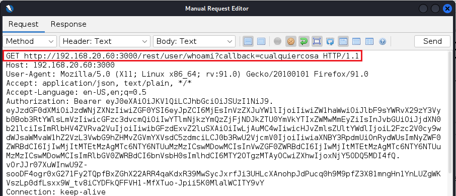

Hacemos clic en el botón ***Send*** y esperamos la respuesta. Como puede observarse, la aplicación está exfiltrando información, por ejemplo el ***id*** del usuario con el que estamos logado. 

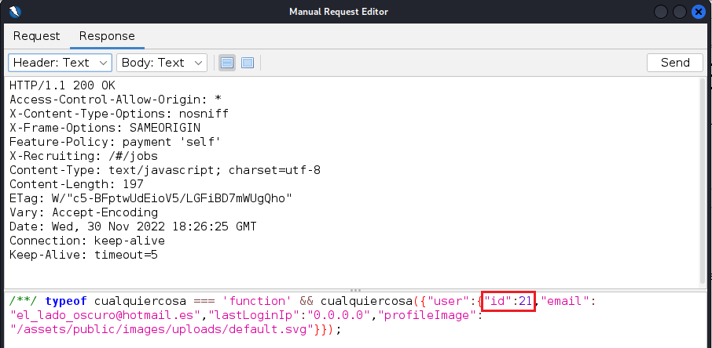


***FIN DEL LABORATORIO***

https://pwning.owasp-juice.shop/part2/sensitive-data-exposure.html

https://pwning.owasp-juice.shop/appendix/solutions.html


Exposed Metrics	Find the endpoint that serves usage data to be scraped by a popular monitoring system.	⭐
Forgotten Developer Backup	Access a developer's forgotten backup file.	⭐⭐⭐⭐
Forgotten Sales Backup	Access a salesman's forgotten backup file.	⭐⭐⭐⭐
GDPR Data Theft	Steal someone else's personal data without using Injection.	⭐⭐⭐⭐
Leaked Access Logs	Dumpster dive the Internet for a leaked password and log in to the original user account it belongs to. (Creating a new account with the same password does not qualify as a solution.)	⭐⭐⭐⭐⭐
Leaked Unsafe Product	Identify an unsafe product that was removed from the shop and inform the shop which ingredients are dangerous.	⭐⭐⭐⭐
Login Amy	Log in with Amy's original user credentials. (This could take 93.83 billion trillion trillion centuries to brute force, but luckily she did not read the "One Important Final Note")	⭐⭐⭐
Login MC SafeSearch	Log in with MC SafeSearch's original user credentials without applying SQL Injection or any other bypass.	⭐⭐
Meta Geo Stalking	Determine the answer to John's security question by looking at an upload of him to the Photo Wall and use it to reset his password via the Forgot Password mechanism.	⭐⭐
Misplaced Signature File	Access a misplaced SIEM signature file.	⭐⭐⭐⭐
Reset Uvogin's Password	Reset Uvogin's password via the Forgot Password mechanism with his original answer to his security question.	⭐⭐⭐⭐
Retrieve Blueprint	Deprive the shop of earnings by downloading the blueprint for one of its products.	⭐⭐⭐⭐⭐
Visual Geo Stalking	Determine the answer to Emma's security question by looking at an upload of her to the Photo Wall and use it to reset her password via the Forgot Password mechanism.	⭐⭐⭐⭐