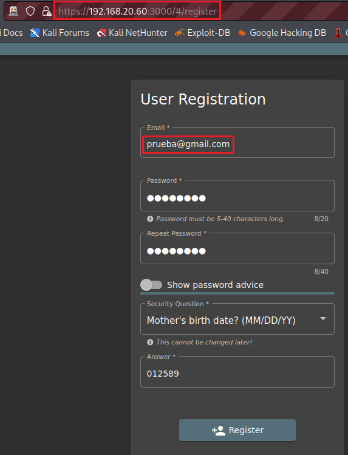
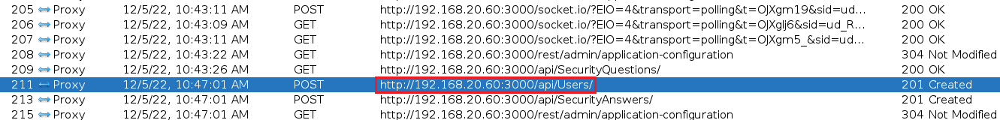
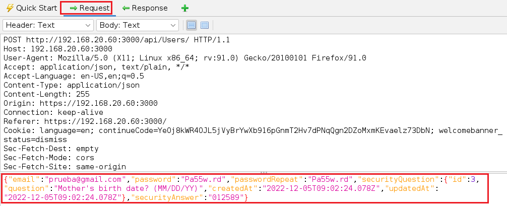
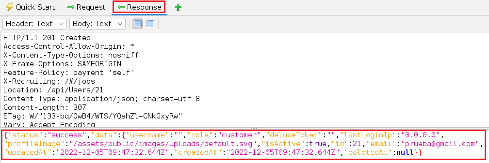
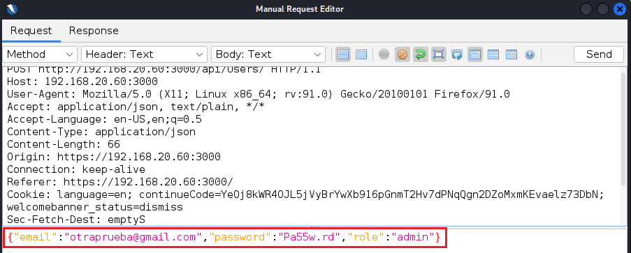
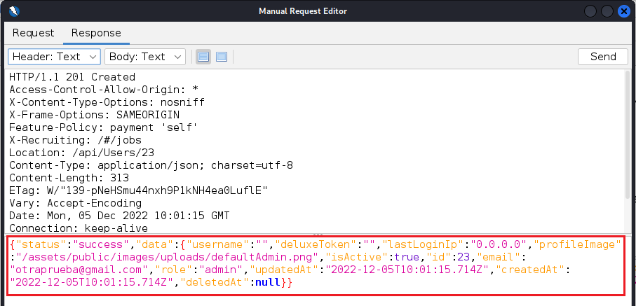
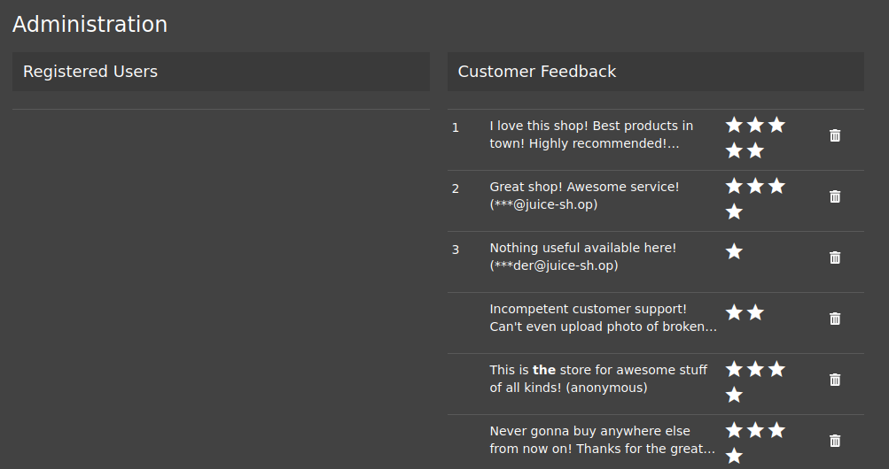
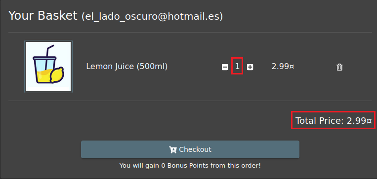

# Improper Input Validation

     

Requisitos:
1. Máquina ***Router-Ubu***.
2. Máquina ***Kali Linux***.
3. Máquina ***Ubu_srv_01***

La pricipal amenaza a la que se ve sometida una aplicación web es la ausencia o un control incorrecto del texto que puede introducir un atacante en un campo de formulario o parámetro en general. Es conocido por todos que si usas un buen framework de desarrollo, éste debería proteger tu aplicación de este tipo de debilidades.

## Ejercicio 1: Registrar a un usuario con privilegios de administrador. 

***OBJETIVO***: Conseguir que un usuario convencional acceda a la parte de administración de la aplicación.

***PISTAS***: 

* Estudia la Request/Response que se genera cuando se registra un nuevo usuario. 
* Reenvía la request cambiando algún parámetro.

***RESOLUCIÓN***. Los pasos para resolver el reto son.

Como siempre iniciamos ***ZAP***.

Realiza con ZAP una exploración manual sobre la siguiente URL.
```
http://192.168.20.60:3000
```

A continuación registra un nuevo usuario, tal y como se muestra en la imagen.
(Nota: observa la URL en la que se crea el usuario)



Pulsa el botón para crear el usuario.

Intenta entrar en la sección ***Administration***, escribiendo la siguiente URL en la barra de direcciones.
(Nota: Esta sección se descubrió en el ***Ejercicio 2*** del laboratorio ***lab-25-C***)
```
http://192.168.20.60:3000/#/administration
```


A continuación, accede a ZAP y localiza en el historial, la request que registró al usuario. Esta request es de tipo ***POST***.



En la Request puedes observar los campos que se envían al servidor para crear al nuevo usuario.



Y la response indica que el ***role*** del usuario es ***customer***.



Hacemos clic derechos en la request anterior y elegimos ***Open/Resend with Request Editor*** para editarla.

Modifica los parámetros hasta que tengan la siguiente forma.



Hacemos clic en el botón ***Send***.

En la respuesta podrás ver que la API ha aceptado la creación del usuario de esta forma tan simple.



Observa como la response es aceptada ***success***. Mira también los valores para los campos ***email*** (otraprueba@gmail.com) y ***role*** (admin). El password es el que pusiste.

Cierra la sesión con el usuario actual einicia sesión con el nuevo usuario. A continuación escribe en la barra de direcciones la siguiente URL.
```
http://192.168.20.60:3000/#/administration
```

Podrás comprobar que puedes acceder a la sección de administración de la aplicación.




## Ejercicio 2: Hacer un pedido que te hará rico.

***OBJETIVO***: Conseguir que el total a pagar de un pedido sea una cantidad negativa.

***PISTAS***: 

* Haz un pedido. Modifica la cantidad del elemento que has pedido y estudia la request correspondiente.
* Reenvía la request cambiando algún parámetro.

***RESOLUCIÓN***. Los pasos para resolver el reto son.

Como siempre iniciamos ***ZAP***.

Realiza con ZAP una exploración manual sobre la siguiente URL.
```
http://192.168.20.60:3000
```

Inicia sesión con tu usuario de la aplicación y haz un pedido de una unidad de zumo de limón.



Podrás comprobar que es posible cambiar la cantidad, pero que esta no puede ser negativa. Déjala en 5 unidades.

Localiza la request que actualiza la cantidad de producto a 5 unidades. 


Haz clic en ella con botón derecho y ejecuta ***Open/Resend with Request Editor***. Edita el parámetro ***quantity*** y pon una cantidad negativa, por ejemplo ***-100***.


Reenvía la Request por medio del botón ***Send***.

A continuación, en la aplicación reliza el ***Checkout*** y comprobarás que tendrás más dinero que antes.


***FIN DEL LABORATORIO***
