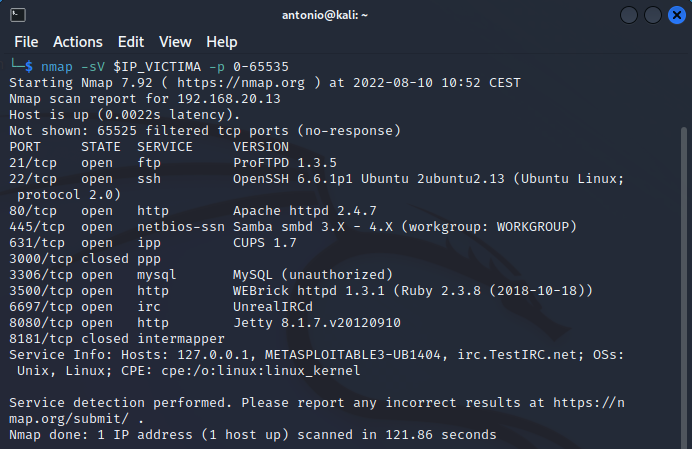
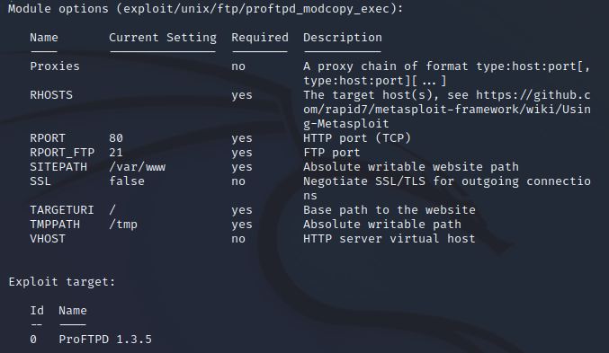

# Atacar la máquina Metasploitable3.

## Ejercicio 1: Descubrir servicios presentes en la víctima.


Como ya hemos visto, ***nmap*** es la herramienta estrella para descubrir los servicios presente en una víctima que resida en la misma red local que el atacante. Almacenamos la IP de Metasploitable en una variable de entorno por comodidad.
```
IP_VICTIMA=192.168.20.13
```

Procedemos a realizar un nmap de todos los puertos en la víctima. El parámetro ***-sV*** sondea los puertos abiertos para determinar la versión de cada servicio. Conocer la versión es importante para determinar si existen vulnerabilidades que se puedan implementar. (Nota: Tardará bastante tiempo. Tener paciencia)
```
nmap -sV $IP_VICTIMA -p 0-65535
```

El resultado debe ser similar al siguiente. Observar como el rectángulo rojo marca que se ha detectado la aplicación ***ProFTPD 1.3.5***. También comprobar cómo el rectángulo azul indica que hay un servidor web presente en el puerto ***80***.



Localizamos información sobre vulnerabilidades en ***CVE Details*** y encontramos que existe una de ***nivel 10***: https://www.cvedetails.com/cve/CVE-2015-3306/. Abrir el link y estudiarlo detenidamente.

En la parte inferior de la página puede observar que se dice que ***No hay ningún módulo de Metasploit relacionado con esta entrada CVE***, pero eso no es correcto, como veremos a continuación.

Una búsqueda un poco más detenida demuestra que Metasploit sí que puede explotar la vunerabilidad presente en ***ProFTP 1.3.5***: https://www.rapid7.com/db/modules/exploit/unix/ftp/proftpd_modcopy_exec/

Como puede leerse en la documentación, el módulo ***proftpd_modcopy_exec*** de Metasploit, se aprovecha de la vulnerabilidad presente en la implementación del comando ***SITE CPFR/CPTO*** de ***ProFTPD***. Cualquier cliente (de FTP) no autenticado (No hace falta conocer credenciales) puede aprovecharse para copiar archivos en ***cualquier carpeta*** del sistema de archivos de la víctima. Los comandos de copia se ejecutan con los derechos (identidad) del servicio ProFTP, que por defecto corre bajo los privilegios del usuario ***nobody***. Mediante el uso de ***/proc/self/cmdline*** es posible subir a la víctima un archivo php que implemente una shell inversa, mediante el cual podemos tomar el control de la víctima.

## Ejercicio 2: Explotar vulnerabilidad.

Cargamos la consola de ***Metasploit*** si no estuviera iniciada.
```
msfconsole
```

Cargamos el módulo del exploit.
```
use exploit/unix/ftp/proftpd_modcopy_exec
```

Mostramos las opciones de configuración.
```
show options
```

La salida será la siguiente.


Las configuraciones que debemos proporcionar son:

* *RHOSTS*: Obligatoria. Debemos poner la IP de la victima, que en nuestro escenario será ***192.168.20.13***.
* *RPORT*: Obligatoria. Una vez subido el payload PHP, el ataque se produce por medio de una Request HTTP. De esta forma, para que el ataque funcione, se necesita un servidor web en la víctima. Este hecho ha sido comprobado en el ejercicio anterior. Como puedes comprobar, no es necesario cambiar este valor (***80***), porque es el puerto correcto donde el servidor ***Apache*** está sirviendo peticiones.
* *RPORT_FTP*: Obligatoria. Este ataque necesita la presencia del servidor ***ProFTPD 1.3.5***, que como hemos comprobado anteriormente, está presente y escuchando en el puerto ***21***, por lo que no es necesario cambiar este ajuste.
* *SITEPATH*: Obligatoria. Es la ruta del directorio raíz del servidor web. En ***Apache*** es ***/var/www/html***. La configuración por defecto que puedes ver es ***/var/www***, que no coincide, por lo que debemos cambiarla a ***/var/www/html***. 

***/proc/self/cmdline*** copiará en este directorio el payload php.
* *TARGETURI*: Obligatoria. Es la URI a la que se conectará el exploit. En ella se espera encontrar el payload php que será llamado por la Request HTTP.
* *TMPPATH*: El exploit no funciona copiando directamente el payload php a la carpeta ***/var/www/html***, si no que lo copia primero a una carpeta tempora y luego, desde esta al directorio ***html***. Por lo tanto, esta configuración debe tener una carpeta en la que no existan problemas de permisos. La candidata ideal es ***/tmp***, así que no modificamos esta configuración.

Mostramos los ***targets***, que en ***Metasploit*** son los servicios vulnerables.
```
show targets
```


