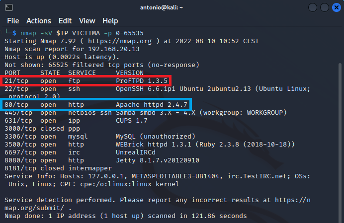

# Atacar la máquina Metasploitable3.

## Ejercicio 1: Descubrir servicios presentes en la víctima.


Como ya hemos visto, ***nmap*** es la herramienta estrella para descubrir los servicios presente en una víctima que resida en la misma red local que el atacante. Almacenamos la IP de Metasploitable en una variable de entorno por comodidad.
```
IP_VICTIMA=192.168.20.13
```

Procedemos a realizar un nmap de todos los puertos en la víctima. El parámetro ***-sV*** sondea los puertos abiertos para determinar la versión de cada servicio. Conocer la versión es importante para determinar si existen vulnerabilidades que se puedan implementar. (Nota: Tardará bastante tiempo. Tener paciencia)
```
nmap -sV $IP_VICTIMA -p 0-65535
```

El resultado debe ser similar al siguiente:


