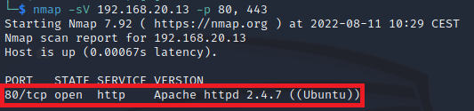

# Explotar vulnerabilidad CVE-2014-6271 (Shellshock) presente en Apache.

Este laboratorio muestra como usar la vulnerabilidad ***Shellshock*** que consigue ejecutar código mediante su inyección en una variable de entorno de Bash. Para ello usa el módulo ***mod_cgi*** del servidor Apache. Aquí tienes información sobre la vulnerabilidad: https://www.cvedetails.com/cve/CVE-2014-6271/.

La debilidad se encuentra en cómo la shell ***Bash*** gestiona las variables de entorno externas. Utiliza ***scripts CGI*** en el servidor web Apache inyectando una función maliciosa en la variable de entorno ***HTTP_USER_AGENT***.

Usamos ***nmap*** contra la víctima para determinar si está presente el servidor Apache.
```
nmap -sV 192.168.20.13 -p 80, 443
```

Como puede observarse en la imagen, está presente el servidor ***Apache 2.4.7*** en el puerto ***80***.



Cargamos la consola de ***Metasploit*** sino estuviera ya iniciada.
```
msfconsole
```

Procedemos a cargar el módulo para realizar el ataque.
```
use exploit/multi/http/apache_mod_cgi_bash_env_exec
```

